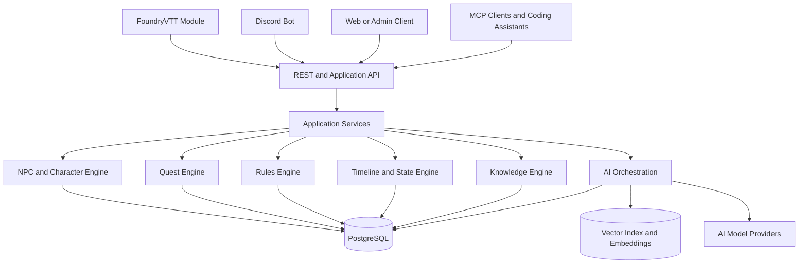
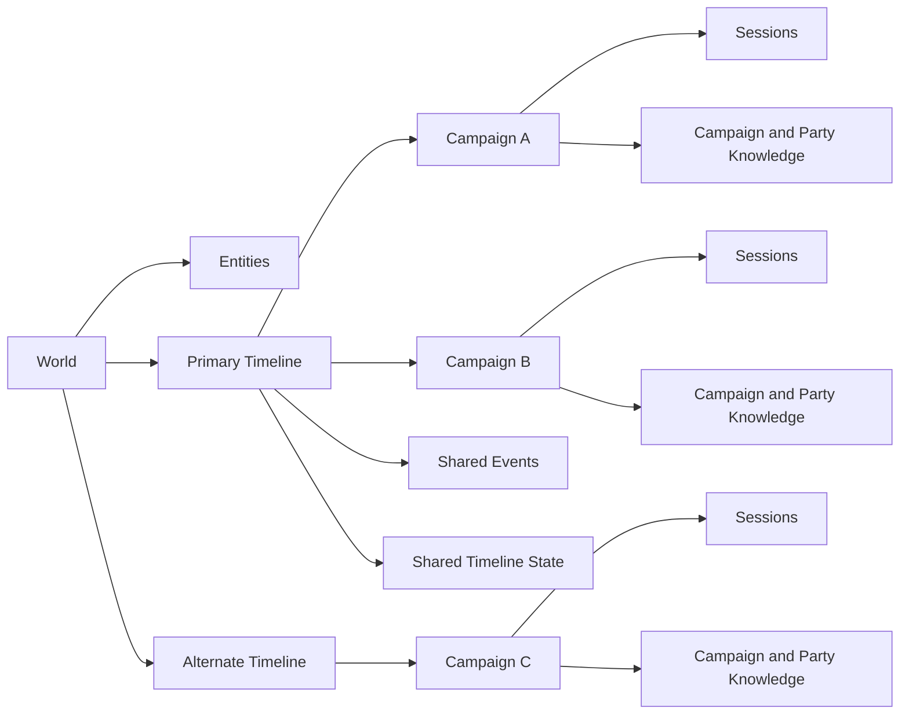
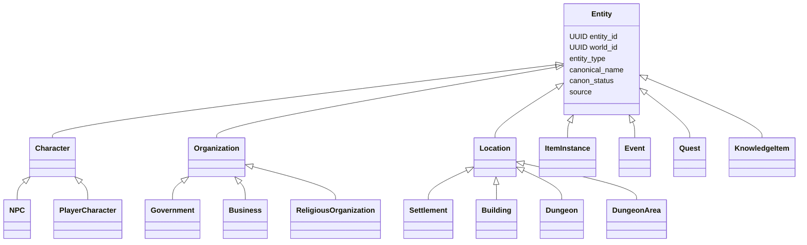
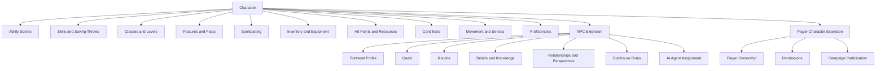
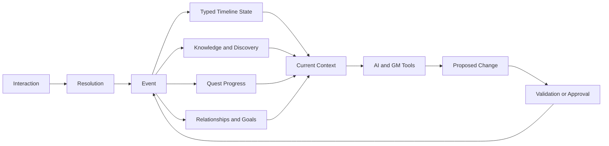
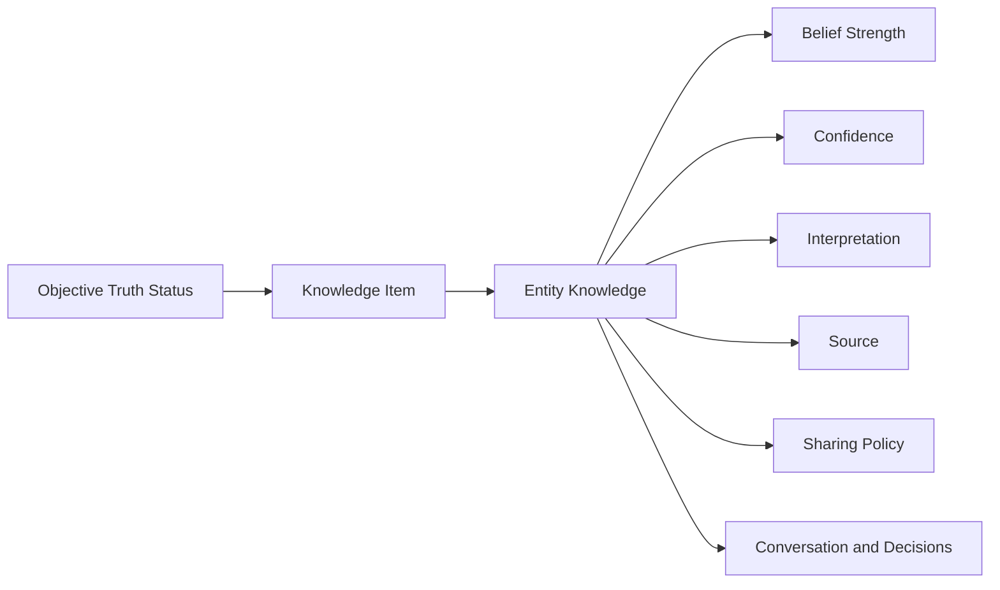
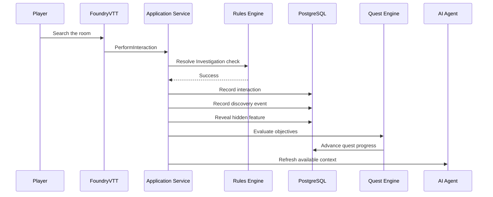

# D&D AI World Platform

## Vision

The D&D AI World Platform is a persistent world simulation engine designed to power tabletop role-playing campaigns using AI-assisted world management.

Rather than treating each campaign as an isolated data set, the platform manages persistent game worlds that can support:

- Multiple simultaneous campaigns
- Shared or branching timelines
- Persistent NPCs, locations, organizations, quests, and history
- AI-assisted GM workflows
- AI-controlled or AI-assisted NPC portrayal
- FoundryVTT and Discord integration
- Retrieval-Augmented Generation (RAG)
- Long-term structured memory
- Future support for additional tabletop rulesets

The initial rules implementation targets Dungeons & Dragons 5e (2024), but the platform is intended to remain ruleset-aware rather than tightly coupled to one game system.

---

## Product Overview

The D&D AI World Platform is a persistent-world simulation engine for tabletop role-playing campaigns. It is built around a PostgreSQL-backed world model with branching timelines, shared campaign state, durable historical events, and rules-aware entity definitions.

The system is designed to support:

- persistent worlds that outlive any single campaign
- multiple campaigns sharing the same timeline or branching into alternate histories
- NPCs, organizations, locations, quests, and inventory as first-class entities
- event-driven state changes with causal history
- AI-assisted GM tooling without allowing AI to own canon directly
- self-hosted deployment via Docker Compose rather than direct database writes from clients

The final product is a rules-aware world platform, not a one-off database or prototype toolchain.

---

## Table of Contents

- [Project Goals](#project-goals)
- [Design Philosophy](#design-philosophy)
- [Core Concepts](#core-concepts)
- [System Architecture](#system-architecture)
- [World, Timeline, and Campaign Model](#world-timeline-and-campaign-model)
- [Entity Model](#entity-model)
- [PostgreSQL Inheritance Strategy](#postgresql-inheritance-strategy)
- [Character Model](#character-model)
- [State and Event Model](#state-and-event-model)
- [Knowledge Model](#knowledge-model)
- [Quest and Dungeon Progression](#quest-and-dungeon-progression)
- [AI Design](#ai-design)
- [PostgreSQL Domain Layout](#postgresql-domain-layout)
- [Repository Structure](#repository-structure)
- [Getting Started](#getting-started)
- [Documentation](#documentation)
- [License](#license)

---

## Project Goals

The platform should provide:

- Persistent game worlds
- Multiple campaigns sharing one world
- Multiple campaigns sharing one timeline
- Alternate and branching timelines
- Shared mechanical models for NPCs and player characters
- Persistent locations, dungeons, organizations, items, and quests
- Event-driven world evolution
- Queryable world history
- Party-specific discovery and knowledge
- AI-assisted NPC simulation
- AI-assisted GM tools
- Controlled AI proposals rather than unrestricted AI mutation
- FoundryVTT integration
- Discord integration
- REST and service APIs
- MCP integration for AI coding assistants
- Retrieval-Augmented Generation
- Long-term structured memory
- Future campaign-data importing
- Support for additional tabletop rulesets

---

## Design Philosophy

### PostgreSQL is the source of truth

Structured PostgreSQL data is authoritative.

AI prompts, embeddings, search indexes, summaries, Discord responses, Foundry displays, caches, and generated documents are derived from that structured data.

### AI does not own world state

AI agents may:

- Read approved world data
- Assemble context
- Generate dialogue
- Summarize sessions
- Suggest consequences
- Propose new facts or state changes
- Detect inconsistencies

AI agents do not directly mutate canonical world state.

High-impact changes must pass through validation and, where required, GM approval.

### Definitions and state are separate

The platform distinguishes between:

- What an entity is
- What its current timeline state is
- What happened to produce that state
- Who knows about it
- What different entities believe about it

### History is preserved

Narratively meaningful changes should retain their cause, source, and effective world time.

The platform uses typed current-state tables for efficient reads and events for history and causality. This is an event-assisted state model, not pure event sourcing.

### Rules definitions and world instances are separate

Examples:

- `Longsword` is a rules definition.
- `The Blade of Saint Orra` is a world entity and item instance.
- `Goblin` is a species or creature definition.
- `Grik the Gatekeeper` is a character entity.

---

## Core Concepts

### World

A persistent setting containing entities, calendars, ruleset configuration, history, and timelines.

A world is not owned by a campaign.

### Timeline

One evolving version of a world.

A timeline contains persistent state and events. Multiple campaigns may share the same timeline and therefore observe the consequences of one another's actions.

A timeline may branch from another timeline at a specific event or world-time point.

### Campaign

A game being played within a timeline.

A campaign organizes:

- Participants
- Parties
- Sessions
- Permissions
- Player-facing notes
- Campaign-specific knowledge views
- Quest participation

A campaign does not normally own a separate copy of world state.

### Session

A period of play within a campaign.

A session may produce interactions, checks, events, discoveries, quest progress, and persistent timeline changes.

### Party

A collection of participating characters whose membership can change over time.

### Entity

A significant world object with a stable UUID and a declared type.

Examples:

- NPC
- Player character
- Monster
- Organization
- Settlement
- Dungeon
- Room
- Item instance
- Artifact
- Event
- Quest
- Knowledge item

Entities belong to worlds and may participate in relationships, events, knowledge, tags, provenance, and timeline state.

The entity model is not an Entity-Attribute-Value replacement. Shared identity belongs in the base entity table; domain-specific attributes belong in typed subtype tables.

### Interaction

A meaningful attempted action, such as:

- Search a room
- Pick a lock
- Attack
- Cast a spell
- Persuade an NPC
- Read an inscription
- Activate a mechanism
- Travel
- Rest

Interactions may produce checks, events, discoveries, or state changes.

### Event

A narratively meaningful occurrence that explains why timeline state changed.

Examples:

- A bridge collapses
- A dungeon door opens
- An NPC dies
- A party activates a pylon
- An organization seizes a city
- A quest objective is completed

### Knowledge Item

A structured statement that may represent:

- Fact
- Rumor
- Secret
- Theory
- Belief
- Prophecy
- Misconception
- Memory
- Doctrine

Knowledge is tracked separately from objective truth and separately for each knower.

### Canon and provenance

Records may carry a lifecycle such as:

- Draft
- Proposed
- Approved
- Canon
- Superseded
- Rejected

Sources may include:

- GM-authored
- Player-authored
- AI-generated
- Imported
- FoundryVTT
- Discord
- Rulebook
- Session transcript
- Administrative correction

The complete creation, approval, mutation, branching, archival and deletion rules are defined in [docs/ENTITY_LIFECYCLE.md](docs/ENTITY_LIFECYCLE.md).

---

## System Architecture



Client integrations should communicate through application services rather than writing directly to database tables.

The detailed application, service, transaction, AI, integration and deployment architecture is defined in [docs/architecture/SYSTEM_ARCHITECTURE.md](docs/architecture/SYSTEM_ARCHITECTURE.md).

---

## World, Timeline, and Campaign Model



Two campaigns attached to the same timeline share persistent consequences.

Example:

- Campaign A opens a sealed vault.
- Campaign B later finds that vault open.
- Campaign C, on a timeline branched before the vault opened, still finds it sealed.

### Effective campaign view

```text
World definitions
+ inherited timeline history
+ current timeline state
+ campaign participation and permissions
+ party or character knowledge
= effective campaign view
```

Campaigns should not usually create independent copies of locations, NPCs, organizations, or dungeon state.

---

> **Illustrative, not authoritative.** From here through "PostgreSQL Domain Layout," diagrams and example SQL introduce the platform at a high level. [docs/architecture/DATABASE_MODEL.md](docs/architecture/DATABASE_MODEL.md) is the source of truth for actual tables, columns, and schema scope.

## Entity Model



Every important world object receives a base entity record. Domain-specific subtype tables contain the attributes unique to that entity type.

The complete logical database model and domain diagrams are defined in [docs/architecture/DATABASE_MODEL.md](docs/architecture/DATABASE_MODEL.md).

---

## PostgreSQL Inheritance Strategy

The platform uses class-table inheritance for major domain objects.

Example:

```text
core.entities
└── character.characters
    ├── character.npcs
    └── character.player_characters
```

Each subtype uses the same UUID as its parent:

```sql
CREATE TABLE core.entities (
    entity_id UUID PRIMARY KEY DEFAULT gen_random_uuid(),
    world_id UUID NOT NULL REFERENCES core.worlds(world_id),
    entity_type_id UUID NOT NULL REFERENCES core.entity_types(entity_type_id),
    canonical_name TEXT NOT NULL,
    summary TEXT,
    canon_status_id UUID NOT NULL,
    source_id UUID,
    created_at TIMESTAMPTZ NOT NULL DEFAULT now(),
    updated_at TIMESTAMPTZ NOT NULL DEFAULT now(),
    archived_at TIMESTAMPTZ
);

CREATE TABLE character.characters (
    character_id UUID PRIMARY KEY
        REFERENCES core.entities(entity_id)
        ON DELETE CASCADE,

    species_id UUID,
    size_id UUID,
    origin_location_id UUID
);

CREATE TABLE character.npcs (
    npc_id UUID PRIMARY KEY
        REFERENCES character.characters(character_id)
        ON DELETE CASCADE,

    importance SMALLINT CHECK (importance BETWEEN 1 AND 10),
    simulation_level_id UUID,
    default_portrayal_profile_id UUID
);
```

Native PostgreSQL `INHERITS` is not the default for the core model because it complicates:

- Foreign-key behavior
- Cross-table uniqueness
- Migration tooling
- ORM support
- Type enforcement
- Parent-child integrity

Native inheritance or partitioning may still be used later for narrowly defined append-only or operational data where it provides a measurable benefit.

---

## Character Model

NPCs and player characters share the same mechanical foundation.



NPCs should be capable of the same level of mechanical detail as player characters when needed.

Not every NPC requires full simulation. NPCs may use simulation levels such as:

- Background
- Minor
- Supporting
- Major
- Central
- Fully simulated

This allows the system to represent both a passing tavern patron and a recurring campaign villain without forcing equal detail.

---

## State and Event Model

The platform uses typed state tables for current reads and events for history and causality.



### Typed state examples

- `campaign.character_state`
- `campaign.location_state`
- `campaign.area_connection_state`
- `campaign.organization_state`
- `campaign.relationship_state`
- `campaign.item_state`
- `campaign.quest_state`
- `campaign.objective_state`

### Event rules

- Significant persistent state changes should reference a causal event or explicit administrative source.
- Events and resulting state updates should commit atomically.
- Events should record world time and system recording time where relevant.
- Not every low-level action must become a permanent narrative event.
- Combat details may remain interaction or encounter records, while significant outcomes become events.

---

## Knowledge Model



The system distinguishes:

- What is objectively true
- Whether an entity is aware of a claim
- Whether the entity believes it
- How confident the entity is
- How the entity interprets it
- Where the entity learned it
- Whether the entity can or will share it
- Whether a party or player has discovered it
- Whether it is publicly known

Different entities may hold contradictory beliefs about the same knowledge item.

The AI should reason from the beliefs and knowledge available to the entity it is portraying, not from unrestricted world truth.

---

## Quest and Dungeon Progression

Dungeon exploration is the first major end-to-end vertical slice for the platform.



A playable dungeon flow should support:

1. A party enters a dungeon area.
2. Character locations update.
3. The party examines a room or interactable.
4. The rules engine resolves a check.
5. Existing hidden information becomes discovered.
6. A trap, door, mechanism, or hazard changes state.
7. An event records the cause of the change.
8. Quest objectives advance when completion rules are satisfied.
9. NPC goals, knowledge, and relationships may react.
10. Other campaigns on the same timeline observe persistent consequences.
11. Campaigns on alternate timelines remain unaffected after their branch points.

This workflow should remain a central architectural test for database and service-layer decisions. The detailed scenario, diagrams, transaction boundaries and acceptance criteria are defined in [docs/architecture/DUNGEON_FLOW.md](docs/architecture/DUNGEON_FLOW.md).

---

## AI Design

AI agents are consumers of structured world context and producers of proposals.

Possible agent roles include:

- NPC portrayal agent
- Dungeon-state assistant
- Quest manager
- Rules assistant
- Session summarizer
- Rumor propagation agent
- Lore consistency checker
- Import extraction agent

### AI mutation flow

```text
Structured context
→ AI output
→ Proposed change
→ Validation
→ Automatic policy or GM approval
→ Event
→ Typed state update
→ Audit record
```

Low-risk changes may be eligible for automatic validation, such as:

- Adding conversational memory
- Revealing an already-authored feature after a successful check
- Updating objective progress from one of three to two of three

High-impact changes should normally require explicit approval, such as:

- Killing a major NPC
- Destroying an artifact
- Changing control of a city
- Creating a new deity
- Permanently failing a major quest
- Declaring generated lore canonical

Factual AI claims about established world state should be traceable to structured records or approved source material.

---

## PostgreSQL Domain Layout

The database will use bounded PostgreSQL schemas:

| Schema | Responsibility |
|---|---|
| `core` | Worlds, entities, names, sources, statuses, tags, calendars, world time |
| `security` | Users, roles, permissions, access-control policies |
| `rules` | Rulesets and reusable mechanical definitions |
| `character` | Shared character mechanics plus NPC and PC extensions |
| `world` | Locations, organizations, items, relationships, economies, religions |
| `campaign` | Timelines, campaigns, parties, sessions, effective mutable state |
| `narrative` | Events, quests, objectives, encounters, story arcs |
| `knowledge` | Facts, rumors, beliefs, discoveries, expertise, information transfer |
| `interaction` | Player, GM, Foundry, Discord, and AI actions and resolutions |
| `ai` | Agents, context assembly, prompt fragments, embeddings, proposals |
| `audit` | Change history, approvals, validation errors, agent activity |
| `import` | Staging and review for future campaign-data imports |
| `integration` | External-system identifiers, sync state, webhook or polling metadata |

---

## Repository Structure

### What exists today

```text
.
├── README.md                       # This file — project entry point
├── CLAUDE.md                       # AI assistant operating instructions
├── Dockerfile                      # Shared image for migrations today; API/worker/adapter once they exist
├── compose.yaml                    # Self-hosted deployment topology (ADR 0012) — no default password, no default port
├── compose.override.yaml           # Auto-loaded local-dev convenience: 127.0.0.1-only port
├── compose.ci.yaml                 # CI override: disposable tmpfs storage
├── .dockerignore
├── build.ps1                       # Terraform orchestration wrapper (optional AWS path)
├── .env.example
├── .github/
│   ├── workflows/ci.yml
│   └── copilot-instructions.md
├── docs/                           # ALL documentation lives here
│   ├── DOMAIN_MODEL.md
│   ├── DATABASE_CONVENTIONS.md
│   ├── ENTITY_LIFECYCLE.md
│   ├── CONTRIBUTING.md             # Onboarding for new contributors
│   ├── DEVELOPMENT.md              # Toolchain, layout, migration and test workflow
│   ├── QUICKSTART.md               # Fast path to deployed infrastructure
│   ├── CHECKLIST.md                # Pre-deployment checks
│   ├── INFRASTRUCTURE.md           # Infrastructure reference
│   ├── AI_ASSISTANT_GUIDE.md       # On-demand examples; not startup context
│   ├── architecture/
│   │   ├── SYSTEM_ARCHITECTURE.md
│   │   ├── DATABASE_MODEL.md
│   │   └── DUNGEON_FLOW.md
│   └── adr/                        # Decision records (0001-0007 stubs; 0008-0009 full)
├── terraform/
│   ├── modules/{database,secrets}/
│   ├── environments/dev/
│   └── scripts/
└── scripts/
```

The Python project and migration scaffolding use this layout:

```text
├── pyproject.toml                  # Python project and tool configuration
├── database/
│   ├── alembic.ini
│   ├── migrations/versions/        # 001_bootstrap, 002_shared_domains
│   └── seeds/
├── src/dnd_ai/                     # persistence/ and config.py so far
└── tests/{unit,database,scenario}/
```

### Reserved extension points

```text
├── database/functions/             # SQL for stored functions, applied via revisions
├── src/dnd_ai/                     # api / commands / queries / domain / ai / integrations
└── terraform/modules/              # optional AWS infrastructure modules
```

These directories are reserved for the responsibilities shown and should be created only when their corresponding runtime component exists. The full repository layout and directory responsibilities are in [docs/DEVELOPMENT.md §2](docs/DEVELOPMENT.md#2-repository-layout).

All design and process documentation lives under `docs/`; only `README.md` and `CLAUDE.md` belong at the repository root.

---

## Getting Started

Self-hosted Docker Compose ([ADR 0012](docs/adr/0012-self-hosted-docker-deployment-and-ci-verification.md)) is the supported topology. The current stack contains PostgreSQL, a one-off migration service, and the FastAPI/Uvicorn API on a private Compose network. [docs/LOCAL_DEPLOYMENT.md](docs/LOCAL_DEPLOYMENT.md) defines the operational requirements for production ingress and the remaining services. AWS RDS is an optional, no-longer-CI-verified database-hosting path.

New here? [docs/CONTRIBUTING.md](docs/CONTRIBUTING.md) is the onboarding path.

### If you are implementing

Development runs against a **local or self-hosted (Docker Compose) PostgreSQL 18 server**. Migrations and the `tests/database`/`tests/scenario` suites need no AWS account, credentials, or network. CI repeats the same suites against a disposable PostgreSQL 18 container and is the merge gate. `compose.yaml` and `Dockerfile` define the supported topology; AWS RDS remains an optional database-hosting path.

1. **Understand the shape of the system** — this README, then [docs/DOMAIN_MODEL.md](docs/DOMAIN_MODEL.md) for the vocabulary.
2. **Set up your environment** — [docs/DEVELOPMENT.md §3](docs/DEVELOPMENT.md#3-local-setup): PostgreSQL 18 locally, then `uv sync`.
3. **Learn the hard rules before writing schema** — [docs/DATABASE_CONVENTIONS.md](docs/DATABASE_CONVENTIONS.md), especially the anti-patterns in §34.
4. **Place code in the right layer** — [docs/architecture/SYSTEM_ARCHITECTURE.md §5](docs/architecture/SYSTEM_ARCHITECTURE.md#5-layering).

### If you are self-hosting

`compose.yaml` at the repository root is the officially supported deployment topology — PostgreSQL 18 with persistent storage, a `migrate` job, and an `api` service (FastAPI under Uvicorn), both built from the shared `Dockerfile`:

```bash
cp .env.example .env   # then set POSTGRES_PASSWORD, MIGRATION_DATABASE_URL, and API_DATABASE_URL — all required, no defaults
docker compose up -d db                          # start PostgreSQL
docker compose --profile tools run --rm migrate   # apply migrations
docker compose up -d api                          # start the API
```

See [docs/DEVELOPMENT.md §3](docs/DEVELOPMENT.md#3-local-setup) for start/stop, backup, and upgrade guidance. Neither `db` nor `api` publishes a host port by default; `compose.override.yaml` adds loopback-only ports for local development. Production ingress requires a reverse proxy.

### If you are deploying to AWS (optional)

AWS RDS remains available as an alternative, no-longer-CI-verified way to host PostgreSQL, via the retained `terraform/modules/database` and `terraform/modules/secrets`. Nothing here is required for development or CI.

```powershell
Copy-Item terraform/environments/dev/terraform.tfvars.example terraform/environments/dev/terraform.tfvars
# Edit terraform.tfvars — set owner_name and my_ip_cidr (its default is 0.0.0.0/0)
./build.ps1 -Environment dev -Action apply -AutoApprove
```

- [docs/QUICKSTART.md](docs/QUICKSTART.md) — the deployment path, step by step
- [docs/CHECKLIST.md](docs/CHECKLIST.md) — pre-flight checks before you apply
- [docs/INFRASTRUCTURE.md](docs/INFRASTRUCTURE.md) — reference: variables, outputs, verification, teardown, known gaps

Note that a freshly deployed database is an **empty PostgreSQL instance** until Alembic's bootstrap revision runs against it — see [docs/DEVELOPMENT.md §3.5](docs/DEVELOPMENT.md#35-connecting-to-aws-dev-occasional). The module's `postgres_version` default is now `18.4`, matching the project's pinned version.

**Cost:** roughly $25–35/month if you deploy `dev`. It is no longer shared, CI-critical infrastructure ([ADR 0012](docs/adr/0012-self-hosted-docker-deployment-and-ci-verification.md)) — manage its lifecycle as you would any infrastructure you personally chose to run; see [docs/CONTRIBUTING.md §6](docs/CONTRIBUTING.md#6-cost-management).

---

## Documentation

### Design and domain

- [docs/DOMAIN_MODEL.md](docs/DOMAIN_MODEL.md) — authoritative vocabulary and domain ownership rules
- [docs/DATABASE_CONVENTIONS.md](docs/DATABASE_CONVENTIONS.md) — PostgreSQL naming, UUIDs, migrations, constraints and testing conventions
- [docs/ENTITY_LIFECYCLE.md](docs/ENTITY_LIFECYCLE.md) — entity creation, approval, mutation, timeline, archival and deletion rules
- [docs/architecture/SYSTEM_ARCHITECTURE.md](docs/architecture/SYSTEM_ARCHITECTURE.md) — application, service, AI, integration and deployment architecture
- [docs/architecture/DATABASE_MODEL.md](docs/architecture/DATABASE_MODEL.md) — full logical database model and domain diagrams
- [docs/architecture/DUNGEON_FLOW.md](docs/architecture/DUNGEON_FLOW.md) — end-to-end dungeon and quest progression diagrams and acceptance scenario

### Building and operating

- [docs/CONTRIBUTING.md](docs/CONTRIBUTING.md) — onboarding: local/self-hosted setup, optional AWS account setup, workflow for code and infrastructure changes
- [docs/DEVELOPMENT.md](docs/DEVELOPMENT.md) — toolchain, repository layout, local setup, migration and testing workflow
- [docs/QUICKSTART.md](docs/QUICKSTART.md) — fast path to a deployed development database
- [docs/CHECKLIST.md](docs/CHECKLIST.md) — pre-deployment and post-deployment checks
- [docs/INFRASTRUCTURE.md](docs/INFRASTRUCTURE.md) — infrastructure reference: variables, outputs, secrets, verification, teardown, known gaps

### Working with AI assistants

- [CLAUDE.md](CLAUDE.md) — Claude Code operating instructions: tech stack, architectural rules, documentation map
- [docs/AI_ASSISTANT_GUIDE.md](docs/AI_ASSISTANT_GUIDE.md) — on-demand worked examples, anti-patterns, and decision trees; start with `CLAUDE.md` and open only the relevant section
- [.github/copilot-instructions.md](.github/copilot-instructions.md) — condensed rules for GitHub Copilot

### Decision records

- [docs/adr/](docs/adr/) — one file per architectural decision. ADR 0012 defines the current self-hosted deployment and verification policy; ADRs 0008 and 0011 preserve superseded deployment decisions; ADR 0009 records database ownership and ADR 0010 fictional-time interval representation.

---

## License

TBD
