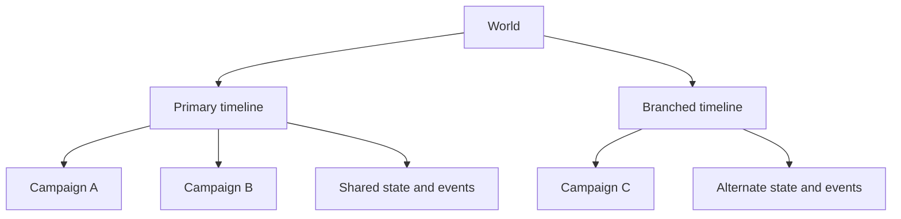
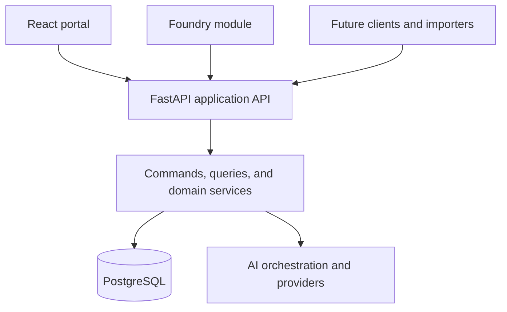

# D&D AI World Platform

> A self-hostable campaign intelligence and world-authoring platform for human Game Masters and their players.

The D&D AI World Platform helps groups build persistent worlds, preserve campaign history, understand what each character knows, and prepare richer sessions without handing authority to an autonomous AI Dungeon Master.

It is designed to become the shared source of truth behind a campaign: worlds, timelines, characters, locations, factions, quests, sessions, knowledge, rules, and the events that connect them. Game Masters remain in control of canon. Players receive views shaped by their characters, permissions, and discoveries. AI assists with understanding and proposing changes, but does not silently rewrite the world.

The initial rules implementation targets Dungeons & Dragons 5e (2024). The architecture is ruleset-aware and is intended to support additional tabletop systems over time.

> [!IMPORTANT]
> This project is under active development and is not yet a production release. See [Project Status](docs/PROJECT_STATUS.md) for verified current capabilities and [Roadmap](docs/PLANv2.md) for upcoming work.

## The product promise

**For Game Masters:** spend less time reconstructing continuity and more time preparing and running the game.

**For players:** remember the campaign, understand what your character knows, collaborate with the party, and make informed choices grounded in prior play.

**For the table:** keep one durable, permission-aware campaign record that can stand on its own and later integrate with virtual tabletops, bots, importers, and AI providers.

## What the platform is becoming

### A home for persistent worlds

A world can outlive any one campaign. Multiple campaigns may share a timeline, experience the consequences of one another's actions, or branch into alternate histories.

The platform treats campaign information as connected, structured records rather than isolated wiki pages:

- Worlds, timelines, and campaigns
- Player characters, NPCs, creatures, and organizations
- Locations, dungeons, items, and artifacts
- Quests, objectives, encounters, and sessions
- Events, relationships, and changing world state
- Facts, rumors, secrets, beliefs, and theories
- Rules definitions, sources, and character mechanics

### Campaign intelligence from what happened at the table

Session notes, recaps, transcripts produced by external services, and future structured imports can become reviewable campaign intelligence.

The intended workflow is:

1. Campaign material or session notes enter the system.
2. AI extracts possible entities, events, claims, relationships, and state changes.
3. The system compares those proposals with established campaign history.
4. The GM reviews, edits, accepts, or rejects each proposed change.
5. Approved changes enter canon with their source and provenance attached.
6. Knowledge and access rules determine who may see or use each fact.
7. GM and player tools use that updated, authorized context for the next session.

The original source, supporting passage, submitting user, approving user, effective game time, and previous value can remain connected to an accepted change. The goal is not just to remember *what* changed, but to preserve *why the system believes it changed*.

### A GM copilot—not an AI replacement GM

The platform is intended to help a human GM:

- Search and understand the full campaign record
- Find continuity conflicts before they reach the table
- Prepare quests, clues, complications, encounters, NPCs, and handouts
- Portray NPCs consistently using their goals, beliefs, relationships, and history
- Evaluate rules-aware character, creature, and encounter information
- Review proposed consequences before committing them to canon
- See the campaign evidence behind an AI recommendation

AI output remains a proposal until policy or the GM makes it authoritative. Saving generated material does not automatically make it true in the world.

### A player experience built from the same campaign

Players use the character-filtered side of the same platform rather than a disconnected companion application. The product direction includes:

- Personalized campaign recaps and character timelines
- Character-visible lore, NPCs, factions, quests, and discoveries
- Search and questions limited to what the player or character may know
- Character sheets, advancement, rules assistance, and resource tracking
- Private notes, bookmarks, plans, and theories
- Controlled sharing with a character, party, or campaign
- Player-submitted session notes and proposed campaign updates
- Advice grounded in the character's established portrayal and prior choices

Private player collaboration must stay private from the GM and GM-facing AI unless a player deliberately shares it.

## What makes it different

### Structured canon instead of chat history

The database—not an AI conversation—is the source of truth. Important campaign concepts are first-class records with stable identities, relationships, history, and authorization rules.

### Time matters

The platform models what was true at a particular point in a world's history, not only the latest version of a page. Campaigns on a shared timeline can observe persistent consequences; campaigns on another branch can retain a different history.

### Knowledge is not the same as truth

A fact may be objectively true without being known by a player, character, NPC, faction, or party. A belief may be sincere and still be wrong. Rumors, secrets, theories, memories, and doctrine are represented separately from objective world state.

### Human-controlled canon

GM-authored, player-authored, imported, and AI-proposed material retain their origin and lifecycle. Drafts and proposals can be reviewed before they become canon; superseded material can retain its history.

### Purpose-specific AI context

A GM copilot, player advisor, NPC roleplayer, and import processor should not receive the same information. Authorization is resolved before context is assembled, and each tool receives only the information allowed for its user and purpose.

### Rules-aware recommendations

Rules are versioned and connected to their sources. Mechanical guidance can be evaluated against the campaign's selected ruleset instead of relying only on a model's memory.

### Standalone first, integrations second

World and campaign authoring should work without a virtual tabletop. FoundryVTT, Discord, importers, transcription providers, local models, and future clients are integrations around the same backend—not prerequisites for using the platform.

### Self-hostable and provider-flexible

The supported deployment direction is self-hosted. The system is not designed around permanent dependence on one hosted campaign service or one AI model provider.

## Product boundaries

The D&D AI World Platform is not intended to replace:

- The human Game Master
- A complete virtual tabletop
- Native audio-transcription services
- A commercial rulebook marketplace
- Every feature of a general-purpose worldbuilding wiki
- Every character-sheet feature offered by a dedicated character builder

It may integrate with those tools while keeping the canonical campaign database under the group's control.

---

# Technical overview

## Design principles

### PostgreSQL is the source of truth

Structured PostgreSQL records are authoritative. Search indexes, embeddings, summaries, prompts, caches, generated documents, Foundry displays, and Discord responses are derived views.

### Clients use application services

The web portal, Foundry module, scripts, bots, importers, and future clients communicate through application services and APIs. They do not write directly to application tables.

### Definitions, state, history, and knowledge are separate

The model distinguishes:

- What an entity is
- What its current timeline state is
- What happened to produce that state
- Who knows or believes a claim
- What different participants are authorized to see

### History and provenance are preserved

Narratively meaningful changes retain their source, cause, actor, system time, and effective world time where applicable. Typed state supports efficient current reads; events and audit records preserve causality and accountability. This is an event-assisted state model, not pure event sourcing.

### Rules definitions and world instances are different things

For example, `Longsword` is a reusable rules definition. *The Blade of Saint Orra* is an item in a particular world. `Goblin` is a creature or species definition. *Grik the Gatekeeper* is a character.

## Core domain model

### World

A persistent setting containing entities, calendars, ruleset configuration, history, and timelines. A world is not owned by a campaign.

### Timeline

One evolving version of a world. Timelines contain persistent state and events and may branch from another timeline at a defined point.

### Campaign

A game played within a timeline. Campaigns organize participants, permissions, parties, sessions, character perspectives, knowledge views, and quest participation without normally copying world state.

### Entity

A significant world object with a stable UUID and declared type. Shared identity belongs in the base entity model; domain-specific attributes live in typed tables rather than an Entity-Attribute-Value replacement.

### Event

A narratively meaningful occurrence that explains why timeline state changed: an NPC died, a bridge collapsed, a vault opened, a faction seized a city, or a quest objective was completed.

### Knowledge item

A structured fact, rumor, secret, theory, belief, prophecy, misconception, memory, or doctrine. Knowledge and belief are tracked separately from objective truth and separately for each knower.

## World, timeline, and campaign relationships


```mermaid
flowchart TB
    W[World] --> T1[Primary timeline]
    W --> T2[Branched timeline]
    T1 --> C1[Campaign A]
    T1 --> C2[Campaign B]
    T2 --> C3[Campaign C]
    T1 --> S1[Shared state and events]
    T2 --> S2[Alternate state and events]
```

If Campaign A opens a sealed vault, Campaign B on the same timeline can later find it open. Campaign C, on a branch created before that event, can still find the vault sealed.

An effective campaign view combines:

```text
world definitions
+ inherited timeline history
+ current timeline state
+ campaign participation and permissions
+ party or character knowledge
= authorized campaign view
```

## Application architecture


```mermaid
flowchart TB
    P[React portal]
    F[Foundry module]
    X[Future clients and importers]
    API[FastAPI application API]
    S[Commands, queries, and domain services]
    DB[(PostgreSQL)]
    AI[AI orchestration and providers]

    P --> API
    F --> API
    X --> API
    API --> S
    S --> DB
    S --> AI
```

The detailed service, transaction, AI, integration, and deployment architecture is defined in [System Architecture](docs/architecture/SYSTEM_ARCHITECTURE.md).

## Technology stack

| Layer | Technology |
|---|---|
| Database | PostgreSQL 18 |
| Backend | Python, FastAPI, SQLAlchemy, Psycopg, Alembic |
| Portal | React, TypeScript, Vite, React Router |
| Portal testing | Vitest and Testing Library |
| Backend testing | Pytest against real PostgreSQL where database behavior matters |
| Authentication | Opaque server-side browser sessions; optional external OIDC compatibility |
| Password hashing | Argon2id |
| VTT integration | FoundryVTT v13 module |
| Deployment | Docker Compose; optional retained AWS infrastructure |

## Security and authorization model

- Browser authentication uses opaque server-side sessions.
- The browser cookie is `HttpOnly`, `Secure` in production, and `SameSite=Lax`.
- Browser code does not store passwords, bearer tokens, refresh tokens, or session identifiers.
- Cookie-authenticated mutations require an allowed Origin and an in-memory CSRF token.
- Authorization is resolved from current server-side state; hiding a control in the portal is presentation, not enforcement.
- Campaign, character-perspective, resource, and administrative access are capability-gated.
- Inaccessible resources must not be disclosed through routes, identifiers, counts, suggestions, cached content, or error details.
- Human browser sessions, optional OIDC bearer principals, Foundry device credentials, and machine principals remain separate trust boundaries.
- Security-sensitive actions produce durable, non-secret audit records.

See the security and authentication contracts under [`docs/`](docs/) for authoritative behavior.

## PostgreSQL domain layout

| Schema | Responsibility |
|---|---|
| `core` | Worlds, entities, names, sources, statuses, tags, calendars, world time |
| `security` | Users, sessions, roles, memberships, capabilities, grants, access groups |
| `rules` | Rulesets and reusable mechanical definitions |
| `character` | Shared character mechanics plus NPC and player-character extensions |
| `world` | Locations, organizations, items, relationships, economies, religions |
| `campaign` | Timelines, campaigns, parties, sessions, and effective mutable state |
| `narrative` | Events, quests, objectives, encounters, and story arcs |
| `knowledge` | Facts, rumors, beliefs, discoveries, expertise, and information transfer |
| `interaction` | Player, GM, portal, Foundry, and AI actions and resolutions |
| `ai` | Context assembly, prompts, embeddings, agents, and proposals |
| `audit` | Security and application change history, approvals, and validation outcomes |
| `import` | Staging and review for campaign-data imports |
| `integration` | External identifiers, device bindings, and synchronization state |

The authoritative logical model is documented in [Database Model](docs/architecture/DATABASE_MODEL.md).

## Repository layout

```text
.
├── database/              # Alembic migrations and seed data
├── docs/                  # Product, domain, architecture, operations, and ADRs
├── foundry-module/        # FoundryVTT v13 integration
├── portal/                # React and TypeScript web portal
├── scripts/               # Development and operational commands
├── src/dnd_ai/            # FastAPI application, commands, queries, and domain logic
├── tests/                 # Unit, database, and scenario tests
├── terraform/             # Optional retained AWS infrastructure
├── compose.yaml           # Supported self-hosted topology
├── Dockerfile
└── pyproject.toml
```

For the exact current layout and ownership rules, see [Development Guide](docs/DEVELOPMENT.md).

## Current implementation status

The repository is evolving quickly, so this README deliberately avoids claiming that every product-direction feature above is already complete.

- [Project Status](docs/PROJECT_STATUS.md) records dated, verification-backed implementation status.
- [Roadmap (PLANv2)](docs/PLANv2.md) is the authoritative product roadmap; [Project Plan](docs/PLAN.md) is the detailed architectural record and carries the Phase 15 completion checkpoints.
- [UI Design](docs/UI_DESIGN.md) defines portal behavior and authorization-sensitive presentation.
- [Entity Lifecycle](docs/ENTITY_LIFECYCLE.md) defines creation, approval, mutation, supersession, archival, and deletion rules.

## Getting started

Self-hosted Docker Compose is the supported deployment topology. The current stack uses PostgreSQL, a migration service, and the FastAPI application on a private Compose network. Development can also use a locally installed PostgreSQL 18 server.

### Contributor setup

Start with:

1. [Contributing](docs/CONTRIBUTING.md) for onboarding and project workflow.
2. [Development Guide](docs/DEVELOPMENT.md) for PostgreSQL, Python, portal, migration, and test setup.
3. [Domain Model](docs/DOMAIN_MODEL.md) for shared vocabulary.
4. [Database Conventions](docs/DATABASE_CONVENTIONS.md) before changing schema or persistence code.

The Python environment is managed with `uv`; the portal uses `npm` with its committed lockfile.

Common verification commands include:

```bash
uv sync
uv run ruff check .
uv run mypy src
uv run pytest tests/unit

cd portal
npm ci
npm test
npm run lint
npm run build
```

Database and scenario tests require a configured PostgreSQL 18 database. Follow the environment and test-database instructions in [Development Guide](docs/DEVELOPMENT.md) rather than inventing local connection conventions.

### Self-hosted startup

```bash
cp .env.example .env
# Set the required database credentials and connection URLs in .env.

docker compose up -d db
docker compose --profile tools run --rm migrate
docker compose up -d api
```

The base Compose file does not publish database or API ports to the host. The development override adds loopback-only ports. A production deployment requires an ingress or reverse proxy and the operational controls described in [Local Deployment](docs/LOCAL_DEPLOYMENT.md).

AWS RDS support remains available as an optional database-hosting path under [`terraform/`](terraform/), but it is not required for development, testing, or self-hosting.

## Documentation map

### Product and status

- [Project Status](docs/PROJECT_STATUS.md) — verified implementation snapshot
- [Roadmap (PLANv2)](docs/PLANv2.md) — authoritative roadmap; [Project Plan](docs/PLAN.md) — architecture and Phase 15 checkpoints
- [UI Design](docs/UI_DESIGN.md) — portal interaction and authorization rules

### Domain and architecture

- [Domain Model](docs/DOMAIN_MODEL.md) — authoritative vocabulary and ownership rules
- [Entity Lifecycle](docs/ENTITY_LIFECYCLE.md) — authoring, canon, supersession, archival, and deletion
- [Database Conventions](docs/DATABASE_CONVENTIONS.md) — PostgreSQL and migration rules
- [System Architecture](docs/architecture/SYSTEM_ARCHITECTURE.md) — application and deployment architecture
- [Database Model](docs/architecture/DATABASE_MODEL.md) — logical schemas and relationships
- [Dungeon Flow](docs/architecture/DUNGEON_FLOW.md) — end-to-end interaction and state-change scenario

### Building and operating

- [Contributing](docs/CONTRIBUTING.md) — contributor onboarding
- [Development Guide](docs/DEVELOPMENT.md) — toolchain, setup, migrations, and tests
- [Local Deployment](docs/LOCAL_DEPLOYMENT.md) — self-hosted operational requirements
- [Quickstart](docs/QUICKSTART.md) — deployment fast path
- [Checklist](docs/CHECKLIST.md) — deployment checks
- [Infrastructure](docs/INFRASTRUCTURE.md) — infrastructure reference

### Working with coding assistants

- [CLAUDE.md](CLAUDE.md) — repository operating instructions
- [AI Assistant Guide](docs/AI_ASSISTANT_GUIDE.md) — worked examples and anti-patterns
- [Copilot Instructions](.github/copilot-instructions.md) — condensed repository rules

### Decisions

- [Architecture Decision Records](docs/adr/) — one file per accepted architectural decision

## Contributing

This is a pre-release project with strict data-integrity, authorization, migration, and test requirements. Before opening a change, read [Contributing](docs/CONTRIBUTING.md) and the documentation for the domain you are modifying.

## License

TBD
