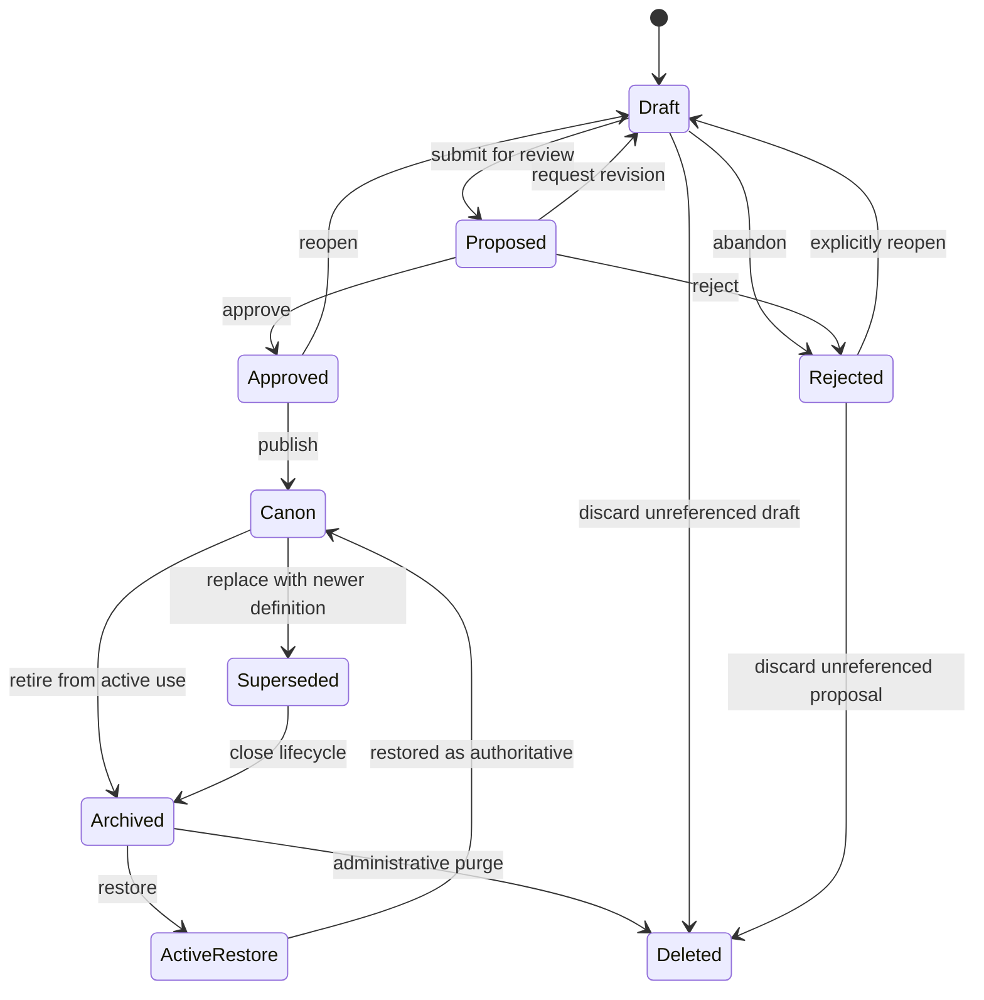
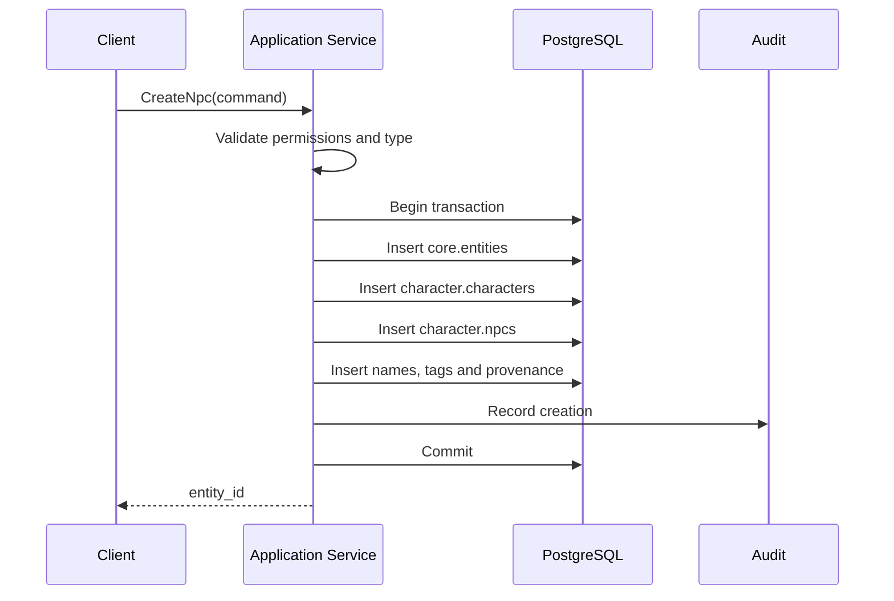
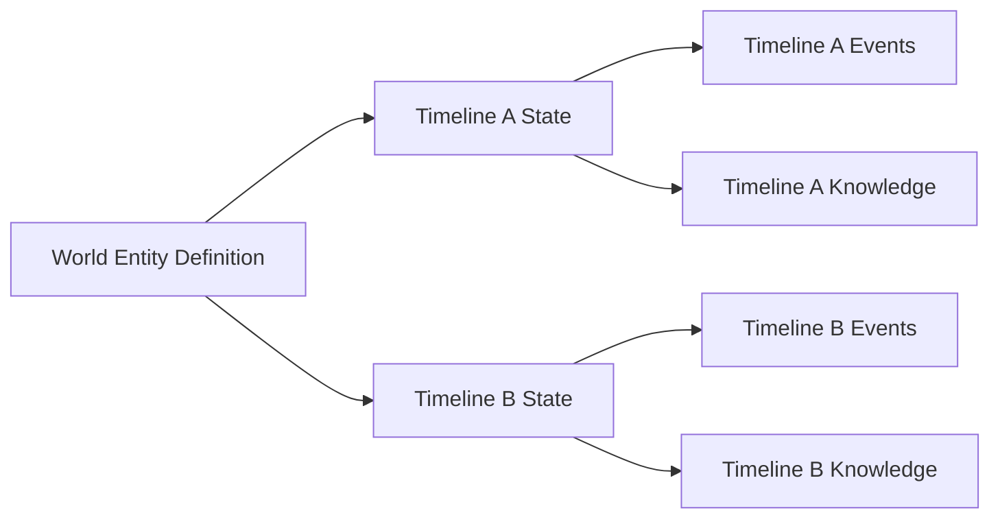
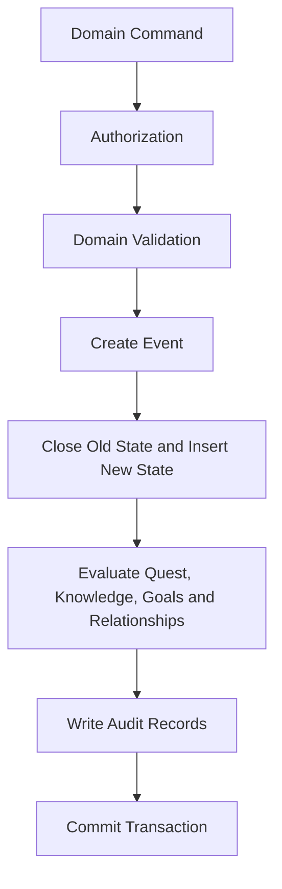
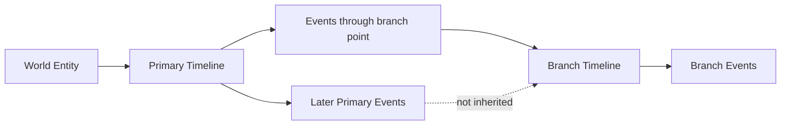
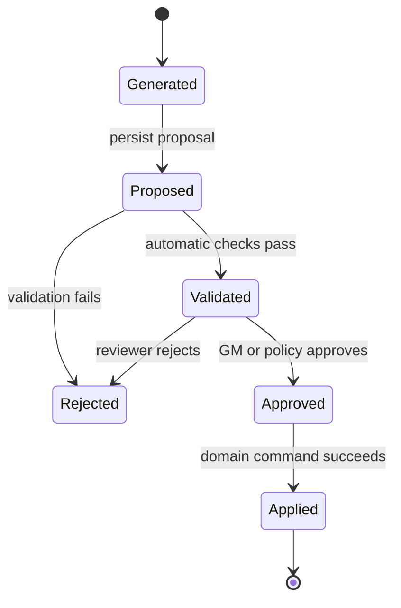

# Entity Lifecycle

## 1. Purpose

This document defines how entities are created, classified, approved, activated, changed, branched, superseded, archived, restored and deleted within the D&D AI World Platform.

The lifecycle applies to all important world objects that use `core.entities`, including characters, NPCs, locations, organizations, item instances, quests, events and knowledge items.

## 2. Lifecycle dimensions

An entity has several independent lifecycle dimensions. They must not be collapsed into one status field.

### 2.1 Canon status

Canon status answers: **How authoritative is this definition?**

Recommended values:

- `draft`
- `proposed`
- `approved`
- `canon`
- `superseded`
- `rejected`
- `deprecated`

`superseded` and `deprecated` are distinct: a superseded definition was *replaced* by a specific newer one, while a deprecated definition is discouraged from new use but has no designated replacement. The state diagram in [§3](#3-lifecycle-state-diagram) does not yet draw `deprecated`'s transitions.

### 2.2 Operational lifecycle status

Lifecycle status answers: **Is this entity currently usable by the platform?**

Recommended values:

- `pending`
- `active`
- `inactive`
- `archived`
- `deleted`

`deleted` is reserved for controlled administrative deletion and should be uncommon.

### 2.3 Timeline state

Timeline state answers: **What is currently true about this entity in a particular timeline?**

Examples:

- alive or dead
- open or sealed
- active or destroyed
- friendly or hostile
- owned or unclaimed
- discovered or unknown

Timeline state is not stored in `core.entities`.

### 2.4 Knowledge state

Knowledge state answers: **Who knows or believes what about this entity?**

Discovery and belief changes do not alter the entity definition or objective world state.

## 3. Lifecycle state diagram



The diagram describes definition authority. Timeline events such as death or destruction do not normally move an entity from `canon` to `archived`.

## 4. Creation workflow

All entity creation should occur through an application command or database function that performs the full class-table inheritance chain in one transaction.

Example command:

```text
CreateNpc
```

Transactional steps:

1. Validate the target world.
2. Resolve the requested entity type.
3. Validate the caller's permission.
4. Create a provenance source when needed.
5. Insert `core.entities` with `draft` or `canon` status according to policy.
6. Insert the required subtype chain.
7. Insert canonical and alternate names.
8. Insert initial tags and relationships.
9. Insert optional baseline definition records.
10. Create initial timeline state only when a timeline is explicitly supplied.
11. Record the operation in `audit.change_log`.
12. Commit atomically.



## 5. Class-table inheritance integrity

An entity subtype is complete only when every required table in its inheritance path exists.

Example NPC chain:

```text
core.entities
  -> character.characters
      -> character.npcs
```

Required rules:

- The same UUID is used at every level.
- The entity type must match the subtype path.
- Subtype creation is atomic.
- Direct inserts into subtype tables are blocked or restricted.
- Validation detects missing, duplicate or conflicting subtype rows.

An entity cannot simultaneously be an NPC and an unrelated location subtype unless the domain model explicitly defines a composite type.

## 6. Definition versus timeline state

Entity definitions are world-scoped and mostly stable.

Examples of definition data:

- canonical name
- species
- dungeon layout
- item identity
- quest objective definition
- organization purpose

Timeline state is mutable and historical.

Examples of timeline state:

- current location
- hit points
- alive/dead status
- door open/closed state
- quest progress
- organization control



A change in one timeline does not modify the shared definition and does not affect another timeline after a branch point.

## 7. Mutation workflow

Persistent mutations should use domain commands rather than direct table updates.

General flow:

```text
Command
-> authorization
-> validation
-> interaction or administrative cause
-> event
-> typed state transition
-> quest, knowledge and relationship reactions
-> audit
-> commit
```



Events and resulting state changes must commit atomically.

## 8. Versioning and correction

### 8.1 Definition revisions

Minor corrections may update a draft directly. Canonical changes should create traceable revisions.

A canonical definition should be superseded when:

- its meaning changes materially
- a replacement definition becomes authoritative
- an import is corrected after publication
- a ruleset version changes the referenced mechanical definition

Supersession should retain a link from the old entity or definition version to the replacement.

### 8.2 Historical corrections

A historical correction does not erase the original event. Use one of:

- correction event
- voiding event
- superseding event
- administrative state repair with explicit provenance

Audit records must preserve both the erroneous and corrected records.

## 9. Branching timelines

When a timeline branches:

1. The new timeline records its parent.
2. The branch point records an event or world time.
3. Entity definitions remain shared through the world.
4. Parent events through the branch point are inherited.
5. Parent events after the branch point are excluded.
6. The branch creates new typed state only when it diverges or when materialized for performance.
7. New events belong only to the branch.



## 10. AI-generated entities and changes

AI generation follows a proposal lifecycle.



Rules:

- Generated text is not canon.
- A proposal references its source context and model output.
- Validation checks world ownership, type compatibility, permissions and contradictions.
- High-impact changes require explicit approval.
- Applying a proposal uses the same domain command path as human-authored changes.
- Applied changes create normal events, state rows and audit records.

## 11. Import lifecycle

Imported campaign material follows a staged workflow.

```text
Source document
-> extraction
-> staged candidate
-> entity matching
-> validation
-> human review
-> promotion batch
-> normal entity creation or update command
-> canon decision
```

Imported candidates must not write directly into `core.entities` or typed state tables.

Possible outcomes:

- create a new entity
- attach evidence to an existing entity
- propose a correction
- create a knowledge item
- reject as duplicate or unsupported

## 12. Archival

Archival removes an entity from ordinary active use while retaining its history.

Archive when:

- a draft is abandoned but should be retained
- a deprecated definition has been superseded
- an organization or location is removed from future authoring menus
- a test or prototype entity must remain traceable

Do not archive an entity merely because it is dead, destroyed, closed or completed in a timeline. Those are timeline-state conditions.

Archived entities remain available to:

- historical queries
- event references
- audit records
- timeline reconstruction
- knowledge and relationship history

## 13. Restoration

Restoration requires:

1. Permission check.
2. Validation that subtype rows still exist.
3. Resolution of name or uniqueness conflicts.
4. A restoration reason and source.
5. Audit entry.
6. Optional reactivation of supporting definitions.

Restoring an archived entity does not automatically reverse timeline-state events.

## 14. Physical deletion

Physical deletion is exceptional.

Allowed cases:

- unreferenced draft created by mistake
- failed test fixture
- data that must be removed for legal or security reasons
- administrative cleanup before production use

Deletion constraints:

- No immutable events may reference the entity.
- No canonical knowledge, relationship or audit record may require it.
- A privileged administrative command is required.
- The deletion reason must be recorded.
- Cascades may remove subtype rows but must not silently remove unrelated history.

## 15. Event entity lifecycle

Events are entities but follow stricter rules.

Recommended statuses:

- `draft`: assembled but not committed as history
- `recorded`: accepted historical event
- `voided`: retained but excluded from effective state
- `corrected`: superseded by a correction event

Recorded events are immutable. Corrections create new records.

## 16. Quest lifecycle

Quest definition lifecycle:

- draft
- proposed
- canon
- superseded
- archived

Quest progression lifecycle is separate and timeline-scoped:

- unavailable
- available
- active
- suspended
- completed
- failed
- abandoned

A completed quest remains a canonical entity. Its timeline state changes; the quest definition is not archived merely because one party completed it.

## 17. Knowledge lifecycle

Knowledge items represent claims and may evolve through versions.

Definition statuses may include:

- proposed claim
- accepted claim
- disputed claim
- superseded wording
- rejected claim

Per-knower states may include:

- unaware
- suspected
- believed
- known
- disbelieved
- forgotten

Changing what a character believes does not change the claim's objective truth status.

## 18. Concurrency and idempotency

All write commands should support an idempotency key when invoked by external integrations or asynchronous workers.

Concurrency rules:

- Use optimistic version columns on mutable current-state rows.
- Lock the current state row before closing and replacing it.
- Enforce one current row with a partial unique index.
- Reject stale version updates.
- Return the already-created result for a repeated idempotency key.

## 19. Required audit data

Every lifecycle transition should record:

- actor user or service identity
- operation
- entity identifier
- previous status
- new status
- source or reason
- correlation identifier
- command identifier
- related event identifier
- AI proposal identifier when applicable
- system timestamp

## 20. Lifecycle invariants

1. Canon status and operational status are independent.
2. Timeline state never overwrites world definition data.
3. Discovery never creates the object being discovered.
4. Class-table subtype chains are complete and type-correct.
5. Canonical changes retain provenance.
6. Recorded events are not edited in place.
7. AI proposals cannot bypass domain commands.
8. Import promotion cannot bypass validation.
9. Archived entities remain referenceable.
10. Physical deletion cannot silently destroy history.
11. Branch timelines inherit only through the branch point.
12. Every current-state transition has a cause or explicit administrative source.

## 21. Service commands

Recommended lifecycle commands:

- `CreateEntity`
- `CreateCharacter`
- `CreateNpc`
- `CreatePlayerCharacter`
- `CreateLocation`
- `CreateDungeon`
- `CreateQuest`
- `SubmitEntityForReview`
- `ApproveEntity`
- `PublishEntityAsCanon`
- `SupersedeEntity`
- `ArchiveEntity`
- `RestoreEntity`
- `DeleteDraftEntity`
- `ApplyTimelineStateChange`
- `RecordEvent`
- `VoidEvent`
- `CorrectEvent`
- `CreateTimelineBranch`
- `SubmitAiProposal`
- `ApproveAiProposal`
- `RejectAiProposal`
- `PromoteImportBatch`

## 22. Acceptance tests

The lifecycle implementation is acceptable when automated tests prove:

- Creating an NPC creates the complete entity/character/NPC chain atomically.
- A failure in any subtype insert rolls back the base entity.
- A canonical entity can be superseded without losing historical references.
- Killing an NPC changes timeline state without archiving the NPC definition.
- A branch before the death event sees the NPC alive.
- Discovering a secret door changes party knowledge without creating a second door.
- An AI proposal cannot mutate state before approval.
- An imported candidate cannot become canon without promotion.
- An archived entity remains queryable through historical events.
- A recorded event cannot be edited directly.
