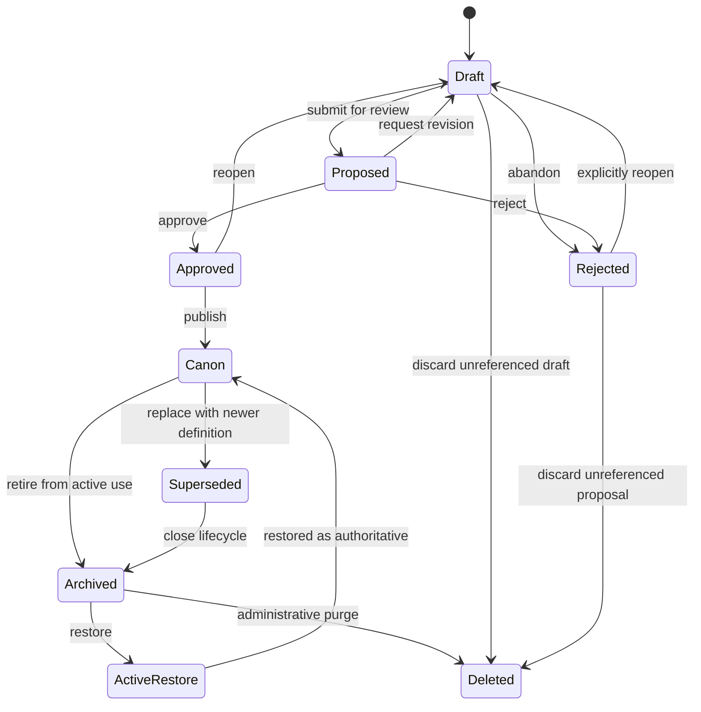
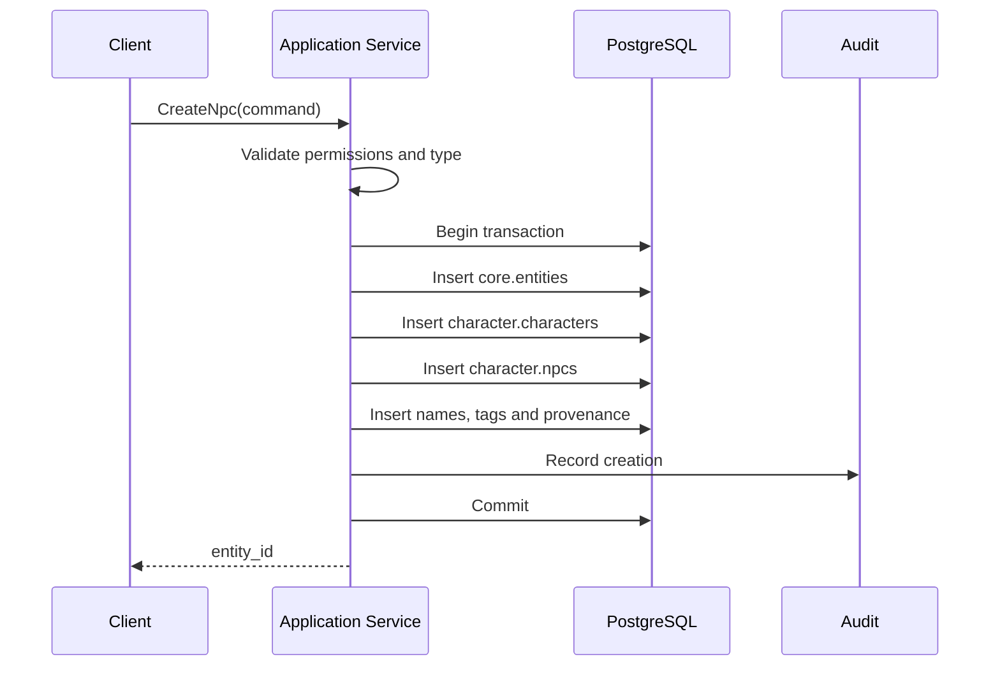
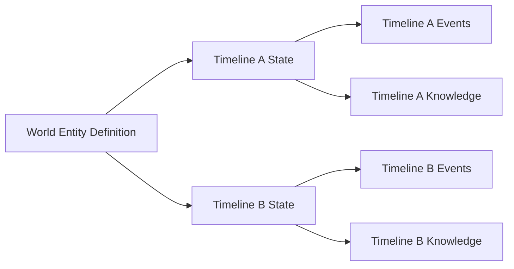
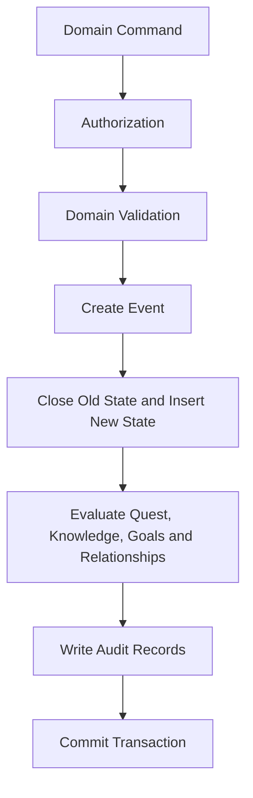
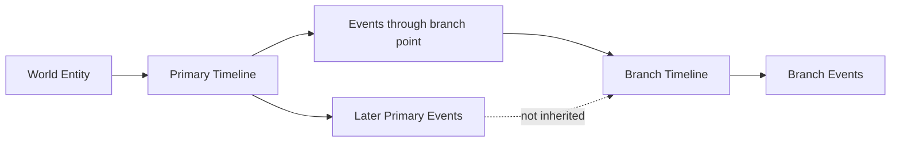
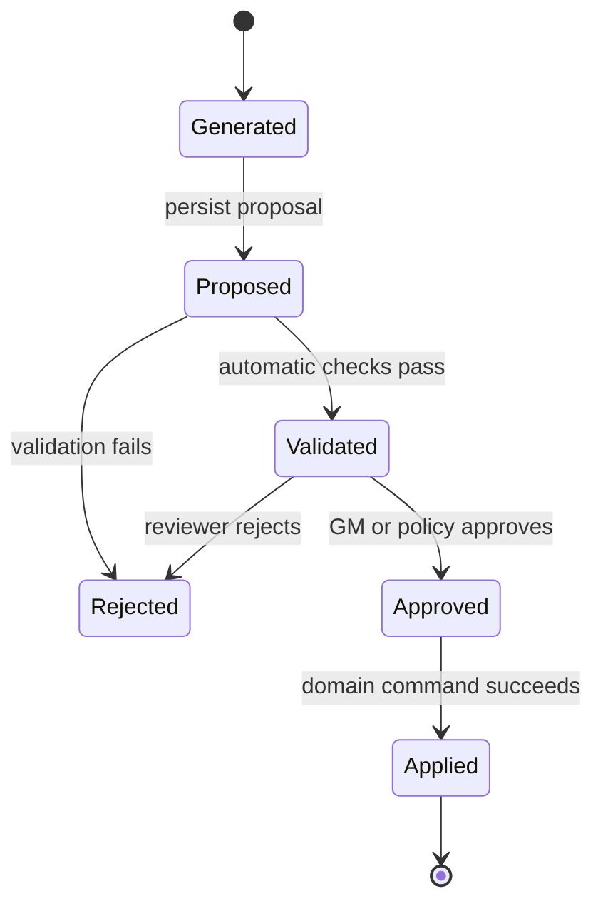

# Entity Lifecycle

## 1. Purpose

This document defines how entities are created, classified, approved, activated, changed, branched, superseded, archived, restored and deleted within the D&D AI World Platform.

The lifecycle applies to all important world objects that use `core.entities`, including characters, NPCs, locations, organizations, item instances, quests, events and knowledge items.

## 2. Lifecycle dimensions

An entity has several independent lifecycle dimensions. They must not be collapsed into one status field.

### 2.1 Canon status

Canon status answers: **How authoritative is this definition?**

Recommended values:

- `draft`
- `proposed`
- `approved`
- `canon`
- `superseded`
- `rejected`
- `deprecated`

`superseded` and `deprecated` are distinct: a superseded definition was *replaced* by a specific newer one, while a deprecated definition is discouraged from new use but has no designated replacement. The state diagram in [§3](#3-lifecycle-state-diagram) does not yet draw `deprecated`'s transitions.

### 2.2 Operational lifecycle status

Lifecycle status answers: **Is this entity currently usable by the platform?**

Recommended values:

- `pending`
- `active`
- `inactive`
- `archived`
- `deleted`

`deleted` is reserved for controlled administrative deletion and should be uncommon.

### 2.3 Timeline state

Timeline state answers: **What is currently true about this entity in a particular timeline?**

Examples:

- alive or dead
- open or sealed
- active or destroyed
- friendly or hostile
- owned or unclaimed
- discovered or unknown

Timeline state is not stored in `core.entities`.

### 2.4 Knowledge state

Knowledge state answers: **Who knows or believes what about this entity?**

Discovery and belief changes do not alter the entity definition or objective world state.

## 3. Lifecycle state diagram


```mermaid
stateDiagram-v2
    [*] --> Draft
    Draft --> Proposed: submit for review
    Draft --> Rejected: abandon
    Proposed --> Draft: request revision
    Proposed --> Approved: approve
    Proposed --> Rejected: reject
    Approved --> Canon: publish
    Approved --> Draft: reopen
    Canon --> Superseded: replace with newer definition
    Canon --> Archived: retire from active use
    Superseded --> Archived: close lifecycle
    Rejected --> Draft: explicitly reopen
    Archived --> ActiveRestore: restore
    ActiveRestore --> Canon: restored as authoritative
    Archived --> Deleted: administrative purge
    Draft --> Deleted: discard unreferenced draft
    Rejected --> Deleted: discard unreferenced proposal
```

The diagram describes definition authority. Timeline events such as death or destruction do not normally move an entity from `canon` to `archived`.

### 3.1 Accepted transitions (Phase 14)

The shared commands implement exactly this table (`dnd_ai.domain.entity_lifecycle`), enforced by one pure policy that both the commands and the portal's `available_actions` / `blocked_actions` read model consult:

| From | Action | To |
|---|---|---|
| draft | submit for review | proposed |
| draft | reject (abandon) | rejected |
| proposed | return to draft | draft |
| proposed | approve | approved |
| proposed | reject | rejected |
| approved | publish | canon |
| approved | return to draft | draft |
| rejected | return to draft | draft |
| canon | supersede (replacement `approved` or `canon`, same world and type; an `approved` replacement is published by the call and must pass the same type-specific publish preconditions as ordinary publish, see §3.1a) | superseded |
| any canon status except proposed/approved | archive | lifecycle `archived` (canon status unchanged) |
| lifecycle `archived` | restore (reason required) | lifecycle `active` (canon status unchanged; a superseded entity restores to superseded) |
| draft or rejected, unreferenced | delete draft (reason required) | physically deleted |

`deprecated` has no transitions yet. Every transition other than restore and delete requires lifecycle `active`. **Publish and restore require the subtype chain to be complete**, because the database verifies that a subtype row matches its entity's type but not that one exists. Approval and publish bind to the `row_version` the reviewer saw, so a draft edited after review cannot be approved by mistake. There is no separation of duties: the same `canon.edit` holder may author, approve, and publish (accepted limitation).

### 3.2 Which records use canon lifecycle (eligibility registry)

Canon lifecycle applies to `core.entities` *definitions* only, and only to the types in `ENTITY_LIFECYCLE_ELIGIBLE_TYPE_CODES`: the place types (`location`, `settlement`, `building`, `plane`, `continent`, `nation`, `region`, `district`, `geographic_feature`, `realm`), the organization types (`organization`, `business`, `government`, `religious_organization`, `military_unit`, `political_faction`), `religion`, and, since Phase 15.1, `npc` (NPC identity, with an archive guard while a user is linked), since Phase 15.2B-1 `player_character` (identity only; the same archive guard, and a draft or unpublished character confers no perspective even when a relationship exists), `quest` (a definition lifecycle; progress stays timeline state), `dungeon` and `dungeon_area` (since Phase 15.3A-1; runtime state and discovery stay timeline state and knowledge), and `knowledge_item` (the claim; who knows it stays per-knower state). Excluded types (`ENTITY_LIFECYCLE_EXCLUDED_TYPE_CODES`) and why: the bare `character` supertype (no authoring surface; NPC and player-character identity are the eligible subtypes), `event` (own draft/recorded/voided/corrected machine; 15E), and `item_instance` (instance/state; 15F). Since Phase 15.3A-1 `dungeon` and `dungeon_area` are eligible (see section 23 on dungeon authoring). Worlds, timelines, and campaigns do **not** use canon lifecycle; they use only operational `active`/`archived`.

**Adding a type to the registry is a reviewed change**: it must also extend read-side visibility gating (`dnd_ai.queries.entity_lifecycle.lifecycle_hidden_entity_ids` and the World Explorer) to every surface the type appears on, and its deletable-reference classification must be reviewed (§14). A catalog test fails when a new foreign key to a definition is unclassified.

### 3.1a Editing a definition (Phase 15.1; [ADR 0015](adr/0015-typed-world-content-authoring.md))

Type-specific `update_*` commands mutate a definition in place, **only while lifecycle is `active` and canon status is `draft` or `canon`**. `proposed` and `approved` records are not editable (return to draft first), so an approved record cannot change before publish; `rejected` and `superseded` report `wrong_canon_status`, and archived records report `entity_archived`. The check is the pure `content_edit_blocked_reason` policy that the read model's `update` action also uses. A real edit bumps `row_version` through the root UPDATE (even for subtype-only changes) and writes one `updated` audit row with bounded `{field: {from, to}}`; an identical resubmission is a no-op (`changed: false`, no version bump, no audit). Entity type is immutable after creation; a change of meaning on canon is a new draft that supersedes the old record. Type-specific **publish** and **archive** preconditions (a canon parent, origin, target or subject; the NPC user-relationship guard) are a hook consulted by both the commands and `blocked_actions`. **Supersession publishes an `approved` replacement, so it enforces the same hook** (`quest_definition_incomplete`, `reference_not_published`) after locking the replacement's references `FOR SHARE` in the same ascending-id pass as the pair, and refuses a replacement that depends on the record being superseded; a failure mutates nothing, writes no audit row, and leaves no idempotency reservation. A `canon` replacement is already published and is not re-validated (existing-reference policy). `replacement-candidates` omits an `approved` record that supersession would refuse.

### 3.3 Read-side visibility

A caller without `canon.edit` sees only published definitions in browse lists (`canon` and `active`); detail routes, relationship participants, and event participants/locations additionally resolve `superseded`, `deprecated`, and archived definitions so history stays referenceable. Drafts, proposals, approved-but-unpublished, and rejected definitions are the same 404 as a nonexistent record. A `canon.edit` caller sees everything (except deleted) in detail and may preview drafts and archived records in lists with `include_noncanon` / `include_archived`; those flags are ignored for everyone else.

## 4. Creation workflow

All entity creation should occur through an application command or database function that performs the full class-table inheritance chain in one transaction.

Example command:

```text
CreateNpc
```

Transactional steps:

1. Validate the target world.
2. Resolve the requested entity type.
3. Validate the caller's permission.
4. Create a provenance source when needed.
5. Insert `core.entities` with `draft` or `canon` status according to policy.
6. Insert the required subtype chain.
7. Insert canonical and alternate names.
8. Insert initial tags and relationships.
9. Insert optional baseline definition records.
10. Create initial timeline state only when a timeline is explicitly supplied.
11. Record the operation in `audit.change_log`.
12. Commit atomically.


```mermaid
sequenceDiagram
    participant C as Client
    participant API as Application Service
    participant DB as PostgreSQL
    participant AUD as Audit

    C->>API: CreateNpc(command)
    API->>API: Validate permissions and type
    API->>DB: Begin transaction
    API->>DB: Insert core.entities
    API->>DB: Insert character.characters
    API->>DB: Insert character.npcs
    API->>DB: Insert names, tags and provenance
    API->>AUD: Record creation
    API->>DB: Commit
    API-->>C: entity_id
```

## 5. Class-table inheritance integrity

An entity subtype is complete only when every required table in its inheritance path exists.

Example NPC chain:

```text
core.entities
  -> character.characters
      -> character.npcs
```

Required rules:

- The same UUID is used at every level.
- The entity type must match the subtype path.
- Subtype creation is atomic.
- Direct inserts into subtype tables are blocked or restricted.
- Validation detects missing, duplicate or conflicting subtype rows.

An entity cannot simultaneously be an NPC and an unrelated location subtype unless the domain model explicitly defines a composite type.

## 6. Definition versus timeline state

Entity definitions are world-scoped and mostly stable.

Examples of definition data:

- canonical name
- species
- dungeon layout
- item identity
- quest objective definition
- organization purpose

Timeline state is mutable and historical.

Examples of timeline state:

- current location
- hit points
- alive/dead status
- door open/closed state
- quest progress
- organization control


```mermaid
flowchart LR
    DEF[World Entity Definition] --> T1[Timeline A State]
    DEF --> T2[Timeline B State]
    T1 --> E1[Timeline A Events]
    T2 --> E2[Timeline B Events]
    T1 --> K1[Timeline A Knowledge]
    T2 --> K2[Timeline B Knowledge]
```

A change in one timeline does not modify the shared definition and does not affect another timeline after a branch point.

## 7. Mutation workflow

Persistent mutations should use domain commands rather than direct table updates.

General flow:

```text
Command
-> authorization
-> validation
-> interaction or administrative cause
-> event
-> typed state transition
-> quest, knowledge and relationship reactions
-> audit
-> commit
```


```mermaid
flowchart TD
    CMD[Domain Command] --> AUTH[Authorization]
    AUTH --> VAL[Domain Validation]
    VAL --> EVT[Create Event]
    EVT --> STATE[Close Old State and Insert New State]
    STATE --> REACT[Evaluate Quest, Knowledge, Goals and Relationships]
    REACT --> AUDIT[Write Audit Records]
    AUDIT --> COMMIT[Commit Transaction]
```

Events and resulting state changes must commit atomically.

## 8. Versioning and correction

### 8.1 Definition revisions

Minor corrections may update a draft directly. Canonical changes should create traceable revisions.

A canonical definition should be superseded when:

- its meaning changes materially
- a replacement definition becomes authoritative
- an import is corrected after publication
- a ruleset version changes the referenced mechanical definition

Supersession should retain a link from the old entity or definition version to the replacement.

**Built (Phase 15, checkpoint 15.2R):** every real change to a typed definition (create, edit, quest stage/objective change) and every lifecycle transition writes a snapshot to `core.entity_revisions` (see DATABASE_MODEL §5.3a). Edits made before that checkpoint have no snapshot. There is no read path or comparison view until checkpoint 15.3C-2.

### 8.2 Historical corrections

A historical correction does not erase the original event. Use one of:

- correction event
- voiding event
- superseding event
- administrative state repair with explicit provenance

Since Phase 15.2E-1 (decision D-15) the first two are implemented as `void_event` and `correct_event` over `narrative.event_corrections`. A correction records a *correcting event* (`administrative_correction`, at the original event's own world time, citing it as its cause) that carries a compensating `narrative.event_effects` row for every reversed effect, applies the reversals, optionally records a replacement event (a correction), links everything, and moves the original from `recorded` to `voided` / `corrected`, in one transaction (the deferred trigger refuses the status change without the link). The original is never edited or deleted, and `campaign.effective_events()` already ignores events that are not `recorded`. The compensation is applied only when the state the original effect produced is still there; otherwise the command refuses with `correction_not_reversible`. Reversals exist today for what the knowledge runtime records (learning and telling remove the belief and the transfer, a public record and a party reveal are removed, a belief change restores the previous values; since 15.2E-3), quest and objective status (`quest_status_id`, `objective_status_id`; since 15.2E-2b, restoring the earlier status or removing the state a first write created), hit points (`current_hit_points`), the active build (`character_build_id`) and party membership (`party_membership`: a join is removed, a leave reopens the membership unless it would overlap); an event with any other effect kind (location, conditions, resources, the campaign clock, relationships) refuses until its writer gains a reversal. A correction cannot itself be corrected, and an event is corrected at most once.

Audit records must preserve both the erroneous and corrected records.

## 9. Branching timelines

When a timeline branches:

1. The new timeline records its parent.
2. The branch point records an event or world time.
3. Entity definitions remain shared through the world.
4. Parent events through the branch point are inherited.
5. Parent events after the branch point are excluded.
6. The branch creates new typed state only when it diverges or when materialized for performance.
7. New events belong only to the branch.


```mermaid
flowchart LR
    W[World Entity] --> P[Primary Timeline]
    P --> E1[Events through branch point]
    E1 --> B[Branch Timeline]
    P --> E2[Later Primary Events]
    B --> E3[Branch Events]
    E2 -. not inherited .-> B
```

### 9.1 Branch creation through `create_timeline_branch` (Phase 14)

The branch command offers exactly two kinds of branch point:

- **`existing_world_time`** — the world time of a *recorded* event in `campaign.effective_events(parent)` (inherited ancestor history counts). It must not precede the parent's own branch point: `effective_events` caps each ancestor at the *next timeline down's* branch point, so branching earlier than one's parent's branch point would let the child see ancestor events newer than its own branch point.
- **`latest`** — "branch from the present state of the parent's history". Creates a new narrative `core.world_times` row (no calendar or year, a required label) with `sort_key` one past everything the parent can see (never before the parent's own branch point). On an event-less timeline that is `sort_key = 0`, so a brand-new world can branch without SQL.

Nonexistent, other-world, not-in-history, and draft-event-only world times are the same `branch_point_invalid` error. `branch_event_id` stays NULL in Phase 14 (attaching a causal event arrives with event authoring, Phase 15E). The parent timeline and its world must be active; a new branch is never primary. Lineage (`parent_timeline_id`, `branch_world_time_id`) is immutable after creation.

**Inheritance is by world-time position**, exactly as `effective_events` computes it: a parent event recorded *later* at a world time at or before the branch point is pre-branch history by definition and is inherited. Branch-point options expose only world-time labels, never event names or IDs.

## 10. AI-generated entities and changes

AI generation follows a proposal lifecycle.


```mermaid
stateDiagram-v2
    [*] --> Generated
    Generated --> Proposed: persist proposal
    Proposed --> Validated: automatic checks pass
    Proposed --> Rejected: validation fails
    Validated --> Approved: GM or policy approves
    Validated --> Rejected: reviewer rejects
    Approved --> Applied: domain command succeeds
    Applied --> [*]
```

Rules:

- Generated text is not canon.
- A proposal references its source context and model output.
- Validation checks world ownership, type compatibility, permissions and contradictions.
- High-impact changes require explicit approval.
- Applying a proposal uses the same domain command path as human-authored changes.
- Applied changes create normal events, state rows and audit records.

## 11. Import lifecycle

Imported campaign material follows a staged workflow.

```text
Source document
-> extraction
-> staged candidate
-> entity matching
-> validation
-> human review
-> promotion batch
-> normal entity creation or update command
-> canon decision
```

Imported candidates must not write directly into `core.entities` or typed state tables.

Possible outcomes:

- create a new entity
- attach evidence to an existing entity
- propose a correction
- create a knowledge item
- reject as duplicate or unsupported

## 12. Archival

Archival removes an entity from ordinary active use while retaining its history.

Archive when:

- a draft is abandoned but should be retained
- a deprecated definition has been superseded
- an organization or location is removed from future authoring menus
- a test or prototype entity must remain traceable

Do not archive an entity merely because it is dead, destroyed, closed or completed in a timeline. Those are timeline-state conditions.

Archived entities remain available to:

- historical queries
- event references
- audit records
- timeline reconstruction
- knowledge and relationship history

## 13. Restoration

Restoration requires:

1. Permission check.
2. Validation that subtype rows still exist.
3. Resolution of name or uniqueness conflicts.
4. A restoration reason and source.
5. Audit entry.
6. Optional reactivation of supporting definitions.

Restoring an archived entity does not automatically reverse timeline-state events.

Phase 14 implements restoration as `restore_entity`: `canon.edit`, a required reason, the legal-transition check, and subtype-chain completeness; canon status is unchanged and `archived_at` is cleared. Archive is `archive_entity`; it is refused while an entity is in review (`proposed`/`approved`) — reject or return it to draft first.

## 14. Physical deletion

Physical deletion is exceptional.

Allowed cases:

- unreferenced draft created by mistake
- failed test fixture
- data that must be removed for legal or security reasons
- administrative cleanup before production use

Phase 14 implements the first case as `delete_draft_entity`: only a never-canon (`draft`/`rejected`) entity with a reason, and only when nothing references it. What counts as a reference is the reviewed `ENTITY_REFERENCE_CLASSIFICATION` (`dnd_ai.commands.entity_lifecycle`): the subtype chain, names, and tags are owned and go with the definition; any other foreign key (events, relationships, grants, state, children) blocks the deletion with `entity_referenced`. The audit row survives the delete.

Deletion constraints:

- No immutable events may reference the entity.
- No canonical knowledge, relationship or audit record may require it.
- A privileged administrative command is required.
- The deletion reason must be recorded.
- Cascades may remove subtype rows but must not silently remove unrelated history.

## 15. Event entity lifecycle

Implementation note (Phase 15.2E-1): `void_event` and `correct_event` carry out the `recorded -> voided | corrected` transitions below; see §8.2 for the compensation rules and the supported effect kinds.

Events are entities but follow stricter rules.

Recommended statuses:

- `draft`: assembled but not committed as history
- `recorded`: accepted historical event
- `voided`: retained but excluded from effective state
- `corrected`: superseded by a correction event

Recorded events are immutable. Corrections create new records.

## 16. Quest lifecycle

Quest definition lifecycle:

- draft
- proposed
- canon
- superseded
- archived

Quest progression lifecycle is separate and timeline-scoped:

- unavailable
- available
- active
- suspended
- completed
- failed
- abandoned

A completed quest remains a canonical entity. Its timeline state changes; the quest definition is not archived merely because one party completed it.

**Runtime commands (Phase 15.2E-2b, decision D-16).** Only explicit GM commands change quest and objective progress; nothing cascades, so completing every required objective does not complete the quest (the read model reports `all_required_complete` as a hint). `change_quest_status` runs `activate` (from no state, `available` or `unavailable`), `complete`, `fail` and `suspend` (from `active`), `resume` (from `suspended`) and `abandon` (from `active` or `suspended`); `completed`, `failed` and `abandoned` are terminal. `set_objective_status` moves one objective of an `active` quest to `available`, `active`, `completed`, `failed` or `skipped`. Each records one causal event (`quest_activated|completed|failed|suspended|resumed|abandoned`, `objective_activated|completed|failed|skipped`), the matching `narrative.event_effects` row (`quest_status_id` on the quest entity, `objective_status_id` on the objective) and the state row, atomically, at the caller's world time or the campaign clock's. Progress is per timeline and optionally per party (`party_id`); the caller names the status it saw (`expected_status`) and a quest that moved is a stale write. The quest must be a published, active definition. The scope is serialized by an advisory lock, so the first write of a scope, a quest change and an objective change cannot race, and the quest entity is held `FOR SHARE` so a structural edit cannot interleave. The adapter route `advance_objective` is kept and refuses progress for a quest that is suspended or finished for that audience; a quest with no state row is untracked and still accepts it. Event correction (section 8.2) reverses these effects while the state row is still the one the event last wrote.

**Definition freeze (Phase 15.1; extended in 15.2E-2a).** Objective dependencies are structural and freeze with the rest, while participants, outcomes, rewards and GM notes stay editable (dependencies themselves are not progress). Once any `campaign.quest_state` or `campaign.objective_state` row exists for a quest in any timeline, removing a stage or objective, reordering stages, and changing an objective's type, target, completion mode, requirement level, quantity, or completion rule are refused with `quest_has_progress`. Wording and visibility stay editable; structural change after progress is supersession.

## 17. Knowledge lifecycle

Knowledge items represent claims and may evolve through versions.

Definition statuses may include:

- proposed claim
- accepted claim
- disputed claim
- superseded wording
- rejected claim

Phase 15.1 authors the *definition* (the claim) as a lifecycle-managed `knowledge_item` draft; publishing it makes it visible in audience-filtered reads, and an unpublished claim is the same non-disclosing "not found" to anyone without `canon.edit`. Who knows or believes it is per-knower state, written only by the reveal and belief commands (Phase 15.2), which take the claim's entity row `FOR SHARE` so they serialize against a statement edit.

Per-knower states may include:

- unaware
- suspected
- believed
- known
- disbelieved
- forgotten

Changing what a character believes does not change the claim's objective truth status.

**Runtime commands (Phase 15.2E-3, decision D-17).** Who knows a claim is recorded through explicit GM commands on the audiences the schema already has, with no new audience type: a party (`reveal_knowledge_to_party`, the existing writer now behind a route), a character, NPC or organization (`record_character_knowledge`, `knowledge.entity_knowledge`), one knower telling another (`record_knowledge_transfer`: a `knowledge.information_transfers` row plus the recipient's belief, carrying the interpretation actually conveyed), a revised belief (`change_belief`: awareness, confidence, interpretation, willingness to share) and everyone at a location (`make_knowledge_public`, `knowledge.public_knowledge`). Each records one causal event (`knowledge_revealed|learned|transferred|made_public`, `belief_changed`), its effect rows and the state rows, atomically, at the caller's world time or the campaign clock's. The claim and every knower must be published, active definitions of the world; there is one current belief per knower and claim (a second learning is `knower_already_knows`; later changes are belief changes) and one public row per claim and location. A belief change names the event that last wrote the belief it saw (`expected_last_event_id`), and a belief that moved is a stale write. A belief never changes the claim's truth, and a false belief is valid data. The first learning takes the claim `FOR SHARE`, so the statement freeze cannot race it. Event correction (section 8.2) removes what a learning, telling, public record or party reveal added, and restores the previous values of a belief change, while the belief row is still the one the event last wrote; the audience read for editors is `GET /campaigns/{id}/knowledge/{id}/audience`, and players keep seeing knowledge only through the perspective-scoped reads.

**Statement freeze (Phase 15.1).** Once any per-knower, party, discovery, public-knowledge, or information-transfer row references a knowledge item, changing its statement, knowledge type, or subject is refused with `knowledge_already_known`, because it would silently rewrite what knowers learned. `truth_status` stays editable and audited.

## 18. Concurrency and idempotency

All write commands should support an idempotency key when invoked by external integrations or asynchronous workers.

**Adopted in Phase 14.** Optimistic concurrency uses a numeric `row_version` on worlds, timelines, campaigns, and entities (DATABASE_CONVENTIONS §26.3); every edit, archive, restore, reactivate, and lifecycle transition carries an `expected_row_version` and a stale write is HTTP 409 `stale_write`. Idempotency uses three stores chosen by route scope (§26.4); replay is answered before the version check so a retried success is not reported as stale.

Concurrency rules:

- Use optimistic version columns on mutable current-state rows.
- Lock the current state row before closing and replacing it.
- Enforce one current row with a partial unique index.
- Reject stale version updates.
- Return the already-created result for a repeated idempotency key.

## 19. Required audit data

Every lifecycle transition should record:

- actor user or service identity
- operation
- entity identifier
- previous status
- new status
- source or reason
- correlation identifier
- command identifier
- related event identifier
- AI proposal identifier when applicable
- system timestamp

## 20. Lifecycle invariants

1. Canon status and operational status are independent.
2. Timeline state never overwrites world definition data.
3. Discovery never creates the object being discovered.
4. Class-table subtype chains are complete and type-correct.
5. Canonical changes retain provenance.
6. Recorded events are not edited in place.
7. AI proposals cannot bypass domain commands.
8. Import promotion cannot bypass validation.
9. Archived entities remain referenceable.
10. Physical deletion cannot silently destroy history.
11. Branch timelines inherit only through the branch point.
12. Every current-state transition has a cause or explicit administrative source.

## 21. Service commands

### 21.1 Accepted Phase 14 commands

Delivered commands (each intent-specific, `expected_row_version`-guarded, idempotent, and audited; see [SYSTEM_ARCHITECTURE.md §5.3](architecture/SYSTEM_ARCHITECTURE.md)). **Built** unless marked **Planned**:

| Command | Status |
|---|---|
| `create_world` (world, allow-listed rulesets and default, owner membership, primary timeline — one transaction) | Built |
| `update_world`, `archive_world`, `restore_world` | Built |
| `claim_unowned_world` (trusted infrastructure only, never over HTTP) | Built |
| `create_timeline`, `update_timeline`, `create_timeline_branch`, `archive_timeline`, `restore_timeline` | Built |
| `update_campaign`, `archive_campaign`, `reactivate_campaign` (and `create_campaign` extended with world-owner authorization) | Built |
| `submit_entity_for_review`, `return_entity_to_draft`, `approve_entity`, `reject_entity`, `publish_entity_as_canon`, `supersede_entity`, `archive_entity`, `restore_entity`, `delete_draft_entity` | Built (eligible types only; see §3.2) |

Phase 15.1 typed content commands ([ADR 0015](adr/0015-typed-world-content-authoring.md)); status is updated as each checkpoint lands:

| Command | Status |
|---|---|
| `create_location`, `update_location` (ten place categories; reparent with cycle prevention) | Built (backend) |
| `create_organization` / `update_organization` (six kinds, parent/headquarters/religion references, hierarchy-cycle prevention), `create_religion`, `update_religion` | Built (backend) |
| `create_npc`, `update_npc` (identity only; archive guarded while a user is linked) | Built (backend) |
| `void_event`, `correct_event` (a correcting event with compensating effects, a link in `narrative.event_corrections`, and the original moved to `voided` / `corrected`, atomically; refused with `correction_not_reversible` when what the event changed has changed since or has no reversal yet), plus the read-only `assess_event` behind the correction preview; a recorded narrative event is recorded through the existing `POST /campaigns/{id}/events` | Built (Phase 15.2E-1) |
| `start_session` (one in progress per campaign; the time is the caller's or the campaign clock's), `add_session_participant` / `remove_session_participant` (published, active characters; until the session ends), `record_session_log_entry` (a `session_narrative` event; entry campaign-visible, details GM-only; session must be in progress), `end_session` (hardened: needs the version and a session in progress, strictly later than its start) | Built (Phase 15.2D-2) |
| `schedule_session` (server-assigned number), `update_session` (title, planned start, summary; the planned start is frozen once the session starts), `archive_session` (refused while in progress), `restore_session` (a reason is required) | Built (Phase 15.2D-1) |
| `create_party` (creates the world-level party and attaches it to the campaign atomically), `update_party`, `archive_party`, `restore_party` (a reason is required; an archived party takes no new membership or knowledge writes) | Built (Phase 15.2C-1) |
| `add_party_member`, `end_party_membership` (a published, active NPC or player character joins at a chosen world time; each records a `party_member_joined` / `party_member_left` event and effect, bumps the party version, and an overlap is `party_membership_overlap`; adding needs an active party, ending does not) | Built (Phase 15.2C-2) |
| `create_character_build` (immutable snapshot of ability scores, class levels, proficiencies, features, spellcasting with known/prepared spells; NPC or player character; options must be canon content of the campaign's ruleset version), `initialize_character_state` (administrative starting hit points, once per timeline), `activate_character_build` (first activation administrative; later ones are `character_build_activated` events and need a published character and a campaign clock; optimistic token is the active build the caller saw) | Built (Phase 15.2B-2) |
| `create_player_character`, `update_player_character` (identity only, through the same shared command as the NPC; `character.player_characters.player_user_id` is never set, so who plays a character is expressed only by character relationships; publish waits for a published origin; archive refused while any current user relationship exists) | Built (Phase 15.2B-1) |
| `create_quest`, `update_quest`, `add_quest_stage`, `update_quest_stage`, `reorder_quest_stages`, `remove_quest_stage`, `add_quest_objective`, `update_quest_objective`, `remove_quest_objective` (definition aggregate; structure freezes once progress exists) | Built (backend) |
| `add_objective_dependency`, `remove_objective_dependency` (structural: refused with `quest_has_progress`; prerequisite edges between objectives of the one quest cannot form a loop, `objective_dependency_cycle`), `add_quest_participant`, `remove_quest_participant` (a published character or an organization, one row per participant and role), `add_quest_outcome`, `update_quest_outcome`, `remove_quest_outcome` (code is immutable and unique per quest; removal deletes its rewards), `add_quest_reward`, `remove_quest_reward` (a knowledge reward must name a usable knowledge item); `update_quest` also edits GM-only `gm_notes` | Built (Phase 15.2E-2a); free of the progress freeze except dependencies |
| `change_quest_status` (`activate`, `complete`, `fail`, `suspend`, `resume`, `abandon`), `set_objective_status`, plus the read-only quest progress query (explicit GM commands only, per-party scope, event and effect per change; D-16) | Built (Phase 15.2E-2b) |
| `reveal_knowledge_to_party` (route), `record_character_knowledge`, `record_knowledge_transfer`, `change_belief`, `make_knowledge_public`, plus the read-only knowledge audience query (explicit GM commands, an event and effects per change, belief tokens by last event; D-17) | Built (Phase 15.2E-3) |
| `create_dungeon`, `update_dungeon`, `create_dungeon_area`, `update_dungeon_area`, `add_connection`, `update_connection`, `remove_connection`, `add_area_child`, `update_area_child`, `remove_area_child` (feature, hazard, interactable), and `set_dungeon_state` (decision D-31: the dungeon root version covers every structural child, an area versions its own fields; state changes record an event) | Built (Phase 15.3A-1) |
| `create_knowledge_item`, `update_knowledge_item` (the claim only: statement, type, truth status, sensitivity, optional subject; statement, type, and subject freeze once any knower, party, discovery, public-knowledge, version, or event-effect row refers to the claim, with `knowledge_already_known`; truth status and sensitivity stay editable and audited) | Built |
| Campaign operations: sessions, events, timeline state, progress, reveal, relationships | Scheduled in the Phase 15 completion checkpoints (see [PLAN.md Phase 15](PLAN.md)); not built |

Subtype-specific create/revise commands (`CreateLocation`, `CreateNpc`, …) are Phase 15 and are deliberately **not** shared: subtype invariants (containment, organization kind, religion fields) make a generic writer unsafe, and nothing in the database checks that a subtype row exists. **Contract every subtype create command must satisfy:** authority `canon.edit`; insert the `core.entities` root at `draft` with `row_version`, `created_by_user_id`, and a `gm_entry` `core.sources` row; insert the complete subtype chain in the same transaction; write an audit `created` row; support idempotency; and register the type in the eligibility registry only together with its read-side gating. Source attachment beyond that (imported or homebrew sources) is Phase 15/18. There are no bulk lifecycle commands.

### 21.2 Recommended lifecycle commands (design catalog)

Recommended lifecycle commands:

- `CreateEntity`
- `CreateCharacter`
- `CreateNpc`
- `CreatePlayerCharacter`
- `CreateLocation`
- `CreateDungeon`
- `CreateQuest`
- `SubmitEntityForReview`
- `ApproveEntity`
- `PublishEntityAsCanon`
- `SupersedeEntity`
- `ArchiveEntity`
- `RestoreEntity`
- `DeleteDraftEntity`
- `ApplyTimelineStateChange`
- `RecordEvent`
- `VoidEvent`
- `CorrectEvent`
- `CreateTimelineBranch`
- `SubmitAiProposal`
- `ApproveAiProposal`
- `RejectAiProposal`
- `PromoteImportBatch`

## 22. Acceptance tests

The lifecycle implementation is acceptable when automated tests prove:

- Creating an NPC creates the complete entity/character/NPC chain atomically.
- A failure in any subtype insert rolls back the base entity.
- A canonical entity can be superseded without losing historical references.
- Killing an NPC changes timeline state without archiving the NPC definition.
- A branch before the death event sees the NPC alive.
- Discovering a secret door changes party knowledge without creating a second door.
- An AI proposal cannot mutate state before approval.
- An imported candidate cannot become canon without promotion.
- An archived entity remains queryable through historical events.
- A recorded event cannot be edited directly.

## 23. Dungeon authoring and runtime state (Phase 15.3A-1, decision D-31)

A dungeon (`world.dungeons`) and each of its areas (`world.dungeon_areas`) are lifecycle-managed location definitions: created as drafts, published separately (an area only after its dungeon, a dungeon only after its parent location), and read by players only once published (an unpublished area, or one under an unpublished dungeon, is the same not-found; a connection to an area the reader may not see is not listed). A dungeon cannot be archived while it has active areas.

**Aggregate versioning (option a).** The dungeon's `row_version` covers every structural child of every one of its areas: connections between areas and the features, hazards and interactables in an area. Each of those commands names the dungeon version the editor saw, locks the dungeon `FOR UPDATE` and bumps it; an area's own name, summary and typed fields are versioned by the area entity. A connection's endpoints never change (to rewire, remove it while the dungeon is a draft and add another); authoring joins areas of one dungeon, though the schema still allows a teleportation link across dungeons. A child is removed only while the dungeon is a draft; afterwards it is edited in place. `is_hidden` is a fact about the object itself, never about whether anyone found it.

**Runtime state.** `set_dungeon_state` is the GM's explicit command for what is currently true in the campaign timeline: an area searched, destroyed or on alert, a connection's status, a hazard's status, an interactable's status, a feature destroyed. It writes the matching `campaign.*_state` row and records one `dungeon_state_changed` event with one effect per changed component, atomically; the caller names the event that last wrote the state it saw (`expected_last_event_id`) and a row that moved is a stale write. The area, its dungeon and a connection's two areas must be published. Event correction (section 8.2) reverses these effects, and the existing interaction effects on the same rows, while the state row is still the one the event last wrote.

