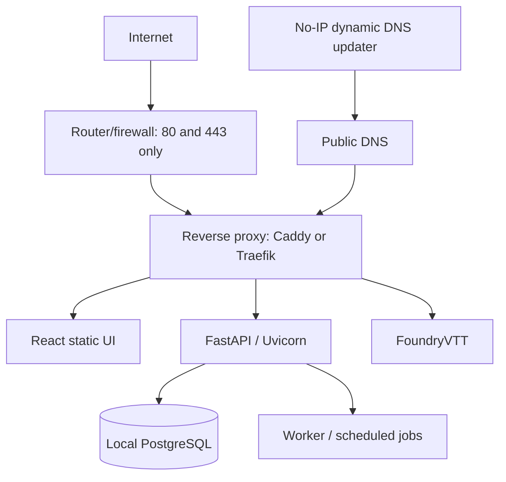

# Local Production Deployment and Operations

This is the target production runbook. It describes intended configuration; no deployment is performed by this documentation change. See [ADR 0013](adr/0013-locally-host-production-on-existing-mini-pc.md), which builds on [ADR 0012](adr/0012-self-hosted-docker-deployment-and-ci-verification.md)'s self-hosted Docker Compose decision.

## Topology and service ownership

The preferred public routes are `https://world.<domain>/` for React, `https://world.<domain>/api/*` for FastAPI, and `https://foundry.<domain>/` for FoundryVTT. Do not substitute an invented domain. With a custom domain, point or delegate the two names to a No-IP-managed target. With only No-IP-provided names, use separate provider-supported hostnames or another reverse-proxy routing arrangement. Confirm the final names during deployment.

Use separate Compose projects (or otherwise independently managed stacks) for Foundry and D&D AI. They may attach to a deliberately shared proxy network, but retain separate data volumes, credentials, authentication, configuration, upgrades, rollback, health checks, and backups.

## Compose responsibilities and network policy

The D&D AI Compose project contains:

| Service | Responsibility | Exposure |
|---|---|---|
| `proxy` | Host routing, HTTPS issuance/renewal, security headers, request limits | Host ports 80/443 only |
| `ui` | Serve versioned React assets | Private network only |
| `api` | Run FastAPI under Uvicorn; commands, queries, authentication and authorization | Private network only |
| `postgres` | Canonical application data | Private network and persistent volume; no published 5432 port |
| `worker` / scheduler | Outbox, AI, imports, and scheduled work when required | Private network only |
| `ddns` | Keep the selected No-IP record current | Outbound access only |

Do not expose Uvicorn or PostgreSQL directly. Route all inbound HTTP/HTTPS through the proxy. Forward router/firewall ports only to the proxy. Use internal Compose DNS, least-privilege database roles, health checks, dependency readiness, and `unless-stopped` (or an explicitly chosen equivalent) restart policies. Put credentials in host-readable environment/secret files or mounted secrets outside the repository.

## Web security

- Prefer the same `world` origin for UI and API.
- Use `Secure`, `HttpOnly` authentication cookies with the narrowest practical `Path`, `Domain`, and `SameSite` scope.
- Protect every cookie-authenticated state-changing request with a CSRF token and origin checks.
- Enforce authentication and player/GM/observer authorization in FastAPI, including user-to-detail many-to-many access; UI visibility is never authorization.
- Rate-limit login attempts and costly AI endpoints at the proxy and/or application boundary without trusting client-supplied identity headers.
- Terminate HTTPS at the proxy, automate certificate issuance and renewal, and alert on renewal failure.
- Do not log tokens, passwords, secret content, or unauthorized resource details.

## Operations

Before production, define CPU and memory limits/reservations so D&D AI workers or AI requests cannot starve FoundryVTT. Monitor container health, restart counts, CPU, memory, database connections, filesystem capacity, backup age, certificate renewal, and No-IP update success. Configure Docker log rotation and disk-space alerts.

Back up PostgreSQL with regular logical dumps (and volume-level protection only as a supplement), and back up uploaded/source files and deployment configuration needed to rebuild the service. Keep at least one encrypted offsite copy. Document retention, periodically restore into a disposable database, apply migrations, and verify application reads before declaring backups healthy. Foundry backups remain separate.

For upgrades: take/verify a backup, pull or build immutable versioned images, run compatible migrations, replace containers, and exercise health/readiness plus the vertical slice. Preserve the prior images and compatible database restore point. Roll back application images when schema compatibility permits; otherwise restore the verified database backup and matching uploaded files/configuration. Disaster recovery rebuilds the host/Compose configuration, restores PostgreSQL and files, updates No-IP if necessary, and reruns end-to-end authentication and authorization checks.

Residential power, internet, dynamic IP, and single-host availability are accepted constraints. A UPS, router restart behavior, and remote recovery are operational improvements, not requirements to create a hybrid production architecture.

## Production readiness gate

Do not retire transitional AWS resources until all of the following are recorded:

- migrations apply to local PostgreSQL and required extensions exist;
- bootstrap roles and grants work locally;
- the API vertical slice works end to end;
- authentication, authorization, secure cookies, and CSRF work through the proxy;
- PostgreSQL and uploaded-file backups can be created and restored, including an offsite copy;
- retained AWS development data is exported/migrated and verified locally; and
- the team explicitly approves retirement.

