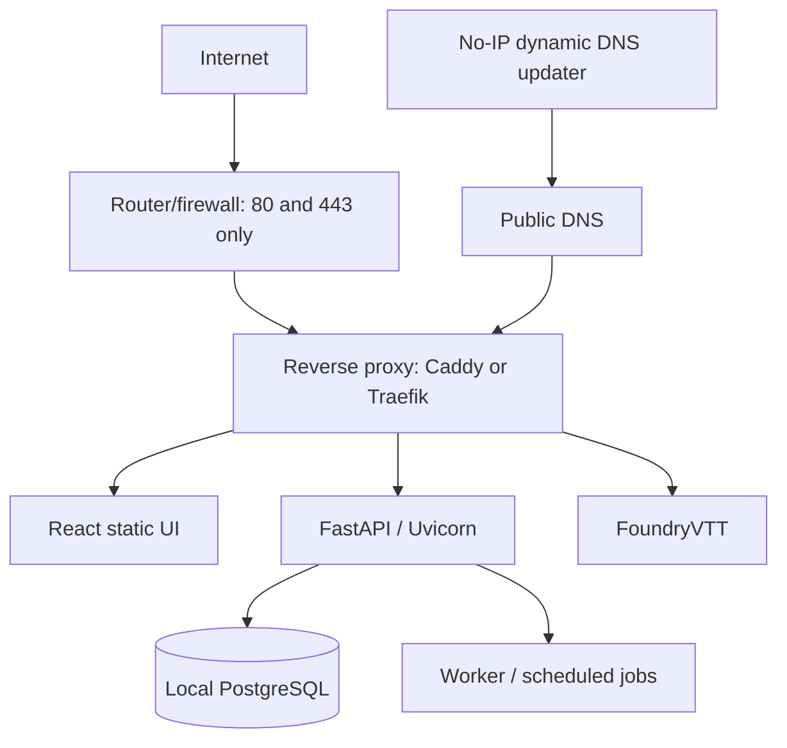

# Local Production Deployment and Operations

This is the target production runbook. It describes intended configuration; no deployment is performed by this documentation change. See [ADR 0013](adr/0013-locally-host-production-on-existing-mini-pc.md), which builds on [ADR 0012](adr/0012-self-hosted-docker-deployment-and-ci-verification.md)'s self-hosted Docker Compose decision.

## Topology and service ownership

```mermaid
flowchart TB
    Internet --> Router[Router/firewall: 80 and 443 only]
    Router --> Proxy[Reverse proxy: Caddy or Traefik]
    NoIP[No-IP dynamic DNS updater] --> DNS[Public DNS]
    DNS --> Proxy
    Proxy --> UI[React static UI]
    Proxy --> API[FastAPI / Uvicorn]
    API --> DB[(Local PostgreSQL)]
    API --> Worker[Worker / scheduled jobs]
    Proxy --> Foundry[FoundryVTT]
```

The preferred public routes are `https://world.<domain>/` for React, `https://world.<domain>/api/*` for FastAPI, and `https://foundry.<domain>/` for FoundryVTT. Do not substitute an invented domain. With a custom domain, point or delegate the two names to a No-IP-managed target. With only No-IP-provided names, use separate provider-supported hostnames or another reverse-proxy routing arrangement. Confirm the final names during deployment.

Use separate Compose projects (or otherwise independently managed stacks) for Foundry and D&D AI. They may attach to a deliberately shared proxy network, but retain separate data volumes, credentials, authentication, configuration, upgrades, rollback, health checks, and backups.

## Compose responsibilities and network policy

The D&D AI Compose project contains:

| Service | Responsibility | Exposure |
|---|---|---|
| `proxy` | Host routing, HTTPS issuance/renewal, security headers, request limits | Host ports 80/443 only |
| `ui` | Serve versioned React assets | Private network only |
| `api` | Run FastAPI under Uvicorn; commands, queries, authentication and authorization | Private network only |
| `postgres` | Canonical application data | Private network and persistent volume; no published 5432 port |
| `worker` / scheduler | Outbox, AI, imports, and scheduled work when required | Private network only |
| `ddns` | Keep the selected No-IP record current | Outbound access only |

Do not expose Uvicorn or PostgreSQL directly. Route all inbound HTTP/HTTPS through the proxy. Forward router/firewall ports only to the proxy. Use internal Compose DNS, least-privilege database roles, health checks, dependency readiness, and `unless-stopped` (or an explicitly chosen equivalent) restart policies. Put credentials in host-readable environment/secret files or mounted secrets outside the repository.

## Web security

- Prefer the same `world` origin for UI and API.
- FoundryVTT (`https://foundry.<domain>/`) is a genuinely separate browser origin from the API (`https://world.<domain>/api/*`), so its module needs an explicit CORS allowlist (`DND_AI_FOUNDRY_ALLOWED_ORIGINS`/`API_FOUNDRY_ALLOWED_ORIGINS` — see `.env.example`) naming that exact origin; the API never falls back to a wildcard, and unset means no cross-origin browser access at all rather than an open one.
- Use `Secure`, `HttpOnly` authentication cookies with the narrowest practical `Path`, `Domain`, and `SameSite` scope. Implemented as of Phase 11R workstream A/B: the `__Host-dnd_ai_session` cookie (`Secure`, `HttpOnly`, `SameSite=Lax`, `Path=/`, no `Domain`).
- Protect every cookie-authenticated state-changing request with a CSRF token and origin checks. Implemented via `DND_AI_LOCAL_SESSION_ALLOWED_ORIGINS`/`API_LOCAL_SESSION_ALLOWED_ORIGINS` (see `.env.example`) — required unconditionally in production, unlike the Foundry allowlist above, since local authentication has no feature flag to gate the requirement behind — plus a double-submit `X-CSRF-Token` header checked against the session's own server-stored value.
- Enforce authentication and player/GM/observer authorization in FastAPI, including user-to-detail many-to-many access; UI visibility is never authorization.
- Rate-limit login attempts and costly AI endpoints at the proxy and/or application boundary without trusting client-supplied identity headers.
- Terminate HTTPS at the proxy, automate certificate issuance and renewal, and alert on renewal failure.
- Do not log tokens, passwords, secret content, or unauthorized resource details.
- The single-link campaign-invitation onboarding flow (Phase 13E) constructs its shareable `/campaign-invitations/accept#token=...` URL from the portal's own already-loaded origin — never from an untrusted forwarded host — so a remote player's generated link resolves correctly only when the portal and API are actually reachable at the same public origin this deployment topology already requires (`https://world.<domain>/` for React, `.../api/*` for FastAPI). No separate configuration key exists for this; it falls out of the same-origin proxy setup above.

## Operations

After the first `migrate` run against a genuinely empty database, create the first platform administrator with `scripts/bootstrap_admin.py` (DB-direct, never over HTTP, and never exposed as an API endpoint — it fails closed once any `security.users` row already exists) before anyone can create further local accounts or issue activation tokens.

**Claiming legacy worlds (Phase 14).** Worlds created before migration 110 have no owner, and nobody can author them in the portal until an operator claims them. List them with `uv run python scripts/claim_world_ownership.py --list-unowned`, preview a claim with `--world-slug <slug> --login-name <account>`, and apply it by adding `--apply`. The script is database-direct (never over HTTP), refuses any world that has or ever had an owner, and records an audit row naming the script as the actor. Worlds created through the portal after this phase need no claim: the creator is the first owner.

**Read-only world access and ownership remediation ([ADR 0019](adr/0019-world-visibility-and-viewer-role.md)).** World memberships have no portal control; `scripts/manage_world_membership.py` is the operator path, preview by default and written only with `--apply`, with one audit row per change. Grant read-only access with `--world-slug <slug> --login-name <account> --set-role world_viewer`, end it with `--end`, and list a world's memberships with `--list`. A world owned by an account that may no longer create worlds (for example a player who created one before ADR 0018) is listed by `--list-ineligible-owners`; transfer it with `--world-slug <slug> --login-name <former owner> --transfer-to <eligible account> [--retain-viewer]`. The world is never deleted and the last owner can never be removed without a successor. The former owner keeps their campaign roles, so each of their campaigns still opens its World Explorer read-only.

**Development data (Phase 14).** `scripts/setup_phase13c_dev_data.py` now builds the fixture world, its timelines, and its two campaigns through the same commands the portal uses (`create_world`, `create_timeline`, `create_campaign` under world-owner authority, no bootstrap grant), attributed to the `--user-id` account, which must be a platform administrator (the script already requires that, and it also satisfies the world-creation policy of [ADR 0018](adr/0018-world-creation-eligibility.md)). On a fresh database that account becomes the world's owner. On a database that already has the legacy `phase13c-dev-world`, the script claims it for that account with the same trusted command as `claim_world_ownership.py` (it never overrides an existing owner) and creates nothing twice; a re-run adds no worlds, timelines, memberships, or audit rows. A re-run does end (never delete) a Phase 13E account's membership in a campaign the script documents it as *not* belonging to — for example a roleless Campaign B membership added for Phase13E Dev Player A from the Access page during manual testing — so the fixture again matches its description ([ADR 0019](adr/0019-world-visibility-and-viewer-role.md)). Entities, sessions, quests and the other Phase 15+ fixture rows are still written directly and are converted in their own phases. `scripts/ai_provider_smoke_test.py` keeps its direct inserts on purpose (a throwaway ruleset and a `pending` campaign the commands cannot produce); each is marked `phase14-direct-insert: allowed`, and `tests/unit/test_scripts_no_phase14_direct_inserts.py` fails on any unmarked direct insert of a world, timeline, campaign, world membership or world ruleset in `scripts/`.

Before production, define CPU and memory limits/reservations so D&D AI workers or AI requests cannot starve FoundryVTT. Monitor container health, restart counts, CPU, memory, database connections, filesystem capacity, backup age, certificate renewal, and No-IP update success. Configure Docker log rotation and disk-space alerts.

Back up PostgreSQL with regular logical dumps (and volume-level protection only as a supplement), and back up uploaded/source files and deployment configuration needed to rebuild the service. Keep at least one encrypted offsite copy. Document retention, periodically restore into a disposable database, apply migrations, and verify application reads before declaring backups healthy. Foundry backups remain separate.

For upgrades: take/verify a backup, pull or build immutable versioned images, run compatible migrations, replace containers, and exercise health/readiness plus the vertical slice. Preserve the prior images and compatible database restore point. Roll back application images when schema compatibility permits; otherwise restore the verified database backup and matching uploaded files/configuration. Disaster recovery rebuilds the host/Compose configuration, restores PostgreSQL and files, updates No-IP if necessary, and reruns end-to-end authentication and authorization checks.

Residential power, internet, dynamic IP, and single-host availability are accepted constraints. A UPS, router restart behavior, and remote recovery are operational improvements, not requirements to create a hybrid production architecture.

### Scoped roles: settings and the upgrade note ([ADR 0020](adr/0020-scoped-system-world-and-campaign-roles.md))

- **`API_ALLOW_IN_APP_ADMIN_GRANT`** (compose; `DND_AI_ALLOW_IN_APP_ADMIN_GRANT` for a direct run) defaults to `false`. While it is false the Administrator role is granted only by `scripts/grant_platform_administrator.py`, the Platform Accounts Administrator checkbox is disabled with an explanation, and `POST /admin/accounts*` refuses `admin` with 403 `admin_grant_disabled`. Turning it on is a deployment decision: an Administrator can then make other Administrators from the app, and each grant is audited with the acting administrator.
- **Upgrading a populated database** (migrations 137 and 138). Existing administrators receive the system `admin` and `gm` roles, existing world Owners receive `gm`, and everyone else receives `player`. Campaign GMs are **not** promoted. After the upgrade an Administrator should assign system GM to the people who run games, and the owner should give world Editor to any second GM who authors shared content. To find campaign GMs who lost world creation: `SELECT DISTINCT u.user_id, u.display_name FROM security.users u JOIN security.campaign_memberships cm ON cm.user_id = u.user_id AND cm.ended_at IS NULL JOIN security.membership_roles mr ON mr.campaign_membership_id = cm.campaign_membership_id AND mr.revoked_at IS NULL JOIN security.roles r ON r.role_id = mr.role_id AND r.campaign_id IS NULL AND r.code = 'gm' WHERE NOT EXISTS (SELECT 1 FROM security.user_system_roles usr JOIN security.system_roles sr ON sr.system_role_id = usr.system_role_id WHERE usr.user_id = u.user_id AND usr.revoked_at IS NULL AND sr.code = 'gm');`
- **A fresh install:** `scripts/bootstrap_admin.py` creates the first account with `admin` and `gm`, so the bootstrap administrator can create the first world and campaign. Every account created afterwards starts as `player` unless the creating Administrator chooses otherwise.
- **Stranded worlds and campaigns** (an Owner whose account was disabled or who lost system GM; a campaign whose only access manager was disabled): see [operations/PLATFORM_ADMINISTRATOR_RECOVERY.md](operations/PLATFORM_ADMINISTRATOR_RECOVERY.md).

## Production readiness gate

Do not retire transitional AWS resources until all of the following are recorded:

- migrations apply to local PostgreSQL and required extensions exist;
- bootstrap roles and grants work locally;
- the API vertical slice works end to end;
- authentication, authorization, secure cookies, and CSRF work through the proxy;
- PostgreSQL and uploaded-file backups can be created and restored, including an offsite copy;
- retained AWS development data is exported/migrated and verified locally; and
- the team explicitly approves retirement.

