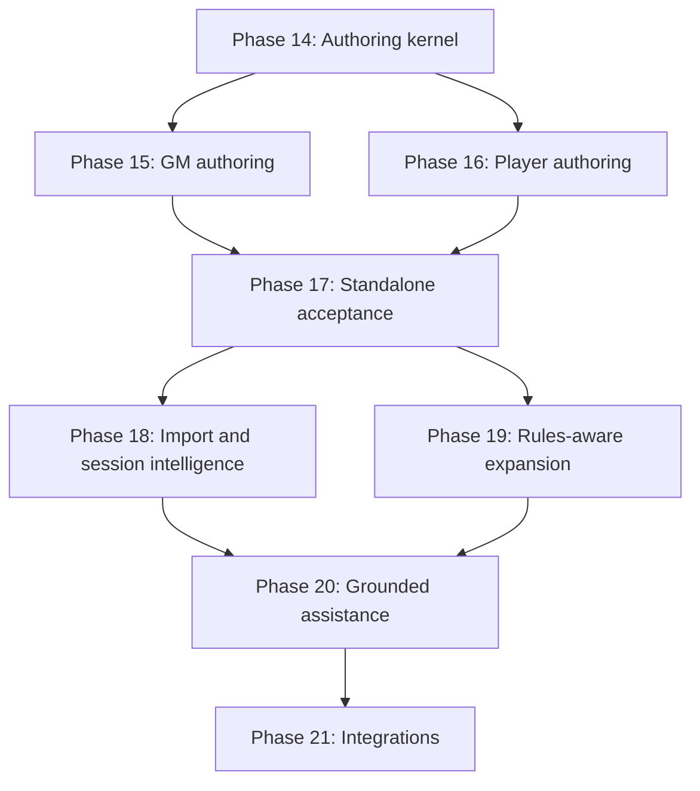

# Persistent World Platform Implementation Plan

## Authoring-First Roadmap Revision

**Revision date:** 2026-10-03
**Status:** Accepted; the authoritative product roadmap. It replaces the future-delivery portion of `PLAN.md` (as of 2026-10-05 the Phase 15 completion sequence in `PLAN.md` implements it).
**Inputs:** Current implementation plan, Platform Review dated 2026-09-25, and AI D&D Campaign Intelligence Platform marketing and feature proposal

---

## 1. Purpose of this revision

The platform must be a complete, useful web application without FoundryVTT, another VTT, an importer, or an AI provider. A Game Master and players must be able to create, maintain, play, and review a campaign through supported application commands and portal workflows.

The current platform already has an unusually strong data model, authorization boundary, read experience, audit trail, temporal history, and integration foundation. Its largest remaining product gap is ordinary authoring: most world and campaign content can be read through the portal but cannot be created or maintained through supported commands and interfaces.

This revision therefore establishes the following hard delivery order:

1. Build the shared authoring and canon-lifecycle foundation.
2. Deliver complete Game Master authoring and campaign-operation workflows.
3. Deliver player-owned authoring, contribution, and collaboration workflows.
4. Prove that the standalone web application is deployable and usable without integrations.
5. Add session intelligence and controlled imports through the same commands used by manual authoring.
6. Expand rules-aware management and grounded AI assistance.
7. Add or finish VTT, bot, transcription, and other external integrations.

This order overrides earlier future-phase language that placed Foundry device UI, Phase 12 AI surfaces, or import ahead of general authoring.

Sections 1–23 of the current `PLAN.md` remain the architectural foundation unless explicitly amended here. This document replaces the future delivery roadmap in §24 and any conflicting future-phase references elsewhere.

---

## 2. Product outcome

The platform is a self-hostable campaign intelligence and canonical-world application for human Game Masters and their players.

Its primary promise is:

> Help human Game Masters create, maintain, prepare, and run richer campaigns while helping players understand their characters, remember the campaign, contribute safely, and collaborate according to explicit visibility rules.

The web application is the primary product. Foundry, other VTTs, bots, importers, transcription services, and AI providers are optional clients of the same backend services.

### 2.1 Standalone-product requirement

Before new integration work begins, a fresh deployment must allow authorized users to complete this loop entirely in the portal:

1. Create a world, initial timeline, and campaign.
2. Invite players and manage campaign access.
3. Create and maintain characters, NPCs, locations, organizations, items, quests, sessions, events, and knowledge.
4. Record session outcomes and update campaign state.
5. Let players maintain their own permitted character and campaign contributions.
6. Review history, provenance, permissions, and audit records.
7. Back up, restore, and upgrade the deployment.

No step in this loop may require direct SQL, a development seed script, Foundry, a VTT, an importer, or an AI model.

### 2.2 Product boundary

The platform is not intended to become:

- an autonomous AI Game Master;
- a full virtual tabletop replacement;
- a native audio-transcription service;
- a commercial rulebook marketplace;
- an unrestricted generic wiki;
- a replacement for every feature in D&D Beyond;
- a system in which AI or imports silently alter canon.

---

## 3. Architectural principles retained

The following existing decisions remain mandatory:

- PostgreSQL is the source of truth.
- Structured data is authoritative; generated prose is derived.
- Worlds, timelines, campaigns, parties, and sessions are distinct.
- Definition data and timeline state are distinct.
- Canon, knowledge, belief, rumor, theory, and private notes are distinct.
- Authorization is resolved from current server-side state.
- The frontend never invents a capability or expands an audience.
- Human browser sessions use opaque server-side sessions, secure cookies, CSRF protection, and allowed-Origin checks.
- Mutations use domain commands, transaction boundaries, idempotency where retry matters, durable audit records, and temporal history.
- AI and imports produce proposals unless a human has explicitly authorized a bounded deterministic operation.
- Inaccessible records must not be disclosed through routes, IDs, counts, search suggestions, relationships, errors, previews, caches, or AI context.
- Foundry, the portal, importers, and future clients must reuse the same commands rather than implement parallel write models.

### 3.1 Authoring is not generic CRUD

Authoring endpoints must express domain intent. Examples include `CreateLocation`, `PublishEntity`, `AdvanceQuestObjective`, `RecordSessionEvent`, and `SubmitCharacterAdvancement`, not unrestricted table-shaped create/update/delete operations.

Each command must define:

- actor and required capability;
- target world, timeline, campaign, and audience;
- validation and lifecycle preconditions;
- concurrency and idempotency behavior;
- temporal-history behavior;
- provenance and audit output;
- immediate effects on authorization and read models;
- non-disclosing error behavior.

### 3.2 Manual authoring defines the canonical write path

The manual authoring commands built in Phases 14–16 become the canonical mutation layer for:

- portal forms;
- import promotion;
- AI-approved proposals;
- Foundry synchronization;
- bots and future clients;
- development/test data builders.

No later subsystem may bypass them with direct inserts merely because it processes data in bulk.

---

## 4. Delivered baseline

The revised roadmap does not reopen verified work.

### 4.1 Complete foundation

Phases 0–10 remain complete: documentation and ADRs, PostgreSQL bootstrap, worlds and entities, timelines and campaigns, rules and shared characters, locations and dungeons, events and interactions, quests and knowledge, relationships and organizations, items and encounters, and the core FastAPI vertical slice.

### 4.2 Existing Foundry work

Phase 11 delivered the backend and module foundation for pairing, per-device credentials, scoped access, combat/state synchronization, principal separation, and automated tests. That work remains supported. The remaining licensed-live verification and portal device-management experience move to the later Integrations phase; they are not prerequisites for standalone application use.

### 4.3 Existing AI work

Phase 12 delivered the reference corpus, provider abstraction, context/proposal controls, one NPC-conversation use case, and audience-aware synthesis foundations. Those surfaces remain disabled behind the server feature manifest until the later Grounded Assistance phase closes their verification and product contracts.

### 4.4 Portal and access-management baseline

Phase 13 is considered complete as the portal/read/access foundation. Delivered work includes:

- local accounts, activation, password reset, opaque browser sessions, CSRF and Origin enforcement;
- authoritative session bootstrap and server-owned capabilities;
- campaign and character-perspective selection;
- authenticated routing, persistent navigation, account/settings flows, appearance preferences, and startup-campaign preferences;
- read surfaces for Home, World, Characters, Character Sheet, Quests, Sessions, and Knowledge;
- campaign invitations and register/sign-in continuation;
- account lifecycle and self-service session management;
- campaign membership, role, character-relationship, resource-grant, and access-group management;
- audit history and bounded per-resource audience preview;
- disabled Phase 12 feature states that make no related requests.

The previously planned Phase 13F Foundry UI moves to Phase 21. Phase 13G AI surfaces move to Phase 20. Phase 13H acceptance, accessibility, E2E, and packaging work moves to Phase 17.

### 4.5 Existing deployment work

The current PostgreSQL/API Compose services and development topology are retained. Their incomplete production UI, worker, reverse-proxy, secrets, monitoring, and backup/restore work moves into Phase 17.

---

## 5. Revised progress at a glance

| Phase | Status | Outcome |
|---:|---|---|
| 0–10 | Complete | Architecture, schema, history, core domain services, API, and verified vertical slice |
| 11 | Foundation delivered; remaining work reassigned | Existing Foundry backend/module retained; live acceptance and portal UI move to Phase 21 |
| 12 | Foundation delivered; remaining work reassigned | Existing AI/context/proposal foundation retained; product surfaces and real-provider acceptance move to Phase 20 |
| 13 | Complete | Portal foundation, campaign reads, account/settings, invitations, and access management |
| **14** | **Complete with accepted limitations** | **Shared authoring kernel plus world/timeline/campaign setup** (provenance presentation and prior-version history arrive with Phase 15) |
| **15** | **Implemented; acceptance pending (not complete)** | **Game Master world, campaign, and session authoring.** 15.1 is merged; every completion checkpoint is implemented on `phase15/completion` with local automated evidence. The owner's manual accessibility/responsive acceptance, a CI run on the final head and the merge remain (`PHASE15_MANUAL_ACCEPTANCE.md`) |
| **16** | **Blocked by the Phase 15 completion gate** | **Player character authoring, notes, theories, contributions, and collaboration** |
| **17** | Planned | **Standalone-product acceptance and self-hosted production packaging** |
| 18 | Planned | Session intelligence and controlled world/campaign import |
| 19 | Planned | Rules-aware character, creature, and encounter expansion |
| 20 | Planned | Grounded GM/player assistance and structured NPC scenes |
| 21 | Planned | Foundry/VTT, bots, transcription, MCP, and other integrations |
| 22 | Deferred | Hosted/paid offering and demonstrated-need scale work |

---

## 6. Dependency order

Rules for starting work:

- Phase 15 may start only after Phase 14's command and lifecycle conventions are verified.
- Phase 16 may overlap late Phase 15 increments only when it reuses already accepted commands and authorization rules.
- Phase 17 closes only after Phases 14–16 satisfy the standalone loop in §2.1.
- Phase 18 may not promote imported content until the matching manual-authoring commands exist.
- Phase 20 may not enable a user-facing AI feature until its source data, audience rules, citations, and human-control path are verified.
- Phase 21 clients may not receive write behavior unavailable to the portal through the shared backend.

---

## 7. Phase 14 — Shared authoring kernel and campaign setup

**Goal:** Establish the production write model and let a GM create the minimum viable campaign without SQL or seed scripts.

### 14.1 Domain command foundation

Implement and document reusable command policies for:

- create, revise, archive, restore, and—where the domain supports it—supersede;
- draft, in-review, approved, canon, superseded, and archived canon states;
- optimistic or row-lock concurrency appropriate to each aggregate;
- idempotent browser retries;
- provenance and source attachment;
- audit records that distinguish creation, content revision, lifecycle transition, and state change;
- validation previews that do not mutate data;
- non-disclosing target resolution;
- bulk commands only where they are atomic, bounded, and meaningfully auditable.

Do not introduce a generic entity mutation endpoint that can write arbitrary subtype data.

### 14.2 Initial command catalog

At minimum, provide supported commands for:

- `CreateWorld`, `UpdateWorld`, `ArchiveWorld`, `RestoreWorld`;
- `CreateTimeline`, `UpdateTimeline`, `CreateTimelineBranch`, `ArchiveTimeline`;
- `CreateCampaign`, `UpdateCampaign`, `ArchiveCampaign`, `ReactivateCampaign`;
- `CreateEntityDraft`, `SubmitEntityForReview`, `ApproveEntity`, `PublishEntityAsCanon`, `SupersedeEntity`, `ArchiveEntity`, `RestoreEntity`, `DeleteDraftEntity`;
- safe source/provenance attachment;
- campaign ruleset and world/timeline selection using existing authorized records.

Commands should be split by aggregate when subtype-specific invariants make a generic command unsafe.

### 14.3 Campaign setup workflow

The portal must guide an authorized GM through:

1. Create or select a world.
2. Create or select an initial timeline.
3. Create the campaign and select its ruleset/version.
4. Establish the initial campaign owner/manager membership.
5. Configure campaign name, description, current timeline, and basic defaults.
6. Arrive at an empty but usable Campaign Home with clear next actions.

The workflow must support cancellation and recovery without leaving invisible half-created objects. Multi-object setup should use an explicit transaction or a resumable draft, not a chain of untracked partial writes.

### 14.4 Reusable portal authoring patterns

Create owner-authored, accessible patterns for:

- create/edit forms;
- field-level and form-level validation;
- unsaved-change warnings;
- save, cancel, retry, conflict, denied, and unavailable states;
- archive/restore confirmations;
- lifecycle badges and provenance presentation;
- server-authoritative option lists;
- draft preview versus published view;
- narrow and ultrawide layouts;
- keyboard and screen-reader operation.

Avoid a broad form framework or new state-management dependency unless repeated implementation proves a concrete need.

### 14.5 Development-data conversion

Begin replacing direct-insert development scripts with builders that call the same commands used by the portal. Direct SQL remains acceptable for immutable reference seeds and migration-owned lookup data, not for authored campaign content.

### 14.6 Phase 14 exit criteria

Phase 14 is complete when:

- a new GM can create a world, timeline, and campaign through the portal;
- a timeline branch can be created through a supported command;
- canon lifecycle transitions are enforced and audited;
- archived records stop appearing or authorizing as documented and can be restored where allowed;
- concurrency, idempotency, CSRF, Origin, authorization, and non-disclosure tests pass;
- development fixtures for the new aggregates use commands rather than direct content inserts;
- API contracts and portal workflows are documented;
- local PostgreSQL verification and final-head CI are green.

---

## 8. Phase 15 — Game Master authoring and campaign operations

**Goal:** Let a GM create and operate the campaign's canonical content entirely in the web application.

Implement in independently verifiable increments. Each increment includes commands, read models, portal workflows, authorization, audit, temporal behavior, and tests.

### 15A. World structure and places

- Locations, location hierarchy, realms, routes, and travel metadata.
- Dungeon definitions, areas, connections, features, hazards, and interactables.
- World-level entities that do not yet require a specialized subtype.
- Safe reparenting, cycle prevention, and timeline-aware state where applicable.
- Map/image attachment metadata only if a current storage contract exists; do not invent a binary-asset platform inside this phase.

### 15B. Organizations, factions, religions, governments, and businesses

- Create and maintain organization definitions and subtype data.
- Memberships, offices, affiliations, and public/hidden attributes.
- Timeline-scoped organization state and relationships.
- Explicit visibility and knowledge controls for player-facing information.

### 15C. Characters and NPCs

- Create player characters, NPCs, and other supported character kinds.
- Maintain identity, names, species, size, appearance, biography, affiliations, and campaign participation.
- Maintain active character builds using the currently supported rules content.
- Maintain timeline state such as location, hit points, conditions, resources, and inventory through intent-specific commands.
- Add NPC detail/simulation level and a minimal portrayal profile needed for consistent human-authored play.
- Keep identity/build/state/portrayal as separate write boundaries.
- Do not require Foundry synchronization.

### 15D. Quests and narrative planning

- Create, revise, archive, and restore quest definitions.
- Author stages, objectives, dependencies, participants, locations, rewards, and visibility.
- Record quest activation, progress, completion, failure, and correction as temporal state changes.
- Preserve definition versus runtime-state separation.
- Support GM-private planning text separately from player-visible quest knowledge.

### 15E. Sessions, events, knowledge, and corrections

- Schedule, start, update, complete, and archive sessions.
- Record events and attach participants, locations, causes, effects, and world time.
- Correct or void events without erasing historical provenance.
- Create and revise knowledge items, claims, beliefs, rumors, discoveries, and audience grants.
- Record what a character, party, NPC, faction, or public audience learned, from whom, and when.
- Provide a manual session-log workflow that can update campaign state without an importer or AI.

### 15F. Items, inventory, treasure, and encounters

- Create item definitions and instances supported by the current model.
- Transfer, equip, consume, damage, restore, and archive item instances through auditable commands.
- Maintain character and party inventory without VTT synchronization.
- Create and run the currently modelled encounter/combat records through the portal where the backend contract is complete.
- Treat advanced creature construction and party-risk analysis as Phase 19 work.

### 15G. Canon review and history

- Provide queues and filters for drafts, in-review records, approved records, and archived records.
- Show provenance, prior versions, supersession, and the actor responsible for transitions.
- Let authorized GMs compare revisions before approval.
- Ensure published player views never expose draft or GM-only fields.

### 15.8 GM authoring exit scenario

Using only a clean deployment and the portal, a GM must be able to:

1. Create a world, timeline, and campaign.
2. Create two locations, an organization, an NPC, a player character, an item, a quest, and a session.
3. Invite a player and establish the intended character relationship.
4. Record the character acquiring the item and meeting the NPC.
5. Record a discovery and quest progress during the session.
6. Complete the session and view the resulting timeline, quest, character, and knowledge state.
7. Correct one mistaken event while preserving the original audit/provenance trail.
8. Archive and restore an authored record without exposing it while archived.

No SQL, seed script, importer, Foundry, or AI provider may be used.

### 15.9 Phase 15 exit criteria

- Every entity used in the GM exit scenario has supported create and maintenance commands.
- All portal write options come from server-authoritative catalogs and capabilities.
- State changes are temporal where the model requires history.
- Definition edits do not silently rewrite historical state.
- Cross-world, cross-timeline, and cross-campaign requests are rejected without disclosure.
- Audit and provenance identify real changes without storing reusable secrets.
- The same commands are suitable for later import and integration clients.
- Focused tests, full suites, migrations, lint, types, build, and final-head CI pass.

---

## 9. Phase 16 — Player authoring, contribution, and collaboration

**Goal:** Let players maintain their permitted character and campaign material while preserving GM authority, private-player boundaries, and canon separation.

### 16A. Character-owned authoring

For characters the player is authorized to control:

- maintain portrayal guidance, personality, ideals, bonds, flaws, goals, fears, loyalties, boundaries, speech patterns, and player notes;
- propose editable biography and presentation fields according to campaign policy;
- maintain prepared/selected options where the current rules contract supports them;
- submit build or advancement proposals for GM approval when a direct player commit is not allowed;
- preview changes before submission;
- preserve advancement and approval history.

The full option engine, broad rules catalog, and rich advancement analysis belong to Phase 19. Phase 16 must not pretend unsupported rules content is complete.

### 16B. Notes, bookmarks, and theories

Players can:

- bookmark visible campaign records;
- write private notes;
- create theories and mark suspicions;
- associate notes with characters, NPCs, factions, quests, locations, events, sessions, items, and knowledge;
- submit corrections or possible duplicate-entity reports to the GM;
- distinguish private material, shared material, character belief, and approved canon visually and structurally.

Add `Theory` to the authoritative domain vocabulary: a theory is player-owned, is not canon, is not automatically character belief, and is never included in GM or NPC AI context unless explicitly shared through an approved path.

### 16C. Player-private collaboration

Add the planned collaboration domain before building its UI. It must support:

- private notes;
- selected-player or party discussions attached to campaign records;
- character-group discussions;
- material explicitly shared with the GM;
- immutable snapshots when private content is submitted or shared;
- clear participant and visibility rules;
- retention and revocation behavior.

GM-role users must not be able to access player-private material through supported APIs, portal screens, search, exports, previews, or AI context. For self-hosted deployments, documentation must state that the machine/database administrator can inspect stored data; the product promises application-level role privacy, not secrecy from the host administrator.

### 16D. Player session contributions

- Players may submit their own session notes, corrections, discoveries, and proposed facts.
- Submissions remain player-owned proposals until an authorized GM accepts, edits, rejects, or classifies them.
- Multiple accounts of the same session may coexist.
- Approved material uses the same Phase 15 commands as manual GM authoring.
- Rejection does not delete the player's private source unless the player requests deletion and retention rules allow it.

This is manual contribution, not automated session-note extraction; automated matching and extraction belong to Phase 18.

### 16E. Player campaign experience

Enhance the player dashboard with authored and permitted information:

- latest approved recap;
- relevant character and campaign events;
- active quests and objectives;
- recent NPCs and locations;
- newly learned facts;
- unresolved decisions;
- pending character proposals;
- bookmarks, notes, theories, and shared discussions.

### 16.6 Phase 16 exit scenario

Using only the portal, a player must be able to:

1. Accept an invitation or sign in to an existing membership.
2. Select an authorized character.
3. Update permitted portrayal/profile content.
4. Create a private note and theory attached to a visible quest.
5. Share a snapshot with selected players while keeping later edits private.
6. Submit a correction or session contribution to the GM.
7. Review the status of that submission.
8. Confirm that another player, a GM-role user, campaign search, and GM-facing preview cannot access unshared private material.

### 16.7 Phase 16 exit criteria

- Player-owned content has explicit ownership, audience, provenance, and lifecycle.
- Private content is excluded by backend authorization, not frontend hiding.
- GM review never converts material into canon without a deliberate command.
- Player character mutations are limited to authorized characters and fields.
- Shared snapshots are immutable and later private edits do not change them.
- Context-building tests prove private material is excluded from unauthorized AI purposes.
- Manual accessibility and privacy scenarios pass in addition to automated tests.

---

## 10. Phase 17 — Standalone-product acceptance and self-hosted packaging

**Goal:** Close the standalone web application before adding import, expanded AI, or new integration work.

### 17.1 Browser acceptance

Add browser E2E coverage for the critical standalone paths:

- install/bootstrap and first administrator;
- account activation and password reset;
- invitation registration/sign-in continuation;
- campaign setup;
- GM authoring exit scenario;
- player authoring exit scenario;
- access revocation taking effect on the next request;
- session expiry, logout, and recovery;
- draft/canon/private-content non-disclosure;
- conflict, retry, and interrupted-request behavior.

### 17.2 Accessibility and responsive acceptance

Verify with automated and manual evidence:

- keyboard-only operation;
- screen-reader names, landmarks, live regions, and focus management;
- reduced-motion and theme behavior;
- narrow mobile, standard desktop, and ultrawide layouts;
- persistent navigation and authoring forms;
- tables/cards that reflow without losing information or controls;
- no color-only status communication.

### 17.3 Production packaging

Complete the self-hosted topology:

- built portal assets;
- API service;
- PostgreSQL 18;
- worker service if queued work exists;
- reverse proxy and HTTPS termination contract;
- same-origin routing for portal, `/api`, and `/auth`;
- secret injection and rotation guidance;
- health/readiness checks;
- startup migration procedure;
- structured logs and bounded audit retention;
- backup, restore, and rollback runbooks;
- release/version metadata;
- upgrade verification from the previous supported release.

### 17.4 Standalone completion gate

Phase 17 closes only when a clean home-network/self-hosted deployment can perform the entire GM and player loops without optional integrations. Record exact browser, viewport, assistive-technology, backup/restore, Compose, migration, and final-head CI evidence in `docs/PHASE17_VERIFICATION.md`.

At this milestone the product is considered independently functional.

---

## 11. Phase 18 — Session intelligence and controlled import

**Goal:** Add import as an accelerator over verified manual authoring, never as the only way to create campaign content.

### 18A. Source intake and staging

- Pasted text, uploaded text documents, recaps, transcripts from external services, and structured exports.
- Immutable original source, ownership, checksum, licensing/permission metadata, and provenance.
- Separate reference-corpus ingestion from campaign-data import.
- No native speech-to-text service.

### 18B. Session-note intelligence

- Entity and mention matching.
- Events, claims, discoveries, relationships, quest changes, inventory changes, injuries, conditions, and world-time extraction.
- Contradiction, timeline, canon, and knowledge-conflict detection.
- Multiple source accounts for one session.
- Confidence and supporting-passage presentation.

### 18C. Reviewable change sets

- Accept, edit, reject, merge, split, defer, and rematch proposals.
- Preview exact changes and affected audiences before promotion.
- Keep truth, knowledge, belief, and player theory separate.
- Require a human decision for canon changes.

### 18D. Promotion through authoring commands

- Every promoted record invokes the Phase 14–16 command that manual authoring uses.
- Promotion is idempotent, auditable, resumable, and safe under partial failure.
- Imported content retains source passage and batch provenance.
- Rejected or deferred proposals remain inspectable without becoming effective state.

### 18E. Broader world/campaign import

After session-note promotion is proven, add campaign documents and structured exports using the same staging and review machinery.

### 18.6 Exit criteria

- A session import can produce a fully reviewed change set and promote it without direct domain-table inserts.
- Promotion and equivalent manual authoring produce the same effective state and audit semantics.
- Invalid, duplicated, conflicting, or unauthorized proposals cannot partially alter canon.
- Source ownership and audience restrictions flow to derived artifacts.
- Exact provenance remains available after promotion.

---

## 12. Phase 19 — Rules-aware character, creature, and encounter expansion

**Goal:** Make authoring mechanically trustworthy for the supported ruleset without attempting to reproduce every commercial rulebook.

### 19.1 Rules content and policy

- Expand the legally usable SRD/open-content catalog for the chosen ruleset/version.
- Preserve source and license metadata.
- Support campaign allow lists, house rules, custom content, and GM grants.
- Complete legal/policy review before any private commercial source-import feature.
- Keep PostgreSQL full-text search as the baseline; add embeddings only when measured retrieval quality requires them.

### 19.2 Character advancement

- Detect available advancement.
- Calculate permitted choices from authorized sources.
- Enforce prerequisites and mutually exclusive choices.
- Preview derived statistics before commit.
- Support player submission and GM approval where configured.
- Preserve advancement history and explain why each option is available.

### 19.3 Creature model decision and implementation

Before implementation, record an ADR choosing between:

- character-based monsters with explicit simulation/detail levels; or
- separate creature templates plus world instances.

Then provide creature authoring, validation, abilities, actions, defenses, and provenance consistent with that decision.

### 19.4 Encounter analysis

- Party-specific analysis using actual characters, resources, environment, objectives, and action economy.
- Treat challenge rating as one input, not a sufficient answer.
- Show assumptions and uncertainty.
- Keep final encounter and ruling authority with the GM.

---

## 13. Phase 20 — Grounded assistance and structured NPC scenes

**Goal:** Enable AI only after the standalone data, authoring, audience, and review paths are complete.

### 20.1 Close the existing Phase 12 foundation

- Real-provider smoke verification.
- Local-model path verification.
- Provider failure, timeout, cancellation, and retry behavior.
- Feature-manifest enablement only after each surface passes its own gate.
- `docs/PHASE20_VERIFICATION.md` records exact model/provider evidence without making a provider mandatory for normal application startup.

### 20.2 Grounded user surfaces

- Cited campaign questions over permitted knowledge.
- GM briefs and preparation copilot.
- Player/character-specific recaps.
- Rules and character explanation assistant.
- Character-aware player advisor.
- NPC portrayal assistance based on approved portrayal profiles.

Each surface declares its purpose and assembles a purpose-specific context. GM secrets, player-private collaboration, unrevealed facts, later-timeline facts, and unauthorized sources are excluded before prompting.

### 20.3 Structured live scenes

- Scene participants and context.
- Player intent/action declarations.
- Rules/check recommendations.
- GM-confirmed DCs, rolls, and outcomes.
- NPC portrayal without hidden-context leakage.
- Proposed consequences reviewed before canon/state changes.

AI never silently changes canon or chooses a player character's action.

---

## 14. Phase 21 — Integrations and adapters

**Goal:** Let external tools use the independently functional platform without becoming alternate sources of truth.

### 21A. FoundryVTT

- Complete licensed Foundry v13 acceptance for the existing module.
- Add portal pairing, device listing, rotation, and revocation UI.
- Map supported Foundry documents/actions to canonical backend commands.
- Define conflict ownership for simultaneous portal and Foundry edits.
- Preserve independently paired client/device credentials and in-memory short-lived access tokens.
- Never require Foundry for campaign creation, character maintenance, session logging, or play.

### 21B. Other VTT and import/export adapters

- Add adapters only against stable backend commands.
- Each adapter declares supported round-trip fields and loss behavior.
- Imported external IDs are metadata, not authorization.

### 21C. Bots, messaging, MCP, and transcription providers

- Discord or other bots use scoped service/client identities.
- MCP exposes bounded tools, not raw database access.
- External transcription services submit text plus provenance to Phase 18 intake.
- No integration receives a broader audience than the human or service principal it represents.

---

## 15. Phase 22 — Hosted offering and demonstrated-need expansion

This phase remains optional until the standalone self-hosted product is stable and there is demonstrated demand.

Potential work includes:

- tenant boundaries and hosted operations;
- billing and subscription management;
- managed secrets and backups;
- hosted-worker scaling;
- support and abuse workflows;
- privacy and legal controls for hosted player-private content;
- additional rulesets;
- vector retrieval if measured needs justify it;
- native mobile clients;
- additional model providers.

Hosted work must not weaken self-hosting or create a second domain model.

---

## 16. Authoring ownership and approval matrix

| Content/action | Player default | GM/access-manager default | Canon effect |
|---|---|---|---|
| World, timeline, campaign settings | View if authorized | Direct authoring | Immediate after valid command |
| Locations, organizations, NPCs, items | View permitted projection | Draft/review/publish | Only published/approved content is canon |
| Quest definitions and hidden planning | View permitted projection | Direct authoring with lifecycle | Definition and progress remain separate |
| Sessions and events | Submit contribution where allowed | Record/correct/void | Event command controls effective state |
| Character identity/profile | Propose or edit allowed fields | Configure policy/approve | Field and campaign policy dependent |
| Character mechanical build | Submit proposal by default | Approve or directly manage | Only validated approved build becomes active |
| Character timeline state | Declare/request where allowed | Apply authoritative change | Temporal state change |
| Player notes/bookmarks/theories | Owner-controlled | No access unless shared | Never canon by default |
| Player-private discussions | Participant-controlled | No access unless shared | Never canon by default |
| Corrections/session contributions | Submit | Accept/edit/reject | Canon only through matching domain command |
| Imported or AI-proposed changes | Review only if assigned | Accept/edit/reject | Never automatic canon |

Campaign policy may delegate more authority, but the server must calculate that policy and expose explicit capabilities. The portal may not infer write permission from display roles.

---

## 17. Cross-cutting delivery requirements

Every authoring increment must address the following before it is accepted.

### 17.1 Security and authorization

- Current database state determines identity, membership, capability, resource scope, and audience.
- Cookie-authenticated mutations require CSRF and allowed Origin.
- Local, external OIDC, Foundry, machine, and future bot principals remain distinct.
- Writes repeat eligibility checks; they do not trust prior lookup responses.
- Target IDs are bound to the route's world/timeline/campaign.
- Unauthorized resources are not disclosed through validation details.

### 17.2 Data integrity and history

- Use explicit transaction boundaries and consistent lock order.
- Preserve temporal rows rather than overwriting history when the domain requires it.
- Corrections and voids do not silently delete consequential history.
- Commands that span aggregates either commit atomically or use a documented resumable workflow.
- Database constraints remain the final backstop for invariants.

### 17.3 Idempotency and concurrency

- Retryable create/transition commands support durable idempotency.
- Idempotency fingerprints include every effect-determining value and actor scope.
- Conflicting concurrent edits produce deliberate outcomes.
- Real PostgreSQL concurrency tests cover credible races, especially lifecycle transitions and state changes.

### 17.4 Audit and provenance

- Every real security-sensitive or canon-changing mutation produces a bounded durable audit record.
- No-op retries do not duplicate audit history.
- Audit metadata excludes credentials, CSRF values, invitation/reset/session tokens, private note content, and unnecessary personal data.
- Provenance connects authored or promoted content to its human, source, import batch, or proposal without becoming an authorization shortcut.

### 17.5 UX and accessibility

- Loading, empty, denied, invalid, conflict, stale, interrupted, and recoverable-error states are deliberate.
- Forms retain safe user input after recoverable failures.
- Destructive or history-changing operations require clear confirmation.
- Focus moves predictably into confirmations and back on cancellation.
- Success messages survive the authoritative refetch that proves the write.
- Stale data is never shown as the result of a newer selection or audience.
- Mobile, standard desktop, and ultrawide layouts are verified.

### 17.6 Testing and evidence

- Unit tests cover pure policy and mapping logic.
- PostgreSQL tests cover command/query behavior and constraints.
- API tests cover authentication, authorization, CSRF/Origin, error shape, idempotency, audit, and non-disclosure.
- Portal tests cover user behavior through the real component/hook/client path.
- Browser E2E covers critical cross-page workflows.
- Manual evidence covers accessibility and responsive behavior where automation is insufficient.
- A final-head green CI run is required before phase closure.

---

## 18. Documentation changes required with this roadmap

1. Replace `PLAN.md` §24's future roadmap with this phase order and update all cross-references.
2. Mark Phase 13 complete and record that its former 13F/13G/13H scope moved to Phases 21, 20, and 17 respectively.
3. Move the existing Phase 14 deployment work into Phase 17 and the existing Phase 15 import plan into Phase 18.
4. Update `ENTITY_LIFECYCLE.md` with the accepted command catalog and lifecycle transition rules as Phase 14 defines them.
5. Update `DOMAIN_MODEL.md` to define player-owned `Theory` separately from truth, belief, rumor, and knowledge.
6. Add a `collaboration` schema and application-privacy section to `DATABASE_MODEL.md` before Phase 16 implementation.
7. Add explicit `Built`/`Planned` markers to logical schema inventories so planned portrayal, collaboration, creature, and campaign-state tables cannot be mistaken for implemented tables.
8. Record the creature-template versus character-based-creature decision in an ADR before Phase 19 implementation.
9. Update UI design documentation with authoring form, lifecycle, conflict, unsaved-change, and private/shared content patterns.
10. Keep project status and verification documents factual: distinguish source inspection, automated evidence, runtime evidence, manual evidence, and unverified behavior.
11. Reconcile environment documentation with ADR 0012's disposable PostgreSQL 18 CI and self-hosted default.
12. Document the self-hosted privacy boundary: application roles protect player-private material from GM-role access, not from the machine/database administrator.

---

## 19. Scope guardrails

The following are explicitly outside the authoring-first milestone:

- autonomous AI campaign control;
- automatic canon changes from AI, imports, or VTT events;
- native speech-to-text infrastructure;
- every published class, subclass, spell, monster, or rule source;
- commercial rulebook sales or unlicensed content distribution;
- full VTT replacement;
- VTT-only character or campaign state;
- portal-wide user impersonation;
- player-private content in GM search, GM preparation, NPC context, or campaign exports unless explicitly shared;
- embeddings before PostgreSQL full-text search is measured and found insufficient;
- generalized workflow engines or speculative abstraction layers.

---

## 20. Definition of authoring-first success

The authoring-first roadmap succeeds when all of the following are true:

1. A GM can start from an empty deployment and create a playable campaign entirely in the web portal.
2. Players can join, maintain permitted character/profile content, contribute notes and proposals, and collaborate within explicit privacy boundaries.
3. The GM can record sessions and maintain the world's resulting state without Foundry, another VTT, direct SQL, imports, or AI.
4. Canon lifecycle, temporal history, knowledge/audience separation, provenance, and audit remain intact for every write.
5. Development data for authored campaign content can be built through production commands.
6. The application is packaged, backed up, restored, upgraded, and exercised as a standalone self-hosted product.
7. Importers, AI, and integrations can be added later by reusing the same commands rather than bypassing them.

Only after this definition is met should the roadmap treat import, expanded AI, or VTT integration as the next product milestone.
