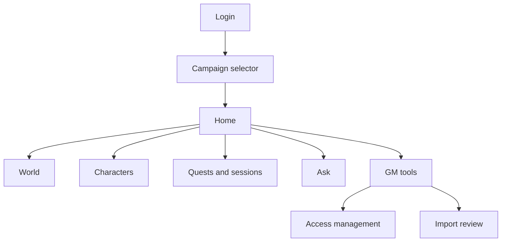
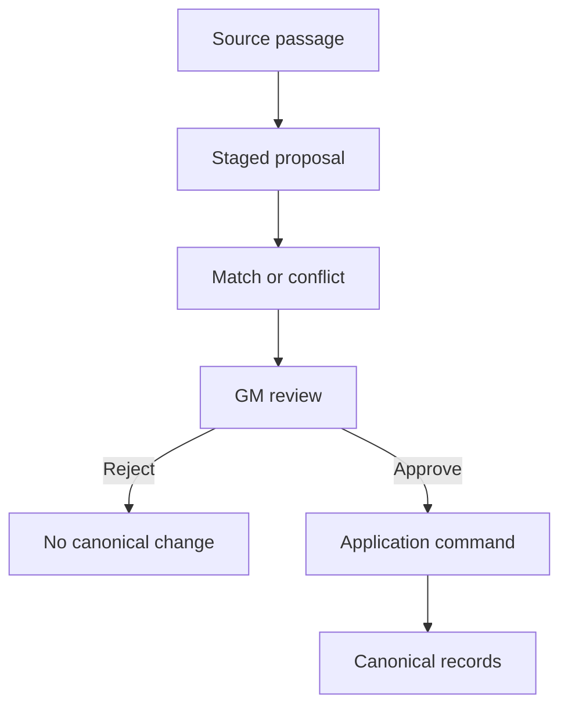
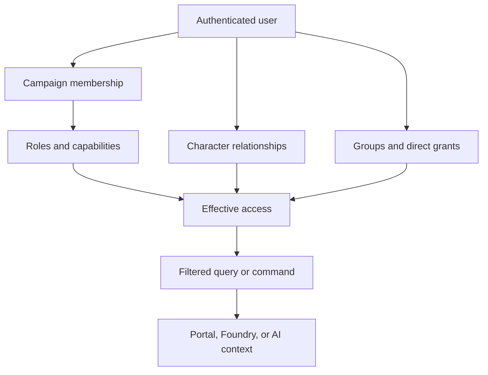

# Persistent World Web Portal UI Design

## 1. Purpose

This document defines the first-class web experience for the persistent tabletop roleplaying world platform. The portal is the primary out-of-session interface for players, GMs, assistant GMs, and observers. FoundryVTT remains the primary in-session tactical client. Discord is deferred until demonstrated demand justifies a later thin-client integration.

The portal must let an authorized user:

- understand the current campaign quickly;
- browse permitted world and campaign details;
- request summaries or ask questions on demand;
- work with one or more characters;
- see facts, beliefs, rumors, quests, sessions, and relationships from an explicit perspective;
- administer canon, users, roles, access, and import proposals when authorized.

The defining authorization rule is:

> Roles provide defaults, but users and details are many-to-many. A user may relate to many characters, facts, and other resources; each resource may relate to many users through roles, characters, parties, groups, knowledge, or direct grants.

## 2. Product principles

1. **Perspective is always visible.** The active campaign, timeline, role, effective time, and optional character perspective appear in the shared shell.
2. **No hidden-data inference.** Unauthorized resources do not appear in pages, search suggestions, counts, links, relationship edges, identifiers, errors, caches, or AI context.
3. **Filter before synthesis.** The server resolves authorization before sending records to the UI or an AI provider. The system never creates a GM answer and redacts it into a player answer.
4. **Truth and awareness remain distinct.** Canonical truth, belief, rumor, knowledge possession, user visibility, and administrative permission are separately represented.
5. **Roles are not ownership.** Player, GM, and observer roles establish defaults; semantic character relationships and resource grants determine detailed access.
6. **Every important answer is traceable.** Summaries and answers identify perspective, effective time, source records, and rules citations when applicable.
7. **The MVP is useful, not encyclopedic.** Begin with lists, cards, detail pages, links, and focused GM tools. Interactive maps, graph explorers, and a generalized CMS are later enhancements.

## 3. Users and roles

| Role template | Primary needs | Default experience |
|---|---|---|
| Campaign owner | Administration and continuity | All campaign configuration plus GM tools |
| GM | Canon, secrets, preparation, approvals | Full authorized canon, hidden state, visibility preview |
| Assistant GM | Delegated preparation or portrayal | Only assigned GM capabilities and resources |
| Player | Character and party play | Associated characters, permitted knowledge, quests, recaps |
| Observer | Curated view | Explicitly published or granted resources only |
| Import reviewer | Campaign-data review | Import proposals and promotion decisions |
| Rules curator | Reference-source management | Rules sources, editions, rights, retrieval status |

A person may hold multiple roles in one campaign and different roles in other campaigns. Authorization checks capabilities, not role-name strings.

## 4. Information architecture



Primary navigation:

- Home
- World
- Characters
- Quests
- Sessions
- Knowledge
- Ask
- GM Tools, when permitted
- Access Management, when permitted

The shared header contains:

- campaign selector;
- timeline selector when more than one is available;
- viewing role/purpose selector when the user has multiple authorized modes;
- character-perspective selector when the user relates to multiple characters;
- effective-time indicator;
- account and logout menu.

Changing perspective refreshes the page from the server. It is not a client-only filter over previously downloaded data.

## 5. Core screens

### 5.1 Login and invitation

States:

- Sign in.
- Accept campaign invitation.
- First-time profile confirmation.
- No active campaign membership.
- Expired, revoked, or invalid invitation.
- Account recovery through the identity provider.

The portal does not expose campaign names or invitation details until the invitation token is validated. After login, the application maps the external identity to an internal user and evaluates campaign membership.

### 5.2 Campaign selector

Show only campaigns the user may discover. Each item may include:

- campaign name;
- world name when permitted;
- user's role labels;
- associated character names when permitted;
- last accessible session date;
- membership status.

Do not show aggregate counts that include inaccessible campaigns.

### 5.3 Home dashboard

The dashboard answers: “What do I need to know right now?”

Ordered sections:

1. Ask about this campaign.
2. Last-session recap.
3. Current location and situation.
4. Active quests and immediate objectives.
5. Recent discoveries and world changes.
6. Relevant NPCs, factions, and relationships.
7. Character-specific reminders, resources, or unresolved decisions.

Each card is assembled for the current user and perspective. A player using Character A may receive a different dashboard than the same user viewing Character B. Observers receive only curated content. GMs may switch between GM briefing and preview-as-user modes.

### 5.4 World explorer

Browse authorized:

- locations and dungeons;
- NPCs and player characters;
- organizations, factions, governments, religions, and cultures;
- items and artifacts;
- historical events;
- relationships;
- approved lore and knowledge.

MVP presentation:

- type-filtered lists;
- text search over authorized records;
- compact result cards;
- detail pages;
- related-resource links;
- breadcrumbs for location containment.

Detail pages display only sections the user may access. They distinguish established canon, knowledge in the current perspective, rumor/belief, uncertainty, and source provenance without indicating that additional hidden sections exist.

### 5.5 Character workspace

The character selector shows every character related to the user for the active campaign and timeline. A user can have several characters; a character can have several users.

Tabs appear only when authorized:

- Overview
- Sheet
- Current state
- Inventory
- Knowledge
- History
- Relationships
- Quests
- Notes
- Access

Capabilities are independent:

| Capability | Example |
|---|---|
| Discover | Character may appear in search or links |
| View summary | Public profile and current summary |
| View full | Full sheet and ordinary history |
| View private | Private background, memories, or knowledge |
| Interact | Speak or act through the character where supported |
| Control | Submit play-state commands |
| Edit narrative | Update authorized descriptive fields |
| Edit mechanical | Update authorized mechanical fields |
| Manage access | Change user-character relationships or grants |

The screen labels why access exists, such as “Primary controller,” “Co-controller,” or “Viewer through Party A.”

### 5.6 Knowledge

Views:

- Known facts
- Rumors and beliefs
- Recently discovered
- Character-private
- Party-shared
- Public lore
- Sources

Each item shows, when permitted:

- claim or summary;
- knowledge type;
- confidence or truth status appropriate to the viewer;
- who knows or believes it;
- discovery or transfer source;
- effective time;
- related entities and quests.

The UI never labels a player-facing claim “false” merely because the GM's canonical record says so. GM mode can compare canonical truth with character beliefs. Player mode shows only the belief state available to the selected perspective.

### 5.7 Quest detail

Player/observer sections:

- visible description;
- known objectives;
- current status;
- relevant permitted NPCs and locations;
- discoveries and prior events;
- character-specific knowledge.

GM-only sections, when authorized:

- hidden stages and objectives;
- dependencies and failure conditions;
- secret participants and motives;
- possible outcomes and rewards;
- event mappings;
- visibility preview.

### 5.8 Session detail

Sections:

- recap;
- participants;
- locations visited;
- encounters and major decisions;
- facts discovered;
- quest changes;
- character, relationship, and inventory changes;
- source events and notes.

Users can request a summary of one session, a selected range, or “since my character last participated.” Results honor effective time and perspective.

### 5.9 Ask

Supported request families:

- campaign, arc, session, or location summary;
- current quests and unresolved clues;
- NPC, faction, item, or relationship details;
- “what does my character know?”;
- GM session-preparation brief;
- campaign-selected rules question with citations.

Example prompts:

- “Summarize the last three sessions.”
- “What does Arlen know about the Glass Ossuary?”
- “Which active quests involve Cardinal Dravus?”
- “What changed in Stormreach?”
- “Prepare a GM briefing for tonight.”
- “What are this campaign's grappling rules?”

Every response displays:

- campaign and timeline;
- perspective and viewing purpose;
- effective point in time;
- deterministic or AI-synthesized status;
- source records and document/rules citations when permitted;
- generation time and cache status.

Answers link to authorized detail pages. They do not mention omitted hidden information.

### 5.10 Observer view

Observer access is curated. Possible grants include:

- public campaign synopsis;
- selected characters;
- approved or delayed session recaps;
- public world lore;
- spoiler-free quest summaries;
- selected event feed.

Different observer groups may exist for a livestream audience, former players, collaborators, or invited guests. Observer membership does not inherit all player-visible information.

## 6. GM workspace

### 6.1 GM dashboard

- Tonight's preparation brief.
- Recent events and state changes.
- Active and stalled quests.
- Hidden facts likely to matter.
- NPC goals and pending reactions.
- Unreviewed AI proposals.
- Import-review workload.
- Recent access changes.

### 6.2 Canon and proposal work

Authorized GMs can:

- search full permitted canon;
- create or edit data through application commands;
- review AI proposals;
- inspect provenance and audit history;
- compare timelines;
- publish or reveal knowledge;
- generate a visibility preview before applying disclosure changes.

### 6.3 Preview as user

The GM selects:

- target user;
- campaign and timeline;
- role/viewing purpose;
- character perspective;
- effective time.

The portal then issues normal authorized preview queries and clearly marks the entire interface as preview mode. Preview does not impersonate the user for writes. Any attempted mutation exits preview or requires an explicit GM action in GM mode.

### 6.4 Access management

Screens:

- Invitations and memberships
- Role assignments
- Role capability templates
- User-character relationships
- Access groups
- Direct resource grants
- Effective-access explanation
- Revocation and audit history

The grant editor requires:

- grantee user or group;
- resource;
- campaign/timeline scope;
- capability;
- allow or explicit restriction when supported;
- source/reason;
- optional effective period.

Before saving, show a concise impact preview. After saving, invalidate relevant authorization and summary caches.

## 7. Campaign import review

Phase 14 extends the GM workspace with:

- import job list and progress;
- retained source and source-location viewer;
- staged entity, relationship, event, knowledge, and state proposals;
- entity-match candidates and ambiguity resolution;
- conflict comparison against existing canon;
- editable proposal form;
- individual and grouped approve/reject actions;
- promotion result and retry status;
- provenance and audit trail.



Only users with import-review capabilities can discover jobs or proposals. Approved changes go through application commands; the UI never writes canonical tables directly.

## 8. Authorization model

### 8.1 Resolution paths



### 8.2 Conceptual relationships

```text
users
  ↔ campaign_memberships
    ↔ membership_roles
      ↔ roles
        ↔ role_capabilities

users
  ↔ user_character_relationships
    ↔ characters

users or access_groups
  ↔ resource_grants
    ↔ securable_resources

characters / parties / organizations
  ↔ knowledge holdings
    ↔ facts, rumors, beliefs, and memories
```

The implementation may use typed joins, a generic resource registry, or a hybrid, but it must preserve semantic character relationships and efficient filtered queries.

### 8.3 Effective-access explanation

When appropriate, the UI can explain:

- “Visible because you are a GM.”
- “Visible while viewing Arlen, who learned this in Session 18.”
- “Visible because Party A shares this knowledge.”
- “Visible through the Stream Audience group.”
- “Editable because you are this character's co-controller.”

Explanations are themselves filtered; they must not reveal a hidden intermediary.

## 9. Search, lists, and non-disclosure

- Search operates over an authorization-filtered index or query.
- Autocomplete never receives forbidden names or identifiers.
- Counts describe only accessible records.
- Pagination totals exclude inaccessible records.
- Relationship graphs omit hidden nodes and edges without leaving unexplained placeholders.
- Direct routes to inaccessible resources return the same non-disclosing result as nonexistent resources, except in authorized administrative diagnostics.
- Export and print actions repeat server authorization at request time.
- Browser caches and service workers must not retain data after logout, membership revocation, perspective change, or access revocation.

## 10. States and interaction behavior

Every major screen defines:

- initial loading;
- partial loading;
- empty but authorized;
- unavailable or non-discoverable;
- session expired;
- access changed while open;
- recoverable server error;
- stale data requiring refresh;
- successful save or command acceptance;
- background processing with resumable status.

Optimistic updates are limited to low-risk presentation changes. Canonical mutations show pending, accepted, rejected, or failed command status and remain idempotent when retried.

## 11. Responsive and accessible behavior

- Support desktop, tablet, and phone layouts.
- Collapse primary navigation into a labeled menu on small screens.
- Keep perspective indicators visible near the page title even when the main navigation collapses.
- Use semantic headings, landmarks, tables, forms, and buttons.
- Support keyboard navigation and visible focus.
- Do not encode canon/rumor/secret/status distinctions by color alone.
- Announce async answer completion, access errors, and validation errors to assistive technology.
- Preserve readable source citations and audit tables with responsive wrapping or bounded horizontal scrolling where necessary.

## 12. Security and privacy requirements

The production browser UI and `/api/*` should share the `world` origin. Use `Secure`, `HttpOnly`, narrowly scoped authentication cookies; do not store long-lived application secrets or bearer tokens in browser code. Protect every cookie-authenticated state-changing request with CSRF tokens and origin checks. Exact hostnames are chosen at deployment time from the custom-domain-plus-No-IP or No-IP-only arrangements in ADR 0012.

- Use OIDC authorization-code flow with PKCE for the browser client.
- Store no long-lived application secret in browser code.
- Validate issuer, audience, signature, expiry, and revocation-relevant state at the API boundary.
- Protect state-changing requests against CSRF according to the selected token/session architecture.
- Avoid tokens and restricted content in URLs, analytics, logs, or client error reports.
- Reauthorize every command and sensitive query; UI state is not proof of permission.
- Audit role changes, grants, revocations, preview use, sensitive reads, proposal decisions, and canonical writes.
- Rate-limit login-linked abuse, search enumeration, and expensive Ask requests.

## 13. API-facing UI contracts

Portal responses should include:

- resource data already filtered for the current request context;
- permitted actions/capabilities for rendering controls;
- perspective and effective-time metadata;
- provenance/citation links the user may access;
- stable pagination and correlation identifiers;
- non-disclosing errors;
- command status and idempotency identifiers for mutations.

The UI may use permitted-action hints to choose controls, but the API must independently authorize the eventual request.

## 14. Delivery boundaries

### Phase 10: security and query foundation

- Login-provider integration and internal user mapping.
- Campaign memberships, multi-role capabilities, character relationships, and resource grants.
- Centralized access resolution.
- Audience-filtered summary/detail/search services.
- GM/player/observer API acceptance scenario.

### Phase 11: Foundry

- Foundry user mapping and character-control enforcement through the same API rules.

### Phase 12: assistant

- AI synthesis over pre-filtered campaign queries.
- Cited rules/reference retrieval.
- GM, player-character, and observer answer differences.

### Phase 13: portal MVP

- Login and campaign/perspective selection.
- Home, World, Characters, Quests, Sessions, Knowledge, and Ask.
- Observer view.
- GM access management, audit view, and preview-as-user.
- Same-origin static deployment behind the local reverse proxy and end-to-end role/access testing.

### Phase 14: local production hardening

- No-IP and automatic HTTPS for the selected deployment-time hostname arrangement.
- Secure-cookie and CSRF verification through the reverse proxy.
- Login and Ask/AI endpoint rate limiting and non-disclosing operational error states.

### Phase 15: import review

- Source/proposal review, matching, conflict resolution, approval, rejection, and promotion status in the portal.

## 15. Deferred experience

Defer until demonstrated need:

- Discord client;
- interactive geographic maps;
- free-form relationship graph editor;
- real-time collaborative editing;
- generalized page/layout builder;
- unrestricted administration CMS;
- offline-first mutation;
- broad notification center;
- bulk ACL editing beyond the first real campaign need;
- theming marketplace or user-authored themes.

## 16. MVP acceptance checklist

- A user can log in, accept an invitation, select a campaign, and log out.
- A user can hold multiple roles and switch among permitted viewing purposes.
- A user can access multiple characters, and a character can be associated with multiple users.
- A fact can be visible to multiple users through different authorized paths.
- Player, GM, and observer dashboards differ correctly.
- Search, counts, links, errors, relationships, and Ask responses do not reveal inaccessible resources.
- Revoking a role, character relationship, group membership, or grant removes access on the next request and invalidates affected cached summaries.
- A player can request recaps, quest status, world details, character knowledge, and cited rules answers.
- A GM can request a preparation brief and preview the portal as a selected user/character perspective.
- A GM can manage memberships, roles, user-character relationships, and resource grants with an audit trail.
- Phase 15 import reviewers can resolve matches and approve or reject proposals without bypassing application commands.
- All critical flows are keyboard-accessible and usable on desktop and mobile layouts.
