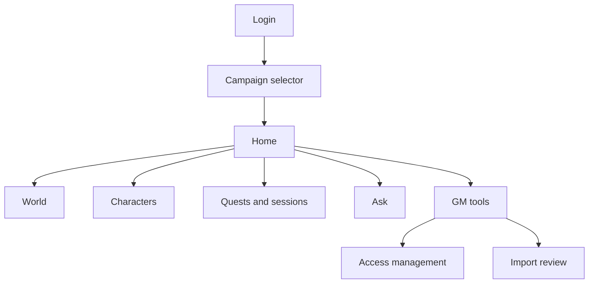
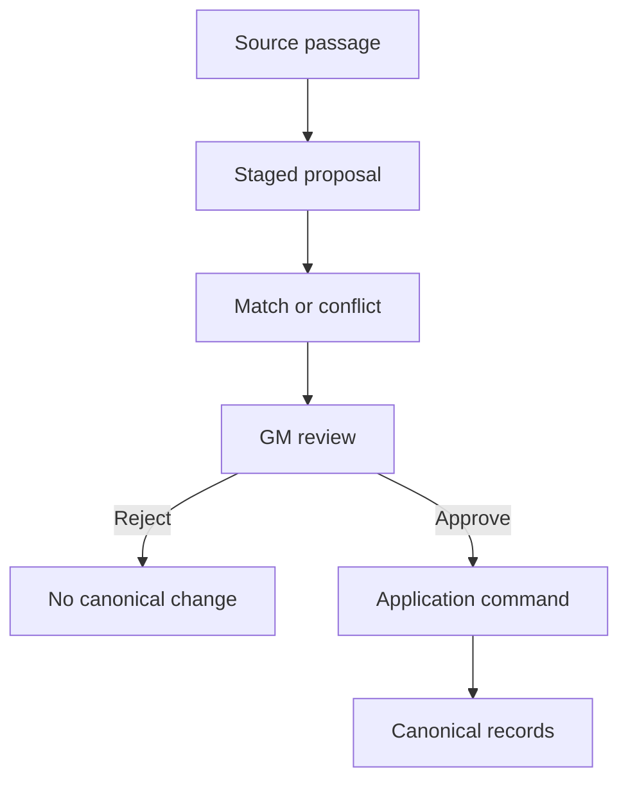
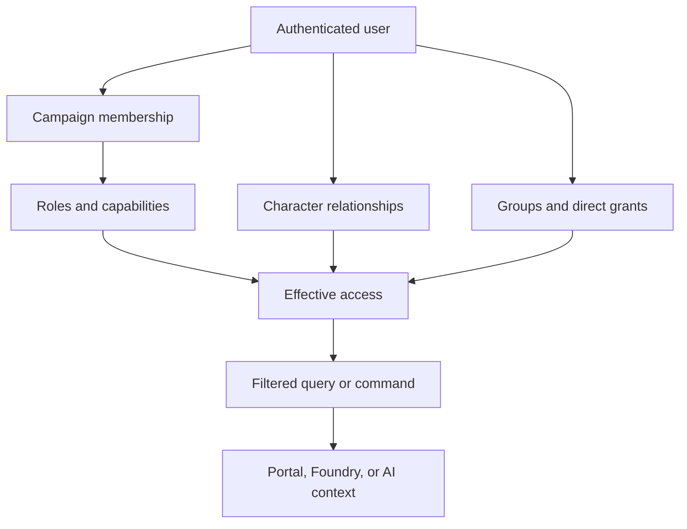

# Persistent World Web Portal UI Design

## 1. Purpose

This document defines the first-class web experience for the persistent tabletop roleplaying world platform. The portal is the primary out-of-session interface for players, GMs, assistant GMs, and observers. FoundryVTT remains the primary in-session tactical client. Discord is deferred until demonstrated demand justifies a later thin-client integration.

This document is the product-level authority for portal behavior, information architecture, authorization boundaries, and screen responsibilities. [`UI_STYLE_GUIDE.md`](UI_STYLE_GUIDE.md) defines the shared visual language, card and detail-page anatomy, responsive presentation, theme-token usage, and component-level presentation standards used to implement this design.

The portal must let an authorized user:

- understand the current campaign quickly;
- browse permitted world and campaign details;
- request summaries or ask questions on demand;
- work with one or more characters;
- see facts, beliefs, rumors, quests, sessions, and relationships from an explicit perspective;
- administer canon, users, roles, access, and import proposals when authorized.

The defining authorization rule is:

> Roles provide defaults, but users and details are many-to-many. A user may relate to many characters, facts, and other resources; each resource may relate to many users through roles, characters, parties, groups, knowledge, or direct grants.

## 2. Product principles

1. **Perspective is always visible.** The active campaign, timeline, role, effective time, and optional character perspective appear in the shared shell.
2. **No hidden-data inference.** Unauthorized resources do not appear in pages, search suggestions, counts, links, relationship edges, identifiers, errors, caches, or AI context.
3. **Filter before synthesis.** The server resolves authorization before sending records to the UI or an AI provider. The system never creates a GM answer and redacts it into a player answer.
4. **Truth and awareness remain distinct.** Canonical truth, belief, rumor, knowledge possession, user visibility, and administrative permission are separately represented.
5. **Roles are not ownership.** Player, GM, and observer roles establish defaults; semantic character relationships and resource grants determine detailed access.
6. **Every important answer is traceable.** Summaries and answers identify perspective, effective time, source records, and rules citations when applicable.
7. **The MVP is useful, not encyclopedic.** Begin with concise collection cards, route-based detail pages, links, and focused GM tools. Interactive maps, graph explorers, and a generalized CMS are later enhancements.
8. **Progressive detail is addressable.** Collection cards summarize authorized records; opening a card navigates to a refreshable, bookmarkable detail route that performs its own current authorization check. A visual “expansion” never depends solely on cached list data.

## 3. Users and roles

| Role template | Primary needs | Default experience |
|---|---|---|
| Campaign owner | Administration and continuity | All campaign configuration plus GM tools |
| GM | Canon, secrets, preparation, approvals | Full authorized canon, hidden state, visibility preview |
| Assistant GM | Delegated preparation or portrayal | Only assigned GM capabilities and resources |
| Player | Character and party play | Associated characters, permitted knowledge, quests, recaps |
| Observer | Curated view | Explicitly published or granted resources only |
| Import reviewer | Campaign-data review | Import proposals and promotion decisions |
| Rules curator | Reference-source management | Rules sources, editions, rights, retrieval status |

A person may hold multiple roles in one campaign and different roles in other campaigns. Authorization checks capabilities, not role-name strings.

## 4. Information architecture



Primary navigation:

- Home
- World
- Characters
- Quests
- Sessions
- Knowledge
- Ask
- GM Tools, when permitted
- Access Management, when permitted

The shared header contains:

- campaign selector;
- timeline selector when more than one is available;
- viewing role/purpose selector when the user has multiple authorized modes;
- character-perspective selector when the user relates to multiple characters;
- effective-time indicator;
- account and logout menu.

Changing perspective refreshes the page from the server. It is not a client-only filter over previously downloaded data.

### 4.1 Reusable presentation system

A small set of reusable `portal/src/components` primitives supports the screens below rather than each screen inventing its own layout. The exact component names may evolve, but their responsibilities remain separate:

- **`CampaignContextPanel`** answers "what campaign context and viewing perspective am I using?" It is one compact, infobox-styled panel divided into four stacked sections — **World, Campaign, Timeline, Character**, in that order — each showing the current selection plus a few compact read-only detail rows for it. The hierarchy is causal: changing a higher selection repopulates the lower options and clears the lower selection. **World** is a read-only value and **Timeline** a disabled control until the backend exposes authorized worlds/timelines and their selection APIs; **Campaign** is a live selector over the authorized campaigns from session bootstrap, and switching it preserves the current top-level section (discarding any detail id) and clears the character for the target campaign; **Character** reuses the established character-perspective context/selector and shows compact live character facts. The panel is presentation-oriented — the surrounding layout (`CampaignLayout`) owns the routing and perspective wiring. It collapses behind a native disclosure control on narrow screens and is meant for a right-hand column or the shared shell.
- **`InfoBox`** answers "what are the important facts about the entity on this page?" It is a generic, Wiki-style label/value panel (title, optional subtitle/image/status, label/value sections, related links) with no built-in knowledge of any entity type; per-entity wrappers (e.g. `CampaignInfoBox`) translate an authorized domain record into the generic model and are responsible for authorization-safe field selection.
- **Collection-card primitives** answer "which authorized record should I open?" A responsive card grid presents concise, domain-mapped cards for world entities, knowledge, quests, campaigns, and other browsable collections. Cards use real links, expose only fields present in the audience-safe list contract, and do not fetch or imply inaccessible detail records.
- **Detail-panel primitives** answer "how is this authorized record organized?" A full-page detail layout composes stat cards, semantic fact groups, compact lists or tables, and bounded panels under one page heading. Domain-specific wrappers decide which authorized fields belong in each panel; a generic primitive never reflects over an arbitrary API object.

These concepts stay distinct: context describes the viewer's current vantage point; an infobox describes compact facts about a subject; a collection card supports discovery and navigation; and a detail surface organizes the complete authorized view. `InfoBox` remains available for compact subject summaries and the context panel retains its specialized structure. None infers access, filters hidden records, reflects over arbitrary fields, or exposes internal identifiers or authorization metadata — that remains the server's responsibility.

Activating a navigable card changes route and loads the detail contract for that campaign and perspective. The detail page may visually continue the selected card's category, title, status, and surface treatment so that it feels expanded, but correctness, deep linking, refresh, browser Back/Forward behavior, and authorization do not depend on animation.

## 5. Core screens

### 5.1 Login and invitation

States:

- Sign in (local username/password against `POST /auth/login`).
- Account activation from an administrator-issued invitation link (`POST /auth/activate` — sets the account's first password; no temporary password is ever assigned or displayed).
- Accept campaign invitation.
- First-time profile confirmation.
- No active campaign membership.
- Expired, revoked, or invalid invitation/activation/reset token.
- Password reset (self-initiated request plus administrator-issued reset — `POST /auth/password-reset`), and an account-disabled state distinct from a wrong-credential state (both still return the same non-disclosing sign-in error, per §12).

The portal does not expose campaign names or invitation details until the invitation token is validated. After login, the session-bootstrap response (`GET /auth/session`) is what the application uses to resolve the authenticated user and evaluate campaign membership — never an external identity mapping.

### 5.2 Campaign selector

Show only campaigns the user may discover. Each item may include:

- campaign name;
- world name when permitted;
- user's role labels;
- associated character names when permitted;
- last accessible session date;
- membership status.

Do not show aggregate counts that include inaccessible campaigns.

### 5.3 Home dashboard

The dashboard answers: “What do I need to know right now?”

Ordered sections:

1. Ask about this campaign.
2. Last-session recap.
3. Current location and situation.
4. Active quests and immediate objectives.
5. Recent discoveries and world changes.
6. Relevant NPCs, factions, and relationships.
7. Character-specific reminders, resources, or unresolved decisions.

Each card is assembled for the current user and perspective. A player using Character A may receive a different dashboard than the same user viewing Character B. Observers receive only curated content. GMs may switch between GM briefing and preview-as-user modes.

### 5.4 World explorer

Browse authorized:

- locations and dungeons;
- NPCs and player characters;
- organizations, factions, governments, religions, and cultures;
- items and artifacts;
- historical events;
- relationships;
- approved lore and knowledge.

MVP presentation:

- type-filtered card collections;
- text search over authorized records;
- concise result cards showing only audience-safe list fields;
- campaign-scoped, route-based detail pages when an authoritative detail contract exists;
- related-resource links;
- breadcrumbs for location containment.

World cards identify the entity's human-readable category/type, name, and authorized short summary. They do not infer containment, relationships, population, organization membership, visibility, or other details from identifiers or category codes. Converting a list to cards may proceed before detail support exists; a card becomes a detail link only after the server exposes a directly loadable, audience-safe detail contract for that category.

Detail pages display only sections the user may access. They use bounded panels for the authorized overview, current state, containment, relationships, known history, related resources, and provenance supplied by the detail response. Irrelevant or unavailable panels are omitted without suggesting that hidden sections exist. The page distinguishes established canon, knowledge in the current perspective, rumor/belief, uncertainty, and source provenance only where the current contract deliberately exposes those distinctions.

### 5.5 Character workspace

The character selector shows every character related to the user for the active campaign and timeline. A user can have several characters; a character can have several users.

Tabs appear only when authorized:

- Overview
- Sheet
- Current state
- Inventory
- Knowledge
- History
- Relationships
- Quests
- Notes
- Access

Capabilities are independent:

| Capability | Example |
|---|---|
| Discover | Character may appear in search or links |
| View summary | Public profile and current summary |
| View full | Full sheet and ordinary history |
| View private | Private background, memories, or knowledge |
| Interact | Speak or act through the character where supported |
| Control | Submit play-state commands |
| Edit narrative | Update authorized descriptive fields |
| Edit mechanical | Update authorized mechanical fields |
| Manage access | Change user-character relationships or grants |

The screen labels why access exists, such as “Primary controller,” “Co-controller,” or “Viewer through Party A.”

The character Sheet view uses a responsive tabletop-inspired information hierarchy rather than one long sequence of tables:

- identity, build, ruleset, class, and level facts form the page header;
- hit points, proficiency bonus, movement, and spellcasting values use compact stat cards when present;
- every ability has its own card containing the score, prominent modifier, saving-throw modifier, and an explicit save-proficiency state;
- skills, other proficiencies, languages, senses, conditions, resources, features, and spellcasting profiles use separately headed panels;
- spells are grouped by level, preserve their contract-provided identity, and display known/prepared state without relying on color;
- sparse but valid characters retain character-level facts and deliberate empty states rather than losing the entire sheet.

The portal does not invent familiar sheet values such as armor class, initiative, hit dice, attacks, equipment, background, alignment, or personality traits until authoritative audience-safe contracts provide them.

### 5.6 Knowledge

Views:

- Known facts
- Rumors and beliefs
- Recently discovered
- Character-private
- Party-shared
- Public lore
- Sources

Each item shows, when permitted:

- claim or summary;
- knowledge type;
- confidence or truth status appropriate to the viewer;
- who knows or believes it;
- discovery or transfer source;
- effective time;
- related entities and quests.

The UI never labels a player-facing claim “false” merely because the GM's canonical record says so. GM mode can compare canonical truth with character beliefs. Player mode shows only the belief state available to the selected perspective.

Knowledge collections use cards. A card may show the authorized statement, type, scope, awareness, confidence, willingness-to-share state, and truth status only when those fields are meaningful and deliberately included for the current audience. Null values are omitted or neutrally described; they are never translated into a suggestion that hidden information exists.

Opening a knowledge card as a full detail surface requires an explicit detail route and an authoritative detail contract, or a documented API guarantee that the list item is the complete directly retrievable detail representation. The portal does not construct a refresh-dependent detail page from a collection page's in-memory record. Future detail panels may include discovery context, subject, sources, related records, and GM truth comparison only when separately authorized.

### 5.7 Quests and quest detail

The quest collection uses concise cards. The current list contract supplies a quest name and status, so list cards do not invent descriptions, objective counts, rewards, participants, or locations from data absent from that contract. Each card links to the established campaign-scoped quest detail route.

The full quest detail surface visually continues the selected card and organizes the authorized contract into separately headed stage and objective regions. It preserves server-provided stage sequence and objective order; it does not alphabetize narrative progression.

Player/observer sections:

- visible description;
- known objectives;
- current status;
- relevant permitted NPCs and locations;
- discoveries and prior events;
- character-specific knowledge.

GM-only sections, when authorized:

- hidden stages and objectives;
- dependencies and failure conditions;
- secret participants and motives;
- possible outcomes and rewards;
- event mappings;
- visibility preview.

With the current read-only contract, the implemented detail surface may include only the quest title/status, stages, descriptions, and objectives with their requirement level, completion mode, quantity, and status. The richer sections above remain product goals and appear only after matching audience-safe backend fields exist. Hidden stages, objectives, sequence gaps, and aggregate counts are not exposed.

### 5.8 Session detail

Sections:

- recap;
- participants;
- locations visited;
- encounters and major decisions;
- facts discovered;
- quest changes;
- character, relationship, and inventory changes;
- source events and notes.

Users can request a summary of one session, a selected range, or “since my character last participated.” Results honor effective time and perspective.

### 5.9 Ask

Supported request families:

- campaign, arc, session, or location summary;
- current quests and unresolved clues;
- NPC, faction, item, or relationship details;
- “what does my character know?”;
- GM session-preparation brief;
- campaign-selected rules question with citations.

Example prompts:

- “Summarize the last three sessions.”
- “What does Arlen know about the Glass Ossuary?”
- “Which active quests involve Cardinal Dravus?”
- “What changed in Stormreach?”
- “Prepare a GM briefing for tonight.”
- “What are this campaign's grappling rules?”

Every response displays:

- campaign and timeline;
- perspective and viewing purpose;
- effective point in time;
- deterministic or AI-synthesized status;
- source records and document/rules citations when permitted;
- generation time and cache status.

Answers link to authorized detail pages. They do not mention omitted hidden information.

### 5.10 Observer view

Observer access is curated. Possible grants include:

- public campaign synopsis;
- selected characters;
- approved or delayed session recaps;
- public world lore;
- spoiler-free quest summaries;
- selected event feed.

Different observer groups may exist for a livestream audience, former players, collaborators, or invited guests. Observer membership does not inherit all player-visible information.

## 6. GM workspace

### 6.1 GM dashboard

- Tonight's preparation brief.
- Recent events and state changes.
- Active and stalled quests.
- Hidden facts likely to matter.
- NPC goals and pending reactions.
- Unreviewed AI proposals.
- Import-review workload.
- Recent access changes.

### 6.2 Canon and proposal work

Authorized GMs can:

- search full permitted canon;
- create or edit data through application commands;
- review AI proposals;
- inspect provenance and audit history;
- compare timelines;
- publish or reveal knowledge;
- generate a visibility preview before applying disclosure changes.

### 6.3 Preview as user

The GM selects:

- target user;
- campaign and timeline;
- role/viewing purpose;
- character perspective;
- effective time.

The portal then issues normal authorized preview queries and clearly marks the entire interface as preview mode. Preview does not impersonate the user for writes. Any attempted mutation exits preview or requires an explicit GM action in GM mode.

### 6.4 Access management

Screens:

- Invitations and memberships
- Role assignments
- Role capability templates
- User-character relationships
- Access groups
- Direct resource grants
- Effective-access explanation
- Revocation and audit history

Invitation-specific interaction rules:

- The Access page lists only outstanding campaign invitations and offers issue/revoke controls at the campaign level, never nested under an individual member or access-group card.
- Invitation issuance may show the raw token exactly once in a dedicated success panel. The token must stay in React memory only: never `localStorage`, `sessionStorage`, IndexedDB, URL path/query/fragment, cookies, analytics, or browser history.
- The optional invitation email field is a delivery label only, not an account-binding rule. Accepting an invitation grants campaign membership only; role or additional access assignment remains a separate GM action.
- The authenticated invitation-acceptance route takes the token by manual paste into a secret-appropriate field and submits it only in the request body. Generic failure copy must not disclose whether the token was wrong, expired, revoked, or already accepted by someone else.

The grant editor requires:

- grantee user or group;
- resource;
- campaign/timeline scope;
- capability;
- allow or explicit restriction when supported;
- source/reason;
- optional effective period.

Before saving, show a concise impact preview. After saving, invalidate relevant authorization and summary caches.

## 7. Campaign import review

The campaign-import workspace provides:

- import job list and progress;
- retained source and source-location viewer;
- staged entity, relationship, event, knowledge, and state proposals;
- entity-match candidates and ambiguity resolution;
- conflict comparison against existing canon;
- editable proposal form;
- individual and grouped approve/reject actions;
- promotion result and retry status;
- provenance and audit trail.



Only users with import-review capabilities can discover jobs or proposals. Approved changes go through application commands; the UI never writes canonical tables directly.

## 8. Authorization model

### 8.1 Resolution paths



### 8.2 Conceptual relationships

```text
users
  ↔ campaign_memberships
    ↔ membership_roles
      ↔ roles
        ↔ role_capabilities

users
  ↔ user_character_relationships
    ↔ characters

users or access_groups
  ↔ resource_grants
    ↔ securable_resources

characters / parties / organizations
  ↔ knowledge holdings
    ↔ facts, rumors, beliefs, and memories
```

The implementation may use typed joins, a generic resource registry, or a hybrid, but it must preserve semantic character relationships and efficient filtered queries.

### 8.3 Effective-access explanation

When appropriate, the UI can explain:

- “Visible because you are a GM.”
- “Visible while viewing Arlen, who learned this in Session 18.”
- “Visible because Party A shares this knowledge.”
- “Visible through the Stream Audience group.”
- “Editable because you are this character's co-controller.”

Explanations are themselves filtered; they must not reveal a hidden intermediary.

## 9. Search, lists, and non-disclosure

- Search operates over an authorization-filtered index or query.
- Autocomplete never receives forbidden names or identifiers.
- Counts describe only accessible records.
- Pagination totals exclude inaccessible records.
- Browsable collections default to responsive cards whose fields come only from the audience-safe list contract.
- A card uses a real link when a detail route exists; navigation is not simulated with a clickable `div`.
- Activating a card loads a campaign-scoped detail contract and performs a current authorization check; list data and client state are not proof of detail access.
- Hovering or focusing a card does not preload sensitive detail content unless a later reviewed design provides an equally strong authorization and cache-invalidation guarantee.
- Cards remain concise previews rather than miniature detail pages. Long descriptions, nested collections, and multi-section data belong on the routed detail surface.
- Relationship graphs omit hidden nodes and edges without leaving unexplained placeholders.
- Direct routes to inaccessible resources return the same non-disclosing result as nonexistent resources, except in authorized administrative diagnostics.
- Export and print actions repeat server authorization at request time.
- Browser caches and service workers must not retain data after logout, membership revocation, perspective change, or access revocation.

## 10. States and interaction behavior

Every major screen defines:

- initial loading;
- partial loading;
- empty but authorized;
- unavailable or non-discoverable;
- session expired;
- access changed while open;
- recoverable server error;
- stale data requiring refresh;
- successful save or command acceptance;
- background processing with resumable status.

Optimistic updates are limited to low-risk presentation changes. Canonical mutations show pending, accepted, rejected, or failed command status and remain idempotent when retried.

Collection and detail transitions additionally obey these rules:

- navigating to a different record never leaves the previous record's details visible beneath a new URL;
- loading preserves the application shell and current context without exposing stale subject content;
- empty states describe only the absence of accessible results;
- missing and inaccessible detail records share one non-disclosing unavailable presentation;
- recoverable errors display safe wording and a retry action without exposing internal diagnostics;
- browser Back returns to the collection, preserving URL-backed filters and search state where practical;
- a refreshed detail URL loads independently of the collection page that linked to it.

## 11. Responsive and accessible behavior

- Support desktop, tablet, and phone layouts.
- Collapse primary navigation into a labeled menu on small screens.
- Keep perspective indicators visible near the page title even when the main navigation collapses.
- Reflow card collections and detail panels from multiple columns to one without page-level horizontal scrolling.
- Allow only inherently wide tables to scroll inside a bounded local container.
- Preserve meaningful source order when a multi-column detail layout becomes a single column.
- Use semantic headings, landmarks, tables, forms, and buttons.
- Use semantic lists for card collections and native links for card navigation.
- Support keyboard navigation and visible focus.
- Do not encode canon/rumor/secret/status distinctions by color alone.
- Do not encode proficiency, known/prepared state, confidence, or selection by color alone.
- Announce async answer completion, access errors, and validation errors to assistive technology.
- Preserve readable source citations and audit tables with responsive wrapping or bounded horizontal scrolling where necessary.
- Respect reduced-motion preferences; optional card-to-detail visual transitions are enhancements, never navigation dependencies.

## 12. Security and privacy requirements

The production browser UI and `/api/*` should share the `world` origin. Use `Secure`, `HttpOnly`, narrowly scoped authentication cookies; do not store long-lived application secrets or bearer tokens in browser code. Protect every cookie-authenticated state-changing request with CSRF tokens and origin checks. Exact hostnames are chosen at deployment time from the custom-domain-plus-No-IP or No-IP-only arrangements in ADR 0012.

- Browser login is local application authentication (PLAN.md §23.1/§23.4), not an OIDC authorization-code/PKCE flow: the portal submits a username and password to a same-origin FastAPI endpoint, which issues an opaque, server-side, PostgreSQL-backed session via a `Secure`, `HttpOnly`, `SameSite=Lax` cookie (`__Host-dnd_ai_session` in production). External OIDC bearer-token verification remains available only as an optional compatibility path for non-browser clients presenting their own `Authorization: Bearer` token — the browser client never performs an OIDC redirect/callback and never handles a token itself.
- Store no long-lived application secret in browser code — no bearer or refresh token in `localStorage`, `sessionStorage`, IndexedDB, a JavaScript-readable cookie, a URL, or application state.
- The session-bootstrap endpoint (`GET /auth/session`) is the single source of the current user, campaigns/roles/character-perspectives/capabilities, a CSRF token, and the Phase 12 feature manifest; the server recomputes every authorization-sensitive field from current database state on every call, so the client never infers permissions from a cached value or a display-role string.
- Protect every cookie-authenticated, state-changing request with the `X-CSRF-Token` header (validated against the current server-side session) and an allowed `Origin` — the selected token/session architecture is the one described above, not a placeholder.
- Avoid tokens and restricted content in URLs, analytics, logs, or client error reports.
- Reauthorize every command and sensitive query; UI state is not proof of permission.
- Audit role changes, grants, revocations, preview use, sensitive reads, proposal decisions, and canonical writes.
- Rate-limit login-linked abuse, search enumeration, and expensive Ask requests.

## 13. API-facing UI contracts

Portal responses should include:

- resource data already filtered for the current request context;
- permitted actions/capabilities for rendering controls;
- perspective and effective-time metadata;
- provenance/citation links the user may access;
- stable pagination and correlation identifiers;
- non-disclosing errors;
- command status and idempotency identifiers for mutations.

The UI may use permitted-action hints to choose controls, but the API must independently authorize the eventual request.

## 14. Capability boundaries

- Identity and access services provide login mapping, memberships, roles, character relationships, resource grants, centralized access resolution, and audience-filtered queries.
- Foundry uses the same user mapping, character-control, command, and query authorization rules as the portal.
- Assistant features synthesize only pre-filtered campaign context and return cited rules/reference results appropriate to the active perspective.
- The portal provides campaign and perspective selection, player and observer views, GM access management, audit history, and preview-as-user.
- Production ingress provides same-origin UI/API routing, HTTPS, secure cookies, CSRF protection, rate limits, and non-disclosing operational errors.
- Import review provides source/proposal inspection, matching, conflict resolution, approval, rejection, and promotion status without bypassing application commands.

## 15. Deferred experience

Defer until demonstrated need:

- Discord client;
- interactive geographic maps;
- free-form relationship graph editor;
- real-time collaborative editing;
- generalized page/layout builder;
- unrestricted administration CMS;
- offline-first mutation;
- broad notification center;
- bulk ACL editing beyond the first real campaign need;
- theming marketplace or user-authored themes.

## 16. MVP acceptance checklist

- A user can log in, accept an invitation, select a campaign, and log out.
- A user can hold multiple roles and switch among permitted viewing purposes.
- A user can access multiple characters, and a character can be associated with multiple users.
- A fact can be visible to multiple users through different authorized paths.
- Player, GM, and observer dashboards differ correctly.
- World, Knowledge, Quest, and similar collection screens use concise, responsive, keyboard-accessible cards where applicable.
- Navigable cards use refreshable detail routes, preserve browser navigation behavior, and perform fresh authorization rather than expanding cached list data alone.
- Character sheets use responsive ability/stat cards and separately headed information panels while retaining valid sparse-data states.
- Quest detail preserves server-provided stage/objective order and does not disclose hidden stages, objectives, counts, or sequence gaps.
- World and Knowledge full-detail navigation is enabled only when corresponding audience-safe detail contracts are available.
- Search, counts, links, errors, relationships, and Ask responses do not reveal inaccessible resources.
- Revoking a role, character relationship, group membership, or grant removes access on the next request and invalidates affected cached summaries.
- A player can request recaps, quest status, world details, character knowledge, and cited rules answers.
- A GM can request a preparation brief and preview the portal as a selected user/character perspective.
- A GM can manage memberships, roles, user-character relationships, and resource grants with an audit trail.
- Authorized import reviewers can resolve matches and approve or reject proposals without bypassing application commands.
- All critical flows are keyboard-accessible, theme-compatible, and usable at phone, tablet, and desktop widths.
