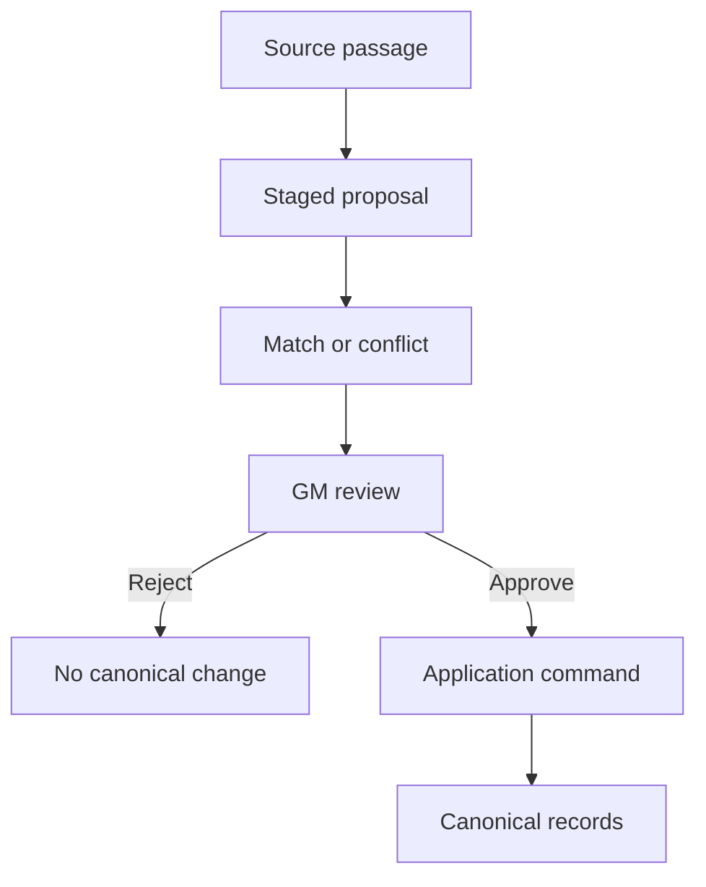
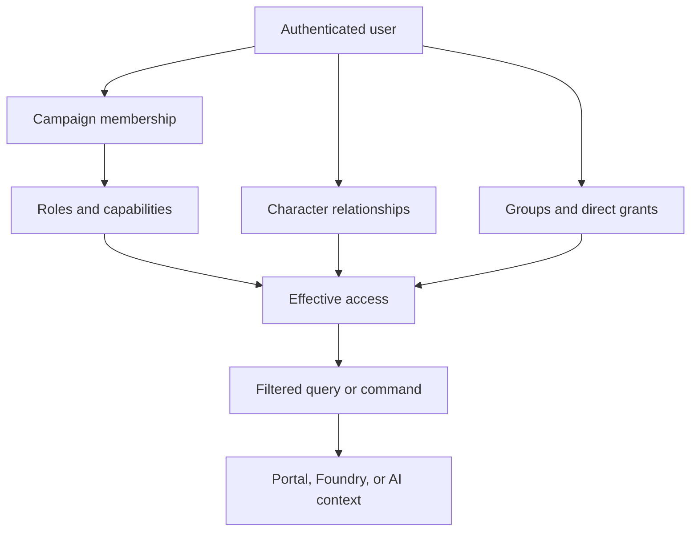

# Persistent World Web Portal UI Design

## 1. Purpose

This document defines the first-class web experience for the persistent tabletop roleplaying world platform. The portal is the primary out-of-session interface for players, GMs, assistant GMs, and observers. FoundryVTT remains the primary in-session tactical client. Discord is deferred until demonstrated demand justifies a later thin-client integration.

This document is the product-level authority for portal behavior, information architecture, authorization boundaries, and screen responsibilities. [`UI_STYLE_GUIDE.md`](UI_STYLE_GUIDE.md) defines the shared visual language, card and detail-page anatomy, responsive presentation, theme-token usage, and component-level presentation standards used to implement this design.

The portal must let an authorized user:

- understand the current campaign quickly;
- browse permitted world and campaign details;
- request summaries or ask questions on demand;
- work with one or more characters;
- see facts, beliefs, rumors, quests, sessions, and relationships from an explicit perspective;
- administer canon, users, roles, access, and import proposals when authorized.

The defining authorization rule is:

> Roles provide defaults, but users and details are many-to-many. A user may relate to many characters, facts, and other resources; each resource may relate to many users through roles, characters, parties, groups, knowledge, or direct grants.

## 2. Product principles

1. **Perspective is always visible in campaign work.** The active campaign, timeline, role, effective time, and optional character perspective appear in the campaign context area. The authenticated global shell remains available without a selected campaign; labels describe context and never grant capabilities.
2. **No hidden-data inference.** Unauthorized resources do not appear in pages, search suggestions, counts, links, relationship edges, identifiers, errors, caches, or AI context.
3. **Filter before synthesis.** The server resolves authorization before sending records to the UI or an AI provider. The system never creates a GM answer and redacts it into a player answer.
4. **Truth and awareness remain distinct.** Canonical truth, belief, rumor, knowledge possession, user visibility, and administrative permission are separately represented.
5. **Roles are not ownership.** Player, GM, and observer roles establish defaults; semantic character relationships and resource grants determine detailed access.
6. **Every important answer is traceable.** Summaries and answers identify perspective, effective time, source records, and rules citations when applicable.
7. **The MVP is useful, not encyclopedic.** Begin with concise collection cards, route-based detail pages, links, and focused GM tools. Interactive maps, graph explorers, and a generalized CMS are later enhancements.
8. **Progressive detail is addressable.** Collection cards summarize authorized records; opening a card navigates to a refreshable, bookmarkable detail route that performs its own current authorization check. A visual “expansion” never depends solely on cached list data.

## 3. Users and roles

| Role template | Primary needs | Default experience |
|---|---|---|
| Campaign owner | Administration and continuity | All campaign configuration plus GM tools |
| GM | Canon, secrets, preparation, approvals | Full authorized canon, hidden state, visibility preview |
| Assistant GM | Delegated preparation or portrayal | Only assigned GM capabilities and resources |
| Player | Character and party play | Associated characters, permitted knowledge, quests, recaps |
| Observer | Curated view | Explicitly published or granted resources only |
| Import reviewer | Campaign-data review | Import proposals and promotion decisions |
| Rules curator | Reference-source management | Rules sources, editions, rights, retrieval status |

A person may hold multiple roles in one campaign and different roles in other campaigns. Authorization checks capabilities, not role-name strings.

## 4. Information architecture

**Approved target design; not implemented by this documentation change.** The authoritative frontend is the React/TypeScript/Vite application under `portal/`, not the obsolete `ui/` directory. The authenticated navigation redesign below supersedes the earlier login-to-campaign-selector model. Existing Phase 13E verification and acceptance records are unchanged.

At the reviewed integration base (`origin/phase13e/phase13e-b`, `5cf7ee5`), `App` supplies persistent identity/theme/account/logout chrome and a footer, but global Home/Campaigns navigation is absent. `/` renders "Portal Foundation"; `LoginPage` sends authenticated users to `/campaigns`; `/home` does not exist. `CampaignSessionBoundary` wraps `AuthenticatedSessionBoundary` and `CampaignLayout`; only the latter renders `AppNavigation` and `CampaignContextPanel`. Account administration currently lives at `/admin/accounts`, and separate `AccountNavLink`, `AdminAccountsNavLink`, and `LogoutButton` controls appear in the header. These are current behavior, not the approved target.

The target has two navigation levels:

- **Global:** D&D AI Portal identity linking to `/home`, Home (`/home`), Campaigns (`/campaigns`), room for future global destinations, a profile/account button, and a consistent footer. This shell surrounds every authenticated page regardless of campaign selection, including account and platform administration pages.
- **Campaign:** Campaign Home, World, Characters, Quests, Sessions, Knowledge, and Access when the selected campaign's authoritative capabilities include `access.manage`. Ask follows the existing server feature-manifest/readiness rules: it remains disabled or clearly labeled unavailable while disabled and makes no related requests or cached output available. Future GM/import destinations require their own readiness and authorization; this redesign does not add them.

Use distinct Global and Campaign navigation landmarks and distinguish global Home from Campaign Home. Role and perspective labels are contextual display data, never locally derived authorization. Changing perspective obtains fresh server-authorized data rather than filtering previously downloaded records.

Conceptual target hierarchy (existing names are retained; `AuthenticatedAppLayout` is a proposed responsibility, not an implemented component):

```text
AuthenticatedSessionBoundary
  AuthenticatedAppLayout (proposed)
    Global header/navigation and profile menu
    Global route outlet
      Home (/home; proposed landing page)
      Campaigns (CampaignsPage)
      Your Account (AccountPage)
      Platform Accounts (AdminAccountsPage; authorized only)
      CampaignSessionBoundary
        CampaignLayout
          Campaign context/navigation (CampaignContextPanel, AppNavigation)
          Campaign page outlet
    Footer
```

`AuthenticatedSessionBoundary` remains responsible for the authenticated session boundary. `CampaignSessionBoundary` owns campaign-specific context and authorization, not the entire authenticated application shell. `CampaignLayout` continues to compose campaign context and campaign pages. Moving between global and campaign routes must preserve global navigation while retaining the existing fresh-bootstrap and campaign-context reset semantics. Without a selected campaign, the global shell stays present; an optional context area may say "No campaign selected" with a native **Select Campaign** link to `/campaigns`.

### 4.1 Reusable presentation system

A small set of reusable `portal/src/components` primitives supports the screens below rather than each screen inventing its own layout. The exact component names may evolve, but their responsibilities remain separate:

- **`CampaignContextPanel`** answers "what campaign context and viewing perspective am I using?" It is one compact, infobox-styled panel divided into four stacked sections — **World, Campaign, Timeline, Character**, in that order — each showing the current selection plus a few compact read-only detail rows for it. The hierarchy is causal: changing a higher selection repopulates the lower options and clears the lower selection. **World** is a read-only value and **Timeline** a disabled control until the backend exposes authorized worlds/timelines and their selection APIs; **Campaign** is a quick switcher over authorized session-bootstrap campaigns, with an adjacent **All Campaigns** or **Browse Campaigns** link to `/campaigns`; target switching normally enters the selected campaign's Home and clears or refreshes campaign-scoped context as specified in §4.5 (the current implementation preserves the top-level section and discards detail IDs); **Character** reuses the established character-perspective context/selector and shows compact live character facts. The panel is presentation-oriented — the surrounding layout (`CampaignLayout`) owns the routing and perspective wiring. It collapses behind a native disclosure control on narrow screens and is meant for a right-hand column or the shared shell.
- **`InfoBox`** answers "what are the important facts about the entity on this page?" It is a generic, Wiki-style label/value panel (title, optional subtitle/image/status, label/value sections, related links) with no built-in knowledge of any entity type; per-entity wrappers (e.g. `CampaignInfoBox`) translate an authorized domain record into the generic model and are responsible for authorization-safe field selection.
- **Collection-card primitives** answer "which authorized record should I open?" A responsive card grid presents concise, domain-mapped cards for world entities, knowledge, quests, campaigns, and other browsable collections. Cards use real links, expose only fields present in the audience-safe list contract, and do not fetch or imply inaccessible detail records.
- **Detail-panel primitives** answer "how is this authorized record organized?" A full-page detail layout composes stat cards, semantic fact groups, compact lists or tables, and bounded panels under one page heading. Domain-specific wrappers decide which authorized fields belong in each panel; a generic primitive never reflects over an arbitrary API object.

These concepts stay distinct: context describes the viewer's current vantage point; an infobox describes compact facts about a subject; a collection card supports discovery and navigation; and a detail surface organizes the complete authorized view. `InfoBox` remains available for compact subject summaries and the context panel retains its specialized structure. None infers access, filters hidden records, reflects over arbitrary fields, or exposes internal identifiers or authorization metadata — that remains the server's responsibility.

Activating a navigable card changes route and loads the detail contract for that campaign and perspective. The detail page may visually continue the selected card's category, title, status, and surface treatment so that it feels expanded, but correctness, deep linking, refresh, browser Back/Forward behavior, and authorization do not depend on animation.

### 4.2 Root, authentication, and deep links

- `/` uses replacement navigation to `/login`, removing the "Portal Foundation" dead end from the target. With a valid session, the login boundary then replaces `/login` with `/home`.
- Successful ordinary login lands at `/home`, not directly at `/campaigns`. An authenticated visit to `/login` also replaces it with `/home`.
- Successful logout revokes the server session, clears protected client context, and routes to `/login`. A failed logout shows a safe recoverable error and retry; it must not claim sign-out succeeded.
- Known protected deep links without a valid session route to login using replacement navigation. Preserve the intended destination where the existing authentication architecture supports continuation, using only a validated same-origin portal path and reauthorizing it after login. Ordinary login without a supported continuation uses `/home`. The current `AuthenticatedSessionBoundary` redirects to `/login` without retaining a return destination; continuation is a target requirement, not a delivered contract.
- `/campaign-invitations/accept` retains its public single-link onboarding and authenticated manual-token fallback. Inline sign-in/registration and the server-side onboarding session continue under [PHASE13E_ACCESS_CONTRACT.md §3n](PHASE13E_ACCESS_CONTRACT.md#3n-single-link-invitation-onboarding-delivered-checkpoints-8a-8d); the ordinary login landing rule must not interrupt invitation completion. Do not retain invitation secrets in a return path.
- Unknown routes display a proper not-found state, including unknown campaign sections; do not turn a wildcard into a login redirect. A known protected route still checks its session and authorization. Missing and unauthorized resources remain indistinguishable.

### 4.3 Profile menu

Replace the separate Your Account, Platform Accounts, and Log Out header controls with one profile button. Display the user's server-provided display name where space allows and initials in the avatar position by default. The fallback order is a future configured profile image, initials, the first usable account identifier already authorized for this viewer, then a generic account icon. Initials remain the default without a configured image. The current bootstrap supplies `user.display_name` and an opaque `user_id`, not a profile image or displayable login identifier; never show the UUID or fetch another account's identifier to fill an avatar. The generic icon covers an unusable display name until an authorized identifier is available.

Menu order:

1. Identity summary for the signed-in user.
2. **Your Account** linking to `/account`.
3. **Administration**, containing **Platform Accounts** linking to `/platform/accounts` only when authorized; omit the section when empty.
4. **Log Out**, separated from navigation as an action.

Allow future account destinations without designing profile-image upload or extending profile contracts in this change. The button needs an accessible name even when the display name is visually hidden; decorative avatar content must not duplicate that name.

Use a real button with `aria-expanded`, `aria-controls`, and an appropriate `aria-haspopup` state for the chosen menu semantics. Enter/Space opens it and moves focus into the menu. With ARIA menu semantics, provide menu/menuitem roles, Up/Down movement, Home/End, and Enter/Space activation; Tab closes and continues normal focus order. Escape closes and returns focus to the profile button. Outside-click and focus leaving the menu close it; dismissal must not steal focus from an outside control the user activated. Close on navigation or logout, and apply the route-focus convention after navigation. Hidden menu content is absent from keyboard and screen-reader navigation. Every action remains usable by keyboard and touch, with visible focus and no hover-only controls.

### 4.4 Platform Accounts authorization

Platform Accounts is global platform administration, independent of campaign selection or campaign administration. Visibility derives exclusively from authoritative server-provided platform permission, such as an `accounts.manage` capability. Never infer it from GM, campaign owner, system-role labels, campaign roles, or campaign `access.manage`.

**Existing-contract compatibility:** the current bootstrap reports `is_platform_administrator`, not a platform-capability list or `accounts.manage`; [PHASE13E_ACCESS_CONTRACT.md §3p/§4](PHASE13E_ACCESS_CONTRACT.md#3p-platform-account-lifecycle-ui-delivered-checkpoints-9-11b) documents the actual server gate. Use that explicit server-provided authorization signal while that contract remains current. `accounts.manage` is an example of a future named platform capability, not a capability introduced or synthesized locally by this redesign. No authorization contract changes are approved here.

Hiding a menu item is presentation only. The direct page route must enforce platform eligibility, and every list/mutation request must independently enforce backend authorization. Preserve the fixed non-disclosing not-found/unavailable behavior for unauthorized callers (currently server 404), without leaking account names, counts, identifiers, or diagnostics. `/platform/accounts` is the target browser route; the currently implemented browser route and backend account APIs use `/admin/accounts`. A frontend route move does not rename those backend APIs or grant new access.

### 4.5 Campaign discovery and switching

The full `/campaigns` page provides complete authorized campaign browsing and selection with the fuller audience-safe information available for each campaign (§5.2). The context/infobox switcher provides quick switching during campaign work; it does not replace discovery. Users always have both the persistent global **Campaigns** item and an **All Campaigns** or **Browse Campaigns** action adjacent to the switcher. The switcher must never be the only way out of a selected campaign.

Preserve these authoritative behaviors:

- Choices come only from authorized bootstrap/session data, never guessed IDs or locally filtered role lists.
- Revalidate campaign authorization through fresh bootstrap and server checks when campaign scope changes, including browser Back/Forward. A missing, revoked, or unauthorized campaign is not disclosed.
- Reset or refresh campaign-scoped timeline, provider, perspective, character, party, detail, and preview context according to existing contracts. Do not carry one campaign's data under another campaign's URL. `RouteSessionProvider` currently remounts `SessionProvider` when its campaign route scope changes; `CampaignLayout` clears the target character selection. Global-shell persistence must preserve those security behaviors.
- Target switching normally enters `/app/:campaignId/home`. Currently `buildCampaignSelectionPath` preserves an eligible top-level section and drops detail IDs, falling back to Home when needed. That routing difference is a deliberate target design change; authorization revalidation and context clearing remain mandatory.
- Roles remain display information, not locally derived capabilities.

### 4.6 Intended route model

This table describes the approved target, not a claim that the routes already exist.

| Browser route | Boundary and purpose |
|---|---|
| `/` | Replacement redirect to `/login` |
| `/login` | Public login; valid session redirects to `/home` |
| `/campaign-invitations/accept` | Public onboarding/manual authenticated acceptance under the existing contract |
| `/home` | Authenticated global landing/dashboard; no campaign required |
| `/campaigns` | Authenticated full campaign browsing/selection |
| `/account` | Authenticated Your Account/self-service |
| `/platform/accounts` | Authenticated, platform-authorized Platform Accounts |
| `/app/:campaignId/home` | Authenticated and campaign-authorized Campaign Home |
| `/app/:campaignId/world` | Campaign World |
| `/app/:campaignId/characters` | Campaign Characters |
| `/app/:campaignId/quests` | Campaign Quests |
| `/app/:campaignId/sessions` | Campaign Sessions |
| `/app/:campaignId/knowledge` | Campaign Knowledge |
| `/app/:campaignId/access` | Campaign Access, gated by `access.manage` |

Retain the existing `/app/:campaignId` index replacement to its `home` child and all existing detail/subsection routes: `world/:category/:entityId`, `quests/:questId`, `sessions/:sessionId`, `knowledge/:knowledgeItemId`, and `access/audit`, beneath their campaign prefix. Keep `/app/:campaignId/ask` under its existing readiness rules. Preserve the public `/activate` and `/reset-password` browser pages and their fragment-token handling (links are `<portal-origin>/activate#token=<encoded-token>` and `<portal-origin>/reset-password#token=<encoded-token>`); they are not authenticated global destinations and are deliberately kept off the proxied `/auth/*` prefix. Their mutations remain `POST /auth/activate` and `POST /auth/password-reset`, and `GET` of those paths stays `405`. Unknown paths retain not-found handling. These browser paths do not change backend API paths.

## 5. Core screens

### 5.1 Login and invitation

States:

- Sign in (local username/password against `POST /auth/login`).
- Account activation from an administrator-issued invitation link (`POST /auth/activate` — sets the account's first password; no temporary password is ever assigned or displayed).
- Accept campaign invitation, either through the manual authenticated-acceptance form or through single-link onboarding (Phase 13E checkpoints 8a-8d): opening a shareable `/campaign-invitations/accept#token=<one-time-token>` link begins a short-lived server-side onboarding session, then offers **sign in** (an existing account) or **create account** (invitation-authorized registration — the only public account-creation path in this codebase) before automatically accepting the invitation. The completion screen names the campaign by its audience-safe display name and explains that a GM may still need to assign a role, character relationship, resource grant, or access-group membership before campaign content becomes available — see `docs/PHASE13E_ACCESS_CONTRACT.md` §3n for the full delivered contract.
- First-time profile confirmation.
- No active campaign membership.
- Expired, revoked, invalid, or already-consumed invitation/onboarding/activation/reset token/session — every case collapses to one generic unavailable response, never a distinguishable cause.
- Password reset (self-initiated request plus administrator-issued reset — `POST /auth/password-reset`), and an account-disabled state distinct from a wrong-credential state (both still return the same non-disclosing sign-in error, per §12).

The portal does not expose campaign names or invitation details until the invitation token is validated. After login, the session-bootstrap response (`GET /auth/session`) is what the application uses to resolve the authenticated user and evaluate campaign membership — never an external identity mapping.

<a id="52-campaign-selector"></a>

### 5.2 Campaign browsing and selection (`/campaigns`)

Show only campaigns the user may discover. Each item may include:

- campaign name;
- world name when permitted;
- user's role labels;
- associated character names when permitted;
- last accessible session date;
- membership status.

Show fuller campaign information only when the authoritative contract supplies it; these optional fields do not authorize new fetches or invented metadata. Do not show aggregate counts that include inaccessible campaigns. Selection normally opens Campaign Home, with revalidation as described in §4.5.

### 5.2a Authenticated landing/dashboard (`/home`; approved target)

This global page directs users to useful destinations before campaign selection. It is distinct from Campaign Home and is not implemented at the reviewed base.

- Welcome and identity information from the current session bootstrap.
- An **Open Default Campaign** shortcut when the bootstrap-designated default is still authorized and available. The existing `selected_campaign_id` default marker is not a last-visited preference and does not imply recent activity.
- A limited set of authorized campaign cards or shortcuts using only available audience-safe fields, plus a clear **View All Campaigns** action to `/campaigns`. The limited set is not a substitute for the complete campaign list.
- Pending invitation entry points when that feature has an authoritative user-facing contract. Current outstanding-invitation lists are campaign-manager reads, not a global recipient inbox; do not repurpose them or infer invitations from email labels.
- Authorized global/platform actions, including Your Account and Platform Accounts according to §4.4, without requiring a campaign.
- A useful no-campaign empty state explaining that no accessible campaigns are available, with View All Campaigns/Select Campaign and the existing invitation-acceptance entry point where applicable. Do not suggest hidden campaigns exist or offer unrestricted account/campaign creation.

Do not label campaigns "recent" or persist recent-campaign selection without authoritative recent-activity data. New recent-activity storage, profile-image upload, recipient-invitation discovery, and broader dashboards are future capabilities outside this redesign. Preserve existing invitation completion links to `/campaigns` and membership-only admission semantics; a global landing page must not force a newly invited user into content they cannot yet access.

<a id="53-home-dashboard"></a>

### 5.3 Campaign Home dashboard (`/app/:campaignId/home`)

The dashboard answers: “What do I need to know right now?”

Ordered sections:

1. Ask about this campaign.
2. Last-session recap.
3. Current location and situation.
4. Active quests and immediate objectives.
5. Recent discoveries and world changes.
6. Relevant NPCs, factions, and relationships.
7. Character-specific reminders, resources, or unresolved decisions.

Each card is assembled for the current user and perspective. A player using Character A may receive a different dashboard than the same user viewing Character B. Observers receive only curated content. GM briefing remains feature-gated; preview is limited to the effective-access explanation and per-resource quest/knowledge panels in §6.3, not a full-portal viewing mode.

### 5.4 World explorer

Browse authorized:

- locations and dungeons;
- NPCs and player characters;
- organizations, factions, governments, religions, and cultures;
- items and artifacts;
- historical events;
- relationships;
- approved lore and knowledge.

MVP presentation:

- type-filtered card collections;
- text search over authorized records;
- concise result cards showing only audience-safe list fields;
- campaign-scoped, route-based detail pages when an authoritative detail contract exists;
- related-resource links;
- breadcrumbs for location containment.

World cards identify the entity's human-readable category/type, name, and authorized short summary. They do not infer containment, relationships, population, organization membership, visibility, or other details from identifiers or category codes. Converting a list to cards may proceed before detail support exists; a card becomes a detail link only after the server exposes a directly loadable, audience-safe detail contract for that category.

Detail pages display only sections the user may access. They use bounded panels for the authorized overview, current state, containment, relationships, known history, related resources, and provenance supplied by the detail response. Irrelevant or unavailable panels are omitted without suggesting that hidden sections exist. The page distinguishes established canon, knowledge in the current perspective, rumor/belief, uncertainty, and source provenance only where the current contract deliberately exposes those distinctions.

### 5.5 Character workspace

The character selector shows every character related to the user for the active campaign and timeline. A user can have several characters; a character can have several users.

Tabs appear only when authorized:

- Overview
- Sheet
- Current state
- Inventory
- Knowledge
- History
- Relationships
- Quests
- Notes
- Access

Capabilities are independent:

| Capability | Example |
|---|---|
| Discover | Character may appear in search or links |
| View summary | Public profile and current summary |
| View full | Full sheet and ordinary history |
| View private | Private background, memories, or knowledge |
| Interact | Speak or act through the character where supported |
| Control | Submit play-state commands |
| Edit narrative | Update authorized descriptive fields |
| Edit mechanical | Update authorized mechanical fields |
| Manage access | Change user-character relationships or grants |

The screen labels why access exists, such as “Primary controller,” “Co-controller,” or “Viewer through Party A.”

The character Sheet view uses a responsive tabletop-inspired information hierarchy rather than one long sequence of tables:

- identity, build, ruleset, class, and level facts form the page header;
- hit points, proficiency bonus, movement, and spellcasting values use compact stat cards when present;
- every ability has its own card containing the score, prominent modifier, saving-throw modifier, and an explicit save-proficiency state;
- skills, other proficiencies, languages, senses, conditions, resources, features, and spellcasting profiles use separately headed panels;
- spells are grouped by level, preserve their contract-provided identity, and display known/prepared state without relying on color;
- sparse but valid characters retain character-level facts and deliberate empty states rather than losing the entire sheet.

The portal does not invent familiar sheet values such as armor class, initiative, hit dice, attacks, equipment, background, alignment, or personality traits until authoritative audience-safe contracts provide them.

### 5.6 Knowledge

Views:

- Known facts
- Rumors and beliefs
- Recently discovered
- Character-private
- Party-shared
- Public lore
- Sources

Each item shows, when permitted:

- claim or summary;
- knowledge type;
- confidence or truth status appropriate to the viewer;
- who knows or believes it;
- discovery or transfer source;
- effective time;
- related entities and quests.

The UI never labels a player-facing claim “false” merely because the GM's canonical record says so. GM mode can compare canonical truth with character beliefs. Player mode shows only the belief state available to the selected perspective.

Knowledge collections use cards. A card may show the authorized statement, type, scope, awareness, confidence, willingness-to-share state, and truth status only when those fields are meaningful and deliberately included for the current audience. Null values are omitted or neutrally described; they are never translated into a suggestion that hidden information exists.

Opening a knowledge card as a full detail surface requires an explicit detail route and an authoritative detail contract, or a documented API guarantee that the list item is the complete directly retrievable detail representation. The portal does not construct a refresh-dependent detail page from a collection page's in-memory record. Future detail panels may include discovery context, subject, sources, related records, and GM truth comparison only when separately authorized.

### 5.7 Quests and quest detail

The quest collection uses concise cards. The current list contract supplies a quest name and status, so list cards do not invent descriptions, objective counts, rewards, participants, or locations from data absent from that contract. Each card links to the established campaign-scoped quest detail route.

The full quest detail surface visually continues the selected card and organizes the authorized contract into separately headed stage and objective regions. It preserves server-provided stage sequence and objective order; it does not alphabetize narrative progression.

Player/observer sections:

- visible description;
- known objectives;
- current status;
- relevant permitted NPCs and locations;
- discoveries and prior events;
- character-specific knowledge.

GM-only sections, when authorized:

- hidden stages and objectives;
- dependencies and failure conditions;
- secret participants and motives;
- possible outcomes and rewards;
- event mappings;
- visibility preview.

With the current read-only contract, the implemented detail surface may include only the quest title/status, stages, descriptions, and objectives with their requirement level, completion mode, quantity, and status. The richer sections above remain product goals and appear only after matching audience-safe backend fields exist. Hidden stages, objectives, sequence gaps, and aggregate counts are not exposed.

### 5.8 Session detail

Sections:

- recap;
- participants;
- locations visited;
- encounters and major decisions;
- facts discovered;
- quest changes;
- character, relationship, and inventory changes;
- source events and notes.

Users can request a summary of one session, a selected range, or “since my character last participated.” Results honor effective time and perspective.

### 5.9 Ask

Supported request families:

- campaign, arc, session, or location summary;
- current quests and unresolved clues;
- NPC, faction, item, or relationship details;
- “what does my character know?”;
- GM session-preparation brief;
- campaign-selected rules question with citations.

Example prompts:

- “Summarize the last three sessions.”
- “What does Arlen know about the Glass Ossuary?”
- “Which active quests involve Cardinal Dravus?”
- “What changed in Stormreach?”
- “Prepare a GM briefing for tonight.”
- “What are this campaign's grappling rules?”

Every response displays:

- campaign and timeline;
- perspective and viewing purpose;
- effective point in time;
- deterministic or AI-synthesized status;
- source records and document/rules citations when permitted;
- generation time and cache status.

Answers link to authorized detail pages. They do not mention omitted hidden information.

### 5.10 Observer view

Observer access is curated. Possible grants include:

- public campaign synopsis;
- selected characters;
- approved or delayed session recaps;
- public world lore;
- spoiler-free quest summaries;
- selected event feed.

Different observer groups may exist for a livestream audience, former players, collaborators, or invited guests. Observer membership does not inherit all player-visible information.

## 6. GM workspace

### 6.1 GM dashboard

- Tonight's preparation brief.
- Recent events and state changes.
- Active and stalled quests.
- Hidden facts likely to matter.
- NPC goals and pending reactions.
- Unreviewed AI proposals.
- Import-review workload.
- Recent access changes.

### 6.2 Canon and proposal work

Authorized GMs can:

- search full permitted canon;
- create or edit data through application commands;
- review AI proposals;
- inspect provenance and audit history;
- compare timelines;
- publish or reveal knowledge;
- generate a visibility preview before applying disclosure changes.

### 6.3 Preview as user

**Delivered as a bounded pair (Phase 13E, owner decision D-1), not the full mode this section originally specified.** A full-portal projection of an arbitrary member's perspective over every read screen (Option A — the GM selecting target user, campaign/timeline, role/viewing purpose, character perspective, and effective time, then having the *entire* interface re-issue queries as that user) was not built: it is a materially larger surface than 13E's other checkpoints, and is deferred to whichever future phase actually needs it rather than attempted piecemeal. Phase 13E instead ships two independent pieces that together answer the two concrete questions this mode exists for:

- **"What can this person do?"** — the effective-access explanation (§6.4's own entry below; `GET /campaigns/{campaign_id}/members/{campaign_membership_id}/effective-access`): every capability a selected member currently holds, with the role/relationship/grant sources behind each, plus any active `deny`.
- **"What does this specific quest/knowledge item look like to them?"** — a per-resource audience preview (`GET .../preview/quests/{quest_id}` and `.../preview/knowledge/{knowledge_item_id}`): the exact response that member's own request would return for one named quest or knowledge item, in a labelled panel. Placed on the Access page, and — since the backend only ever projects one already-identified quest or knowledge item, never a collection — also directly on the Quest/Knowledge collection and detail pages themselves (the detail placements lock the resource picker to the item already on screen; the collection placements still use the resource picker, but confined to that page's own resource type). Never a mode flag, never a route change, never anything that could be mistaken for impersonation — closing the panel, changing either selection, or navigating to a different campaign clears the rendered result immediately.

Neither piece ever authorizes a request *as* the selected member, creates a second session, or accepts a mutation. See `docs/PHASE13E_ACCESS_CONTRACT.md` §3q/§3r for the full delivered contract, including why the actor/subject separation this required is enforced at the type level, not merely by convention.

### 6.4 Access management

Screens:

- Invitations and memberships
- Role assignments
- Role capability templates
- User-character relationships
- Access groups
- Direct resource grants
- Effective-access explanation
- Revocation and audit history

Invitation-specific interaction rules:

- The Access page lists only outstanding campaign invitations and offers issue/revoke controls at the campaign level, never nested under an individual member or access-group card.
- Invitation issuance may show the raw token exactly once in a dedicated success panel. The token must stay in React memory only: never `localStorage`, `sessionStorage`, IndexedDB, URL path/query/fragment, cookies, analytics, or browser history.
- The optional invitation email field is a delivery label only, not an account-binding rule. Accepting an invitation grants campaign membership only; role or additional access assignment remains a separate GM action.
- The authenticated invitation-acceptance route takes the token by manual paste into a secret-appropriate field and submits it only in the request body. Generic failure copy must not disclose whether the token was wrong, expired, revoked, or already accepted by someone else.

The grant editor requires:

- grantee user or group;
- resource;
- campaign/timeline scope;
- capability;
- allow or explicit restriction when supported;
- source/reason;
- optional effective period.

Before saving, show a concise impact preview. After saving, invalidate relevant authorization and summary caches.

## 7. Campaign import review

The campaign-import workspace provides:

- import job list and progress;
- retained source and source-location viewer;
- staged entity, relationship, event, knowledge, and state proposals;
- entity-match candidates and ambiguity resolution;
- conflict comparison against existing canon;
- editable proposal form;
- individual and grouped approve/reject actions;
- promotion result and retry status;
- provenance and audit trail.


```mermaid
flowchart TD
    S["Source passage"] --> P["Staged proposal"]
    P --> M["Match or conflict"]
    M --> R["GM review"]
    R -->|Reject| N["No canonical change"]
    R -->|Approve| C["Application command"]
    C --> D["Canonical records"]
```

Only users with import-review capabilities can discover jobs or proposals. Approved changes go through application commands; the UI never writes canonical tables directly.

## 8. Authorization model

### 8.1 Resolution paths


```mermaid
flowchart TD
    U["Authenticated user"] --> M["Campaign membership"]
    M --> R["Roles and capabilities"]
    U --> C["Character relationships"]
    U --> G["Groups and direct grants"]
    R --> E["Effective access"]
    C --> E
    G --> E
    E --> F["Filtered query or command"]
    F --> V["Portal, Foundry, or AI context"]
```

### 8.2 Conceptual relationships

```text
users
  ↔ campaign_memberships
    ↔ membership_roles
      ↔ roles
        ↔ role_capabilities

users
  ↔ user_character_relationships
    ↔ characters

users or access_groups
  ↔ resource_grants
    ↔ securable_resources

characters / parties / organizations
  ↔ knowledge holdings
    ↔ facts, rumors, beliefs, and memories
```

The implementation may use typed joins, a generic resource registry, or a hybrid, but it must preserve semantic character relationships and efficient filtered queries.

### 8.3 Effective-access explanation

When appropriate, the UI can explain:

- “Visible because you are a GM.”
- “Visible while viewing Arlen, who learned this in Session 18.”
- “Visible because Party A shares this knowledge.”
- “Visible through the Stream Audience group.”
- “Editable because you are this character's co-controller.”

Explanations are themselves filtered; they must not reveal a hidden intermediary.

## 9. Search, lists, and non-disclosure

- Search operates over an authorization-filtered index or query.
- Autocomplete never receives forbidden names or identifiers.
- Counts describe only accessible records.
- Pagination totals exclude inaccessible records.
- Browsable collections default to responsive cards whose fields come only from the audience-safe list contract.
- A card uses a real link when a detail route exists; navigation is not simulated with a clickable `div`.
- Activating a card loads a campaign-scoped detail contract and performs a current authorization check; list data and client state are not proof of detail access.
- Hovering or focusing a card does not preload sensitive detail content unless a later reviewed design provides an equally strong authorization and cache-invalidation guarantee.
- Cards remain concise previews rather than miniature detail pages. Long descriptions, nested collections, and multi-section data belong on the routed detail surface.
- Relationship graphs omit hidden nodes and edges without leaving unexplained placeholders.
- Direct routes to inaccessible resources return the same non-disclosing result as nonexistent resources, except in authorized administrative diagnostics.
- Export and print actions repeat server authorization at request time.
- Browser caches and service workers must not retain data after logout, membership revocation, perspective change, or access revocation.

## 10. States and interaction behavior

Global landing, account, platform, campaign, and boundary screens all define stable states. Preserve the global shell while the session remains valid, including without a campaign or when campaign access is denied; expired/invalid sessions clear protected data and follow §4.2. Every major screen defines:

- initial loading;
- partial loading;
- empty but authorized;
- unavailable or non-discoverable;
- session expired;
- access changed while open;
- recoverable server error;
- stale data requiring refresh;
- successful save or command acceptance;
- background processing with resumable status.

Optimistic updates are limited to low-risk presentation changes. Canonical mutations show pending, accepted, rejected, or failed command status and remain idempotent when retried.

Collection and detail transitions additionally obey these rules:

- navigating to a different record never leaves the previous record's details visible beneath a new URL;
- loading preserves the application shell and current context without exposing stale subject content;
- empty states describe only the absence of accessible results;
- missing and inaccessible detail records share one non-disclosing unavailable presentation;
- recoverable errors display safe wording and a retry action without exposing internal diagnostics;
- browser Back returns to the collection, preserving URL-backed filters and search state where practical;
- a refreshed detail URL loads independently of the collection page that linked to it.

## 11. Responsive and accessible behavior

- Support desktop, tablet, and phone layouts.
- Reflow global and campaign navigation independently into labeled mobile menus without removing Home, Campaigns, the profile button, or the adjacent Browse Campaigns action. Mobile toggles expose expanded/control state, support Escape and keyboard/touch dismissal, restore focus on cancellation, and close after navigation. Hidden links are not focusable; modal drawers, if used, contain focus while open and restore it when dismissed.
- Keep perspective indicators visible near the page title even when the main navigation collapses.
- Reflow card collections and detail panels from multiple columns to one without page-level horizontal scrolling.
- Allow only inherently wide tables to scroll inside a bounded local container.
- Preserve meaningful source order when a multi-column detail layout becomes a single column.
- Use semantic headings, distinctly labeled Global/Campaign navigation landmarks, tables, forms, and buttons. Preserve one page-level `h1` per route, logical `h2`/`h3` panel headings, and non-heading site-identity chrome as specified in [UI_STYLE_GUIDE.md §14](UI_STYLE_GUIDE.md#14-accessibility-requirements).
- Use semantic lists for card collections and native links for card navigation.
- Support keyboard navigation and visible focus in every theme, with profile-menu keyboard/screen-reader behavior as specified in §4.3. No essential control is hover-only; responsive name truncation must retain accessible names.
- Do not encode canon/rumor/secret/status distinctions by color alone.
- Do not encode proficiency, known/prepared state, confidence, or selection by color alone.
- Announce async answer completion, access errors, and validation errors to assistive technology.
- Preserve readable source citations and audit tables with responsive wrapping or bounded horizontal scrolling where necessary.
- Respect reduced-motion preferences; optional card-to-detail visual transitions are enhancements, never navigation dependencies.

## 12. Security and privacy requirements

The production browser UI and `/api/*` should share the `world` origin. Use `Secure`, `HttpOnly`, narrowly scoped authentication cookies; do not store long-lived application secrets or bearer tokens in browser code. Protect every cookie-authenticated state-changing request with CSRF tokens and origin checks. Exact hostnames are chosen at deployment time from the custom-domain-plus-No-IP or No-IP-only arrangements in ADR 0012.

- Browser login is local application authentication (PLAN.md §23.1/§23.4), not an OIDC authorization-code/PKCE flow: the portal submits a username and password to a same-origin FastAPI endpoint, which issues an opaque, server-side, PostgreSQL-backed session via a `Secure`, `HttpOnly`, `SameSite=Lax` cookie (`__Host-dnd_ai_session` in production). External OIDC bearer-token verification remains available only as an optional compatibility path for non-browser clients presenting their own `Authorization: Bearer` token — the browser client never performs an OIDC redirect/callback and never handles a token itself.
- Store no long-lived application secret in browser code — no bearer or refresh token in `localStorage`, `sessionStorage`, IndexedDB, a JavaScript-readable cookie, a URL, or application state.
- The session-bootstrap endpoint (`GET /auth/session`) is the single source of the current user, campaigns/roles/character-perspectives/capabilities, a CSRF token, and the Phase 12 feature manifest; the server recomputes every authorization-sensitive field from current database state on every call, so the client never infers permissions from a cached value or a display-role string.
- Protect every cookie-authenticated, state-changing request with the `X-CSRF-Token` header (validated against the current server-side session) and an allowed `Origin` — the selected token/session architecture is the one described above, not a placeholder.
- Avoid tokens and restricted content in URLs, analytics, logs, or client error reports.
- Reauthorize every command and sensitive query; UI state is not proof of permission.
- Audit role changes, grants, revocations, preview use, sensitive reads, proposal decisions, and canonical writes.
- Rate-limit login-linked abuse, search enumeration, and expensive Ask requests.

## 13. API-facing UI contracts

Portal responses should include:

- resource data already filtered for the current request context;
- permitted actions/capabilities for rendering controls;
- perspective and effective-time metadata;
- provenance/citation links the user may access;
- stable pagination and correlation identifiers;
- non-disclosing errors;
- command status and idempotency identifiers for mutations.

The UI may use permitted-action hints to choose controls, but the API must independently authorize the eventual request.

## 14. Capability boundaries

- Identity and access services provide login mapping, memberships, roles, character relationships, resource grants, centralized access resolution, and audience-filtered queries.
- Foundry uses the same user mapping, character-control, command, and query authorization rules as the portal.
- Assistant features synthesize only pre-filtered campaign context and return cited rules/reference results appropriate to the active perspective.
- The portal provides campaign and perspective selection, player and observer views, GM access management, audit history, and preview-as-user.
- Production ingress provides same-origin UI/API routing, HTTPS, secure cookies, CSRF protection, rate limits, and non-disclosing operational errors.
- Import review provides source/proposal inspection, matching, conflict resolution, approval, rejection, and promotion status without bypassing application commands.

## 15. Deferred experience

Defer until demonstrated need:

- Discord client;
- interactive geographic maps;
- free-form relationship graph editor;
- real-time collaborative editing;
- generalized page/layout builder;
- unrestricted administration CMS;
- offline-first mutation;
- broad notification center;
- bulk ACL editing beyond the first real campaign need;
- theming marketplace or user-authored themes.

## 16. MVP acceptance checklist

- A user can log in, accept an invitation, select a campaign, and log out.
- A user can hold multiple roles and switch among permitted viewing purposes.
- A user can access multiple characters, and a character can be associated with multiple users.
- A fact can be visible to multiple users through different authorized paths.
- Player, GM, and observer dashboards differ correctly.
- World, Knowledge, Quest, and similar collection screens use concise, responsive, keyboard-accessible cards where applicable.
- Navigable cards use refreshable detail routes, preserve browser navigation behavior, and perform fresh authorization rather than expanding cached list data alone.
- Character sheets use responsive ability/stat cards and separately headed information panels while retaining valid sparse-data states.
- Quest detail preserves server-provided stage/objective order and does not disclose hidden stages, objectives, counts, or sequence gaps.
- World and Knowledge full-detail navigation is enabled only when corresponding audience-safe detail contracts are available.
- Search, counts, links, errors, relationships, and Ask responses do not reveal inaccessible resources.
- Revoking a role, character relationship, group membership, or grant removes access on the next request and invalidates affected cached summaries.
- A player can request recaps, quest status, world details, character knowledge, and cited rules answers.
- A GM can request a preparation brief. **Partially met** — "preview the portal as a selected user/character perspective" is delivered only as the bounded §6.3 pair (an effective-access explanation plus a per-resource quest/knowledge audience preview), never a full-portal projection; see §6.3 and `docs/PHASE13E_ACCESS_CONTRACT.md` §3q/§3r for the delivered scope and D-1's reasoning for not building the rest.
- A GM can manage memberships, roles, user-character relationships, and resource grants with an audit trail.
- Authorized import reviewers can resolve matches and approve or reject proposals without bypassing application commands.
- All critical flows are keyboard-accessible, theme-compatible, and usable at phone, tablet, and desktop widths.
