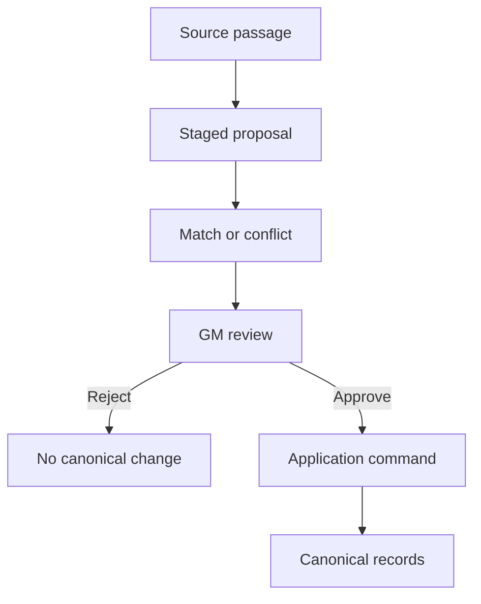
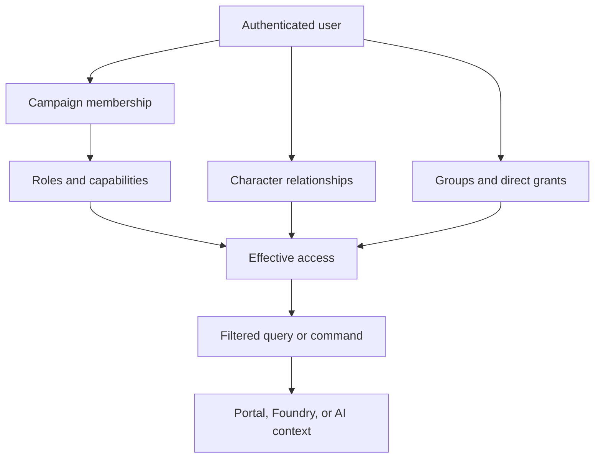

# Persistent World Web Portal UI Design

## 1. Purpose

This document defines the first-class web experience for the persistent tabletop roleplaying world platform. The portal is the primary out-of-session interface for players, GMs, assistant GMs, and observers. FoundryVTT remains the primary in-session tactical client. Discord is deferred until demonstrated demand justifies a later thin-client integration.

This document is the product-level authority for portal behavior, information architecture, authorization boundaries, and screen responsibilities. [`UI_STYLE_GUIDE.md`](UI_STYLE_GUIDE.md) defines the shared visual language, card and detail-page anatomy, responsive presentation, theme-token usage, and component-level presentation standards used to implement this design.

The portal must let an authorized user:

- understand the current campaign quickly;
- browse permitted world and campaign details;
- request summaries or ask questions on demand;
- work with one or more characters;
- see facts, beliefs, rumors, quests, sessions, and relationships from an explicit perspective;
- administer canon, users, roles, access, and import proposals when authorized.

The defining authorization rule is:

> Roles provide defaults, but users and details are many-to-many. A user may relate to many characters, facts, and other resources; each resource may relate to many users through roles, characters, parties, groups, knowledge, or direct grants.

## 2. Product principles

1. **Perspective is always visible in campaign work.** The active campaign, timeline, role, effective time, and optional character perspective appear in the campaign context area. The authenticated global shell remains available without a selected campaign; labels describe context and never grant capabilities.
2. **No hidden-data inference.** Unauthorized resources do not appear in pages, search suggestions, counts, links, relationship edges, identifiers, errors, caches, or AI context.
3. **Filter before synthesis.** The server resolves authorization before sending records to the UI or an AI provider. The system never creates a GM answer and redacts it into a player answer.
4. **Truth and awareness remain distinct.** Canonical truth, belief, rumor, knowledge possession, user visibility, and administrative permission are separately represented.
5. **Roles are not ownership.** Player, GM, and observer roles establish defaults; semantic character relationships and resource grants determine detailed access.
6. **Every important answer is traceable.** Summaries and answers identify perspective, effective time, source records, and rules citations when applicable.
7. **The MVP is useful, not encyclopedic.** Begin with concise collection cards, route-based detail pages, links, and focused GM tools. Interactive maps, graph explorers, and a generalized CMS are later enhancements.
8. **Progressive detail is addressable.** Collection cards summarize authorized records; opening a card navigates to a refreshable, bookmarkable detail route that performs its own current authorization check. A visual “expansion” never depends solely on cached list data.

## 3. Users and roles

| Role template | Primary needs | Default experience |
|---|---|---|
| Campaign owner | Administration and continuity | All campaign configuration plus GM tools |
| GM | Canon, secrets, preparation, approvals | Full authorized canon, hidden state, visibility preview |
| Assistant GM | Delegated preparation or portrayal | Only assigned GM capabilities and resources |
| Player | Character and party play | Associated characters, permitted knowledge, quests, recaps |
| Observer | Curated view | Explicitly published or granted resources only |
| Import reviewer | Campaign-data review | Import proposals and promotion decisions |
| Rules curator | Reference-source management | Rules sources, editions, rights, retrieval status |

A person may hold multiple roles in one campaign and different roles in other campaigns. Authorization checks capabilities, not role-name strings.

## 4. Information architecture

**Status: delivered** (Phase 13 navigation and settings redesign; revision `109_user_portal_preferences` and the portal commits recorded in [PLAN.md §23.6](PLAN.md#236-web-portal-experience)). This section and §4.2–§4.7 describe the delivered *single-navigation and settings* design. The authoritative frontend is the React/TypeScript/Vite application under `portal/`.

History: before this redesign the header carried duplicate Home/Campaigns navigation and the theme selector, the campaign sidebar was owned by `CampaignLayout` (so it existed only on campaign routes), `/home` was a global dashboard, and the bootstrap's `selected_campaign_id` was only the first authorized campaign by name, with no persisted preference.

### One authenticated navigation system

The portal has exactly one primary navigation system for authenticated work — a persistent sidebar owned by the authenticated application shell — plus a minimal header.

- **Header** (`PortalHeader`): portal identity/branding, the narrow-screen navigation-drawer control where required, and the User Account/profile control (§4.3). Nothing else: no Home/Campaigns links, no other primary navigation, and no theme selector (theme selection moves to Settings, §4.7). For an authenticated user the brand links to `/home`, which is an authenticated landing resolver (§4.2), never a duplicate dashboard. For a signed-out visitor the brand is plain text.
- **Sidebar** (one `nav` landmark labeled "Main"): rendered by `AuthenticatedAppLayout`, not `CampaignLayout`, on every authenticated route — campaign pages, `/campaigns`, `/settings`, `/account`, `/platform/accounts`, and future authenticated global pages. It never appears on public pages: `/login`, `/activate`, `/reset-password`, `/campaign-invitations/accept` (logged-out onboarding and the authenticated manual fallback alike, since it is a public-layout route), and the public not-found state. An authenticated visitor on a public route keeps the header's brand link and profile menu as the way back.

Sidebar organization:

```text
Campaign Home  [Choose campaign ▾]   link to the resolved campaign's Home + separate disclosure button
  Authorized Campaign A
  Authorized Campaign B
  Authorized Campaign C
  View all campaigns                  /campaigns
Worlds ▾                              disclosure; the single world group (Phase 14)
  All worlds                          /worlds — always enabled
  New world                           enabled by global capability world.create; otherwise a disabled non-link
  World overview                      enabled when the route selects a server-confirmed world
  Timelines                           /worlds/{id}/timelines — the world's authorized timelines
  Timeline overview                   enabled only when a timeline is selected
  Campaign world                      enabled when a campaign resolves; /app/{campaignId}/world
Characters
Quests
Sessions
Knowledge
Ask                                   server feature manifest
Access ▾                              disclosure; slot present if access.manage on any campaign
  Access Management
  Invitations
  Audit History
-------------------------------------
Collapse / expand navigation          always last
```

Rules:

- **One Worlds group.** There is no separate singular "World" item; the campaign world page is the group's "Campaign world" child. World overview and Timelines are enabled only for a world the server has confirmed (`WorkspaceHierarchyProvider`: only once `GET /worlds/{id}` succeeds for the route's world, or for the authorized route campaign's world — campaign membership alone never enables World navigation, per ADR 0014; the campaign page's own context panel still uses the bootstrap names); otherwise they stay in place, disabled with "Select a world first". Timeline overview is enabled only when a timeline is selected — a timeline route whose ID is in that world's authorized timelines, or the route campaign's timeline, in both cases only if that world response lists it — otherwise it stays disabled with "Select a timeline first". **Timelines is world-scoped:** it opens the collection of every timeline the server returns for the world, never just a campaign's timeline. An unknown route ID adds nothing and is never echoed. Disabled entries are non-links with `aria-disabled="true"`, no `href`, no active styling, and the neutral reason as their description; they keep icon, label, and position in expanded, collapsed, and drawer modes. "New world" follows `global_capabilities`, never a display role: without `world.create` (held only by an active platform administrator or an effective built-in GM, ADR 0018) it stays visible as a disabled non-link. For a world the server returns as view-only, World overview and Timelines open read-only pages and Timeline overview is disabled ("Not available for your account"). The group starts open on a `/worlds` or campaign world route.
- **Campaign choices** come only from the current authoritative session bootstrap (`campaigns`). The sidebar never invents, guesses, caches, or carries forward a campaign from a previous bootstrap, from browser storage, or from a stored preference. Selecting a different campaign clears that campaign's character-perspective selection (`useSelectCampaign`) and enters `/app/{campaignId}/home`. **View all campaigns** always links to `/campaigns`, the full campaign-selection route (§5.2).
- **Campaign Home is a link plus a separate disclosure button**, never one control that is ambiguously both. The link (visible text "Campaign Home") navigates to the resolved campaign's Home; an adjacent button (accessible name "Choose campaign", `aria-expanded`, `aria-controls`) shows or hides the campaign list beneath it. When no campaign resolves, the link is replaced in the same slot by a disabled "Campaign Home" entry (see "Stable structure") and the disclosure button keeps its "Choose campaign" name. The list starts open on `/campaigns` and closed elsewhere. The active campaign's entry carries `aria-current="true"`.
- **Resolved campaign for campaign-specific links:** the route's `:campaignId` when it is in the current bootstrap's `campaigns`; otherwise `campaign_preferences.last_visited_campaign_id`; otherwise `startup_campaign_id` (§4.7); otherwise none. A route campaign ID that is not authorized is never used or echoed. With no resolved campaign, Campaign Home/Campaign world/Characters/Quests/Sessions/Knowledge/Ask/Access are not rendered as links — they remain in place as disabled entries (see "Stable structure") — so no link ever contains a guessed ID.
- **Stable structure.** Route context never adds, removes, or reorders sidebar entries; a missing prerequisite switches an entry to disabled instead. A disabled entry is never an anchor: it is a non-focusable element with the normal icon and label, `aria-disabled="true"`, no `aria-current`, muted styling, no navigation, and the prerequisite as its accessible description (`aria-describedby`) and tooltip (collapsed tooltips are "Label: reason"). Reasons are neutral — "Select a campaign first", "Select a world first", "No timeline available", "Not available for your account", "Unavailable for this campaign", or the server-provided feature reason for Ask — and never carry a name, ID, capability, or count. Capability-gated slots follow the caller, not the route: "New world" follows `global_capabilities`; the Access slot exists only for a caller with `access.manage` on at least one authorized campaign, and is enabled only when the resolved campaign grants it. The Knowledge slot is a plain link, except that it becomes an expandable group with **Claims** and **Member preview** children when the resolved campaign grants `access.manage`; Claims stays active on the collection and on claim pages, Member preview on its own routes, and the group opens on load when either is current. The sidebar presents server-computed state and never grants access; the server remains the enforcement boundary.
- **Ask** follows the server feature manifest exactly as before: a link only when `features.ask` is true, otherwise a visibly disabled item that is not a link and makes no request.
- **Access** is a disclosure button (not a link) over **Access Management** (`/access`), **Invitations** (`/access/invitations`), and **Audit History** (`/access/audit`). The group is shown only when the resolved campaign's server-supplied `capabilities` include `access.manage` — the capability each of those routes' APIs already requires — and is never shown with no visible child. Hiding it is presentation only; each route and API re-authorizes. The Access page's own tab strip remains as page-local navigation.
- **Collapse/expand** stays the last item. Collapsed, the sidebar is an icon rail: every item keeps an accessible name (visible label hidden, `title` shown), the campaign-list disclosure is replaced by a Campaign Home icon link (when a campaign resolves) and a rail **All campaigns** link to `/campaigns`, and activating the Access button in the rail opens its children as a bounded flyout beside the rail with their labels shown, so they stay keyboard-reachable. The collapsed/expanded choice is a per-viewer convenience persisted in browser storage (never authentication data), so it survives the scope-keyed remount.
- **Loading and refresh:** every campaign-scope change remounts the session provider and refetches the bootstrap (§4.5). During that loading state the shell keeps the header, the sidebar frame, the collapse/expand control, the drawer control, and the static **View all campaigns** destination; bootstrap-derived entries are replaced by a busy placeholder until the fresh bootstrap arrives. The previous scope's campaign list is never shown in the meantime. A session-check error keeps the same frame with no bootstrap-derived entries. Authentication expiry removes the authenticated shell and follows §4.2.

Landmarks: the header `banner`, the sidebar `nav` ("Main"), and page-local navigation such as the Access tab strip ("Access"). There is no global Home page; Campaign Home (`/app/:campaignId/home`) is the only Home. Role and perspective labels are contextual display data, never locally derived authorization. Changing perspective obtains fresh server-authorized data rather than filtering previously downloaded records.

Component hierarchy:

```text
App
  PublicLayout                 header (identity; profile menu when authenticated), no sidebar
    /login, /campaign-invitations/accept, /activate, /reset-password, public not-found
  AuthenticatedAppLayout
    PortalHeader               identity, drawer control, profile menu   (outside the session boundary)
    PortalSidebar              persistent; reads session state directly (outside the session boundary)
    AuthenticatedSessionBoundary
      Route outlet
        /home                  LandingRedirect (no content)
        /campaigns             CampaignsPage
        /settings              SettingsPage
        /account               AccountPage
        /platform/accounts     AdminAccountsPage (platform-authorized only)
        /app/:campaignId       CampaignSessionBoundary -> CampaignLayout
                                 WorkspaceFrame: <main> + HierarchyContextPanel
                                 Campaign page outlet
        /worlds/*              WorldWorkspaceLayout
                                 WorkspaceFrame: <main> + HierarchyContextPanel
                                 World / Timelines / Timeline page outlet
    PortalFooter
```

`AuthenticatedSessionBoundary` remains the single authenticated session gate. `CampaignSessionBoundary`/`CampaignLayout` own campaign-specific context and authorization — the authorized-campaign lookup, perspective wiring, the campaign-not-found state, and the last-visited update (§4.7) — but no longer own navigation. `WorkspaceHierarchyProvider` (mounted in `AuthenticatedAppLayout`, shared by the sidebar and the context panel) derives the selected world and timeline from the route and confirms them against server data; it stores nothing.

### 4.1 Reusable presentation system

A small set of reusable `portal/src/components` primitives supports the screens below rather than each screen inventing its own layout. The exact component names may evolve, but their responsibilities remain separate:

- **`HierarchyContextPanel`** answers "where am I in World → Timeline → Campaign → Character, and which perspective am I using?" It is one compact, infobox-styled panel with four labelled sections — **World, Timeline, Campaign, Character**, in that order — rendered by `WorkspaceFrame` on every World and Campaign workspace page (`/worlds/*` through `WorldWorkspaceLayout`, `/app/:campaignId/*` through `CampaignLayout`), so it persists across All Worlds, World Overview, the Timelines collection, Timeline Overview, and Campaign pages. Selection is route-derived; the panel never stores it. Per page: All Worlds selects nothing; World Overview and the Timelines collection select the world; Timeline Overview selects world and timeline; a campaign page selects world, timeline, and campaign, with an optional authorized character perspective. Each level is a labelled `<select>` whose options come only from authoritative data — the same deduplicated world choices All Worlds shows (`GET /worlds` merged with the bootstrap campaigns' worlds by `buildWorldChoices`, [ADR 0019](adr/0019-world-visibility-and-viewer-role.md); the list is identical on every page, and choosing a campaign-visible world opens that campaign's World Explorer), the selected world's timelines (`GET /worlds/{id}`), and the session's authorized campaigns for that world and timeline. A level without such a list stays visible and disabled (`disabled` is exposed to assistive technology); the empty "No selection" placeholder is never a choice. Choosing an option only navigates, so lower levels clear because their routes unmount: changing the world clears timeline, campaign, and character; changing the timeline clears campaign and character; changing the campaign clears the previous campaign's perspective (`useSelectCampaign`) and uses only the new campaign's server-authorized default or explicit choice. While a newly chosen world is unconfirmed the panel shows no selection and no previous options. **Character perspectives are Campaign-membership and relationship scoped** — they come from the route campaign's bootstrap entry, never from World-scoped characters, and are not selectable outside a campaign. A route world or timeline the server does not authorize selects nothing and its ID is never rendered. It collapses behind a native disclosure control on narrow screens and sits in the right-hand column from 64rem.
- **`InfoBox`** answers "what are the important facts about the entity on this page?" It is a generic, Wiki-style label/value panel (title, optional subtitle/image/status, label/value sections, related links) with no built-in knowledge of any entity type; per-entity wrappers (e.g. `CampaignInfoBox`) translate an authorized domain record into the generic model and are responsible for authorization-safe field selection.
- **Collection-card primitives** answer "which authorized record should I open?" A responsive card grid presents concise, domain-mapped cards for world entities, knowledge, quests, campaigns, and other browsable collections. Cards use real links, expose only fields present in the audience-safe list contract, and do not fetch or imply inaccessible detail records.
- **Detail-panel primitives** answer "how is this authorized record organized?" A full-page detail layout composes stat cards, semantic fact groups, compact lists or tables, and bounded panels under one page heading. Domain-specific wrappers decide which authorized fields belong in each panel; a generic primitive never reflects over an arbitrary API object.

These concepts stay distinct: context describes the viewer's current vantage point; an infobox describes compact facts about a subject; a collection card supports discovery and navigation; and a detail surface organizes the complete authorized view. `InfoBox` remains available for compact subject summaries and the context panel retains its specialized structure. None infers access, filters hidden records, reflects over arbitrary fields, or exposes internal identifiers or authorization metadata — that remains the server's responsibility.

Activating a navigable card changes route and loads the detail contract for that campaign and perspective. The detail page may visually continue the selected card's category, title, status, and surface treatment so that it feels expanded, but correctness, deep linking, refresh, browser Back/Forward behavior, and authorization do not depend on animation.

### 4.2 Root, authentication, landing, and deep links

- `/` uses replacement navigation to `/login`. With a valid session, the login boundary replaces `/login` with the post-login destination below.
- **`/home` is an authenticated landing resolver, not a content page.** It renders no dashboard; once the bootstrap is authenticated it replaces itself (`<Navigate replace>`) with the landing destination, so Back never returns to `/home`. It stays a valid route for old bookmarks, the brand link, and the ordinary login default.
- **Post-login landing precedence**, evaluated after sign-in or on an authenticated visit to `/login`:
  1. An explicit security/onboarding continuation wins. A live campaign-invitation onboarding continuation keeps its existing explicit **Resume invitation** / **Continue** choice on the login page ([PHASE13E_ACCESS_CONTRACT.md §3n](PHASE13E_ACCESS_CONTRACT.md#3n-single-link-invitation-onboarding-delivered-checkpoints-8a-8d)); a validated protected-route return path (below) is the other explicit continuation. **Continue**, and every login without a continuation, goes to `/home`.
  2. `/home` then resolves: no authorized campaigns → `/campaigns`.
  3. Exactly one authorized campaign → its Campaign Home.
  4. Startup mode **Always open this campaign** with the preferred campaign still authorized → its Campaign Home.
  5. Otherwise, the last-visited campaign if still authorized → its Campaign Home.
  6. Otherwise → `/campaigns`.

  Steps 2–6 are computed by the server into the bootstrap's `startup_campaign_id` (§4.7) so the rule lives in one place; the client navigates to `/app/{startup_campaign_id}/home` when that ID is in the current `campaigns` list, and to `/campaigns` otherwise. The client never picks the first or alphabetically first campaign when several exist and no valid preference resolves. A stored campaign that is inaccessible, revoked, ended, archived, or deleted is never disclosed or navigated to.
- Successful logout revokes the server session, clears protected client context, and routes to `/login` with no continuation state. A failed logout shows a safe recoverable error and retry; it must not claim sign-out succeeded.
- **Delivered.** Known protected deep links without a valid session route to login using replacement navigation, carrying the intended destination in router history state (never the URL). `AuthenticatedSessionBoundary` sets `state={{from: pathname+search}}` (the hash is never carried); `LoginPage` resolves it through `utils/postLoginDestination.ts`'s same-origin, allowlisted-path check before navigating, and rejects anything else (including `/login` itself and other public routes) back to `/home`. `/settings` is on that allowlist. The destination still fully reauthorizes on arrival — this allowlist is a UX convenience, not a security boundary.
- `/campaign-invitations/accept` retains its public single-link onboarding and authenticated manual-token fallback. Inline sign-in/registration and the server-side onboarding session continue under [PHASE13E_ACCESS_CONTRACT.md §3n](PHASE13E_ACCESS_CONTRACT.md#3n-single-link-invitation-onboarding-delivered-checkpoints-8a-8d); the ordinary landing rule must not interrupt invitation completion, and its completion link to `/campaigns` is unchanged. Do not retain invitation secrets in a return path.
- Unknown routes display a proper not-found state, including unknown campaign sections; do not turn a wildcard into a login redirect. A known protected route still checks its session and authorization. Missing and unauthorized resources remain indistinguishable.

### 4.3 Profile (User Account) menu

One profile button in the header. Display the user's server-provided display name where space allows and initials in the avatar position by default. The fallback order is a future configured profile image, initials, the first usable account identifier already authorized for this viewer, then a generic account icon. Initials remain the default without a configured image. The current bootstrap supplies `user.display_name` and an opaque `user_id`, not a profile image or displayable login identifier; never show the UUID or fetch another account's identifier to fill an avatar. The generic icon covers an unusable display name until an authorized identifier is available.

Menu order:

1. Identity summary for the signed-in user.
2. **Settings** linking to `/settings` (§4.7).
3. **Account & Security** linking to `/account` — the existing self-service password-change and own-session page, renamed in the menu only.
4. **Platform Accounts** linking to `/platform/accounts`, only when the bootstrap's `is_platform_administrator` is true (§4.4), kept under its **Administration** group label; omit the group otherwise.
5. **Log out**, separated from navigation as an action.

Allow future account destinations without designing profile-image upload or extending profile contracts. The button needs an accessible name even when the display name is visually hidden; decorative avatar content must not duplicate that name.

Keep the delivered disclosure pattern (deliberately not an ARIA `menu`): a real button with `aria-expanded` and `aria-controls`; Enter/Space opens it and moves focus to the first item; Tab moves through native links/buttons and leaving the popup closes it; Escape closes and returns focus to the profile button. Outside-click and focus leaving the menu close it; dismissal must not steal focus from an outside control the user activated. Close on navigation or logout. Hidden menu content is absent from keyboard and screen-reader navigation. Every action remains usable by keyboard and touch, with visible focus and no hover-only controls.

### 4.4 Platform Accounts authorization

Platform Accounts is global platform administration, independent of campaign selection or campaign administration. Visibility derives exclusively from authoritative server-provided platform permission, such as an `accounts.manage` capability. Never infer it from GM, campaign owner, system-role labels, campaign roles, or campaign `access.manage`.

**Existing-contract compatibility:** the current bootstrap reports `is_platform_administrator`, not a platform-capability list or `accounts.manage`; [PHASE13E_ACCESS_CONTRACT.md §3p/§4](PHASE13E_ACCESS_CONTRACT.md#3p-platform-account-lifecycle-ui-delivered-checkpoints-9-11b) documents the actual server gate. Use that explicit server-provided authorization signal while that contract remains current. `accounts.manage` is an example of a future named platform capability, not a capability introduced or synthesized locally by this redesign. No authorization contract changes are approved here.

Hiding a menu item is presentation only. The direct page route must enforce platform eligibility, and every list/mutation request must independently enforce backend authorization. Preserve the fixed non-disclosing not-found/unavailable behavior for unauthorized callers (currently server 404), without leaking account names, counts, identifiers, or diagnostics. **Delivered:** `/platform/accounts` is the browser route (its route adapter itself is the gate, so a non-administrator never mounts the page and triggers no list request), with `/admin/accounts` kept only as a redirect for existing bookmarks. The backend account APIs are unchanged and still live at `/api/admin/accounts*`.

### 4.5 Campaign discovery and switching

The full `/campaigns` page provides complete authorized campaign browsing and selection with the fuller audience-safe information available for each campaign (§5.2). The sidebar's Campaign Home campaign list is the quick switcher during campaign work and always ends with **View all campaigns** (`/campaigns`); the sidebar is present on every authenticated route, so it is never the only way out of a selected campaign. The former campaign-only context panel's switcher and its **Browse all campaigns** link are retired (§4); the hierarchy panel's Campaign selector lists only the authorized campaigns of the selected timeline.

Preserve these authoritative behaviors:

- Choices come only from authorized bootstrap/session data, never guessed IDs, stored preferences, or locally filtered role lists.
- Revalidate campaign authorization through fresh bootstrap and server checks when campaign scope changes, including browser Back/Forward. A missing, revoked, or unauthorized campaign is not disclosed.
- Reset or refresh campaign-scoped timeline, provider, perspective, character, party, detail, and preview context according to existing contracts. Do not carry one campaign's data under another campaign's URL. `RouteSessionProvider` remounts `SessionProvider` (and the application subtree beneath it) when its campaign route scope changes; switching clears the target campaign's character selection. Shell persistence must preserve those security behaviors: the sidebar's persistent state is limited to its collapsed/expanded presentation.
- **Delivered.** Switching always enters `/app/:campaignId/home`; section/detail preservation is not offered.
- Roles remain display information, not locally derived capabilities.

### 4.6 Route model

| Browser route | Boundary and purpose | Status |
|---|---|---|
| `/` | Replacement redirect to `/login` | Delivered |
| `/login` | Public login; valid session follows §4.2's landing precedence | Delivered |
| `/campaign-invitations/accept` | Public onboarding/manual authenticated acceptance under the existing contract | Delivered |
| `/activate`, `/reset-password` | Public one-time-link pages (fragment tokens) | Delivered |
| `/home` | Authenticated landing resolver; renders no content (§4.2) | Delivered |
| `/settings` | Authenticated user settings: appearance and campaign startup (§4.7) | Delivered |
| `/campaigns` | Authenticated full campaign browsing/selection | Delivered |
| `/account` | Authenticated Account & Security: own password and sessions | Delivered |
| `/platform/accounts` | Authenticated, platform-authorized Platform Accounts | Delivered |
| `/admin/accounts` | Redirect to `/platform/accounts` for old bookmarks | Delivered |
| `/app/:campaignId/home` | Campaign-authorized Campaign Home | Delivered |
| `/app/:campaignId/{world,characters,quests,sessions,knowledge}` | Campaign pages | Delivered |
| `/app/:campaignId/access` | Access Management, gated by `access.manage` | Delivered |
| `/app/:campaignId/access/invitations` | Invitations, gated by `access.manage` | Delivered |
| `/app/:campaignId/access/audit` | Audit History, gated by `access.manage` | Delivered |
| `/app/:campaignId/ask` | Ask, under its existing feature-readiness rules | Placeholder |
| `/worlds` | Every world the caller can see (Active/Archived filter), from `buildWorldChoices`: worlds from `GET /worlds` link by their own `capabilities` (`world.manage` opens the authoring overview; `world.view` only, e.g. `world_viewer`, opens the read-only overview marked "View only"); a world visible only through an authorized campaign is listed under Active, marked "View only" with "Through campaign …", and opens `/app/{campaignId}/world`, never a `/worlds` route. One entry per world; explicit world authority wins; a world with neither is not listed. "Create world" appears only with the bootstrap's `world.create` | Delivered (Phase 14; access-aware links ADR 0018; campaign-derived entries ADR 0019) |
| `/worlds/new` | Create a world (rulesets, primary timeline); `?returnTo=/campaigns/new` resumes campaign setup. Route-guarded: without `world.create` the not-found page renders and the form never mounts (no `GET /rulesets`) | Delivered (Phase 14; guard ADR 0018) |
| `/worlds/:worldId` | World overview: details, rulesets, timeline lineage, managed campaigns, server-computed actions. A world without `world.manage` renders read-only: no create, edit, archive, restore, timeline-authoring, or campaign-creation controls, and timelines as plain names | Delivered (Phase 14) |
| `/worlds/:worldId/edit` | Edit world name and description. Route-guarded: the world read model must list `update` in `available_actions`, otherwise the not-found page renders and the form never mounts | Delivered (Phase 14; guard ADR 0018) |
| `/worlds/:worldId/timelines` | World-scoped Timelines collection: every timeline the server returns for the world as a lineage, each linking to its detail route; loading, empty, denied/unavailable (non-disclosing), and retryable-error states | Delivered (Phase 14 navigation correction) |
| `/worlds/:worldId/timelines/new`, `/worlds/:worldId/timelines/:timelineId`, `…/edit`, `…/branch` | Timeline management and branching; the branch form offers a labeled "latest" point or a moment from the server-provided branch-point list, and explains when only "latest" exists | Delivered (Phase 14) |
| `/campaigns/new?worldId&timelineId` | Three-step campaign setup | Delivered (Phase 14) |
| `/app/:campaignId/review` and `/app/:campaignId/world/:category/:entityId/history` | For editors, with a **Review** sidebar link shown only on a campaign that grants `canon.edit`: the review queue lists records that are not yet published by status (needs attention, drafts, in review, approved, rejected, archived, each with its count) and kind, each with its state, who changed it last ("you" when it was the viewer; approving one's own work is allowed and audited), a link to the record and its history, and **Load more** for the next page. The history page lists every revision (created, edited, or a status change) with who made it and when, and **Compare versions** picks any two and shows a table of the authored fields that differ (field, change, the two values), or says there are none; the table scrolls sideways on a narrow screen. A record with no World page (a quest) links to its history at `/world/record/:id/history` | Delivered (Phase 15 checkpoint 15.3C-2); automated tests only, manual browser/accessibility verification pending (the comparison at ultrawide and narrow width, screen-reader reading of the table) |
| A **Sources** section under a record's lifecycle panel, and `/app/:campaignId/world/:category/:entityId/provenance` | For editors: under the lifecycle panel of every lifecycle-managed record, a **Sources** section says what the record was created from and by whom, lists the sources attached now (with their GM-only reference text) each with a **Detach** button, offers **Attach source** for an existing source of the world and **Write and attach source** (type, title, reference), and links to **View provenance**. The provenance page lists the creator and creation source, the sources attached now, the sources detached (who attached and detached them and when), the lifecycle history with actors and times, and what the record supersedes or was superseded by. Players see none of it | Delivered (Phase 15 checkpoint 15.3C-1); automated tests only, manual browser/accessibility verification pending (the provenance page at narrow width) |
| The encounter page, once prepared (`/sessions/:sessionId/encounters/:encounterId`) | A prepared encounter gets **Start encounter** and **Discard encounter** (behind a confirmation). An active one shows the round, each participant's side, hit points and outcome, a **Record a turn** form (who acts, action, optional target, result, damage and round; an empty round is the current one), the turn log by round, and an **End the encounter** form (an outcome per participant, how it ended) with **Abort encounter** behind a confirmation. A completed or aborted encounter is a read-only record with outcomes and turns. Hit points change through the turn (a hit with damage on a tracked character) or the character controls; they are never typed here | Delivered (Phase 15 checkpoint 15.3B-2b); automated tests only, manual browser/accessibility verification pending (turn entry with keyboard only, reduced motion) |
| `/app/:campaignId/sessions/:sessionId/encounters/new`, `/sessions/:sessionId/encounters/:encounterId`, and the **Encounter preparation** (Prepare stage) and **Encounters** (Run session stage) sections of the session run page | For editors: the run page lists the session's encounters (summary, status, place, participant count), prepared ones under Encounter preparation and started or finished ones under Encounters, with a **Prepare an encounter** link; each encounter page carries the breadcrumb **Sessions › [session title] › Run session › Encounter** (or **Prepare an encounter**), and its "Run session" crumb returns to the section that lists it (`?section=encounter-prep` for a pending encounter, `?section=encounters` otherwise); the prepare page takes an optional place and summary and saves a pending encounter; the encounter page edits its place and summary and lists the participants as a **compact roster** under one compact add form on one row from 40rem (character search, side, **Add participant**). Each roster row shows the character's name with its type as secondary text, a side selector (party, ally, enemy, neutral), and a compact **✕** remove button whose accessible name is "Remove [participant]"; **Save** (also named for the participant) and an "Unsaved" marker appear only while the chosen side differs from the saved one, and a failed save keeps the draft with the error shown in that row. Rows are aligned under column headings from 40rem and reflow into grouped blocks below it. Initiative is not entered or shown here and is never required to add participants or to start or end an encounter; a stored initiative is left untouched by a side change (the update omits it). Once the encounter has started the page is read-only and says preparation is over (running it is 15.3B-2b) | Delivered (Phase 15 checkpoint 15.3B-2a); automated tests only, manual browser/accessibility verification pending (the participant forms with keyboard only) |
| `/app/:campaignId/items`, `/items/new`, `/items/:itemId/edit`, and on an item's World page | For editors, with an **Items** sidebar link shown only on a campaign that grants `canon.edit`: a list of the world's item instances (carrier, draft or published, destroyed), a create/edit form (name, kind of item chosen from published definitions and fixed afterwards, summary, origin notes) saved as a draft like any definition, and, under the item's World page, an Edit link, the lifecycle panel and a **Run this item** panel (carried by, lying at, owner, quantity, condition, equipped, attuned; award to a character when unplaced; give to a character or leave at a place with an optional ownership change; equip or unequip; use, damage or repair by an amount; attune or end an attunement; destroy behind a confirmation), each one command at an optional time (empty means the campaign time) that names the last event the panel saw. A character's World page shows an **Inventory** list the server allows that caller, a party's members page a **Party inventory** (editors), and the session run page an **Award an item** section | Delivered (Phase 15 checkpoint 15.3B-1b); automated tests only, manual browser/accessibility verification pending (the operations panel with keyboard only and at narrow width) |
| `/app/:campaignId/item-definitions`, `/item-definitions/new`, `/item-definitions/:definitionId` | For editors, with an **Item definitions** sidebar link shown only on a campaign that grants `canon.edit`: a list of the ruleset's generic definitions and this world's homebrew (filter by category, or by this world's only; generic ones are marked and have no edit link), and one form for new and edit (name, category, rarity, requires attunement, weight, value in gold, description, draft or canon status) that saves against the version it loaded | Delivered (Phase 15 checkpoint 15.3B-1a); automated tests only, manual browser/accessibility verification pending (the form with keyboard only) |
| `/app/:campaignId/characters/:characterId/portrayal` and the **Run this NPC** panel | For editors: a portrayal page for an NPC (detail level, the nine profile fields as one form that saves a new version against the version it saw, a change note, the version history with each version viewable and usable as a starting point; nothing here is shown to players or used by the AI), and, beneath a published NPC's detail page, a **Run this NPC** panel: one time chooser, then hit points (a signed change), conditions (add with a source, remove), resources (a signed change) and a move to a place, each one command that records an event at that time | Delivered (Phase 15 checkpoint 15.3A-3); automated tests only, manual browser/accessibility verification pending (the long form and the panel at narrow width) |
| `/app/:campaignId/sessions/:sessionId/run?section=travel` (Travel) | In the **Travel** section of the Run session stage, for a session in progress: a **Record travel** form (a destination found by search, the participants who are travelling, or a whole party, and an optional route offered once the destination is chosen). The campaign clock supplies the time; one event covers the journey. Routes themselves are authored in the Relationships panel on a location (kind Route: where it starts and ends, distance, travel time, mode, and whether it is concealed from players) | Delivered (Phase 15 checkpoint 15.3A-2c); automated tests only, manual browser/accessibility verification pending (the checkbox group and the search) |
| `/app/:campaignId/world/organization/:entityId` (Members and offices) | Beneath an organization's detail page: the members a reader may see (public, current, discoverable; each with office, rank and dates) for everyone who can view it. Editors also see private, ended and archived stints, an **Add a member** form (a character or another organization found by search, office, rank, public or not, and when they joined) and an **Operational status** control (the status it was seen in, the new one and when). Offices are edited in the Relationships panel below, where a membership is one kind of relationship | Delivered (Phase 15 checkpoint 15.3A-2b); automated tests only, manual browser/accessibility verification pending (the search and the time pickers) |
| `/app/:campaignId/world/:category/:entityId` (Relationships panel) | For editors only, beneath the location, organization, religion and character detail pages: every relationship the record takes part in (private and archived ones included, archived on request), each with an editor (description, start, the kind's own fields, how it ended, archive and restore, and how each participant sees it) and an **Add a relationship** form (kind, type, this record's role, the other participant found by search, their role, description, start and the kind's fields). Players and observers see nothing and send no request | Delivered (Phase 15 checkpoint 15.3A-2a); automated tests only, manual browser/accessibility verification pending (the expanding editors and the search) |
| `/app/:campaignId/world/dungeon/new`, `…/world/dungeon/:dungeonId/edit`, `…/world/dungeon/:dungeonId/areas/:areaId/edit` | Dungeon authoring for editors: a dungeon form (name, summary, danger level, the place it lies in) with its areas, an add-area form and every connection (add, edit, and remove while a draft; a connection can be one way, concealed or conditional); an area form (name, summary, kind, size, environment) with its features, hazards and interactables (add, edit, and remove while a draft; each can be marked concealed, a hazard has a severity) and the lifecycle panel; for a published area, **What is happening here now**: searched, destroyed, alarm level and notes, and a status for each connection, hazard, interactable and feature, which record the current campaign only. Edit links appear on a dungeon or area detail page; "New dungeon" is offered with the other create links on World | Delivered (Phase 15 checkpoint 15.3A-1); automated tests only, manual browser/accessibility verification pending (the many inline forms, narrow width) |
| `/app/:campaignId/world/location/new`, `…/world/location/:entityId/edit` | Location authoring: category, name, summary, "Contained in" combobox (`ReferenceCombobox`), category-specific fields from the server catalog; canon-edit confirmation; stale-write recovery that keeps the user's values; unsaved-change guard; `replace` navigation after create; `canon.edit` only. The World page offers "New location" and the location detail page "Edit location" to editors only | Delivered (Phase 15.1, CP2); automated tests only, manual browser/accessibility verification pending |
| `/app/:campaignId/world/{organization,religion}/new`, `…/:entityId`, `…/:entityId/edit` | Organization (six kinds, catalog-driven fields, "Part of" / "Headquarters" / "Religion" comboboxes, GM notes) and religion authoring, plus a new audience-safe organization detail that names a parent, headquarters, or religion only if the caller may see it | Delivered (Phase 15.1, CP4); automated tests only, manual browser/accessibility verification pending |
| `/app/:campaignId/characters/npc/new`, `/app/:campaignId/characters/:characterId/edit` | NPC identity authoring (server species and size catalogs, origin combobox, GM notes). A character's World detail gives editors an Edit link and the lifecycle panel; "New NPC" is offered on the World page | Delivered (Phase 15.1, CP5); automated tests only, manual browser/accessibility verification pending |
| `/app/:campaignId/characters/new`, `…/characters/pc/new`, `…/characters/:characterId/edit` | The character kind is chosen explicitly (NPC or player character); player-character identity authoring uses the same form as an NPC. One edit route serves both kinds (the NPC read decides, otherwise the player-character editor). A published player character's World detail gives people with `access.manage` a **Link a player** link to Access with that character preselected; a draft says to publish it first | Delivered (Phase 15 checkpoint 15.2B-1); automated tests only, manual browser/accessibility verification pending |
| `/app/:campaignId/characters/:characterId/builds`, `…/builds/new` | A character's starting state (hit points, set once), its builds (counts, the active one marked) and **Activate** (confirmation; explains an unpublished character or an unset campaign time), and a build form: ability scores, classes with optional subclass and level, skill and saving-throw proficiencies, free-text weapon/armor/tool proficiencies, features, and spellcasting rows with known and prepared spells. Builds cannot be edited after they are created. Reached from a character's World detail ("Builds and starting state") by editors | Delivered (Phase 15 checkpoint 15.2B-2); automated tests only, manual browser/accessibility verification pending |
| `/app/:campaignId/parties`, `…/parties/new`, `…/parties/:partyId/edit` | Parties of the campaign: every member sees the active ones; editors also see **New party**, **Edit**, **Archive** and **Restore** (confirmations; a reason is required to restore) and can show archived parties. The edit form keeps the user's values and offers the latest version on a stale save. Reached from Campaign Home's "Game master tools" card. Membership is added in checkpoint 15.2C-2 | Delivered (Phase 15 checkpoint 15.2C-1); automated tests only, manual browser/accessibility verification pending |
| `/app/:campaignId/parties/:partyId` | A party's current members and its history in two tables (character, joined, left), **Add a member** (character search of published characters, a `WorldTimePicker` for when the character joins, an optional reason) and **End membership** (confirmation with the end time). An archived party shows no add form. Editors only; reached from the party list ("Members of …") | Delivered (Phase 15 checkpoint 15.2C-2); automated tests only, manual browser/accessibility verification pending |
| `/app/:campaignId/sessions/new`, `…/sessions/:sessionId` (`…/sessions/:sessionId/edit` redirects here, replacing history) | The session list gains a derived **Status** column (not scheduled, scheduled, in progress, completed; archived marked) and a **Planned start** column; editors also get **Schedule a session** and a **Run** link where a session can be run. Session titles open the unified detail page for every authorized viewer. That page shows the same labeled **Title**, **Planned start** and **Summary** fields to everyone: they are editable in place (no Edit button or mode) only for a member with `canon.edit` whose server-provided `available_actions` include `update`; otherwise they are native read-only with a short explanation (no permission, archived, or action unavailable). The planned start is also read-only once the session has started (its unchanged value is echoed back on save). Changed fields show explicit **Save** and **Discard changes** buttons; Save stays on the page, announces success and refreshes the values and row version, and unsaved navigation is guarded. **Archive** (not while in progress, not with unsaved changes) and **Restore** (reason required) keep their confirmations. Archived sessions are hidden from players | Delivered (Phase 15 checkpoint 15.2D-1, unified in the session detail/edit consolidation); automated tests only, manual browser/accessibility verification pending |
| `/app/:campaignId/sessions/:sessionId/run[?section=…]` | Run a session in three **stages** with a local menu of **sections** each; one section is shown at a time. **Prepare:** *Participants* (present list with role and **Remove**, character search and role to **Add**, those who left) and *Encounter preparation* (prepared encounters waiting to start and a **Prepare an encounter** link; available while the session is active and not completed). **Run session:** *Session log* (campaign-visible entries, GM notes shown to editors, a composer with "What happened" (visible to the campaign), "GM notes" (visible only to people who can edit canon) and an optional time), *Travel*, *Award item* and *Encounters* (started or finished encounters); the **Start** panel (optional time, defaults to the campaign time) sits at the top of this stage and is shown only while the session can be started, and Advance/Correct time appear here only. **Wrap up:** *Session review* (read-only: real-world times, recap, participants, log entries, encounters, each with a link to the section that changes it or a reason when nothing can be changed) and *End session* (a button that opens a confirmation with an optional recap and time). **Stages are navigation only, not lifecycle states:** choosing one never starts, ends or changes the session; a section a session cannot use now explains why instead of showing a form. The section is held in the address (`?section=participants`, `encounter-prep`, `log`, `travel`, `award-item`, `encounters`, `review`, `end`); the stage follows from it. A missing or unknown value is replaced (no extra Back step) by the default for the session: Participants before it starts, Session log while in progress, Session review once completed or archived. Choosing a stage or section adds a history entry, so Back and Forward walk through them; a stage opens on the section last used in it. Every section stays mounted, so unfinished input (log entry, GM notes, travel and award choices, a participant choice, a half-entered time) survives switching sections and stages. After Start or End the page stays where it is and links to the log or the review. The page breadcrumb reads **Sessions › [session title] › Run session** (Sessions and the title are links; the current page is not; no raw identifier is shown), separate from the campaign context panel. A compact **Campaign time (in-world)** bar shows the current in-world time in every stage; real-world timestamps are labelled "Real-world start/end". Every write announces its result and refetches the session; each refusal (another session in progress, no campaign time, a stale version, an ended session) has its own plain message. Editors only; reached from the session list ("Run …") | Delivered (Phase 15 checkpoint 15.2D-2; staged layout added in the Run Session redesign); automated tests only, manual browser/accessibility verification pending (all widths, keyboard use of the stage and section menus, Back/Forward, live-region announcements) |
| `/app/:campaignId/knowledge/:knowledgeItemId` (the **Knowledge claim** page; `/edit` and `/audience` redirect to it) | One page for a claim, spanning the whole main-content width (between the navigation and the context panel), organised as a **Guided workspace**. The always-visible **header** holds the breadcrumb **Knowledge › Claim** (the Knowledge crumb carries `character_id` and `party_id`), the claim itself as the page heading (a very long claim is cut at 200 characters, in full under Claim), the record's actual **status badge** (canon status, plus **Archived**), the prominent **About this World entry** block (the subject's name and type; an editor gets a separate **Open World entry** button, a reader the name as a link; absent when the server returned no subject), a **Replaced by X** line linking to the replacement when superseded, the kind and one **Next** link. There is no per-claim preview control: previewing a member is its own workspace (**Knowledge › Member preview**, next row). The **Next** link is navigation only (never an action) and is derived from the server's `available_actions` and `blocked_actions`: Restore it to use it in play / Restore it, then continue review (archived), Replaced by X (superseded), Publish as canon, Publish its subject first (an approved claim whose subject is not published; it links to the subject), Approve, Submit for review, Return it to draft to rework it (rejected), Record who knows it (published); it is absent when the person has no step. People who can edit canon (`canon.edit`) then get three **presentation stages**, each with its own section menu and one visible section at a time (all six panels stay mounted, inactive ones hidden, so drafts survive switching): **1. Prepare** (Claim, Sources), **2. Review & publish** (Review claim, Publication), **3. Use in play** (Who knows this, Character knowledge). Stages and sections are navigation only: they are links that add a history entry, never call the API, never change or imply a status, and the stage row carries no status. The section lives in `?section=claim|sources|review|publication|who-knows|character`; every other query parameter (`character_id`, `party_id`) is preserved; a missing or unknown value is replaced (not pushed) with the default for the loaded status (draft or rejected: Claim; in review or approved: Review claim; published or superseded: Who knows this; archived: Publication; lifecycle unreadable: Claim); the old `#claim` and `#who-knows` fragments map to the same sections; each stage reopens on the section last used in it. **Claim**: the claim text and subject (separate **Open World entry**, **Change subject** and **Clear subject** actions, with the selector appearing only when changing or when there is no subject, and an unsaved change shown as "not saved yet"), **GM and canonical information** as one responsive row of fields (Kind, Truth, Sensitivity; change note for a published claim) followed by **Save claim** / **Discard changes**, and the note that claim changes and knowledge actions save independently. Fields are controls exactly when the authoring read model offers `update`; statement, kind and subject stay disabled once someone knows the claim; otherwise they are text with one line saying why and linking to Publication (for example "This claim is in review. Return it to draft to edit it."). Unsaved edits that can no longer be saved (the claim moved to review) are not hidden: an **Unsaved changes not applied** notice lists them with **Discard changes**. **Sources**: origin, attached sources, **View provenance** (which returns to this section with the perspective) and an **Add source** button whose forms keep what was typed while closed; copy says sources are optional, can change at any status and do not affect review or publication, and that a written source cannot be edited. Writing and attaching a source sends two commands with two derived idempotency keys. **Review claim**: a read-only summary of the saved claim (statement, subject with its own status, kind, truth, sensitivity, attached source count, whether anyone knows it), a warning when there are unsaved claim edits (not part of review), and the **Approve** or **Publish as canon** button when the server offers it. **Publication**: the status explained in words (never implying that publishing tells anyone), the one blocker for an approved claim whose subject is unpublished, the next lifecycle step as a button and the other available actions under **More** (confirmations kept; Restore and, for a rejected claim, Return to draft are shown directly when they are the way forward); no list of unavailable actions; delete draft returns to the Knowledge list. **Who knows this**: a compact roster in three groups (Parties; Characters, NPCs and organizations; Public places), each row showing the recorded name, type and state, with a knower's **Details** expanding inline to its belief and **Save belief**; each group's action sits beside its heading and reveals a compact form only when chosen; an action closes its form after the server confirms and otherwise keeps what was typed, with the error under that group; "Every active party already knows this" replaces a missing Tell a party button. Only a published (canon, active) claim can be recorded as known or have a belief changed, so otherwise one note names the status and the real next step (draft: "Only a published claim can be recorded as known. This claim is a draft. Next: Submit for review"; archived: "What was recorded is kept, but nothing new can be recorded or changed until it is restored"; superseded: "record new knowledge on the replacement"), the action buttons are left out, recorded rows stay readable and belief details are text only. There is no delete or forget action: undoing a record is an event correction. **Character knowledge** shows the selected perspective's awareness, confidence and willingness to share, only the ones recorded; with no perspective it is one message saying a perspective is needed, and it never infers awareness from a role or from access. Everyone else (no campaign `canon.edit`) gets no stages: the header, then the same values as text (truth and sensitivity only when the detail response includes them) and Character knowledge, with no editing actions, and a `?section=` in their address is ignored and not rewritten. The claim, each source change, each knowledge action and each lifecycle step save independently, and no refresh overwrites another section's unsaved input (only the claim fields the user changed are held as a draft). One page-level guard protects the claim, a source form and a knowledge form (any value the person changed counts, including a source type or an awareness or method choice made before the rest is filled in) on leaving the page or closing the tab, naming what is unsaved. When the page holds unsaved claim edits, every lifecycle action asks first and says the edits are not part of the change and stay in the form. A claim is created as a draft, and nothing on this page publishes it or changes its status except those explicit, confirmed lifecycle actions. The old `/knowledge/:id/edit` and `/knowledge/:id/audience` addresses redirect (replacing history) to this page at `?section=claim` or `?section=who-knows`, carrying the whole query string, so `character_id` and `party_id` survive | Delivered (Phase 15 checkpoint 15.2E-3; unified page in the Knowledge UI redesign; Guided workspace); automated tests and a scripted real-browser pass at 360, 768, 1280 and 1920 px recorded in [PHASE15_VERIFICATION.md](PHASE15_VERIFICATION.md); the manual screen-reader pass is pending |
| `/app/:campaignId/knowledge/member-preview` and `/app/:campaignId/knowledge/member-preview/:knowledgeItemId` (the **Knowledge Member preview** workspace) | A separate, read-only workspace under the **Knowledge › Member preview** sidebar child, for a caller whose campaign grants `access.manage` (the capability the server checks). Static routes, so `member-preview` can never be read as a claim id. Breadcrumbs: **Knowledge › Member preview** and **Knowledge › Member preview › Claim**. Before a member is chosen the page shows only a **Choose a member to preview** state (nothing from the ordinary Knowledge data is shown or requested). The member list is the campaign's open, active members whose account is active; the server still resolves and authorizes the chosen member. Choosing a member loads that member's own selectable perspectives from the server (`GET .../members/{membership}/preview/knowledge/perspectives`, the same derivation as their own session bootstrap) and offers only those characters and the parties the chosen character may use, labelled **Character to preview** and **Party to preview** so they are not mistaken for the signed-in person's own perspective. A persistent bordered banner reads **Previewing as [member] ([roles])**, names the character and party perspective (or says there is none), says the workspace is read-only, and separates member access (which claims the member may open) from fictional knowledge (what a character or party knows). A **Return to Knowledge** link goes to the ordinary collection. The collection is the server's projection for that member (`GET .../members/{membership}/preview/knowledge`, the same derivation as the member's own `GET /campaigns/{id}/knowledge`) with the same View, Search and Include-public controls; cards open the claim inside the preview and omit the subject link, because it would leave the preview. A preview claim (`GET .../members/{membership}/preview/knowledge/{id}`) shows the member's own projection as text: the claim, the subject name and type, kind, truth and sensitivity only when the projection includes them, and the selected character's recorded knowledge; it has no field, source, lifecycle or knowledge-management control and sends no request other than the preview reads. A claim the member cannot see is explained as not visible to them. Everything the workspace selects lives in its own address (`?member=`, `character_id`, `party_id`, `view`, `q`, `public=0`, `cursor`), so reload, Back/Forward and a shared link reproduce it and the claim page keeps the collection's filters and page. A member, character or party that is not valid for the selection is a clear error and no Knowledge request is made; the workspace never falls back to the signed-in person's own data. A newly chosen member resets character, party and page, and nothing from the previous member is shown under the new banner. A campaign change remounts the workspace. Leaving for **Claims** or **Return to Knowledge** carries no preview context, and the normal pages keep their own authoring state. Choosing a member never changes the signed-in person's identity, roles or permissions; viewing a preview is audited as a metadata-only `sensitive_read`. The sidebar Knowledge item is a plain link for everyone else; for an `access.manage` caller it expands into **Claims** (the collection and every claim route except the preview) and **Member preview** | Delivered (Knowledge member preview); automated tests and a scripted real-browser pass at 360, 768, 1280 and 1920 px recorded in [PHASE15_VERIFICATION.md](PHASE15_VERIFICATION.md); the manual screen-reader pass is pending |
| `/app/:campaignId/quests/:questId/progress` | **Run quest** for editors: the campaign-wide scope and each party's own progress, each with its status, the quest actions that apply (Activate, Suspend, Resume, and Complete, Fail or Abandon behind a confirmation with an optional note) and every objective with the moves it allows (Reveal, Start, Complete, Fail, Skip). A hint says when all required objectives are complete; nothing completes the quest automatically. Linked from the quest editor once the quest is published | Delivered (Phase 15 checkpoint 15.2E-2b); automated tests only, manual browser/accessibility verification pending (confirmation dialog focus, objective buttons) |
| `/app/:campaignId/events/new`, `…/events/:eventId` | **Record an event** (kind, what happened, GM notes, a required `WorldTimePicker`) and an event page for editors: status, time, kind, GM notes, participants, **what it changed** with whether each change can be reversed now, and, for a recorded event, **Void event** and **Correct event** (confirmation with a required reason; a correction also takes the replacement text, notes and an optional time) with a plain explanation when the event cannot be corrected automatically. A corrected or voided event shows its reason and links to the correcting event and the replacement; a correction is marked as such. Session log entries link to their event; reached from Game master tools ("Record an event") | Delivered (Phase 15 checkpoint 15.2E-1); automated tests only, manual browser/accessibility verification pending (correction dialog focus) |
| `/worlds/:worldId/calendars/new` | New calendar: name, epoch, days per week, and an ordered month list (add/remove rows, per-field validation, unsaved-change guard). Offered only when the world's `available_actions` include `create_calendar` | Delivered (Phase 15 checkpoint 15.2W-1); automated tests only |
| Campaign Home "Campaign time" card | The campaign's current world time, shown as the full reading (calendar, year, month and day, clock time when recorded, and the point's label after an em dash; the same wording as Recent events), visible to every member (a branch shows time carried over from its original timeline, labelled). On the Run Session page the same card is a one-line **Campaign time (in-world)** bar shown in every stage, with **Advance time** / **Correct time** offered only in the Run session stage (an open form is kept, hidden, while another stage is shown). Editors get **Advance time** and **Correct time**: a `WorldTimePicker` plus a submit; a correction goes through a confirmation that states the earlier advance stays in history. A time that is not later, a stale clock (offers "Load latest version"), and an unavailable time each have their own message. **Layout:** a compact, content-height bar placed below Recent events (about 1.5rem gap), aligned with the 48rem main column: the “Campaign time” label and “Now” value on the left, **Advance time** / **Correct time** on the right. The bar has restrained padding and a subtle border and no fixed height. Advance/Correct open their form inside the bar, under a divider. Below 40rem the summary text wraps naturally and long labels break rather than clip; the buttons stack vertically within their compact action group, each filling that group's width (the group sizes to its widest button and does not stretch across the bar). **Game master tools** is a separate section beneath the bar (heading, divider, compact inline links to World times, Parties and Record an event). Delivered with the clock (checkpoint 15.2W-2) | Delivered (Phase 15 checkpoint 15.2W-2); automated tests only |
| `/app/:campaignId/world-times` | World times: the recorded points (latest first, keyset paged) and a form that records a calendar date or a narrative moment placed after (and optionally before) another time; a closed gap shows its own message. Editors only; reached from the Campaign Home "Game master tools" card. The reusable `WorldTimePicker` (choose a recorded time or record one inline) is the control later session, party, clock, and event forms use | Delivered (Phase 15 checkpoint 15.2W-1); automated tests only |
| `/app/:campaignId/quests/new`, `/app/:campaignId/quests/:questId/edit` | Quest definition editor: details, ordered stages, and objectives as inline panels (server catalogs, target combobox, connected collapsible stage cards reordered by drag and drop or the right-hand Move up/Move down arrow buttons through the one `reorder_stages` command, confirmed removals; see UI_STYLE_GUIDE §12.3), the lifecycle panel, and a progress-locked structure that is shown with its reason. Since 15.2E-2a the editor page also shows a completion section: GM-only planning notes, dependencies between objectives (locked with a reason once progress exists), participants (character or organization search plus role), and outcomes with inline edit, removal and rewards (a knowledge reward picks a knowledge item); each action is one idempotent command. The quests list gives editors "New quest" and a card for each authored, not-yet-started definition | Delivered (Phase 15.1, CP6; completion section 15.2E-2a); automated tests only, manual browser/accessibility verification pending |
| `/app/:campaignId/knowledge/new` | Knowledge-item definition creator: statement, server type / truth / sensitivity catalogs, optional subject combobox. A New claim link appears on the Knowledge screen for `canon.edit` holders only; editing an existing claim happens on the Knowledge claim page above. | Delivered (Phase 15.1, CP7); automated tests only, manual browser/accessibility verification pending |
| `/app/:campaignId/settings` | Campaign settings, archive; gated by `access.manage` | Delivered (Phase 14) |

Retain the existing `/app/:campaignId` index replacement to its `home` child and all existing detail routes: `world/:category/:entityId`, `quests/:questId`, `sessions/:sessionId`, and `knowledge/:knowledgeItemId`. Preserve the public `/activate` and `/reset-password` browser pages and their fragment-token handling (links are `<portal-origin>/activate#token=<encoded-token>` and `<portal-origin>/reset-password#token=<encoded-token>`); they are deliberately kept off the proxied `/auth/*` prefix. Their mutations remain `POST /auth/activate` and `POST /auth/password-reset`, and `GET` of those paths stays `405`. Unknown paths retain not-found handling. These browser paths do not change backend API paths.

### 4.7 Settings and campaign startup preferences

**Status: delivered** (revision `109_user_portal_preferences`).

`/settings` is an authenticated global page (sidebar present, no campaign required) with one `h1` ("Settings") and these sections:

- **Appearance** — the existing theme selector, moved out of the header unchanged: the same supported themes (`System` plus the light and dark options in `portal/src/themes/themes.ts`) and the same behavior. The preference stays **client-side** in `localStorage` (`dnd-ai-theme`), applied by `ThemeProvider` before authentication/bootstrap completes so there is no flash of the wrong theme, and therefore it also applies on public pages and is per browser rather than per account. Nothing authentication-related (session, CSRF token, bootstrap) is ever stored alongside it.
- **Campaign startup** — a radio group:
  - **Resume my last visited campaign**
  - **Always open this campaign:** [selector of currently authorized campaigns from the bootstrap]

  Saving sends one explicit mutation (below); the selector is required when the second option is chosen. Only campaigns in the current bootstrap's `campaigns` list are offered. With zero campaigns the section explains that no campaigns are available yet and links to `/campaigns`; the radio group is not shown. With exactly one campaign the page notes that it always opens that campaign (step 3 of §4.2) while still allowing the preference to be saved. Save is an explicit button and shows pending, success (polite status), and safe retryable error states. A non-disclosing 404 for an unavailable campaign tells the user the campaign is no longer available and drops it from the selector without reloading the bootstrap (a reload would unmount the page and lose the explanation); a 401/403 says nothing was saved and offers **Check my session**, which re-fetches the bootstrap so an expired session redirects to sign-in and a stale CSRF token is replaced. The save never assumes authorization optimistically: after the PUT succeeds the portal re-fetches `GET /auth/session` and replaces the shared bootstrap in place (`useSessionBootstrap().refresh`, which does not pass through the loading state, so the page and its polite success status stay mounted). Success is reported only once that authoritative bootstrap is applied and the form shows the server's saved value; if the re-fetch fails the user sees a retryable "could not be confirmed" message with **Check my session** and nothing local is treated as saved, and an unauthenticated re-fetch sends the user to sign-in. Because the shared bootstrap is fresh, `/home` and a remounted Settings page in the same session use the saved preference immediately.

**Persisted, user-scoped preferences.** Startup mode, preferred campaign, and last-visited campaign belong to the platform user, not to a browser or browser session, and are stored server-side in one row per user (`security.user_portal_preferences`, [DATABASE_MODEL.md §19.1](architecture/DATABASE_MODEL.md#191-identity-and-login)). Startup mode is not a separate column: a non-null preferred campaign means **Always open this campaign**; null means **Resume my last visited campaign**.

Authorization boundaries:

- Stored campaign IDs never grant access, are never copied into authorization decisions, and are never returned unless the campaign is currently in the user's authorized bootstrap campaign set (an active membership in an active campaign that currently carries `campaign.view` through an unrevoked, unexpired, active role — resolved through the same path as `campaigns`; a membership without it is never listed, selected, or accepted as a preference, [ADR 0019](adr/0019-world-visibility-and-viewer-role.md)). An unauthorized stored ID is ignored silently: no error, no name, no hint that it exists. If access is later restored, the stored preference applies again.
- The preference row stores only the user and the two campaign IDs plus timestamps — never roles, capabilities, memberships, or other authorization state.
- Writes re-verify that the campaign is currently authorized for the caller (non-disclosing 404 otherwise) and require the existing cookie-session `X-CSRF-Token` and allowed-`Origin` protections. They are idempotent set operations, so they take no `Idempotency-Key`. Preference changes are presentation state, not canon, typed campaign state, or permission changes ([DATABASE_CONVENTIONS.md §24.1](DATABASE_CONVENTIONS.md#241-what-to-audit)), so they write neither `audit.change_log` rows nor security-audit events.
- `GET /auth/session` never writes. **Last visited** is updated by an explicit client mutation sent only after `CampaignLayout` has confirmed the route campaign against the fresh bootstrap for that scope, at most once per campaign-scope entry and only when it differs from the bootstrap's current value; the server re-verifies authorization before writing. A failed or rejected last-visited write is silent and never blocks the page.

**Bootstrap contract.** `GET /auth/session` replaces `selected_campaign_id` (whose "first authorized campaign" fallback is retired, not redefined) with:

- `startup_campaign_id: UUID | null` — the server-resolved result of §4.2 steps 2–6; always either null or an ID present in `campaigns`.
- `campaign_preferences: { startup_mode: "resume_last_visited" | "preferred_campaign", preferred_campaign_id: UUID | null, last_visited_campaign_id: UUID | null }` — each ID only when currently authorized; `startup_mode` reports the *effective* mode (`preferred_campaign` only when the preferred campaign is authorized).

Write API: `PUT /auth/preferences/campaign-startup` with `{ "preferred_campaign_id": UUID | null }`, and `PUT /auth/preferences/last-visited-campaign` with `{ "campaign_id": UUID }`; both return `204`; `401` without a valid session, `403` for a failed CSRF/`Origin` check or a delegated (Foundry) principal, a fixed non-disclosing `404` for an unknown or currently unauthorized campaign (identical for both), and `422` for a malformed body. Both are `PUT` set operations on the caller's own row and each writes only its own column, so recording a last-visited campaign never clobbers the startup choice.

Accepted limitations: last-visited writes from multiple tabs or rapid successive switches are last-writer-wins; the theme is per browser, not per account; `/home` costs one extra bootstrap request before landing; the sidebar shows a busy placeholder (never stale campaigns) during each campaign-scope bootstrap refresh.

## 5. Core screens

### 5.1 Login and invitation

States:

- Sign in (local username/password against `POST /auth/login`).
- Account activation from an administrator-issued invitation link (`POST /auth/activate` — sets the account's first password; no temporary password is ever assigned or displayed). Before showing the passphrase form the page runs an advisory, read-only `POST /auth/activation-status` check (token in the JSON body only); an unusable link of any kind shows one generic message with no password fields, a transport failure shows Retry, and `POST /auth/activate` still repeats every check.
- Password reset from an administrator-issued link (`POST /auth/password-reset`). Like activation, the page first runs an advisory, non-consuming `POST /auth/password-reset-status` check (token in the JSON body only) and shows the new-passphrase form only for a usable link; every unusable reason shows one generic unavailable state with no password fields, a recoverable failure or rate limit shows a distinct message with **Try again** rather than an invalid-link claim, and `POST /auth/password-reset` still revalidates and atomically consumes the token.
- Accept campaign invitation, either through the manual authenticated-acceptance form or through single-link onboarding (Phase 13E checkpoints 8a-8d): opening a shareable `/campaign-invitations/accept#token=<one-time-token>` link begins a short-lived server-side onboarding session, then offers **sign in** (an existing account) or **create account** (invitation-authorized registration — the only public account-creation path in this codebase) before automatically accepting the invitation. The completion screen names the campaign by its audience-safe display name and explains that a GM may still need to assign a role, character relationship, resource grant, or access-group membership before campaign content becomes available — see `docs/PHASE13E_ACCESS_CONTRACT.md` §3n for the full delivered contract.
- First-time profile confirmation.
- No active campaign membership.
- Expired, revoked, invalid, or already-consumed invitation/onboarding/activation/reset token/session — every case collapses to one generic unavailable response, never a distinguishable cause.
- Password reset (self-initiated request plus administrator-issued reset — `POST /auth/password-reset`), and an account-disabled state distinct from a wrong-credential state (both still return the same non-disclosing sign-in error, per §12).

The portal does not expose campaign names or invitation details until the invitation token is validated. After login, the session-bootstrap response (`GET /auth/session`) is what the application uses to resolve the authenticated user and evaluate campaign membership — never an external identity mapping.

<a id="52-campaign-selector"></a>

### 5.2 Campaign browsing and selection (`/campaigns`)

Show only campaigns the user may discover. Each item may include:

- campaign name;
- world name when permitted;
- user's role labels;
- associated character names when permitted;
- last accessible session date;
- membership status.

Show fuller campaign information only when the authoritative contract supplies it; these optional fields do not authorize new fetches or invented metadata. Do not show aggregate counts that include inaccessible campaigns. Selection normally opens Campaign Home, with revalidation as described in §4.5. This page is also the landing destination when no startup campaign resolves (§4.2) and owns the zero-campaign empty state, including the invitation-acceptance entry point. It marks the user's preferred startup campaign ("Opens at sign-in") and last-visited campaign ("Last visited") using only the authorized `campaign_preferences` values (§4.7); it never labels campaigns "recent" from any other data. The sidebar's Campaign Home campaign list starts open on this route.

### 5.2a Retired global dashboard (`/home`)

**Retired.** The former `PortalHomePage` global dashboard (welcome line, bootstrap default-campaign shortcut, up to six campaign cards, and an Account section) is not retained, and Campaign Home is not turned into a settings page. Its responsibilities move as follows:

- campaign selection → the sidebar's Campaign Home campaign list and `/campaigns` (§4, §5.2);
- account/platform destinations → the profile menu (§4.3);
- "open my default campaign" → the post-login landing resolver and the Campaign startup preference (§4.2, §4.7);
- the zero-campaign empty state and invitation entry point → `/campaigns`.

`/home` remains a valid authenticated route only as the landing resolver (§4.2). Recipient-invitation discovery, campaign activity feeds, profile images, and broader global dashboards remain future capabilities outside this redesign. Preserve existing invitation completion links to `/campaigns` and membership-only admission semantics; landing must never force a newly invited user into content they cannot yet access.

<a id="53-home-dashboard"></a>

### 5.3 Campaign Home dashboard (`/app/:campaignId/home`)

The dashboard answers: “What do I need to know right now?”

Ordered sections:

1. Ask about this campaign.
2. Last-session recap.
3. Current location and situation.
4. Active quests and immediate objectives.
5. Recent discoveries and world changes.
6. Relevant NPCs, factions, and relationships.
7. Character-specific reminders, resources, or unresolved decisions.

**Recent events (implemented: list and detail).** The campaign-level “Recent events” section shows a compact list of events beside the selected event's detail panel.

- *Data:* the list is the campaign summary's `recent_events` exactly as the server returns it (its ordering, event limit, and draft/voided visibility filtering are untouched); there is no per-event fetch, no filtering, pagination, or character-perspective selection. Each event carries a server-formatted `world_time_display` (see *Time display*).
- *Time display:* list entries and the detail panel show the server-formatted in-world time, which keeps every available part of the point. A calendar point reads “Calendar name: Year N (Epoch), Month D, HH:MM” (month, day, and clock appear only when recorded; year 0 is a real year), and a label on a calendar point is appended after an em dash (“… — Harvest feast”). A narrative point keeps its label. The World times page uses the same reading for calendar points. An event whose time has neither a label nor a year shows “World time unassigned”. Raw ids and the real-world creation timestamp are never shown as in-world time.
- *Selection:* the first event is selected by default and that choice is stored like an explicit click; each list entry is a real `button` (keyboard- and screen-reader-operable, visible focus ring) and the selected one carries `aria-current="true"` plus the accent border and muted-surface treatment. Selecting an entry updates the panel in place — no navigation. The stored selection is normalized against each new list: it survives prepends, reordering, and unrelated changes; if it disappears the first remaining event is adopted and the old choice does not return if its id reappears; an empty list clears it and shows “No recent events are available.” Campaign Home remounts when the campaign changes, so a selection never crosses campaigns.
- *Detail panel:* an `article` labelled by the event title, showing the time, the summary, and the fuller description only when it differs from the summary (“No event description is available.” when neither exists).
- *Narrow screens:* below 48rem the list stacks above the detail panel at full width; titles wrap, so nothing scrolls horizontally. From 48rem the list is the left column and the detail the wider right column. The list scrolls vertically past 20rem; it has inner padding and scroll-padding so the focus ring of the first, middle, and last entries is never clipped.
- *View all events:* intentionally omitted — no authorized all-events list route exists yet, and this change does not add one.
- Loading and failure states come from the Campaign Home summary boundary.

Each card is assembled for the current user and perspective. A player using Character A may receive a different dashboard than the same user viewing Character B. Observers receive only curated content. GM briefing remains feature-gated; preview is limited to the effective-access explanation and per-resource quest/knowledge panels in §6.3, not a full-portal viewing mode.

### 5.4 World explorer

Browse authorized:

- locations and dungeons;
- NPCs and player characters;
- organizations, factions, governments, religions, and cultures;
- items and artifacts;
- historical events;
- relationships;
- approved lore and knowledge.

MVP presentation:

- type-filtered card collections;
- text search over authorized records;
- concise result cards showing only audience-safe list fields;
- campaign-scoped, route-based detail pages when an authoritative detail contract exists;
- related-resource links;
- breadcrumbs for location containment.

World cards identify the entity's human-readable category/type, name, and authorized short summary. They do not infer containment, relationships, population, organization membership, visibility, or other details from identifiers or category codes. Converting a list to cards may proceed before detail support exists; a card becomes a detail link only after the server exposes a directly loadable, audience-safe detail contract for that category.

**Canon lifecycle (Phase 14, delivered).** A member whose bootstrap lists `canon.edit` sees a *Show drafts and archived* checkbox on the World list (it adds `include_noncanon`/`include_archived`; the server ignores the flags for anyone else, so the checkbox is only an offer). Rows that are not active canon carry a text-and-icon badge (Draft, In review, Approved, Rejected, Superseded, Archived) and the badge status is part of the card link's accessible name. On a detail page of a lifecycle-managed type, the same members get a **Lifecycle** panel: the current status, exactly the actions in the server's `available_actions` (submit for review, return to draft, approve, reject, publish as canon, supersede, archive, restore, delete draft), and a plain-language list of the blocked ones. Submit for review is immediate; every other action confirms in a modal dialog, with an optional reason (archive, reject, return to draft) or a required one (restore, delete draft). Supersede offers replacement candidates from the server (same world and type, canon, not the record itself) and never guesses eligibility. A stale version keeps the dialog open with *Load latest version*; success refetches the lifecycle view and the detail, then announces the result; deleting a draft returns to the World list. Players and members without `canon.edit` send no lifecycle request and see no panel.

Detail pages display only sections the user may access. They use bounded panels for the authorized overview, current state, containment, relationships, known history, related resources, and provenance supplied by the detail response. Irrelevant or unavailable panels are omitted without suggesting that hidden sections exist. The page distinguishes established canon, knowledge in the current perspective, rumor/belief, uncertainty, and source provenance only where the current contract deliberately exposes those distinctions.

**Draft versus published (Phase 14).** Players see only published, active definitions in lists and search; archived and superseded definitions stay reachable from history (detail pages, relationship and event links) but are not offered in browse. A game master with `canon.edit` additionally sees, on lifecycle-managed definitions (places, organizations, religions), a lifecycle badge (Draft, In review, Approved, Canon, Superseded, Rejected, Archived — text plus icon, never color alone), a "Show drafts and archived" toggle that is backed by the URL and hidden for players, and a lifecycle panel that renders only the actions the server reports as available, with the server's reason for each blocked action. Restore and delete-draft require a reason; supersede offers only replacement candidates the server returns. After any transition the detail refetches rather than trusting its previous content.

### 5.5 Character workspace

The character selector shows every character related to the user for the active campaign and timeline. A user can have several characters; a character can have several users.

Tabs appear only when authorized:

- Overview
- Sheet
- Current state
- Inventory
- Knowledge
- History
- Relationships
- Quests
- Notes
- Access

Capabilities are independent:

| Capability | Example |
|---|---|
| Discover | Character may appear in search or links |
| View summary | Public profile and current summary |
| View full | Full sheet and ordinary history |
| View private | Private background, memories, or knowledge |
| Interact | Speak or act through the character where supported |
| Control | Submit play-state commands |
| Edit narrative | Update authorized descriptive fields |
| Edit mechanical | Update authorized mechanical fields |
| Manage access | Change user-character relationships or grants |

The screen labels why access exists, such as “Primary controller,” “Co-controller,” or “Viewer through Party A.”

The character Sheet view uses a responsive tabletop-inspired information hierarchy rather than one long sequence of tables:

- identity, build, ruleset, class, and level facts form the page header;
- hit points, proficiency bonus, movement, and spellcasting values use compact stat cards when present;
- every ability has its own card containing the score, prominent modifier, saving-throw modifier, and an explicit save-proficiency state;
- skills, other proficiencies, languages, senses, conditions, resources, features, and spellcasting profiles use separately headed panels;
- spells are grouped by level, preserve their contract-provided identity, and display known/prepared state without relying on color;
- sparse but valid characters retain character-level facts and deliberate empty states rather than losing the entire sheet.

The portal does not invent familiar sheet values such as armor class, initiative, hit dice, attacks, equipment, background, alignment, or personality traits until authoritative audience-safe contracts provide them.

### 5.6 Knowledge

Views:

- Known facts
- Rumors and beliefs
- Recently discovered
- Character-private
- Party-shared
- Public lore
- Sources

Each item shows, when permitted:

- claim or summary;
- knowledge type;
- confidence or truth status appropriate to the viewer;
- who knows or believes it;
- discovery or transfer source;
- effective time;
- related entities and quests.

Public lore is part of every view by default, whether or not a character or party perspective is selected; choosing a perspective adds that audience's records and never removes public ones. Leaving public lore out is an explicit user choice ("Include public knowledge"), and the Public view shows public lore only. An item that is both public and known to the selected audience appears once, as that audience's own belief.

The UI never labels a player-facing claim “false” merely because the GM's canonical record says so. GM mode can compare canonical truth with character beliefs. Player mode shows only the belief state available to the selected perspective.

Knowledge collections use cards in a responsive grid wide enough (about 28rem) to read a sentence comfortably. The claim text is the card's content and its one link; the claim kind is a quiet secondary label; awareness, confidence and willingness to share appear only when meaningful for the current audience; and a labelled **About** area names the subject and its type, as a separate link from the card's own. Scope and canonical truth are not repeated on cards: they live on the claim page. Null values are omitted or neutrally described; they are never translated into a suggestion that hidden information exists.

Opening a knowledge card as a full detail surface requires an explicit detail route and an authoritative detail contract, or a documented API guarantee that the list item is the complete directly retrievable detail representation. The portal does not construct a refresh-dependent detail page from a collection page's in-memory record. Future detail panels may include discovery context, sources, related records, and GM truth comparison only when separately authorized.

**Subject (forward link).** Both the list (`GET /campaigns/{id}/knowledge`) and the detail (`GET /campaigns/{id}/knowledge/{id}`) return an optional `subject` summary — `entity_id`, `name`, `category` (a World Explorer category or `quest`) and `entity_type_code` — and the card and detail page render it as a labelled **About** area (a compact one on cards, a prominent **About this World entry** block on the claim page) showing *name* as a link and *type* whose link opens the subject's existing detail route: `world/:category/:entityId` for a World entity, `quests/:questId` for a quest. A quest link carries the Knowledge view's `character_id` + `party_id` pair only when both are present (the quest route honors only the pair); World links carry neither, since those routes do not read them. Knowing a claim grants nothing about its subject: the summary is returned only when the caller may open the subject itself — a World subject under the World Explorer discoverability rule (character discover tiers, per-entity `campaign.view` denies, unpublished definitions, event scope), a quest under the quest detail route's own contract (per-quest deny, lifecycle, and tracking on this timeline for the caller's authorized party perspective, or any party for a GM). Otherwise `subject` is `null`, exactly as for a claim with no subject, and the row is omitted — no id, name, type, or "hidden subject" hint. The list's `subject_entity_id` follows the same decision. The audience preview inherits it unchanged, because it calls the same detail resolver for the previewed member. Summaries are resolved per page in a fixed number of queries, never per card. Reverse panels (a World entity or quest listing the knowledge about it) and general entity-awareness records are not part of this and remain deferred.

### 5.7 Quests and quest detail

The quest collection uses concise cards. The current list contract supplies a quest name and status, so list cards do not invent descriptions, objective counts, rewards, participants, or locations from data absent from that contract. Each card links to the established campaign-scoped quest detail route.

Quest list and detail requests carry the selected character together with a party perspective, because the API honors a party only as an authorized `(character_id, party_id)` pair. The party comes from the selected character's `authorized_parties` in the session bootstrap: none when the character has none (campaign-wide quests only), the only one when there is exactly one, and only an explicit user choice when there are several — never a guess. Campaign-wide quests always remain listed; the party adds its own quests and statuses, and other parties' quests never appear. The chosen pair travels in the detail link's URL so the detail shows the same party's status and objectives, and it is dropped in favour of that derivation when the selected character changes.

The full quest detail surface visually continues the selected card and organizes the authorized contract into separately headed stage and objective regions. It preserves server-provided stage sequence and objective order; it does not alphabetize narrative progression. Stages are connected, independently collapsible cards whose collapsed summary counts the shown (audience-filtered) objectives that are complete, without claiming a whole-stage status ([UI_STYLE_GUIDE.md §12.3](UI_STYLE_GUIDE.md#123-connected-collapsible-stage-cards)).

Player/observer sections:

- visible description;
- known objectives;
- current status;
- relevant permitted NPCs and locations;
- discoveries and prior events;
- character-specific knowledge.

GM-only sections, when authorized:

- hidden stages and objectives;
- dependencies and failure conditions;
- secret participants and motives;
- possible outcomes and rewards;
- event mappings;
- visibility preview.

With the current read-only contract, the implemented detail surface may include only the quest title/status, stages, descriptions, and objectives with their requirement level, completion mode, quantity, and status. The richer sections above remain product goals and appear only after matching audience-safe backend fields exist. Hidden stages, objectives, sequence gaps, and aggregate counts are not exposed.

### 5.8 Session detail

Sections:

- recap;
- participants;
- locations visited;
- encounters and major decisions;
- facts discovered;
- quest changes;
- character, relationship, and inventory changes;
- source events and notes.

Users can request a summary of one session, a selected range, or “since my character last participated.” Results honor effective time and perspective.

### 5.9 Ask

Supported request families:

- campaign, arc, session, or location summary;
- current quests and unresolved clues;
- NPC, faction, item, or relationship details;
- “what does my character know?”;
- GM session-preparation brief;
- campaign-selected rules question with citations.

Example prompts:

- “Summarize the last three sessions.”
- “What does Arlen know about the Glass Ossuary?”
- “Which active quests involve Cardinal Dravus?”
- “What changed in Stormreach?”
- “Prepare a GM briefing for tonight.”
- “What are this campaign's grappling rules?”

Every response displays:

- campaign and timeline;
- perspective and viewing purpose;
- effective point in time;
- deterministic or AI-synthesized status;
- source records and document/rules citations when permitted;
- generation time and cache status.

Answers link to authorized detail pages. They do not mention omitted hidden information.

### 5.10 Observer view

Observer access is curated. Possible grants include:

- public campaign synopsis;
- selected characters;
- approved or delayed session recaps;
- public world lore;
- spoiler-free quest summaries;
- selected event feed.

Different observer groups may exist for a livestream audience, former players, collaborators, or invited guests. Observer membership does not inherit all player-visible information.

### 5.11 Authoring patterns (Phase 14)

Every authoring surface (worlds, timelines, campaign setup and settings, canon lifecycle) follows one set of patterns, implemented once in `portal/src/components/authoring/` and `portal/src/hooks/useAuthoring*.ts`. None of it is a form library or a state-management framework.

**Server-authoritative.** Capabilities, selectors, available actions, and blocked reasons come from the server (`global_capabilities` in the bootstrap, `available_actions` / `blocked_actions` on read models, `GET /rulesets`, branch-point lists, replacement candidates). The portal never infers an entitlement, never optimistically assumes success, and never trusts a previous lookup for a write: the server re-checks authority at mutation time. A page keys its loaded record by URL, so a record is never shown under another record's route while the next one loads.

**Unavailable destinations (ADR 0018).** One rule per surface: *persistent navigation* keeps an unavailable destination visible as a disabled non-link (`DisabledNavItem`); *contextual actions* (a page's "Create world", "Edit world", "Create a new world" in campaign setup) are omitted, never rendered as links that fail after navigation and never disabled by CSS alone; *direct URLs* to a guarded page (`/worlds/new`, `/worlds/:worldId/edit`, `/platform/accounts`) render the ordinary not-found page without mounting the page's form or requests; and *the server* independently rejects every unauthorized mutation, so none of the above is a security boundary.

**Forms.** Every control has a visible label, an optional hint, and a plain-text error; an invalid control carries `aria-invalid` and `aria-describedby`. Structural limits (required, trimmed length, set membership) are mirrored client-side so errors show before submit; the server never reports a field location, so domain failures reach a field only through a stable error `code` (`ruleset_not_available` → rulesets, `branch_point_invalid` → branch point, `supersession_target_invalid` → replacement). A form has an explicit **Save** and **Cancel**. After a failed submit an **error summary** (one `role="alert"`) takes focus and links each message to its field. Entered values survive every recoverable failure (validation, conflict, denial, network, server) and are never written to browser storage — an expired session loses them, which is an accepted limitation.

**States.** Each page and mutation distinguishes loading, empty, denied (403), unavailable (404 — "does not exist or you cannot access it", never which), invalid (400/422), stale/conflict (409), pending, success, expired session (401 → re-authenticate), network, and server errors, each with safe copy, never raw response text. Retry (network/server) resubmits the same body with the **same Idempotency-Key**, so a lost response replays instead of duplicating; a changed body gets a new key.

**Conflict.** A stale write (409 `stale_write`) explains that someone else changed the record and offers **Load latest version**: the form is replaced with the server's values and the user's previous unsaved values stay visible in a read-only panel (with "Re-apply my changes"), so nothing typed is lost. The old row version is never resubmitted.

**Unsaved changes.** A dirty form holds in-app navigation that changes the path (a data router's blocker) and sets a `beforeunload` prompt; a query-string-only change (the setup wizard moving between steps) is not leaving. The prompt is a confirmation dialog ("Discard unsaved changes?"); a deliberate post-save redirect releases the guard first.

**Confirmation.** Destructive or consequential actions (archive, restore, reactivate, delete draft, supersede) use a native modal `<dialog>`: labelled, described, initial focus on **Cancel**, Escape cancels, focus returns to the invoking control, and the confirm button carries its verb ("Archive world"). A failure renders **inside** the dialog, which closes only on success; an optional reason field is shown when the action takes one (required for restore and delete draft).

**Focus and announcements.** On arrival at a page whose data has loaded, focus moves to its `<h1>`. A success message travels in navigation state and is announced through the shell's single polite live region **after** the destination's authoritative fetch resolves, so it survives the refetch that proves the write. After a write the destination refetches rather than reusing the pre-write record.

**Identifiers.** Raw UUIDs are never rendered; records are named by their human-readable name, and an unlabeled record is described in words.

**Staged pages.** A page with several stages (the Run Session page, the Knowledge claim page) keeps the current section in the query string (`?section=…`), the stage following from it. Choosing a stage or section is a link that adds a history entry; correcting a missing or unknown value replaces it. Every other query parameter on the address (the character and party perspective) is preserved when the section changes. The record's real status is shown in the page header, never in the stage navigation. Query-only changes are not "leaving the page" for the unsaved-changes guard. Sections stay mounted and the inactive ones are hidden, so form drafts persist across switches and are never written to browser storage.

**Layout.** Phone (< 40rem): one column, 16px gutters, full-width buttons, no horizontal page scroll. Desktop (≥ 64rem): the form column is capped at 40rem with an optional aside. Ultrawide (≥ 120rem): content is capped at 96rem and centered. A timeline lineage is an indented list whose only horizontal scroll is inside its own container. State is never conveyed by color alone (text plus icon).

## 6. GM workspace

### 6.1 GM dashboard

- Tonight's preparation brief.
- Recent events and state changes.
- Active and stalled quests.
- Hidden facts likely to matter.
- NPC goals and pending reactions.
- Unreviewed AI proposals.
- Import-review workload.
- Recent access changes.

### 6.2 Canon and proposal work

Authorized GMs can:

- search full permitted canon;
- create or edit data through application commands;
- review AI proposals;
- inspect provenance and audit history;
- compare timelines;
- publish or reveal knowledge;
- generate a visibility preview before applying disclosure changes.

The shared canon-lifecycle controls for world records are delivered as described under §5.4 (Phase 14); proposal review, comparison and the other items above remain later phases.

### 6.3 Preview as user

**Delivered as a bounded pair (Phase 13E, owner decision D-1), not the full mode this section originally specified.** A full-portal projection of an arbitrary member's perspective over every read screen (Option A — the GM selecting target user, campaign/timeline, role/viewing purpose, character perspective, and effective time, then having the *entire* interface re-issue queries as that user) was not built: it is a materially larger surface than 13E's other checkpoints, and is deferred to whichever future phase actually needs it rather than attempted piecemeal. Phase 13E instead ships two independent pieces that together answer the two concrete questions this mode exists for:

- **"What can this person do?"** — the effective-access explanation (§6.4's own entry below; `GET /campaigns/{campaign_id}/members/{campaign_membership_id}/effective-access`): every capability a selected member currently holds, with the role/relationship/grant sources behind each, plus any active `deny`.
- **"What does this specific quest/knowledge item look like to them?"** — a per-resource audience preview (`GET .../preview/quests/{quest_id}` and `.../preview/knowledge/{knowledge_item_id}`): the exact response that member's own request would return for one named quest or knowledge item, in a labelled panel. Placed on the Access page and on the Quest collection and detail pages (the detail placement locks the resource picker to the item already on screen). Knowledge no longer carries a per-page control: the Knowledge collection and claim previews live in the dedicated **Knowledge › Member preview** workspace (§5.6), which also reads the member's Knowledge collection and selectable perspectives through two further preview routes of the same family. Never a mode flag, never a route change, never anything that could be mistaken for impersonation — closing the panel, changing either selection, or navigating to a different campaign clears the rendered result immediately.

Neither piece ever authorizes a request *as* the selected member, creates a second session, or accepts a mutation. See `docs/PHASE13E_ACCESS_CONTRACT.md` §3q/§3r for the full delivered contract, including why the actor/subject separation this required is enforced at the type level, not merely by convention.

### 6.4 Access management

Screens:

- Invitations and memberships
- Role assignments
- Role capability templates
- User-character relationships
- Access groups
- Direct resource grants
- Effective-access explanation
- Revocation and audit history

Invitation-specific interaction rules:

- **Delivered (Access/Invitations navigation redesign):** invitation listing, issuance, and revocation live on their own route, `/app/:campaignId/access/invitations`, not on the Access Management page — reached either through the Access parent's **Invitations** child in the global navigation or through the local `AccessTabNav` tab strip shared with Access Management and Audit history. The route exists so a direct reload works and neither sibling route fetches another's data while it isn't the active one, the same rationale that already applied to splitting out `access/audit`.
- The Invitations page lists only outstanding campaign invitations and offers issue/revoke controls at the campaign level, never nested under an individual member or access-group card.
- Invitation issuance may show the raw token exactly once in a dedicated success panel. The token must stay in React memory only: never `localStorage`, `sessionStorage`, IndexedDB, URL path/query/fragment, cookies, analytics, or browser history.
- The optional invitation email field is a delivery label only, not an account-binding rule. Accepting an invitation grants campaign membership only; role or additional access assignment remains a separate GM action.
- The authenticated invitation-acceptance route takes the token by manual paste into a secret-appropriate field and submits it only in the request body. Generic failure copy must not disclose whether the token was wrong, expired, revoked, or already accepted by someone else.

The grant editor requires:

- grantee user or group;
- resource;
- campaign/timeline scope;
- capability;
- allow or explicit restriction when supported;
- source/reason;
- optional effective period.

Before saving, show a concise impact preview. After saving, invalidate relevant authorization and summary caches.

## 7. Campaign import review

The campaign-import workspace provides:

- import job list and progress;
- retained source and source-location viewer;
- staged entity, relationship, event, knowledge, and state proposals;
- entity-match candidates and ambiguity resolution;
- conflict comparison against existing canon;
- editable proposal form;
- individual and grouped approve/reject actions;
- promotion result and retry status;
- provenance and audit trail.


```mermaid
flowchart TD
    S["Source passage"] --> P["Staged proposal"]
    P --> M["Match or conflict"]
    M --> R["GM review"]
    R -->|Reject| N["No canonical change"]
    R -->|Approve| C["Application command"]
    C --> D["Canonical records"]
```

Only users with import-review capabilities can discover jobs or proposals. Approved changes go through application commands; the UI never writes canonical tables directly.

## 8. Authorization model

### 8.1 Resolution paths


```mermaid
flowchart TD
    U["Authenticated user"] --> M["Campaign membership"]
    M --> R["Roles and capabilities"]
    U --> C["Character relationships"]
    U --> G["Groups and direct grants"]
    R --> E["Effective access"]
    C --> E
    G --> E
    E --> F["Filtered query or command"]
    F --> V["Portal, Foundry, or AI context"]
```

### 8.2 Conceptual relationships

```text
users
  ↔ campaign_memberships
    ↔ membership_roles
      ↔ roles
        ↔ role_capabilities

users
  ↔ user_character_relationships
    ↔ characters

users or access_groups
  ↔ resource_grants
    ↔ securable_resources

characters / parties / organizations
  ↔ knowledge holdings
    ↔ facts, rumors, beliefs, and memories
```

The implementation may use typed joins, a generic resource registry, or a hybrid, but it must preserve semantic character relationships and efficient filtered queries.

### 8.3 Effective-access explanation

When appropriate, the UI can explain:

- “Visible because you are a GM.”
- “Visible while viewing Arlen, who learned this in Session 18.”
- “Visible because Party A shares this knowledge.”
- “Visible through the Stream Audience group.”
- “Editable because you are this character's co-controller.”

Explanations are themselves filtered; they must not reveal a hidden intermediary.

## 9. Search, lists, and non-disclosure

- Search operates over an authorization-filtered index or query.
- Autocomplete never receives forbidden names or identifiers.
- Counts describe only accessible records.
- Pagination totals exclude inaccessible records.
- A paged list (**Next page** / **Previous page**) keeps the cursors of the pages already visited, since list APIs page forward only, so **Previous page** returns to the exact earlier results; it is hidden on the first page. Changing a filter, search, or other list input discards that history and starts again from the first page, so a cursor issued for the old inputs is never reused. The campaign World page follows this rule.
- Browsable collections default to responsive cards whose fields come only from the audience-safe list contract.
- A card uses a real link when a detail route exists; navigation is not simulated with a clickable `div`.
- Activating a card loads a campaign-scoped detail contract and performs a current authorization check; list data and client state are not proof of detail access.
- Hovering or focusing a card does not preload sensitive detail content unless a later reviewed design provides an equally strong authorization and cache-invalidation guarantee.
- Cards remain concise previews rather than miniature detail pages. Long descriptions, nested collections, and multi-section data belong on the routed detail surface.
- Relationship graphs omit hidden nodes and edges without leaving unexplained placeholders.
- Direct routes to inaccessible resources return the same non-disclosing result as nonexistent resources, except in authorized administrative diagnostics.
- Export and print actions repeat server authorization at request time.
- Browser caches and service workers must not retain data after logout, membership revocation, perspective change, or access revocation.

## 10. States and interaction behavior

Global (settings, campaign selection, account, platform), campaign, and boundary screens all define stable states. Preserve the authenticated shell — header and sidebar frame — while the session remains valid, including without a campaign or when campaign access is denied; expired/invalid sessions clear protected data and follow §4.2. Every major screen defines:

- initial loading;
- partial loading;
- empty but authorized;
- unavailable or non-discoverable;
- session expired;
- access changed while open;
- recoverable server error;
- stale data requiring refresh;
- successful save or command acceptance;
- background processing with resumable status.

Optimistic updates are limited to low-risk presentation changes. Canonical mutations show pending, accepted, rejected, or failed command status and remain idempotent when retried.

Collection and detail transitions additionally obey these rules:

- navigating to a different record never leaves the previous record's details visible beneath a new URL;
- loading preserves the application shell and current context without exposing stale subject content;
- empty states describe only the absence of accessible results;
- missing and inaccessible detail records share one non-disclosing unavailable presentation;
- recoverable errors display safe wording and a retry action without exposing internal diagnostics;
- browser Back returns to the collection, preserving URL-backed filters and search state where practical;
- a refreshed detail URL loads independently of the collection page that linked to it.

## 11. Responsive and accessible behavior

- Support desktop, tablet, and phone layouts.
- Sidebar behavior by width: at wide widths it is expanded or collapsed to an icon rail (user choice, persisted per browser); at narrow widths it becomes an off-canvas drawer opened by the header's drawer control, which is always visible there. The drawer is modal: it traps focus while open, Escape or the backdrop closes it and returns focus to the drawer control, and it closes after navigation. Hidden or off-canvas links are not focusable. The collapse/expand control and the drawer control always remain reachable; the profile button and **View all campaigns** are never removed at any width. Disclosure buttons (Campaign Home's campaign list, Access) use `aria-expanded`/`aria-controls`; current-route items use `aria-current="page"` (and the active campaign entry `aria-current="true"`).
- Keep perspective indicators visible near the page title even when the main navigation collapses.
- Reflow card collections and detail panels from multiple columns to one without page-level horizontal scrolling.
- Allow only inherently wide tables to scroll inside a bounded local container.
- Preserve meaningful source order when a multi-column detail layout becomes a single column.
- Use semantic headings, distinctly labeled navigation landmarks (one sidebar `nav` labeled "Main" plus labeled page-local navigation), tables, forms, and buttons. Preserve one page-level `h1` per route, logical `h2`/`h3` panel headings, and non-heading site-identity chrome as specified in [UI_STYLE_GUIDE.md §14](UI_STYLE_GUIDE.md#14-accessibility-requirements).
- Use semantic lists for card collections and native links for card navigation.
- Support keyboard navigation and visible focus in every theme, with profile-menu keyboard/screen-reader behavior as specified in §4.3. No essential control is hover-only; responsive name truncation must retain accessible names.
- Do not encode canon/rumor/secret/status distinctions by color alone.
- Do not encode proficiency, known/prepared state, confidence, or selection by color alone.
- Announce async answer completion, access errors, and validation errors to assistive technology.
- Preserve readable source citations and audit tables with responsive wrapping or bounded horizontal scrolling where necessary.
- Respect reduced-motion preferences; optional card-to-detail visual transitions are enhancements, never navigation dependencies.

## 12. Security and privacy requirements

The production browser UI and `/api/*` should share the `world` origin. Use `Secure`, `HttpOnly`, narrowly scoped authentication cookies; do not store long-lived application secrets or bearer tokens in browser code. Protect every cookie-authenticated state-changing request with CSRF tokens and origin checks. Exact hostnames are chosen at deployment time from the custom-domain-plus-No-IP or No-IP-only arrangements in ADR 0012.

- Browser login is local application authentication (PLAN.md §23.1/§23.4), not an OIDC authorization-code/PKCE flow: the portal submits a username and password to a same-origin FastAPI endpoint, which issues an opaque, server-side, PostgreSQL-backed session via a `Secure`, `HttpOnly`, `SameSite=Lax` cookie (`__Host-dnd_ai_session` in production). External OIDC bearer-token verification remains available only as an optional compatibility path for non-browser clients presenting their own `Authorization: Bearer` token — the browser client never performs an OIDC redirect/callback and never handles a token itself.
- Store no long-lived application secret in browser code — no bearer or refresh token in `localStorage`, `sessionStorage`, IndexedDB, a JavaScript-readable cookie, a URL, or application state.
- The session-bootstrap endpoint (`GET /auth/session`) is the single source of the current user, campaigns/roles/character-perspectives/capabilities, a CSRF token, and the Phase 12 feature manifest; the server recomputes every authorization-sensitive field from current database state on every call, so the client never infers permissions from a cached value or a display-role string.
- Protect every cookie-authenticated, state-changing request with the `X-CSRF-Token` header (validated against the current server-side session) and an allowed `Origin` — the selected token/session architecture is the one described above, not a placeholder.
- Avoid tokens and restricted content in URLs, analytics, logs, or client error reports.
- Reauthorize every command and sensitive query; UI state is not proof of permission.
- Audit role changes, grants, revocations, preview use, sensitive reads, proposal decisions, and canonical writes.
- Rate-limit login-linked abuse, search enumeration, and expensive Ask requests.

## 13. API-facing UI contracts

Portal responses should include:

- resource data already filtered for the current request context;
- permitted actions/capabilities for rendering controls;
- perspective and effective-time metadata;
- provenance/citation links the user may access;
- stable pagination and correlation identifiers;
- non-disclosing errors;
- command status and idempotency identifiers for mutations.

The UI may use permitted-action hints to choose controls, but the API must independently authorize the eventual request.

## 14. Capability boundaries

- Identity and access services provide login mapping, memberships, roles, character relationships, resource grants, centralized access resolution, and audience-filtered queries.
- Foundry uses the same user mapping, character-control, command, and query authorization rules as the portal.
- Assistant features synthesize only pre-filtered campaign context and return cited rules/reference results appropriate to the active perspective.
- The portal provides campaign and perspective selection, player and observer views, GM access management, audit history, and preview-as-user.
- Production ingress provides same-origin UI/API routing, HTTPS, secure cookies, CSRF protection, rate limits, and non-disclosing operational errors.
- Import review provides source/proposal inspection, matching, conflict resolution, approval, rejection, and promotion status without bypassing application commands.

## 15. Deferred experience

Defer until demonstrated need:

- Discord client;
- interactive geographic maps;
- free-form relationship graph editor;
- real-time collaborative editing;
- generalized page/layout builder;
- unrestricted administration CMS;
- offline-first mutation;
- broad notification center;
- bulk ACL editing beyond the first real campaign need;
- theming marketplace or user-authored themes.

## 16. MVP acceptance checklist

- A user can log in, accept an invitation, select a campaign, and log out.
- A user can hold multiple roles and switch among permitted viewing purposes.
- A user can access multiple characters, and a character can be associated with multiple users.
- A fact can be visible to multiple users through different authorized paths.
- Player, GM, and observer dashboards differ correctly.
- World, Knowledge, Quest, and similar collection screens use concise, responsive, keyboard-accessible cards where applicable.
- Navigable cards use refreshable detail routes, preserve browser navigation behavior, and perform fresh authorization rather than expanding cached list data alone.
- Character sheets use responsive ability/stat cards and separately headed information panels while retaining valid sparse-data states.
- Quest detail preserves server-provided stage/objective order and does not disclose hidden stages, objectives, counts, or sequence gaps.
- World and Knowledge full-detail navigation is enabled only when corresponding audience-safe detail contracts are available.
- Search, counts, links, errors, relationships, and Ask responses do not reveal inaccessible resources.
- Revoking a role, character relationship, group membership, or grant removes access on the next request and invalidates affected cached summaries.
- A player can request recaps, quest status, world details, character knowledge, and cited rules answers.
- A GM can request a preparation brief. **Partially met** — "preview the portal as a selected user/character perspective" is delivered only as the bounded §6.3 pair (an effective-access explanation plus a per-resource quest/knowledge audience preview), never a full-portal projection; see §6.3 and `docs/PHASE13E_ACCESS_CONTRACT.md` §3q/§3r for the delivered scope and D-1's reasoning for not building the rest.
- A GM can manage memberships, roles, user-character relationships, and resource grants with an audit trail.
- Authorized import reviewers can resolve matches and approve or reject proposals without bypassing application commands.
- All critical flows are keyboard-accessible, theme-compatible, and usable at phone, tablet, and desktop widths.
