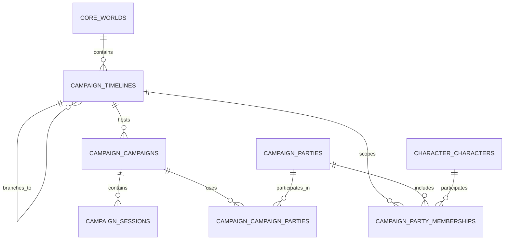
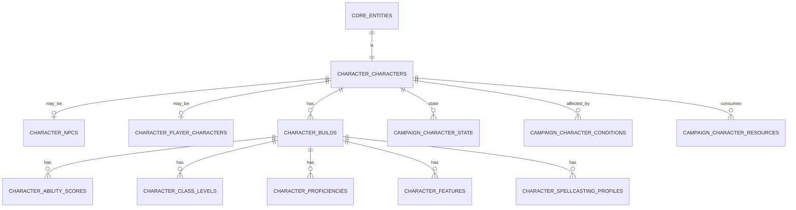
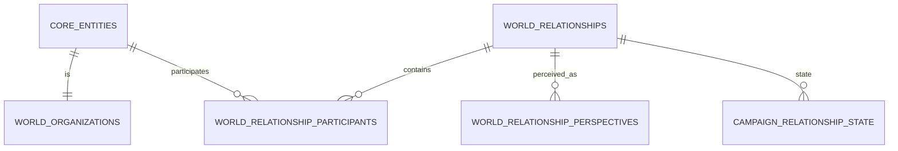
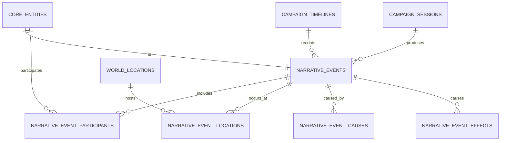
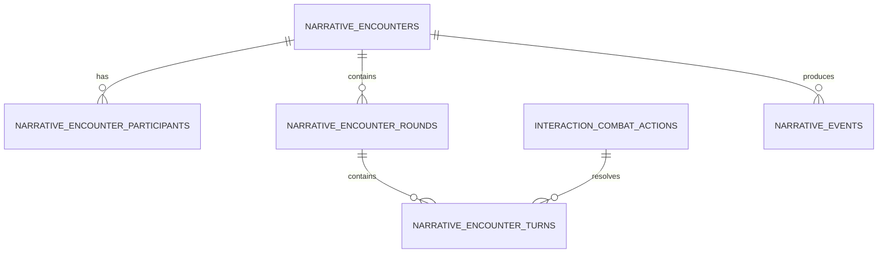
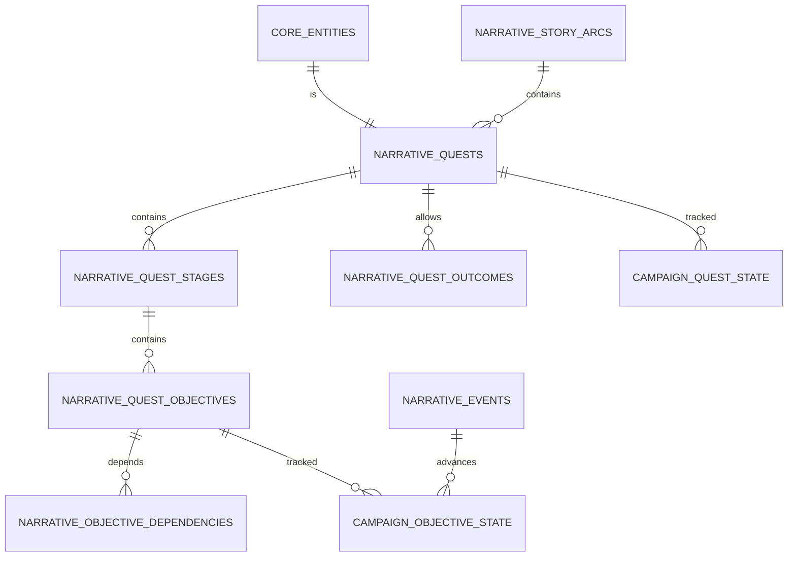
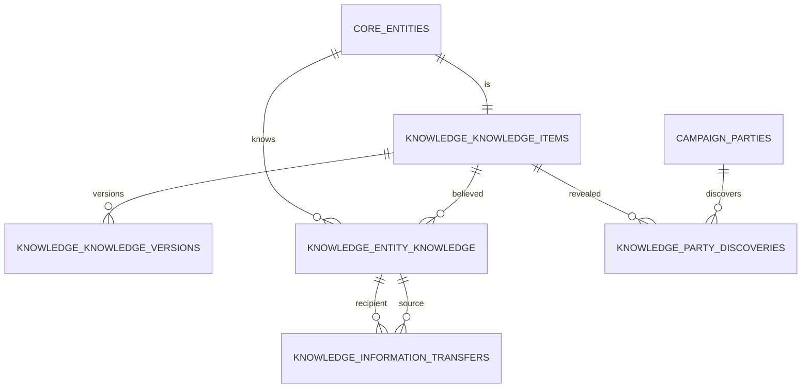
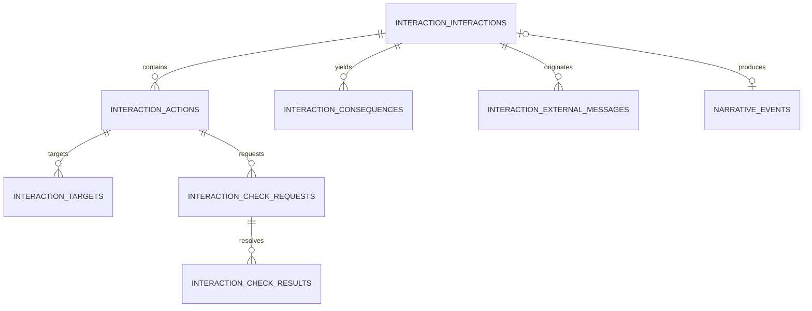
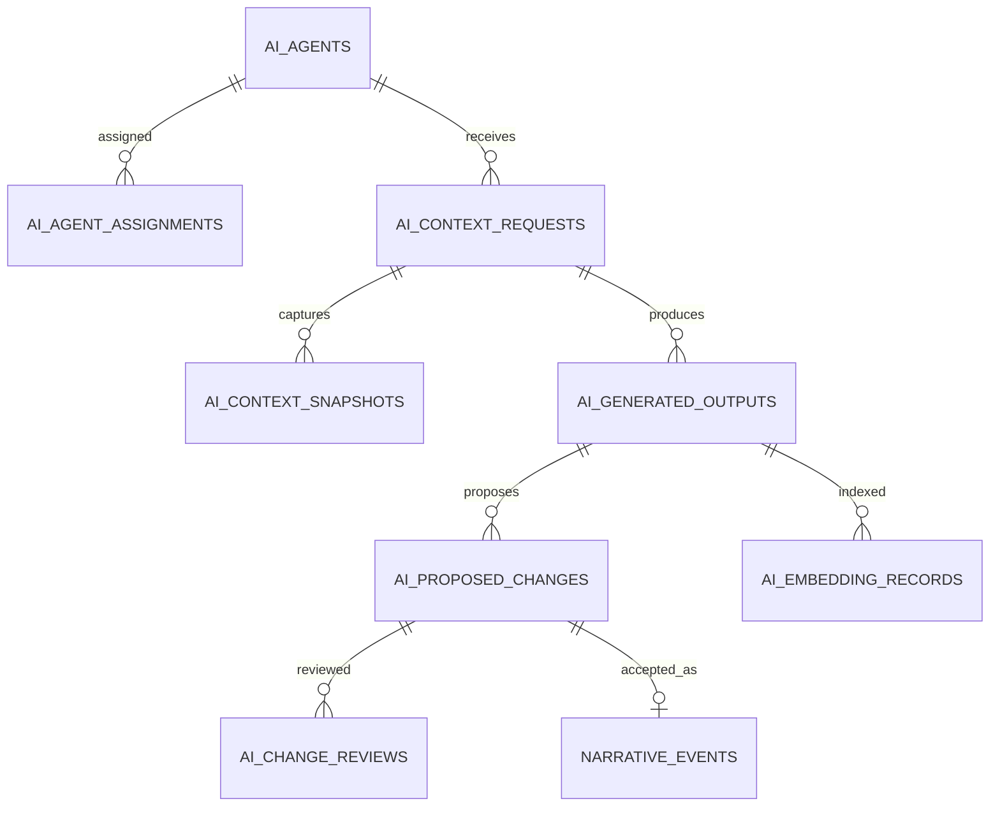

# Persistent World Database Model

## 1. Purpose

This document defines the logical PostgreSQL database model for the D&D AI World Platform. It translates the conceptual model in `docs/DOMAIN_MODEL.md` into a complete set of database domains, primary relationships, ownership rules, and state boundaries.

**This is the authoritative source of truth for database schema and table scope** — which tables exist, what schema they live in, and their key columns. `docs/PLAN.md` is authoritative for implementation *phasing* (which phase builds which table, exit criteria, first-time obligations) but its per-phase "Implement" prose is a working sketch, not the schema record; where the two disagree on a table's existence, name, or column shape, this document wins and PLAN.md should be corrected to match. `README.md`'s schema summary is illustrative only — it exists to give newcomers a feel for the shape of the platform, not to enumerate tables authoritatively.

This is a logical model rather than final migration SQL. Column details may evolve during implementation, but the ownership, identity, inheritance, timeline, event, knowledge, and state rules in this document are architectural constraints.

## 2. Modeling principles

1. PostgreSQL is the authoritative source of structured world state.
2. A world owns persistent entity definitions.
3. A timeline owns evolving world state and history.
4. A campaign organizes play within a timeline but does not normally own copies of world entities.
5. Important world objects use a shared entity identity.
6. Major entity specializations use class-table inheritance.
7. Current state is stored in typed state tables.
8. Events preserve causality and history.
9. Knowledge is separate from objective truth.
10. AI-generated changes are proposals until validated and approved.
11. Rules definitions are separate from world instances.
12. Imports enter staging before becoming canonical records.

## 3. PostgreSQL schema map

| Schema | Primary responsibility |
|---|---|
| `core` | Worlds, entities, names, provenance, tags, calendars, fictional time, common statuses |
| `security` | Users, roles, permissions, campaign access, service identities |
| `rules` | Rulesets and reusable mechanical definitions |
| `character` | Shared character definitions, builds, NPC and PC extensions |
| `world` | Locations, organizations, relationships, item instances, cultures and economies |
| `campaign` | Timelines, campaigns, parties, sessions, mutable effective state |
| `narrative` | Events, encounters, quests, objectives, story arcs and outcomes |
| `knowledge` | Knowledge claims, beliefs, discoveries, expertise and transfers |
| `interaction` | Actions, targets, checks, resolutions and consequences |
| `ai` | Agents, context requests, generated outputs, proposals and embeddings |
| `audit` | Change records, approvals, validation failures and agent activity |
| `import` | Staged extraction, matching, review and promotion |
| `integration` | External identifiers, synchronization state and delivery metadata |

## 4. High-level database diagram

```mermaid
erDiagram
    CORE_WORLDS ||--o{ CORE_ENTITIES : owns
    CORE_WORLDS ||--o{ CAMPAIGN_TIMELINES : contains
    CORE_WORLDS ||--o{ CORE_CALENDARS : uses
    CORE_WORLDS ||--o{ RULES_WORLD_RULESETS : configures

    CORE_ENTITY_TYPES ||--o{ CORE_ENTITIES : classifies
    CORE_SOURCES ||--o{ CORE_ENTITIES : originates
    CORE_CANON_STATUSES ||--o{ CORE_ENTITIES : governs
    CORE_ENTITIES ||--o{ CORE_ENTITY_NAMES : has
    CORE_ENTITIES ||--o{ CORE_ENTITY_TAGS : tagged
    CORE_TAGS ||--o{ CORE_ENTITY_TAGS : applies

    CORE_ENTITIES ||--o| CHARACTER_CHARACTERS : specializes
    CHARACTER_CHARACTERS ||--o| CHARACTER_NPCS : specializes
    CHARACTER_CHARACTERS ||--o| CHARACTER_PLAYER_CHARACTERS : specializes

    CORE_ENTITIES ||--o| WORLD_LOCATIONS : specializes
    WORLD_LOCATIONS ||--o| WORLD_DUNGEONS : specializes
    WORLD_LOCATIONS ||--o| WORLD_DUNGEON_AREAS : specializes
    WORLD_LOCATIONS ||--o| WORLD_SETTLEMENTS : specializes
    WORLD_LOCATIONS ||--o| WORLD_BUILDINGS : specializes

    CORE_ENTITIES ||--o| WORLD_ORGANIZATIONS : specializes
    CORE_ENTITIES ||--o| WORLD_ITEM_INSTANCES : specializes
    CORE_ENTITIES ||--o| NARRATIVE_EVENTS : specializes
    CORE_ENTITIES ||--o| NARRATIVE_QUESTS : specializes
    CORE_ENTITIES ||--o| KNOWLEDGE_KNOWLEDGE_ITEMS : specializes

    CAMPAIGN_TIMELINES ||--o{ CAMPAIGN_CAMPAIGNS : hosts
    CAMPAIGN_CAMPAIGNS ||--o{ CAMPAIGN_SESSIONS : contains
    CAMPAIGN_CAMPAIGNS ||--o{ CAMPAIGN_CAMPAIGN_PARTIES : uses
    CAMPAIGN_PARTIES ||--o{ CAMPAIGN_CAMPAIGN_PARTIES : participates_in
    CAMPAIGN_TIMELINES ||--o{ CAMPAIGN_PARTY_MEMBERSHIPS : scopes
    CAMPAIGN_PARTIES ||--o{ CAMPAIGN_PARTY_MEMBERSHIPS : includes
    CHARACTER_CHARACTERS ||--o{ CAMPAIGN_PARTY_MEMBERSHIPS : joins

    CAMPAIGN_TIMELINES ||--o{ NARRATIVE_EVENTS : records
    CAMPAIGN_SESSIONS ||--o{ NARRATIVE_EVENTS : produces
    NARRATIVE_EVENTS ||--o{ NARRATIVE_EVENT_PARTICIPANTS : has
    CORE_ENTITIES ||--o{ NARRATIVE_EVENT_PARTICIPANTS : participates
    NARRATIVE_EVENTS ||--o{ NARRATIVE_EVENT_EFFECTS : causes

    NARRATIVE_ENCOUNTERS ||--o{ NARRATIVE_ENCOUNTER_PARTICIPANTS : has
    NARRATIVE_ENCOUNTERS ||--o{ NARRATIVE_ENCOUNTER_ROUNDS : contains
    NARRATIVE_ENCOUNTER_ROUNDS ||--o{ NARRATIVE_ENCOUNTER_TURNS : contains
    NARRATIVE_ENCOUNTERS ||--o{ NARRATIVE_EVENTS : produces

    CAMPAIGN_TIMELINES ||--o{ CAMPAIGN_CHARACTER_STATE : owns
    CHARACTER_CHARACTERS ||--o{ CAMPAIGN_CHARACTER_STATE : has
    CAMPAIGN_TIMELINES ||--o{ CAMPAIGN_LOCATION_STATE : owns
    WORLD_LOCATIONS ||--o{ CAMPAIGN_LOCATION_STATE : has
    CAMPAIGN_TIMELINES ||--o{ CAMPAIGN_ITEM_STATE : owns
    WORLD_ITEM_INSTANCES ||--o{ CAMPAIGN_ITEM_STATE : has

    NARRATIVE_QUESTS ||--o{ NARRATIVE_QUEST_STAGES : contains
    NARRATIVE_QUEST_STAGES ||--o{ NARRATIVE_QUEST_OBJECTIVES : contains
    CAMPAIGN_TIMELINES ||--o{ CAMPAIGN_QUEST_STATE : owns
    NARRATIVE_QUESTS ||--o{ CAMPAIGN_QUEST_STATE : tracks
    NARRATIVE_QUEST_OBJECTIVES ||--o{ CAMPAIGN_OBJECTIVE_STATE : tracks

    KNOWLEDGE_KNOWLEDGE_ITEMS ||--o{ KNOWLEDGE_ENTITY_KNOWLEDGE : believed
    CORE_ENTITIES ||--o{ KNOWLEDGE_ENTITY_KNOWLEDGE : knows
    CAMPAIGN_TIMELINES ||--o{ KNOWLEDGE_ENTITY_KNOWLEDGE : scopes

    WORLD_RELATIONSHIPS ||--o{ WORLD_RELATIONSHIP_PARTICIPANTS : contains
    CORE_ENTITIES ||--o{ WORLD_RELATIONSHIP_PARTICIPANTS : participates
    CAMPAIGN_TIMELINES ||--o{ CAMPAIGN_RELATIONSHIP_STATE : owns
    WORLD_RELATIONSHIPS ||--o{ CAMPAIGN_RELATIONSHIP_STATE : tracks

    INTERACTION_INTERACTIONS ||--o{ INTERACTION_TARGETS : targets
    INTERACTION_INTERACTIONS ||--o{ INTERACTION_CHECK_REQUESTS : requests
    INTERACTION_CHECK_REQUESTS ||--o{ INTERACTION_CHECK_RESULTS : resolves
    INTERACTION_INTERACTIONS ||--o{ NARRATIVE_EVENTS : produces

    AI_AGENTS ||--o{ AI_PROPOSED_CHANGES : proposes
    AI_PROPOSED_CHANGES ||--o{ AI_CHANGE_REVIEWS : reviewed
    AI_PROPOSED_CHANGES ||--o| NARRATIVE_EVENTS : accepted_as
```



## 5. Core identity and provenance

### 5.1 `core.worlds`

Represents one persistent fictional setting.

Key columns:

- `world_id UUID PK`
- `name TEXT`
- `slug TEXT`
- `default_calendar_id UUID NULL`
- `default_ruleset_id UUID FK NULL` — added in Phase 4
- `lifecycle_status_id UUID FK`
- `created_at TIMESTAMPTZ`
- `updated_at TIMESTAMPTZ`

A world owns entity definitions, calendars, timelines, and world-specific configuration.

### 5.2 `core.entity_types`

Defines the allowed entity type hierarchy.

Key columns:

- `entity_type_id UUID PK`
- `code TEXT UNIQUE`
- `display_name TEXT`
- `parent_entity_type_id UUID NULL`
- `required_subtype_table TEXT`
- `is_abstract BOOLEAN`

The service layer and database validation functions must ensure that an entity type matches its required subtype row.

### 5.3 `core.entities`

Provides stable identity for important world objects.

Key columns:

- `entity_id UUID PK`
- `world_id UUID FK`
- `entity_type_id UUID FK`
- `canonical_name TEXT`
- `summary TEXT NULL`
- `canon_status_id UUID FK`
- `lifecycle_status_id UUID FK`
- `source_id UUID FK NULL`
- `created_by_user_id UUID NULL`
- `created_at TIMESTAMPTZ`
- `updated_at TIMESTAMPTZ`
- `archived_at TIMESTAMPTZ NULL`

Entity rows are definition records. Timeline-specific conditions do not belong here.

### 5.4 Names, aliases and tags

- `core.entity_names`
- `core.name_types` — lookup for `entity_names.name_type_id` (canonical, common, former, translated, secret, mistaken, …)
- `core.tags`
- `core.entity_tags`

`entity_names` supports canonical, common, former, translated, secret and mistaken names, typed through `name_types` rather than an enum. Names may optionally be scoped to a same-world `campaign.timeline_id` when a name only exists after a historical event; a `NULL` timeline is a global name.

### 5.5 Sources and canon

- `core.sources`
- `core.source_types` — lookup for `sources.source_type_id` (book, session note, homebrew document, import, …)
- `core.source_documents`
- `core.canon_statuses`
- `core.lifecycle_statuses`

Every imported or generated fact should retain provenance. Canon status and operational lifecycle status are separate concepts.

Example:

- Canon status: `canon`
- Lifecycle status: `active`

or

- Canon status: `proposed`
- Lifecycle status: `pending_review`

### 5.6 Calendars and fictional time

- `core.calendars`
- `core.calendar_months`
- `core.world_time_precisions`
- `core.world_times`

A world may define several calendars (a common reckoning and an elvish one, say), each with `calendar_id`, `world_id FK`, `code`, `days_per_week`, and an `epoch_label`. `calendar_months` orders a calendar's months by `month_number` with a `day_count` each.

`world_times` is the concrete representation of a point in fictional chronology: `world_time_id PK`, `world_id FK`, an optional `calendar_id FK` and calendar-aware `year`/`month_number`/`day`/`hour`/`minute` fields (each cascading a NOT NULL requirement onto the field above it — a day needs a month, a month needs a year), a `world_time_precision_id FK` (exact, partial, approximate, narrative — how precisely this moment is known), an optional narrative `label` for moments with no calendar date, and a `sort_key BIGINT NOT NULL` used to order and range-compare moments regardless of calendar. Every fictional-time interval elsewhere in the schema (party membership, sessions, event ordering) is built from `world_times` foreign keys plus a derived range over `sort_key`, never from calendar fields directly — see [ADR 0010](../adr/0010-use-sort-key-ranges-for-fictional-time-intervals.md).

## 6. World, timeline, campaign and session



### 6.1 `campaign.timelines`

Key columns:

- `timeline_id UUID PK`
- `world_id UUID FK`
- `name TEXT`
- `parent_timeline_id UUID NULL`
- `branch_event_id UUID FK NULL` — added by Phase 6 revision 058, `REFERENCES narrative.events(event_id) ON DELETE RESTRICT`
- `branch_world_time_id UUID FK NULL`
- `is_primary BOOLEAN`
- `lifecycle_status_id UUID FK`

A branch inherits parent history only through its branch point. Effective-state queries must never include parent events after that point.

`branch_event_id` is nullable — a branch may exist with only its world-time point (Phase 3 shape) before being given a causal event, or may never get one. When set, `campaign.enforce_timeline_branch()` (extended by revision 058, not a second trigger — see §26's Phase 6 notes) validates it belongs to `parent_timeline_id` and occurs at or before `branch_world_time_id`'s `sort_key`.

A root has neither `parent_timeline_id` nor branch-point fields. A child requires both `parent_timeline_id` and `branch_world_time_id`; the latter must belong to the shared world. `campaign.effective_events(timeline_id)` (revision 059) is the branch-aware effective-history query: a recursive walk of `parent_timeline_id` returning the timeline's own full history plus each ancestor's history bounded by the point the next timeline down actually branched off it — see §12 and §26.

### 6.2 `campaign.campaigns`

Key columns:

- `campaign_id UUID PK`
- `timeline_id UUID FK` — immutable once set (Phase 4 corrections)
- `name TEXT`
- `ruleset_version_id UUID FK` — added in Phase 4, added as `ruleset_id` (pinning a ruleset family) and renamed to `ruleset_version_id` (pinning a specific version) by a Phase 4 corrections revision, for reproducibility: a campaign's rules configuration should not silently change if its ruleset family later gains a second current version
- `lifecycle_status_id UUID FK`
- `started_at TIMESTAMPTZ NULL`
- `ended_at TIMESTAMPTZ NULL`

`ruleset_version_id` must be allowed for the campaign's world (`rules.world_rulesets`, resolved through the pinned version's ruleset family) — enforced by trigger.

### 6.3 Parties and membership

- `campaign.parties`
- `campaign.party_memberships`
- `campaign.campaign_parties`

`campaign.parties` holds a stable party identity within a world, including `party_id UUID PK` and `world_id UUID FK`. `campaign.campaign_parties` associates that identity with one or more campaigns. Membership is mutable timeline state rather than a property of the party definition, so `campaign.party_memberships` includes:

- `party_membership_id UUID PK`
- `timeline_id UUID FK`
- `party_id UUID FK`
- `member_entity_id UUID FK`
- `effective_from_world_time_id UUID FK`
- `effective_to_world_time_id UUID FK NULL`
- `effective_period INT8RANGE`

The endpoints are half-open `[from, to)` positions in fictional chronology. The range is derived from the endpoint rows' `sort_key` values and is used by a GiST exclusion constraint over `(timeline_id, party_id, member_entity_id, effective_period)` to reject overlaps. The upper bound is unbounded while membership is current. A trigger enforces world agreement, endpoint ordering, and agreement between the endpoint IDs and stored range.

Until `character.characters` exists in Phase 4, `member_entity_id` references `core.entities`; Phase 4 adds enforcement that the entity is a character. Until `narrative.events` exists in Phase 6, join/leave event references are omitted rather than stored as unconstrained UUIDs.

### 6.4 Sessions

`campaign.sessions` organizes a period of play and is not itself the owner of permanent world state.

Key columns:

- `session_id UUID PK`
- `campaign_id UUID FK`
- `session_number INTEGER`
- `title TEXT`
- `lifecycle_status_id UUID FK`
- `start_world_time_id UUID FK NULL`
- `end_world_time_id UUID FK NULL`
- `started_at TIMESTAMPTZ NULL`
- `ended_at TIMESTAMPTZ NULL`
- `summary TEXT NULL`
- `source_id UUID FK NULL`
- `world_time_period INT8RANGE NULL` — added by a Phase 4 corrections revision

A session carries both real-world time (`started_at`/`ended_at`, when the table actually played) and fictional time (`start_world_time_id`/`end_world_time_id`, where the story was) at once — they answer different questions and neither substitutes for the other. `world_time_period` is derived from the two world-time endpoints' `sort_key` values the same way `party_memberships.effective_period` is (half-open `[start, end)`, unbounded upper when open-ended, `NULL` when unscheduled — [ADR 0010](../adr/0010-use-sort-key-ranges-for-fictional-time-intervals.md)), but unlike party memberships, sessions carry **no exclusion constraint**: overlapping fictional-time spans across sessions (a flashback, two sessions each covering an overlapping stretch of story time) are legitimate. The range makes the interval queryable; it does not make overlap invalid.

## 7. Character model



### 7.1 Shared character definition

`character.characters` contains identity-level mechanical references such as species, size and origin. NPCs and player characters both extend it. Potential later subtypes (companions, familiars, summons, special creature actors) reuse `character.characters` when they need full character mechanics, rather than growing a parallel hierarchy.

- `character.characters` — `character_id UUID PK/FK` to `core.entities`; `species_id UUID FK` to `rules.species`, which must be allowed for the character's own world (`rules.world_rulesets`, enforced by trigger since a Phase 4 corrections revision); `size_category TEXT` (a fixed CHECK vocabulary, not a lookup table — the six D&D size categories don't vary by ruleset); `origin_location_id UUID FK NULL` to `world.locations`, added by Phase 5 revision 042 once locations existed, same-world enforced by trigger
- `character.character_descriptions` — free-text background, appearance, and other prose that doesn't drive mechanics
- `character.character_languages` — reusable character-to-language association. A character may know languages from multiple ruleset families, but every referenced language's family must be present in the character's world's `rules.world_rulesets` allow-list, enforced by trigger (revision 037), same shape as species/build/condition/resource (revision 029) and inheriting the same concurrency-safe locking (revision 035) via the shared `rules.ruleset_allowed_for_world()` helper.
- `character.character_senses`
- `character.character_movements`
- `character.character_religious_affiliations` — personal belief, distinct from organizational membership or employment (§10.3)

### 7.2 NPC extension

- `character.npcs`
- `character.npc_portrayal_profiles` — versioned: speech style, voice, vocabulary, mannerisms, emotional baseline, conversational habits, topics avoided, disclosure boundaries, roleplay guidance
- `character.npc_characteristics`
- `character.npc_goals` — may be world-level or timeline-specific; each goal has an owner, description, type, priority, status, target entities, progress, secrecy/visibility policy, initiating event, completion/failure event, and dependencies
- `character.npc_routines`
- `character.npc_routine_steps`
- `character.npc_preferences`
- `character.npc_boundaries` — hard limits on portrayal distinct from `npc_disclosure_rules`' softer information-sharing policy
- `character.npc_disclosure_rules`
- `character.npc_agent_assignments`

Portrayal defaults (`npc_portrayal_profiles`, `npc_characteristics`, `npc_preferences`, `npc_boundaries`, `npc_disclosure_rules`) are world definitions. Current mood, trust, and goal progress are timeline-scoped and live in typed state (`campaign.npc_emotional_state`, `campaign.npc_goal_state` — §16), not here — this table holds what an NPC generally *is*, not what is currently true of them in a given timeline.

The AI context service assembles prompts from the current portrayal profile and current state rather than relying on one unstructured personality prompt.

### 7.3 Player character extension

- `character.player_characters`
- `character.character_controllers`
- `security.character_permissions`

A player character can participate in multiple campaigns and timelines. Ownership does not duplicate the character definition. `character_controllers` supports player-controlled, GM-controlled, and AI-controlled NPCs, plus temporary control handoffs (a player temporarily running a companion); assignments are campaign- or timeline-aware.

### 7.4 Character builds

- `character.character_builds` — `character_id UUID FK`, `ruleset_version_id UUID FK` (must be allowed for the character's own world, enforced by trigger), `label TEXT NULL`. No `is_current` column: which build is active on a given timeline is timeline state (`campaign.character_state.character_build_id`, §17), not a property of the build, since a character may use different builds on different timelines after a branch — a global "current" flag couldn't represent that. A character may have any number of builds.
- `character.character_ability_scores` — one row per `(build, ability)`; the ability's ruleset version must match the build's
- `character.character_class_levels` — one row per `(build, class)`, so a build may hold levels in more than one class (multiclassing); an optional `subclass_id` must belong to the same class; the class's ruleset version must match the build's
- `character.character_proficiencies` — exactly one of `skill_id`, `saving_throw_ability_id`, or a free-text `target_label` (weapon/armor/tool categories with no dedicated lookup) per row, and that one must be the kind `proficiency_type_id` requires (`rules.proficiency_types.target_kind`); a build cannot hold the same semantic proficiency twice; the proficiency type itself, and whichever target is a rule reference, must match the build's ruleset version (revision 032 closed the proficiency-type gap)
- `character.character_features` — a granted `rules.features` row per build; ruleset version must match
- `character.character_spellcasting_profiles` — an optional `class_id` plus a required `spellcasting_ability_id`; both, when set, must match the build's ruleset version
- `character.character_known_spells` / `character.character_prepared_spells` — independent associations (not one a subset of the other — whether "prepared" is even meaningful varies by class); each spell's ruleset version must match its profile's build

Builds are versioned definitions. Current hit points, conditions, spell-slot use and other temporary resources belong to campaign timeline state (§16), not the build. Ruleset-version cross-checks are enforced by triggers because a CHECK cannot compare across tables. Revision 033 made every parent side of these cross-version invariants (and `character_builds`/`character_spellcasting_profiles`'s own identity columns) immutable, so a parent edit can no longer invalidate an already-valid child row — see §8's closing paragraphs for the full policy.

## 8. Rules model

Rules data is reusable and ruleset-scoped. All rule definitions must identify their ruleset and version; homebrew definitions use the same tables rather than a separate schema. Every table below carries a nullable `source_id UUID FK` (`core.sources`) and a required `canon_status_id UUID FK` (`core.canon_statuses`, defaulted to `'canon'` for officially authored content and overridable for homebrew or proposed content). `source_id` is nullable and uses `ON DELETE SET NULL` for every origin — official content legitimately has no single authored source row, so presence is not database-enforced. There is also no schema concept of content *origin* (AI-generated, imported, homebrew, ...) independent of canon status today, and inventing one to key a structural check off of would be new domain vocabulary ahead of the phase that needs it. The policy resolved in the Phase 4 closeout is that source presence for AI-generated/imported/homebrew content is an **application-command obligation**, not a database constraint — the command handler that creates such content is responsible for requiring and validating a source, with its own tests, once that command exists (no `commands/` layer exists yet — see §2 of this document and CLAUDE.md's "don't build ahead of the phase that needs it"). Do not describe nullable `source_id` as database-enforced provenance in code or docs.

Every rule-content row's `ruleset_version_id` (or, for `rules.subclasses`/`rules.features`, the class/subclass/species association it is scoped by) is immutable once set, using the same `core.enforce_immutable_columns()` trigger revision 030 introduced for world/timeline/party/campaign scope — a cross-version-consistency trigger only re-validates a *child* row at that child's own insert/update, so the *parent* row's identity must not change out from under already-valid children instead of needing a transactional revalidate-and-rebuild path. Revisions 033 and 036 implement this for every rule-definition table, including `rules.creature_types`, `rules.languages`, and `rules.feats` (no cross-version invariant reads them as a parent yet, but the identity policy applies regardless of whether something references them today). `character.character_builds.character_id`/`ruleset_version_id` and `character.character_spellcasting_profiles.character_build_id` are immutable for the same reason. Associations that are not identity (e.g. `rules.classes.primary_ability_id`, `rules.skills.ability_id`, `rules.spells.damage_type_id`) remain mutable — their owning row's trigger re-checks the relationship when that row changes.

Primary tables:

- `rules.rulesets` — `ruleset_id UUID PK`, `code TEXT UNIQUE`, `display_name TEXT`. Edition-neutral (e.g. code `dnd5e`, display name "D&D 5e") — a specific edition or revision (e.g. "2024") is recorded on `rules.ruleset_versions.version_label`/`description`, not here (revision 034)
- `rules.ruleset_versions` — `ruleset_version_id UUID PK`, `ruleset_id UUID FK`, `version_label TEXT`, `is_current BOOLEAN` (at most one per ruleset)
- `rules.world_rulesets` — a pure allow-list associating a world with the ruleset families it allows (`world_id`, `ruleset_id` composite PK). Identifying the *default* is `core.worlds.default_ruleset_id UUID FK` alone (§5.1) — `world_rulesets` carries no `is_default` column of its own; a Phase 4 corrections revision removed one after finding the two could disagree. The revision-031 trigger prevents removing or repointing an association while it is a world's default, or while a campaign, character species, character build, applied condition, or tracked resource in that world still depends on it, and returns `NEW` on a permitted update and `OLD` on a permitted delete within one transaction. Revision 035 closes the remaining `READ COMMITTED` race between that check and concurrent dependency creation: every covered dependency-creation path takes a `FOR SHARE` lock on the specific `world_rulesets` row it depends on, which a concurrent removal or repoint (needing an exclusive lock on the same row) must wait behind — see that revision's docstring for why a single, always-same-row lock cannot deadlock. Revision 037 (second post-closeout review) extends the same still-in-use check and the same concurrency-safe path to character languages, closing the last uncovered dependency category — see §7.1.
- `rules.abilities`
- `rules.skills` — governing `ability_id` must share the skill's ruleset version
- `rules.species`
- `rules.classes` — optional `primary_ability_id` must share the class's ruleset version
- `rules.subclasses` — scoped to a `class_id`, not directly to a ruleset version; must share its class's version
- `rules.features` — independently nullable `class_id`/`subclass_id`/`species_id`, each of which (when set) must share the feature's ruleset version
- `rules.feats`
- `rules.spells` — optional `damage_type_id` must share the spell's ruleset version; `code` follows the same `^[a-z][a-z0-9_]*$` format as every sibling table
- `rules.conditions`
- `rules.creature_types`
- `rules.damage_types`
- `rules.languages`
- `rules.proficiency_types` — `target_kind TEXT` (`skill` / `saving_throw` / `free_text`) added by a Phase 4 corrections revision, naming which `character.character_proficiencies` column a proficiency of this type must set
- `rules.resource_definitions`

`rules.item_definitions` is listed here as a rule-definition concept (§11) but is deferred to Phase 9, which owns both item definitions and item instances together.

## 9. Location and dungeon model

```mermaid
erDiagram
    CORE_ENTITIES ||--|| WORLD_LOCATIONS : is
    WORLD_LOCATIONS ||--o{ WORLD_LOCATIONS : contains
    WORLD_LOCATIONS ||--o| WORLD_DUNGEONS : may_be
    WORLD_LOCATIONS ||--o| WORLD_DUNGEON_AREAS : may_be
    WORLD_DUNGEON_AREAS ||--o{ WORLD_AREA_CONNECTIONS : from
    WORLD_DUNGEON_AREAS ||--o{ WORLD_AREA_CONNECTIONS : to
    WORLD_DUNGEON_AREAS ||--o{ WORLD_AREA_FEATURES : contains
    WORLD_DUNGEON_AREAS ||--o{ WORLD_AREA_HAZARDS : contains
    WORLD_DUNGEON_AREAS ||--o{ WORLD_AREA_INTERACTABLES : contains
    WORLD_LOCATIONS ||--o{ CAMPAIGN_LOCATION_STATE : state
    WORLD_AREA_CONNECTIONS ||--o{ CAMPAIGN_AREA_CONNECTION_STATE : state
    WORLD_AREA_FEATURES ||--o{ CAMPAIGN_AREA_FEATURE_STATE : state
    WORLD_AREA_HAZARDS ||--o{ CAMPAIGN_HAZARD_STATE : state
```

### 9.1 Location hierarchy

`world.locations` contains a nullable `parent_location_id` for containment. General semantic relationships (adjacency, claims, portals, trade routes, disputed control) use the universal relationship model (§10) instead of dedicated columns.

Built in Phase 5 (revision 038): `world.locations` is the class-table-inheritance root. Leaf location kinds with no structured data of their own beyond "is a location" — plane, continent, nation, region, district, geographic_feature, and **realm** (added by revision 047, closing an oversight in revision 038 — DOMAIN_MODEL.md §9.1 lists it and nothing argues for its removal) — are plain `core.entity_types` rows under `location`, the same pattern `character.characters` already uses for types with no dedicated apparatus. Two kinds get their own subtype table: `world.settlements` (`population` only — government, factions, and economy are later-phase concepts; districts are plain child locations; control/damage state is timeline state) and `world.buildings` (`building_use TEXT`, free text pending a documented vocabulary).

`parent_location_id` is mutable (legitimate reparenting — moving a building to a different district — is a real operation). Revision 044 added ancestry validation and a second trigger that re-validates the dungeon-area-must-have-a-dungeon-parent rule whenever `parent_location_id` changes directly; revision 049 serialized containment changes per world; revision 054 replaced the depth-bounded walk with PostgreSQL's native `CYCLE` clause for real repeated-node detection, keeping the depth bound only as a resource cap that now raises instead of silently truncating; revision 056 added a per-child-location advisory lock so inserting a `world.dungeon_areas` row cannot race with a direct change to that same child's `parent_location_id` — see [PHASE5_VERIFICATION.md § Fourth exit review corrections](../PHASE5_VERIFICATION.md#fourth-exit-review-corrections-2026-08-03).

### 9.2 Dungeon structure

Built in Phase 5 (revision 039):

- `world.dungeons` — `danger_level` (`core.rating_1_10`, optional)
- `world.dungeon_areas` — `area_type`, `dimensions`, `environmental_properties`, all free text; a trigger requires `parent_location_id` to reference a `dungeon`-typed location
- `world.connection_types` — lookup, seeded: door, secret_door, passage, portal, stair, ladder, pit, bridge, teleportation_link
- `world.area_connections` — links two dungeon areas; requires the same world but deliberately *not* the same dungeon (a teleportation link may cross dungeons); `is_hidden` is a structural fact about the connection, never party knowledge; `from_dungeon_area_id`/`to_dungeon_area_id` are immutable once set (revision 044 — an endpoint has no legitimate "move" operation, the same reasoning revision 030 applied to `core.entities.world_id` and similar identity columns)
- `world.area_features`, `world.area_hazards`, `world.area_interactables` — plain children of a dungeon area, not entities (modeling principle 5 — a lever or bloodstain has no independent identity the way an NPC or dungeon does); each carries `is_hidden`; `dungeon_area_id` is immutable once set (revision 044, same reasoning as the connection endpoints above)

Area connections support normal doors, secret doors, passages, portals, stairs/ladders, pits, bridges, one-way routes (`is_one_way`), and **conditional routes** (`is_conditional`/`condition_description`, added by revision 047). Phase 6 revision 064 added the machine-checkable half for the check-gated case: `required_check_kind`/`required_ability_id`/`required_skill_id`/`required_difficulty` (all nullable — only set when the condition is simply "pass a check," as opposed to quest-gated or state-gated) plus `world.conditional_route_requirement_satisfied(area_connection_id, check_result_id)`, a pure read-only function a command can call to decide whether a given check result satisfies a given route's requirement. It deliberately does not mutate `campaign.area_connection_state` itself — rule 6 requires that to go through a causal event via the command layer (Phase 6 increment 5, not yet built); see §27. `world.area_spawn_definitions` (named in earlier drafts of this section and in PLAN.md §9.2) was **not built** in Phase 5 — no creature-instance or stat-block model exists anywhere in this schema yet, and Phase 9 (encounters) is the natural first consumer; building it now would either reference nothing meaningful or invent encounter-generation scope ahead of the phase that needs it.

Definitions describe what can exist. Timeline state (§17) describes what is currently open, destroyed, active, occupied, or depleted — kept mutation-safe by the five `campaign.*_state` tables' own `updated_at` triggers (revision 046, closing a gap where revision 040 declared the column but never attached `core.set_updated_at()`).

### 9.3 Discovery versus existence

A hidden feature exists independently of whether a party knows about it. Do not store `is_discovered` as a global property of a feature — discovery belongs to the knowledge model (§15) and may differ by party or character.

Phase 5 proves this structurally: `world.area_connections.is_hidden` (and the equivalent column on features/hazards/interactables) says the object was built to be concealed, never who has found it. Discovery itself is recorded in `knowledge.party_discoveries`, pulled forward from Phase 7 for this reason — see §15's note and §26.

## 10. Organizations and relationships



### 10.1 Universal relationships

- `world.relationship_types` — lookup: parent-of, member-of, controls, owned-by, reveres, capital-of, connected-to, …
- `world.relationships`
- `world.relationship_participants`
- `world.relationship_perspectives`

Relationships may connect any entities — an NPC parent of another NPC, an NPC member of an organization, an organization controlling a settlement, an item owned by an NPC, a religion revered by a city, a dungeon area connected to another. The base relationship row stores shared facts and history; perspectives store how each participant perceives the relationship (affinity, trust, respect, fear, obligation, emotional tone, private interpretation) — the objective/subjective split rule 5 of §21 depends on.

### 10.2 Specialized relationship subtypes

Class-table inheritance for relationship details that need typed columns beyond the generic participant/perspective shape:

- `world.organization_memberships`
- `world.employment_relationships`
- `world.ownership_relationships`
- `world.family_relationships`
- `world.political_relationships`

### 10.3 Organizations

Hierarchy:

```text
core.entities
    -> world.organizations
        -> world.businesses
        -> world.governments
        -> world.religious_organizations
        -> world.military_units
        -> world.political_factions
```

An organization row stores its type, founded/dissolved world times, headquarters, parent organization, public description, internal description, and status. Membership is a specialized relationship (§10.2), supporting multiple roles, rejoining, secret membership, ranks, and historical periods — it is not a separate ad hoc table.

### 10.4 Religion distinction

A religion is a belief system; a church, temple, order, or cult is an organization that may serve it. Conflating the two loses the distinction between believing something and belonging to (or being employed by) an institution built around it.

- `world.religions`
- `world.religious_organizations`
- `character.character_religious_affiliations` — personal belief, kept separate from organizational rank (`world.organization_memberships`) and employment (`world.employment_relationships`)

## 11. Item model

Rules item definitions are distinct from world item instances, which are distinct again from the state and ownership of a particular instance.

Primary tables:

- `rules.item_definitions` — reusable mechanical definitions (deferred to Phase 9)
- `world.item_instances` — particular objects in the world
- `world.item_containers`
- `campaign.item_state` — location, charges, damage/condition, equipped state
- `campaign.item_ownership` — who owns an instance
- `campaign.inventory_entries` — who currently possesses/carries it, and where (a container, a location) — distinct from ownership, since a borrowed or stolen item is possessed without being owned
- `campaign.item_attunements`
- `knowledge.item_identification` — identification level and which hidden properties are known to whom

Examples:

- `Longsword`: rules definition
- `Blade of Saint Orra`: world entity plus item instance
- Current possessor, charges and damage: timeline state (`item_state`, `inventory_entries`)
- True magical properties known by a character: knowledge state (`item_identification`)

## 12. Events and effects



Primary tables — all built by Phase 6 revision 057:

- `narrative.events`
- `narrative.event_participants`
- `narrative.event_locations`
- `narrative.event_causes`
- `narrative.event_effects`
- `narrative.event_observations`

An event belongs to a timeline and may reference a campaign and session when produced during play (`timeline_id` `NOT NULL`; `campaign_id`/`session_id` nullable, cross-checked by trigger to form a consistent timeline → campaign → session chain when set). Title, summary, source, and recording time are inherited from `core.entities` rather than duplicated on the subtype row — `narrative.events` adds only `timeline_id`/`campaign_id`/`session_id`, `event_type_id`, `event_status_id` (`draft`/`recorded`/`voided`/`corrected`), `world_time_id` (the effective world time — `core.world_times`' own label/precision support covers "approximate period"), and free-form `details`.

Effects (`narrative.event_effects`) identify a target, affected component, old value, new value, effective world time, and application status (`pending`/`applied`/`failed`/`skipped`); common effects should also update typed state tables in the same transaction (rule 6). The target is at most one of `target_entity_id` or one of the four dungeon-domain non-entity columns (`target_area_connection_id`/`_feature_id`/`_hazard_id`/`_interactable_id`) — the same single-typed-target pattern `knowledge.knowledge_items` established in Phase 5, reused rather than reinvented; zero targets is allowed for an effect with no single typed target. `previous_value`/`new_value` are `JSONB`.

`narrative.event_causes` links an event to exactly one of: a prior event (`cause_event_id`), a recorded interaction (`cause_interaction_id`, added by revision 062 once `interaction.interactions` existed — see §16, §27), or a free-text `cause_description` for undocumented decisions/conditions (a GM ruling, an ambient world condition) — the same placeholder pattern Phase 5 used for `knowledge.entity_knowledge.learned_source`, now narrowed to only the genuinely undocumented case.

Not every attack roll needs a permanent world event — high-volume tactical actions live in interaction and encounter logs (§16, §13) instead. Promote meaningful outcomes to narrative events: a character is killed, a ward is disabled, a room is flooded, an artifact is destroyed, an NPC is rescued, a faction becomes hostile, a quest stage is completed.

## 13. Encounters and combat



Primary tables:

- `narrative.encounters`
- `narrative.encounter_participants`
- `narrative.encounter_rounds`
- `narrative.encounter_turns`
- `interaction.combat_actions`

FoundryVTT may remain the detailed tactical authority during live combat; the database captures synchronized state and meaningful outcomes rather than duplicating every tactical decision. Persist enough to support initiative and turn order, current HP and conditions, resource consumption, participants, defeated/escaped/surrendered/captured outcomes, an encounter summary, and the resulting narrative events.

## 14. Quest and story model



Primary tables:

- `narrative.story_arcs`
- `narrative.quests`
- `narrative.quest_stages`
- `narrative.quest_objectives`
- `narrative.objective_dependencies`
- `narrative.quest_participants`
- `narrative.quest_rewards`
- `narrative.quest_outcomes`
- `campaign.quest_state`
- `campaign.objective_state`

Quest definitions describe possible progression; timeline or campaign state records actual progression. Objectives support required/optional/hidden status, dependencies, target entities, quantities, completion-rule metadata, visibility policies, and automatic or GM-confirmed completion. Events may advance objectives through explicit mappings or rule evaluation (entering an area completes a travel objective, activating three pylons completes a restoration objective, an NPC death fails a protection objective); every automated transition must record the triggering event.

## 15. Knowledge model



Primary tables:

- `knowledge.knowledge_items` — **built in Phase 5** (revision 041), pulled forward from Phase 7 to satisfy that phase's "hidden connections remain distinct from party knowledge" exit criterion; see §26. Entity-rooted; `truth_status_id`/`knowledge_type_id` lookups; a single nullable typed subject reference (`subject_entity_id` or one of `subject_area_connection_id`/`_feature_id`/`_hazard_id`/`_interactable_id`, at most one set) rather than the plural `knowledge_item_subjects` junction the conceptual model implies — Phase 7 should promote this if a knowledge item genuinely needs more than one subject.
- `knowledge.knowledge_versions` — deferred to Phase 7 (rumor mutation/distortion; nothing in Phase 5 needed it)
- `knowledge.entity_knowledge` — **built in Phase 5** (revision 041); references a bare `knowledge_item_id`, not a version, since nothing to version exists yet
- `knowledge.information_transfers` — deferred to Phase 7
- `knowledge.expertise_domains` — lookup for `character_expertise.expertise_domain_id`; deferred to Phase 7
- `knowledge.character_expertise` — deferred to Phase 7
- `knowledge.party_discoveries` — the discovery *record*: when and how a party learned a knowledge item. **Built in Phase 5** (revision 041); recipient is exactly one of `party_id` or `knower_entity_id` (partial unique indexes per recipient kind). Public/regional discovery is not yet representable — see `public_knowledge` below.
- `knowledge.public_knowledge` — what is known publicly within a location or region, independent of any one knower; deferred to Phase 7

`campaign.party_knowledge` (§17) is the related but distinct *current effective view* of what a party presently knows — typed state, derived from discoveries and transfers, kept separate from the discovery log the same way `campaign.character_state` is kept separate from the events that produced it. Not yet built.

A knowledge item represents a claim; truth status, awareness, belief, confidence, interpretation, and willingness to share are distinct fields. Entity knowledge stores what a knower believes, its confidence, interpretation, source, and willingness to share — a false belief is valid game data and must not be overwritten merely because the canonical truth is known to the GM. Discovery may be recorded for an individual character, a party, an organization, or the public within a location or region. Information transfers record source knower, recipient, transferred knowledge, modified interpretation, the causing interaction or event, and world time — this is what supports rumor propagation and misinformation.

**Explicit Phase 5 / Phase 7 boundary** (exit review finding — the pulled-forward slice must not quietly grow into the rest of Phase 7's scope):

- **Temporal validity of knowledge items is NOT built.** `knowledge.knowledge_items` has no `effective_from_world_time_id`/`effective_to_world_time_id` (or equivalent) — a knowledge item cannot yet express "this was true until the tower fell" or "this only becomes relevant after X." Phase 7 owns adding that, likely following the same ADR 0010 shape used everywhere else in the schema.
- **Discovery source/provenance was a free-text placeholder through Phase 5; real provenance since Phase 6 revision 063.** `knowledge.entity_knowledge.learned_via_interaction_id`/`learned_via_event_id` and `knowledge.party_discoveries.discovered_via_interaction_id`/`discovered_via_event_id` (revision 063) replaced the original `learned_source`/`discovery_method` `TEXT` columns once `interaction.interactions`/`narrative.events` existed to reference properly — see §27. At most one of each pair is set; both `NULL` means an unrecorded or administrative source. Revision 045's world-agreement validation on the neighboring `learned_at_world_time_id`/`discovered_at_world_time_id` timestamp columns is unaffected.
- What Phase 5 originally supported, now superseded: recording that a specific knower or party learned a specific knowledge item, on a specific timeline, at a specific (world-time-validated) moment, with a free-text note of how. The dungeon-discovery use case (a hidden connection found, a secret learned from an NPC) now records that "how" as a real reference instead.

## 16. Interaction and resolution model

Built by Phase 6 revision 061; `narrative.event_causes.cause_interaction_id` (revision 062) closes the reference this domain's existence unblocks — see §27.



Primary tables:

- `interaction.interactions` — not entity-rooted, unlike `narrative.events`; a high-volume log record (same reasoning DATABASE_MODEL.md §9 gives for `world.area_connections`/etc. not being entities). Scoped to `timeline_id`/`campaign_id`/`session_id` like events; `resulting_event_id` (nullable) is the event this interaction produced, when its outcome was significant enough to promote (§12's event-granularity guidance) — most interactions have none.
- `interaction.actions` — an individual operation within an interaction (DOMAIN_MODEL.md §16.2); a complex interaction may contain several, ordered by `sequence_number`, each with its own `actor_entity_id`.
- `interaction.targets` — belongs to an *action*, not the interaction directly (DOMAIN_MODEL.md §16.3 ties it there explicitly). Reuses the `knowledge.knowledge_items`/`narrative.event_effects` single-typed-target pattern (`target_entity_id` or one of the four dungeon-domain non-entity columns, at most one) plus a free-text `target_description` for abstract objectives with no typed reference.
- `interaction.check_requests` — also action-scoped. References `rules.abilities`/`rules.skills` properly (not free text): `check_kind` is `ability_check`/`skill_check`/`saving_throw`; exactly one of `ability_id` (ability check/saving throw) or `skill_id` (skill check, governing ability reached through `rules.skills.ability_id`) is set. Validated against the interaction's world's ruleset allow-list via the existing `rules.ruleset_allowed_for_world()` helper (revision 035) — insert-side only so far, not yet added to `rules.enforce_world_ruleset_still_in_use()`'s reverse guard (see §27). `target_id` (nullable FK to `interaction.targets`, added by revision 064) names which of the action's possibly-several targets this specific check resolves, when there is one; enforced to belong to the same action as the check request.
- `interaction.check_results` — at most one per `check_requests` row (a re-roll is a new request, not a mutation); roll, modifiers, total, `degree_of_success`, visibility, external system source.
- `interaction.consequences` — interaction-level, not action-level (DOMAIN_MODEL.md §16.6 is explicit). `consequence_type` classifies what kind of outcome (observation/event/state_change/discovery/quest_change/relationship_change); `resulting_event_id`/`resulting_party_discovery_id` are the only typed outcome references built so far — quest/relationship changes have no FK target yet (Phase 7/8 domains don't exist).
- `interaction.external_messages` — the Discord/Foundry message or command that originated an interaction, so external actions create or reference interaction records rather than writing directly to arbitrary tables. Unique per `(source_system, external_id)` so re-delivery cannot double-ingest.

Interactions include searching, movement, lockpicking, conversation, attacks, spellcasting, resting, travel, using an item, activating mechanisms, and reading inscriptions. Not all interactions create events — persistent or narratively meaningful consequences should.

Resolution flow:

```text
Create interaction
    -> determine required checks
    -> resolve rules
    -> create observations and consequences
    -> create significant event where appropriate
    -> update state, knowledge, relationships, and quests
```

## 17. Typed timeline state

Typed state tables are optimized for current effective reads. Once `narrative.events` exists (Phase 6), a state row's target-level history should include `timeline_id`, a target identifier, `effective_from_event_id`, `effective_to_event_id NULL` for current rows, and system timestamps, with a partial unique index enforcing one current row per timeline and target where history is tracked that way.

That is the target model, not a requirement every typed-state table must already meet. Phase 4's `campaign.character_state`, `.character_conditions`, and `.character_resources` are current-state snapshots with no full interval-history columns: they predate `narrative.events` and each table instead enforces "one row per (timeline, target)" directly through its primary key. This is correct for their phase, not a gap to silently work around — do not add `effective_from_event_id`/`effective_to_event_id` to a table merely because this section names them as the general shape; rule 6 (state changes need a causal event, committing atomically) is a transaction-boundary guarantee the command layer provides, not a column these tables were missing.

Phase 6 revision 060 extended the five Phase-5 dungeon-domain state tables below with `last_event_id UUID FK NULL REFERENCES narrative.events(event_id) ON DELETE SET NULL` — the provenance reference this section calls for, not full interval history. A Phase 6 exit-review correction pass (revision 066) closed the remaining gap this section previously flagged as "unstarted": `campaign.character_state`/`.character_conditions`/`.character_resources` now carry the same column, and — for all eight tables, not just the original five — a shared `campaign.enforce_state_event_timeline()` trigger additionally guarantees the cited event actually belongs to the same timeline as the state row (revision 060 alone did not check this).

Primary tables:

- `campaign.character_state` — includes `character_build_id UUID FK NULL` to `character.character_builds` (§7.4), the active build for this character *on this timeline*; must belong to the same character as the state row (enforced by trigger)
- `campaign.character_conditions`
- `campaign.character_resources`
- `campaign.character_inventory` — a character-centric read index over `item_ownership`/`inventory_entries` (§11); the source of truth stays with the item-level tables, this is the "what is this character carrying right now" view
- `campaign.character_location_history` — built by Phase 5 revision 042, upgraded to the full ADR 0010 interval contract by revision 043 (exit-review finding: revision 042 only had same-world checks and a partial-unique-index shortcut). `arrived_at_world_time_id` is required (the interval's finite start, mirroring `campaign.party_memberships.effective_from_world_time_id`); `location_period INT8RANGE` is derived by trigger from the endpoints' `sort_key` values and, since revision 050, declared `NOT NULL` — matching `party_memberships.effective_period` exactly rather than only behaving as if it were; `EXCLUDE USING gist (timeline_id WITH =, character_id WITH =, location_period WITH &&)` rejects any overlap, open or closed — which also fully subsumes the old "one open row" rule, since two unbounded-upper ranges for the same `(timeline, character)` always overlap. Doubles as the current-location view: the row with `departed_at_world_time_id IS NULL` is current. No `current_location_id` column was added to `campaign.character_state` (revision 021) for this.
- `campaign.location_state` — built by Phase 5 revision 040 (`is_searched`, `is_destroyed`, `alarm_level`, `condition_notes`); `last_event_id` added by Phase 6 revision 060
- `campaign.area_connection_state` — built by Phase 5 revision 040; `connection_status_id` FK to a seeded lookup (open/closed/locked/broken/destroyed); `last_event_id` added by Phase 6 revision 060
- `campaign.area_feature_state` — built by Phase 5 revision 040 (`is_destroyed`, `condition_notes`); `last_event_id` added by Phase 6 revision 060
- `campaign.hazard_state` — built by Phase 5 revision 040; `hazard_status_id` FK to a seeded lookup (armed/triggered/reset/bypassed/disarmed); `last_event_id` added by Phase 6 revision 060
- `campaign.interactable_state` — built by Phase 5 revision 040; `interactable_status_id` FK to a seeded lookup (active/inactive/activated/deactivated/broken/locked); `last_event_id` added by Phase 6 revision 060
- `campaign.organization_state`
- `campaign.relationship_state`
- `campaign.item_state`
- `campaign.quest_state`
- `campaign.objective_state`
- `campaign.npc_goal_state`
- `campaign.npc_emotional_state`
- `campaign.party_knowledge` — current effective view of what a party knows; see §15 for how this differs from the discovery log
- `campaign.entity_overrides` — a generic JSON escape hatch for experimental or rarely queried properties; must not replace typed designs (§19.2 in PLAN.md), and a property that turns out to matter should be promoted to its own typed column rather than left here

Examples of tracked state: current and maximum HP, temporary HP, death-save state, exhaustion, initiative when in an encounter, current location, active conditions, expended resources, current form/transformation; door open/closed/locked/broken/destroyed; connection known/undiscovered; trap armed/triggered/reset/bypassed/disarmed; room searched; shrine activated; bridge collapsed; alarm level.

## 18. AI and approval model



Primary tables:

- `ai.agents`
- `ai.agent_roles`
- `ai.agent_assignments`
- `ai.prompt_templates`
- `ai.prompt_fragments`
- `ai.context_requests`
- `ai.context_snapshots` — the assembled context actually sent for a request, retained for reproducibility and debugging, distinct from the request itself
- `ai.generated_outputs`
- `ai.proposed_changes`
- `ai.change_reviews`
- `ai.embedding_records`

Initial agent roles: NPC portrayal agent, dungeon-state agent, quest manager, rules assistant, world-state manager, lore consistency checker, session summarizer, rumor propagation agent.

AI proposals never become canonical merely because they were generated. Agents do not write directly to canonical tables — they submit proposed commands or structured changes, and a policy engine determines whether a proposal may be applied automatically, requires GM approval, or is rejected by validation. Low-risk automatic examples: marking an already-authored hidden feature as discovered, recording conversational memory, advancing a deterministic counter. High-impact approval-required examples: character death, settlement destruction, faction-control changes, permanent quest failure, creation of major new canon. Accepted mutations must produce normal domain commands, events, state updates and audit records.

## 19. Security, audit and integration

### Security

- `security.users`
- `security.roles`
- `security.user_roles`
- `security.permissions`
- `security.campaign_members`
- `security.character_permissions`
- `security.service_accounts`

### Audit

- `audit.change_log`
- `audit.change_actions` — lookup for `change_log.change_action_id` (create, update, archive, delete, …)
- `audit.state_transitions`
- `audit.approval_history`
- `audit.validation_failures`
- `audit.agent_activity`

### Integration

- `integration.external_systems`
- `integration.external_identifiers`
- `integration.sync_jobs`
- `integration.sync_state`
- `integration.delivery_attempts`

External IDs must never replace internal UUID identity.

## 20. Import staging

Primary tables:

- `import.import_jobs`
- `import.import_sources`
- `import.staged_entities`
- `import.staged_relationships`
- `import.staged_events`
- `import.staged_knowledge`
- `import.entity_matches`
- `import.validation_results`
- `import.promotion_batches`

Import flow:

```text
Source documents
    -> extraction
    -> staged candidates
    -> entity matching and deduplication
    -> validation
    -> GM review
    -> approved commands
    -> canonical world records
```

Promotion from staging must use the same entity creation and approval pathways as manually authored data. Imported text must not directly create canon without review.

## 21. Delete and archival rules

- Canonical entities are normally archived, not physically deleted.
- Child subtype rows use `ON DELETE CASCADE` from the base entity only for controlled administrative deletion.
- Timeline state is closed through effective-end fields, not overwritten without history.
- Events, audit records and approved provenance are immutable except through explicit correction workflows.
- Test fixtures may use destructive cleanup; production domain operations may not.

## 22. Required database invariants

1. Every subtype row has a matching base entity.
2. Every base entity requiring a subtype has exactly one valid subtype chain.
3. Entity and subtype world ownership agree.
4. Timeline state references entities from the timeline's world.
5. Events cannot affect entities from unrelated worlds.
6. One current typed state row exists per timeline and target.
7. Timeline branches cannot inherit parent history after their branch point.
8. Accepted AI proposals produce standard events and audit records.
9. Quest objective transitions follow allowed state transitions.
10. Knowledge discovery does not mutate objective truth.
11. External integration records cannot become authoritative identity.
12. Imported records cannot bypass review and promotion.

## 23. Implementation order

1. `core`, `security` and database conventions.
2. Worlds, entity types, entities, sources, names and statuses.
3. Timelines, campaigns, parties and sessions.
4. Rulesets and shared characters.
5. Locations, dungeons and typed location state.
6. Interactions, checks, events and event effects.
7. Quests, objectives and progression state.
8. Knowledge and discovery.
9. Organizations, relationships and items.
10. AI proposals and approval flows.
11. Integration, audit hardening and import staging.

This is the intended dependency order, not a strict phase-to-section mapping — `docs/PLAN.md` §23 is authoritative for what each numbered phase actually delivers and in what order; consult it before starting a phase.

## 24. Acceptance scenario

The database model is sufficient for the first vertical slice when it can represent and query all of the following atomically and historically:

- A party enters a dungeon area.
- Character locations change on one timeline.
- A hidden feature exists before the party knows about it.
- A successful check reveals that feature.
- A player interaction changes a trap, door or pylon state.
- An event records the cause.
- A quest objective advances from the resulting event.
- An NPC learns or reacts to the change.
- Another campaign on the same timeline sees the changed dungeon.
- A campaign on a branch created before the event sees the original state.

## 25. Reconciliation notes (2026-08-02)

This document and `docs/PLAN.md` had drifted independently: this document's per-domain "primary tables" lists were a compressed sketch, while PLAN.md's per-domain implementation sections had grown more detailed prose covering additional tables neither document cross-referenced. This section records the merge and the judgment calls it required, so a future pass can revisit them if they turn out wrong rather than rediscovering the drift from scratch.

**Tables added that already existed in migrations but were undocumented here** (Phases 1–3 built them; this document simply hadn't caught up): `audit.change_actions`, `core.calendars`, `core.calendar_months`, `core.world_time_precisions`, `core.world_times`, `core.name_types`, `core.source_types`. These are facts, not judgment calls — §5.6 and the audit/security section above now describe their actual shape.

**Tables added from PLAN.md with no naming conflict** (genuinely new to this document, not a rename of something already here): `rules.creature_types`; `rules.resource_definitions`, `rules.species`, `rules.world_rulesets` (these three were already present in this document but missing from PLAN.md — PLAN.md should be updated to mention them); `character.character_descriptions`, `character.character_languages`, `character.character_movements`, `character.character_senses`, `character.character_prepared_spells`, `character.character_religious_affiliations`; `character.npc_routine_steps`, `character.npc_boundaries`; `world.relationship_types`, `world.religions`, `world.religious_organizations`; `knowledge.expertise_domains`; `interaction.external_messages`; `ai.context_snapshots`; the entire encounters/combat domain (`narrative.encounters`, `narrative.encounter_participants`, `narrative.encounter_rounds`, `narrative.encounter_turns`, `interaction.combat_actions`) — this document previously had no encounter model at all, now §13.

**Naming or schema conflicts resolved** (the same real concept named or scoped differently in each document — one name was chosen as canonical; PLAN.md should be updated to match):

- `audit.approvals` (this document) vs. `audit.approval_history` (PLAN.md) → kept **`audit.approval_history`**, matching the `_log`/`_history` naming pattern already used by its sibling `audit.change_log`.
- `import.promotion_batches` (this document) vs. `import.approval_batches` (PLAN.md) → kept **`import.promotion_batches`** — this document's own import-flow prose already uses "promotion" as the operative verb for staging → canonical.
- `character.npc_emotional_state` (PLAN.md, under `character` schema) vs. `campaign.npc_emotional_state` (this document, under `campaign` schema) → kept **`campaign.npc_emotional_state`**. This document's own §7.2 text ("current mood and trust belong to timeline state") already argued for campaign-schema placement; PLAN.md's schema tag looks like the error.
- `character.character_classes` (PLAN.md) vs. `character.character_class_levels` (this document) → kept **`character.character_class_levels`**, consistent with `character_ability_scores` naming a scored instance rather than the bare concept.

**Judgment calls that are genuinely uncertain** and should be revisited when the owning phase is actually implemented, not assumed correct from this pass alone:

- `campaign.character_inventory` (PLAN.md) is documented in §17 as a character-centric read index over `campaign.item_ownership` / `campaign.inventory_entries` (this document's existing, more granular item-state split). This is a reasonable reconciliation, but it was not validated against any actual query pattern — Phase 9, which owns items, should confirm whether a separate index table is actually warranted or whether a view/query suffices.
- `campaign.knowledge_discoveries` (PLAN.md, `campaign` schema) was treated as the same concept as `knowledge.party_discoveries` (this document, `knowledge` schema already present) — kept **`knowledge.party_discoveries`** per this document's own schema-responsibility table (§3: discoveries belong to `knowledge`). `campaign.party_knowledge` (PLAN.md) was kept as a **separate**, additional table (§17) for the current-effective-view side, distinct from the discovery log. Phase 7, which owns knowledge, should confirm this split is real and not two names for one table.
- `campaign.character_location_history` (PLAN.md) is listed in §17 but its ownership is deferred to Phase 5 (locations) rather than built alongside the other Phase 4 character-state tables, since it cannot reference anything before `world.locations` exists. **Confirmed at Phase 5 time** (revision 042): built as the sole source of truth for both history and current location, per §17's updated entry.

## 26. Reconciliation notes (Phase 5)

Phase 5 ("Locations and dungeon play") surfaced one real drift between PLAN.md's Phase 5 deliverable list and this document's own implementation order (§23), plus several scoping decisions made while building against it. Recorded here so a future pass can revisit them rather than rediscovering the reasoning from scratch — same purpose as §25.

**The "discovery records" drift.** PLAN.md's Phase 5 deliverables name "discovery records" and its exit criteria require "hidden connections remain distinct from party knowledge," but this document's own implementation order (§23) places "Knowledge and discovery" at item 8 — after locations (item 5), interactions/events (item 6), and quests (item 7) — and the documented shape of `knowledge.party_discoveries` (§15) ties it to `knowledge.knowledge_items`, a Phase 7 concept. Discussed with the user rather than resolved unilaterally; the chosen resolution was to pull the minimum slice of the knowledge domain forward into Phase 5 (revision 041) — `knowledge.knowledge_items`, `knowledge.entity_knowledge`, `knowledge.party_discoveries`, plus the two lookups they need — using their documented shape rather than inventing a smaller, Phase-5-only table that Phase 7 would need to reconcile or replace later. `knowledge.knowledge_versions`, `information_transfers`, `expertise_domains`/`character_expertise`, and `public_knowledge` remain genuinely Phase 7's job; nothing in Phase 5's exit criteria needed them. §15's table list above records exactly which three tables exist now versus which four remain deferred.

**Simplified knowledge-item subjects.** DOMAIN_MODEL.md §15.1 describes a knowledge item's subject as plural ("subject entities"), implying a junction table. Revision 041 instead adds a single nullable typed reference directly on `knowledge.knowledge_items` (`subject_entity_id` for the common entity case — NPCs, locations, organizations — plus one column each for the four non-entity dungeon-domain targets, since connections/features/hazards/interactables are not `core.entities` rows). At most one is set. This was sufficient for Phase 5's dungeon-discovery use case (one knowledge item, one concealed thing) and avoids building a junction table against requirements Phase 7 hasn't specified yet. Phase 7 should promote this to a real `knowledge.knowledge_item_subjects` table if a knowledge item genuinely needs more than one subject — a multi-party rumor about several NPCs, for instance.

**`world.area_spawn_definitions` deliberately not built.** Named in both PLAN.md §9.2 and this document's own §9.2 (prior revision), but no creature-instance or stat-block model exists anywhere in this schema — `rules.creature_types` is a bare classification lookup, not a stat block — and Phase 9 (encounters) is the natural first consumer. Building it now would either reference nothing meaningful or invent encounter-generation scope ahead of the phase that needs it. None of Phase 5's three exit criteria required it. PLAN.md §9.2 should be corrected to match.

**`world.settlements` and `world.buildings` are deliberately minimal**, matching the same "build the marker row, defer the apparatus" pattern Phase 4 used for `character.npcs`: settlements carry `population` only (government and factions are Phase 8 organization concepts; economy is an intentionally deferred domain per DOMAIN_MODEL.md §27; districts are plain child locations via `parent_location_id`; control/damage state is timeline state); buildings carry a free-text `building_use` (no documented controlled vocabulary exists, same reasoning as Phase 4's `character_senses.sense_type`). Six DOMAIN_MODEL.md §9.1 location "subtypes" with no structured data of their own (plane, continent, nation, region, district, geographic_feature) were registered as plain `core.entity_types` leaves under `location` rather than given their own CTI tables — the same pattern `character.characters` uses for types needing no dedicated apparatus.

### First exit review corrections (2026-08-03)

A Phase 5 exit review — before the branch was merged — found seven integrity, completeness, and documentation gaps the original schema's own exit criteria didn't happen to exercise, the same shape of review Phase 4 went through (see PHASE4_VERIFICATION.md's corrections/closeout passes). Five forward-only revisions (043–047) closed them, none touching the already-applied revisions 038–042; full account in PHASE5_VERIFICATION.md.

| Revision | Closes |
|---|---|
| `043_character_location_temporal` | `campaign.character_location_history` only had same-world checks and a partial-unique-index shortcut, not the full ADR 0010 interval contract `campaign.party_memberships` already implements. Added a required `arrived_at_world_time_id`, a derived `location_period INT8RANGE`, and `EXCLUDE USING gist (timeline_id, character_id, location_period WITH &&)` — the exclusion constraint fully subsumes the old "one open row" partial index, since two unbounded-upper ranges for the same (timeline, character) always overlap. Both world-time endpoints' `ON DELETE` action changed from `SET NULL` to `RESTRICT`, matching `party_memberships`' endpoints — `SET NULL` on a now-`NOT NULL` column can't fire cleanly, and on the nullable end it would silently reopen a closed period without re-deriving the range. |
| `044_dungeon_mutation_safety` | Revision 039's dungeon-structure rules validated only at insert time (or, for dungeon areas, only when `dungeon_areas` itself changed). Made `world.area_connections.from_dungeon_area_id`/`to_dungeon_area_id` and `world.area_features/area_hazards/area_interactables.dungeon_area_id` immutable via the existing `core.enforce_immutable_columns()` (revision 030) rather than a new mechanism; added a cycle-of-any-length guard and a dungeon-parent revalidation trigger to `world.locations`, closing the case where `parent_location_id` changes directly rather than through `world.dungeon_areas`. |
| `045_knowledge_timestamp_world` | `knowledge.entity_knowledge.learned_at_world_time_id` and `knowledge.party_discoveries.discovered_at_world_time_id` were nullable `core.world_times` references revision 041's world-agreement triggers never checked. Extended (`CREATE OR REPLACE`) both existing functions rather than adding new ones — same one-function-owns-the-contract shape revision 041 and revision 009 both already use. |
| `046_dungeon_state_updated_at` | The five `campaign.*_state` tables from revision 040 each declared an `updated_at` column but revision 040 never attached `core.set_updated_at()` to any of them — unlike revision 040's own three status lookups, which do have it. |
| `047_realm_conditional_routes` | Two completeness gaps: the `realm` location kind DOMAIN_MODEL.md §9.1 lists (revision 038 registered the other six no-subtype-table kinds but omitted this one by oversight), and the descriptive half of conditional routes PLAN.md §9.2 names (`is_conditional`/`condition_description` on `world.area_connections` — evaluating the condition is deferred to Phase 6, plus Phase 7 for quest-gated conditions specifically (§15's distinction below applies the same way here), recorded explicitly in PLAN.md rather than left silent). |

**Judgment call carried forward, not fully resolved:** the knowledge-domain Phase 5/Phase 7 boundary (temporal validity of knowledge items) is now documented explicitly in §15 rather than left implicit, but the gap was not closed — it remains genuinely Phase 7's job. Real discovery source/provenance is a separate gap with a different, single owner: Phase 6 (see §15's revised wording — `interaction.interactions`/`narrative.events` are Phase 6 deliverables, so replacing the free-text placeholder can happen as soon as both exist, with no dependency on Phase 7's quest or knowledge-versioning work).

### Second exit review corrections (2026-08-03)

A second Phase 5 exit review — also before the branch was merged — found four further integrity gaps a purely sequential, single-transaction test suite hadn't exercised (parent-side type mutation, a genuine concurrent write race, an incompletely-tightened NOT NULL, and an under-constrained pair of columns), plus documentation drift including the Phase 6/7 ambiguity resolved just above. Revisions 048–051 addressed the ordinary tested cases; a post-merge review then found each of the four had a concurrency, recursion, populated-upgrade, or whitespace edge case still open, closed by the third exit review corrections below.

| Revision | Closes |
|---|---|
| `048_entity_type_change_protect` | `core.enforce_entity_subtype()` (revision 004) only validates from the subtype side (INSERT/UPDATE on e.g. `world.dungeons`); nothing stopped `UPDATE core.entities SET entity_type_id = ...` from retyping an entity out from under an existing subtype row. Added `core.entity_types.required_subtype_pk_column` (paired explicitly with `required_subtype_table`, not derived from it) and `core.enforce_entity_type_change()`, a generic `BEFORE UPDATE OF entity_type_id` trigger on `core.entities` that rejects a type change stranding any subtype row still present — protects every registered subtype (character/npc/player_character, location/settlement/building/dungeon/dungeon_area, knowledge_item), not just dungeons. A second, dungeon-specific trigger (`world.enforce_dungeon_type_change_preserves_areas()`) closes the deeper case: `world.dungeons` rows are deletable (conventions §7.5), and once deleted the generic trigger has nothing left to check, but `world.dungeon_areas` children may still depend on the parent staying dungeon-typed — this trigger checks for those children directly. |
| `049_location_containment_lock` | Revision 044's cycle check read the containment ancestry with no lock, so two concurrent transactions (A placed under B; B placed under A, started from the same acyclic snapshot) could each observe no cycle and both commit. `world.enforce_location_no_cycle()` now takes a per-world `pg_advisory_xact_lock`, closing that tested write skew. (Completed by revision 054 below — its recursive walk merely stopped at depth 10,000 until then, silently truncating rather than raising.) |
| `050_char_location_period_notnull` | `campaign.character_location_history.location_period` (revision 043) was never declared `NOT NULL`, unlike `campaign.party_memberships.effective_period`. Revision 050 asserts that no NULL periods exist and then sets `NOT NULL`. (Depends on revision 052 below, spliced immediately before it, for the actual backfill of rows predating revision 043's derivation trigger.) |
| `051_conditional_route_semantics` | Revision 047's `is_conditional`/`condition_description` had no constraint tying them together. The added CHECK rejects NULL and ordinary-space-only descriptions for conditional routes and requires unconditional routes to have no description. (Completed by revision 055 below — it trimmed only `' '` and still accepted tab/newline-only values until then.) |

**Judgment call:** `core.enforce_entity_type_change()` is deliberately not a blanket immutability lock on `entity_type_id` the way `core.enforce_immutable_columns()` treats `world_id` — a type correction before any subtype row exists remains legitimate, since nothing depends on it yet. Only a change that would strand an *existing* subtype row (or, for dungeons specifically, existing dungeon-area children) is rejected.

### Third exit review corrections (2026-08-03)

A post-merge review — the first to run against `main` rather than an open PR — found that each of revisions 049, 050, and 051 had closed only its sequential/single-transaction/always-fresh-database case, plus one incomplete fix and documentation drift. Three forward revisions (053–055) plus one explicitly documented migration-history exception (revision 052 spliced before 050, requiring 050's `down_revision` to change) addressed those findings. A fourth review found revision 053 still left dungeon-area subtype creation racy against direct changes to the child location's `parent_location_id`, and its concurrency tests did not prove that the original waiting statements resume and revalidate; revision 056 closed both — see [Fourth exit review corrections](#fourth-exit-review-corrections-2026-08-03) below.

| Revision | Closes |
|---|---|
| `052_char_location_backfill` | Spliced into history between 049 and 050 — revision 050's `down_revision` repointed here, a narrowly-scoped, explicitly recorded exception to the forward-only policy (justified in the revision's own docstring: revision 050 has never run against a populated database in any deployed environment, and its own DDL is unchanged). Backfills `location_period` for any pre-revision-043 row by re-firing revision 043's own derivation trigger via a no-op `UPDATE`, reusing its validation rather than duplicating it. |
| `053_entity_subtype_change_lock` | `core.enforce_entity_subtype()` and `core.enforce_entity_type_change()`/`world.enforce_dungeon_type_change_preserves_areas()` each read the other side of the subtype-consistency relationship with no shared lock — the same write-skew shape revision 049 fixed for containment. `CREATE OR REPLACE` on five subtype/dungeon-area-related functions adds per-entity `pg_advisory_xact_lock` protection for generic subtype-vs-retype and parent-dungeon-vs-retype writes. (Completed by revision 056 below — it did not yet serialize inserting `world.dungeon_areas` for child location L against concurrently changing L's `world.locations.parent_location_id`.) |
| `054_location_cycle_detection` | Adopts PostgreSQL's native `CYCLE location_id SET is_cycle USING path` clause for real repeated-node detection, independent of whether the row being updated is part of the cycle. The depth bound remains as a resource cap but now raises a clear error when reached instead of silently truncating. |
| `055_conditional_route_whitespace` | Replaces `trim(both ' ' from condition_description)` with `condition_description ~ '\S'` (contains at least one non-whitespace character), rejecting tab/newline/carriage-return/mixed-whitespace-only descriptions the same way a space-only one already was. |

The third pass correctly closed the populated-upgrade, cycle-detection, and whitespace cases and part of the entity/subtype concurrency case. See [PHASE5_VERIFICATION.md § Third exit review corrections](../PHASE5_VERIFICATION.md#third-exit-review-corrections-2026-08-03) for the full account, including the two-connection tests' prior limitation and the populated-upgrade fixtures.

### Fourth exit review corrections (2026-08-03)

A fourth review, of merged PR #6, found revision 053's locking incomplete on one path and its concurrency tests short of the standard the review required.

| Revision | Closes |
|---|---|
| `056_dungeon_area_child_lock` | `world.enforce_dungeon_area_parent_dungeon()` locked only the proposed parent dungeon before checking its type, never the child location whose `parent_location_id` it had just read; `world.enforce_dungeon_area_parent_dungeon_on_update()` checked for an existing `world.dungeon_areas` row before acquiring any lock, so a still-uncommitted concurrent insert was invisible to it. `CREATE OR REPLACE` on both functions adds a `pg_advisory_xact_lock` keyed on the child location, acquired first (in a distinct namespace from revision 053's entity-subtype lock, so the two never collide), with each function's existing read moved to after the lock. Both functions that also need the revision-053 parent-dungeon lock acquire the new child lock strictly before it, giving a single consistent acquisition order across the pair. |

The fourth pass also rewrote the three revision-053 concurrency tests and added two more (one per starting order of the child-lock race) to prove the *original* waiting statement resumes and revalidates against the newly committed state, rather than proving only that a `lock_timeout`-driven copy fails and a fresh retry is rejected — using a real background thread plus a `pg_stat_activity` poll for a genuine lock wait, the same pattern the former `test_phase4_remaining_issues.py` (now redistributed; see `test_world_ruleset_dependency_and_concurrency.py`) established for a `FOR SHARE` row lock. This pass was pushed directly to `main` without a pull request, then verified by integrated `main` GitHub Actions run [`30874081442`](https://github.com/NemesisGhost/dnd_ai/actions/runs/30874081442). See [PHASE5_VERIFICATION.md § Fourth exit review corrections](../PHASE5_VERIFICATION.md#fourth-exit-review-corrections-2026-08-03) for the full account.

### Fifth exit review corrections (2026-08-03)

A fifth review re-checked the fourth pass's five resumed-waiter tests against the acceptance criteria in `PHASE5_REMAINING_ISSUES.md` line by line. Two criteria were not met: no test queried final committed state from an independent connection, and the shared blocking-thread helper had no cleanup path if a resumption assertion failed. No schema or migration change was needed — revision 056 and the revision-053 trigger functions were reviewed again and found correct. The fifth pass added the independent final-state queries and replaced the unmanaged helper with `_BackgroundStatement`, which attempts to terminate a still-alive backend before a bounded join. PR #10 passed all 1,093 tests at its first and final reviewed heads. A sixth review found the helper was still best-effort — it did not verify backend termination or the final join, could lack a backend PID, and had no forced-cleanup regression test — and added explicit checks plus three focused regression tests against a plain advisory lock. A seventh review found that the revised helper still did not contain all failure paths: startup timeout could raise while connection acquisition remained alive, and failed termination/cancellation could raise or return control while the worker remained alive; the two fault-injection tests demonstrated the latter by manually terminating the real backend after leaving the context manager. An eighth pass closed both gaps — the worker's connection acquisition is now bounded by a driver-level `connect_timeout` shorter than every join/poll deadline above it, `__enter__` verifies the thread stopped before raising, and all three regression tests' safety-net cleanup now runs unconditionally in `finally` — with no schema or migration change needed. A ninth review then found that fix still not airtight: ownership was established by racing a poll/join against the worker thread's own startup rather than synchronously before it existed, and the only fallback for failed PostgreSQL signals was to report the failure rather than actually stop the worker through a mechanism the helper itself controls. A ninth pass redesigned `_BackgroundStatement` to establish connection/backend ownership synchronously before any worker thread is created, and added a layered fallback ending in a `lock_timeout` PostgreSQL itself enforces — again with no schema or migration change. A tenth review then found that even this could not deliver a literal no-survivor guarantee, since no Python thread can be unconditionally, forcibly stopped regardless of what it is blocked inside; a tenth pass replaced the worker thread with an independently terminable worker process, reclaimable via `terminate()`/`kill()` regardless of what it is doing, with `_force_stop()` ending in forcible process termination followed by an unconditional `pg_terminate_backend()` call — once more with no schema or migration change. See [PHASE5_VERIFICATION.md § Tenth exit review](../PHASE5_VERIFICATION.md#tenth-exit-review-findings-and-corrections-2026-08-04). An eleventh review then found that process-based redesign could still report false success and silently discard cleanup failures — the worker outcome protocol and controller-side cleanup were hardened in response, confirmed by its own final documentation head's CI run [`30966346368`](https://github.com/NemesisGhost/dnd_ai/actions/runs/30966346368); see [PHASE5_VERIFICATION.md § Eleventh exit review](../PHASE5_VERIFICATION.md#eleventh-exit-review-worker-outcome-protocol-controller-cleanup-and-processipc-hardening-2026-08-04). A twelfth review then found the eleventh pass's own verification-tooling claim didn't hold up to its exit code, the worker outcome protocol still had a gap, `_worker_main`'s cleanup was not itself independently failure-safe, and its IPC redesign still relied on an abandonable thread — the verification tooling was fixed, the worker outcome protocol made total, and the IPC redesigned around `multiprocessing.Pipe`, confirmed by [PR #15](https://github.com/NemesisGhost/dnd_ai/pull/15)'s push-triggered GitHub Actions run [`30972855981`](https://github.com/NemesisGhost/dnd_ai/actions/runs/30972855981) for implementation commit `f3ed98a`; see [PHASE5_VERIFICATION.md § Twelfth exit review](../PHASE5_VERIFICATION.md#twelfth-exit-review-verification-tooling-correctness-worker-outcome-protocol-totality-and-pipe-based-ipc-2026-08-04). A thirteenth review of that same open PR's follow-up commit (`d0032dc`) then found the twelfth pass's own missing-outcome classification, backend verification, and `Process.start()` failure handling were themselves still incomplete — fixed by a thirteenth pass, confirmed by PR #15's push-triggered CI run [`30977657034`](https://github.com/NemesisGhost/dnd_ai/actions/runs/30977657034); see [PHASE5_VERIFICATION.md § Thirteenth exit review](../PHASE5_VERIFICATION.md#thirteenth-exit-review-accurate-missing-outcome-classification-universal-backend-verification-and-processstart-failure-ownership-2026-08-05). A fourteenth review of that same commit (`267ac1d`) then found the thirteenth pass's own forced-termination classification, partial-start cleanup, and regression-test safety net were themselves still incomplete — fixed by a fourteenth pass, verified locally (93 tests in `test_entity_type_change_protection.py`, 1,189 total); see [PHASE5_VERIFICATION.md § Fourteenth exit review](../PHASE5_VERIFICATION.md#fourteenth-exit-review-evidence-based-containment-classification-fully-guarded-cleanup-and-a-complete-independent-safety-net-2026-08-05). The production model remains complete; formal test-infrastructure/tooling closeout is complete pending PR #15's own final-head CI confirmation; [PHASE5_REMAINING_ISSUES.md](../PHASE5_REMAINING_ISSUES.md) reflects the same status.

## 27. Reconciliation notes (Phase 6, increments 1–5, plus exit-review correction pass)

Phase 6 ("Events and interactions") is being delivered as a sequence of independently reviewable increments rather than one change, the same way Phase 5 was.

**Increment 1**: `narrative.events` and its five satellite tables (revision 057), `campaign.timelines.branch_event_id` (revision 058), `campaign.effective_events()` (revision 059), and `last_event_id` provenance on the five Phase-5 dungeon-domain state tables (revision 060).

**Increment 2**: the `interaction.*` domain (revision 061) and `narrative.event_causes.cause_interaction_id` (revision 062), closing increment 1's own placeholder now that `interaction.interactions` exists.

**Increment 3**: real source provenance for `knowledge.entity_knowledge`/`knowledge.party_discoveries` (revision 063), closing the last Phase 5 free-text placeholder — see §15.

**Increment 4**: conditional-route evaluation (revision 064) — structured check requirements on `world.area_connections`, `interaction.check_requests.target_id`, and `world.conditional_route_requirement_satisfied()` — see §9.2, §16.

**Increment 5**: `src/dnd_ai/commands` — the first application-layer code in this repository, per `SYSTEM_ARCHITECTURE.md` §5.3/§6. No schema change (no new migration); this increment is Python only. `record_event()` (the `RecordEvent` command, `docs/ENTITY_LIFECYCLE.md` §21), `perform_interaction()` (`PerformInteraction`), and `resolve_check()` (`ResolveCheck`) together give the first end-to-end path from a player action to an atomically-committed event and typed-state change, closing Phase 6's "first full exercise of rule 6" obligation and its "a player action can resolve into an event and atomic state changes" exit criterion. Increment 6 (encounters/combat) does not belong to this phase — `PLAN.md` §23 lists encounters under Phase 9, not Phase 6; the increment numbering here stops at 5.

**No command/service layer existed before increment 5.** Increment 1 proved the *schema* supports atomic event + typed-state commits with a hand-written multi-statement transaction, forced to fail partway through, leaving no partial write (`tests/database/test_event_state_atomicity.py`) — but `src/dnd_ai` had no `commands`, `services`, or API app at that point. Increment 5 is where `SYSTEM_ARCHITECTURE.md` §5–7's command/transaction-boundary design is actually implemented for the first time, and where the atomicity guarantee is re-proven through real application code rather than hand-written SQL (`tests/scenario/test_resolve_conditional_route_check.py`).

**Correction pass (revisions 065–068)**: a second, more critical exit review of the five-increment implementation found six production defects the first review's own verification loop missed, closed as four corrective migrations plus two application/test-only fixes — see `docs/PHASE6_VERIFICATION.md`'s "Correction Pass" section for the full account (what each defect was, how it was found, and every test added). In schema-diagram terms: `narrative.enforce_recorded_event_immutable()`/`enforce_recorded_event_entity_immutable()`/`enforce_recorded_event_child_immutable()` (065) make a recorded event and its append-only children genuinely immutable; `campaign.enforce_state_event_timeline()` (066) is now the single shared trigger every `last_event_id`-carrying table uses, including the three character-state tables named just above; `interaction.enforce_interaction_locked()` plus five per-table wrapper functions (067) make `interaction.actions`/`.targets`/`.check_requests`/`.check_results`/`.external_messages` append-only once their interaction leaves `initiated`; and `rules.enforce_world_ruleset_still_in_use()` (068) gained the two usage clauses revision 061 had already flagged as a known gap for `check_requests` and never flagged at all for `area_connections`.

**`narrative.events` reuses `core.enforce_entity_subtype()` unchanged.** No new generic-subtype-checking function was needed — the existing one (revision 004, generalized further by revision 048) already walks `core.entity_types.parent_entity_type_id` ancestry and checks `required_subtype_table`, exactly as it does for every other CTI subtype.

**`campaign.enforce_timeline_branch()` was extended, not duplicated.** Revision 058 adds branch_event_id validation via `CREATE OR REPLACE` on the existing revision-008 function rather than a second trigger on `campaign.timelines` — the same "one function owns the contract" shape revision 045 used when it extended the knowledge-domain world-agreement functions. The existing `tr_timelines_enforce_branch` trigger needed no change.

**`campaign.effective_events()` bounds each ancestor by its own child's branch point, not the target timeline's.** Climbing a multi-level branch chain (grandchild → child → parent), the correct cutoff for the *parent's* events is the point at which *child* branched off parent — not the point at which grandchild branched off child, even when that point is later in fictional chronology. A timeline never gains access to more of an ancestor's history than its own immediate parent ever inherited. `tests/scenario/test_branch_effective_history.py` builds exactly this three-level case (a child branch point later than the parent's own branch point from the grandparent) to prove the distinction — a single-level branch test cannot exercise it.

**`narrative.event_effects` reuses `knowledge.knowledge_items`' single-typed-target pattern.** `target_entity_id` plus one column per dungeon-domain non-entity target (`target_area_connection_id`/`_feature_id`/`_hazard_id`/`_interactable_id`), `CHECK (num_nonnulls(...) <= 1)` — the same shape Phase 5 revision 041 established for knowledge-item subjects, reused rather than redesigned for the same underlying problem (several possible non-entity target kinds, at most one set).

**Not built in increment 1, and why:**
- `narrative.events.corrected_by_event_id` / any correction-linkage column — `docs/ENTITY_LIFECYCLE.md` §15's `corrected` status exists as a value, but no Phase 6 exit criterion requires the linkage mechanism yet. Still not built as of the correction pass — the correction pass added `event_status` transition validation (recorded → voided/corrected) but not a linkage column, since no `CorrectEvent` command exists yet to populate it.
- `last_event_id` on `campaign.character_state`/`.character_conditions`/`.character_resources` — PLAN.md's Phase 6 first-time obligations name only the five dungeon-domain state tables explicitly; the character-state tables were an equally valid target for the same provenance column but were not named, and adding it was left to whichever later increment actually produces character-affecting events. Closed by the exit-review correction pass (revision 066) instead — see "Correction pass design decisions" below.

**Increment 2 design decisions:**

**`interaction.interactions` is not entity-rooted.** Unlike `narrative.events`, interactions have no independent canonical identity — no source, no canon status, nothing else references "the interaction" the way `branch_event_id` references "the event." They are high-volume log records, the same category `world.area_connections`/`area_features`/`area_hazards`/`area_interactables` already occupy (§9).

**`interaction.targets` and `interaction.check_requests` belong to `interaction.actions`, not `interaction.interactions` directly.** `docs/DOMAIN_MODEL.md` §16.3 ties a target to "an action" explicitly, and a check resolves whether a specific action succeeds — both are one level more granular than the mermaid diagram in an earlier draft of this section implied (now corrected above). `interaction.consequences` stays interaction-level, per §16.6's own wording ("a proposed or resolved outcome of an *interaction*").

**`interaction.check_requests` reuses `rules.ruleset_allowed_for_world()` (revision 035) rather than inventing new validation.** Same concurrency-safe `FOR SHARE`-locked allow-list check every other ruleset-scoped category (species, build, condition, resource, language) already uses. Only the insert-side check was added — `rules.enforce_world_ruleset_still_in_use()`'s reverse DELETE/UPDATE guard does not yet have a `check_requests` usage clause, the same incremental pattern revision 037 followed for `character_languages` (its insert-side check landed separately from its reverse guard). Tracked as a known, non-blocking gap under §23.1's proportionality policy.

**Increment 3 design decisions:**

**The TEXT placeholders were dropped, not kept alongside their replacements.** `learned_source`/`discovery_method` are gone from `knowledge.entity_knowledge`/`knowledge.party_discoveries` entirely, replaced by `learned_via_interaction_id`/`learned_via_event_id` and `discovered_via_interaction_id`/`discovered_via_event_id` respectively (revision 063) — a stale free-text guess sitting next to a real reference would be a second, disagreeing source of truth. At most one of each pair is set; both `NULL` is legitimate (an unrecorded or administrative source, e.g. seeded starting knowledge), the same "explicit administrative source" carve-out rule 6 already allows for state changes generally.

**Each gets its own world-agreement trigger function** (`knowledge.enforce_entity_knowledge_source_world()`, `knowledge.enforce_party_discovery_source_world()`) rather than folding the check into the existing `enforce_entity_knowledge_world()`/`enforce_party_discovery_world()` functions from revision 041 — the existing functions check the *row's own* timeline/item/knower agreement (an INSERT-time concern that fires on every write); the new functions check an *optional* source reference only when one is set. Keeping them separate means the common no-source path never touches the added checks.

**Increment 4 design decisions:**

**No state-mutating trigger, by design.** The obvious "elegant" implementation — a trigger on `interaction.check_results` that flips `campaign.area_connection_state.connection_status_id` to open the moment a matching check succeeds — was considered and rejected: rule 6 requires state changes to go through a causal event committed atomically by the command layer, and a bare trigger effect has no event to attach to. `world.conditional_route_requirement_satisfied()` is deliberately read-only; the actual state transition is increment 5's job once a command exists to pair it with an event.

**`interaction.check_requests.target_id` is a general modeling fix, not a conditional-route-only feature.** Revision 061 gave an action possibly-several targets and possibly-several check requests with no way to say which check resolves which target. Closing that gap benefits any check that needs a specific target (an attack against a specific enemy, a lock-pick attempt against a specific interactable), not just conditional routes — conditional-route evaluation is simply the first consumer that needed it enough to force the fix.

**The structured requirement lives directly on `world.area_connections`, not a separate table.** One route has at most one check requirement in this model (mirroring `interaction.check_requests`' own single ability-or-skill shape), so a satellite table would add a join for no expressiveness gained — consistent with how `campaign.timelines.branch_event_id` and the Phase 6 `last_event_id` columns were added directly to existing tables rather than through new ones.

**Increment 5 design decisions:**

**A command owns its transaction by calling `engine.begin()` itself, not by receiving an already-open connection.** `record_event()`, `perform_interaction()`, and `resolve_check()` each take a SQLAlchemy `Engine` and open exactly one transaction internally, matching `docs/DEVELOPMENT.md` §9's "each handler owns its transaction boundary." Internal, non-transaction-owning helpers (`_insert_event_row()`, module-private step functions) take an already-open `Connection` instead, so a command that needs to combine several steps atomically — `resolve_check()` calling the same event-insertion logic `record_event()` uses — does so inside its own single transaction rather than nesting or reopening one.

**`resolve_check()` reacts only when the check result is narratively significant, per `SYSTEM_ARCHITECTURE.md` §6 step 5.** A check with no conditional-route target, or one that fails or doesn't meet the route's requirement, still records its `check_results` row — it simply produces no event and no state change. Only a check that `world.conditional_route_requirement_satisfied()` reports as satisfying its route's requirement causes `resolve_check()` to record an event (`mechanism_activated`), a `narrative.event_effects` row (`target_component = 'connection_status_id'`, previous/new value), and open `campaign.area_connection_state`, all in the same transaction — the effect record and the typed-state update `event_effects`' own comment (revision 057) calls for together, not the typed-state update alone. This mirrors increment 4's read/write split exactly: the read-only decision function decides, the command acts on the decision and supplies the event.

**No `domain/` layer was added.** `docs/DEVELOPMENT.md` §2's "create each subpackage as the phase that needs it requires" applied literally here: every invariant these commands must respect (same-world agreement, ruleset allow-listing, the conditional-route decision itself) already lives in database triggers and `world.conditional_route_requirement_satisfied()`. A `domain/` layer re-deriving those rules in Python would be a second, driftable copy of validation the database already owns — the commands call the existing decision primitives instead.

**The forced-failure atomicity test uses `monkeypatch`, not a naturally arising constraint violation.** `tests/scenario/test_resolve_conditional_route_check.py`'s docstring records why: by the time `resolve_check()` runs, `interaction.enforce_target_world()` (revision 061) has already guaranteed the check's target is same-world as the check, closing off the mismatched-world failure that increment 1's hand-written test could still use; and a duplicate check-result submission fails at the first statement, before any event or state work happens, proving nothing about a later-step rollback. The injected fault exercises the real `engine.begin()` rollback path around real, unmodified production code, standing in for any downstream failure a future validation step might introduce.
