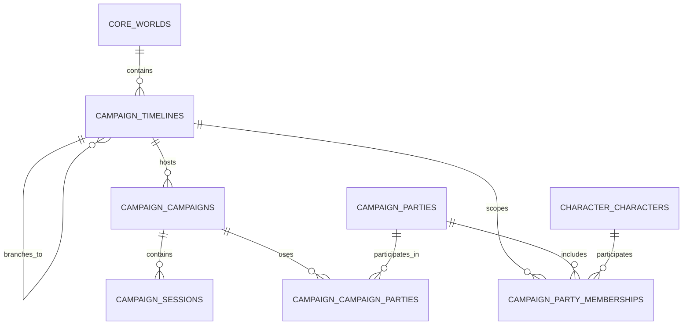
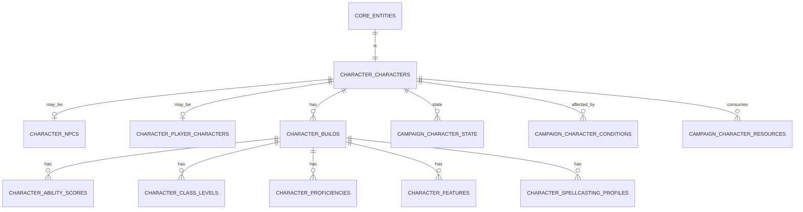
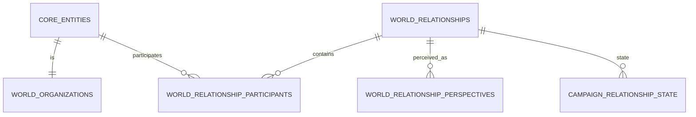
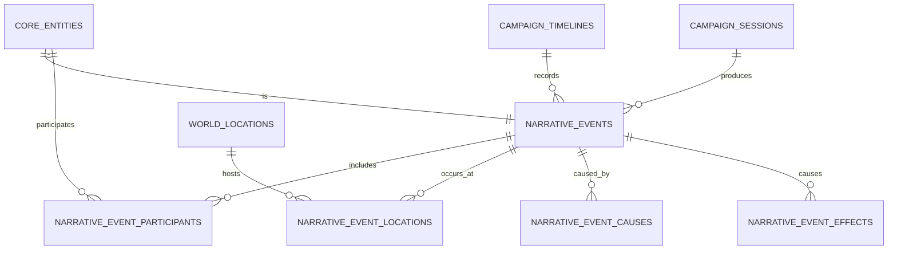
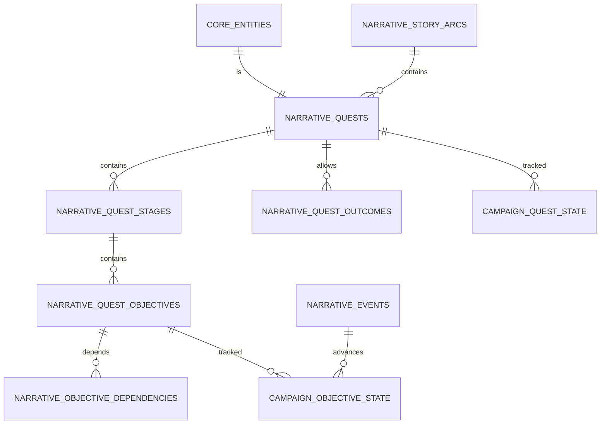
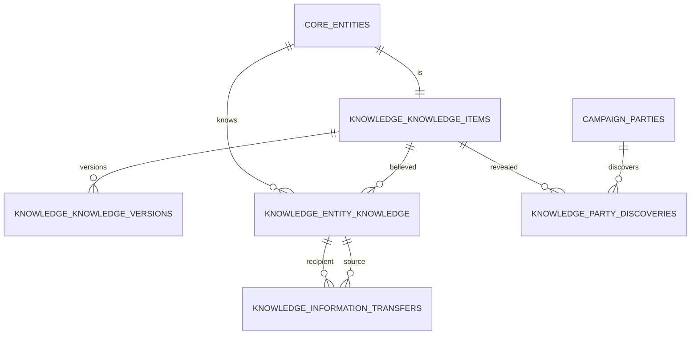
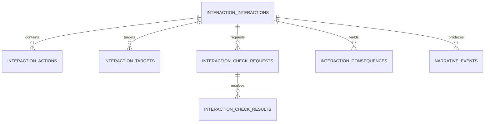
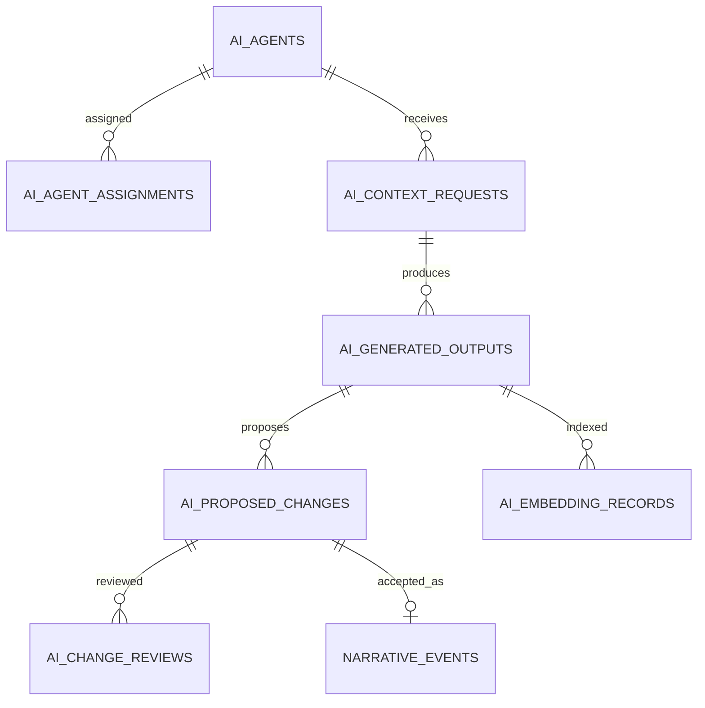

# Persistent World Database Model

## 1. Purpose

This document defines the logical PostgreSQL database model for the D&D AI World Platform. It translates the conceptual model in `docs/DOMAIN_MODEL.md` into a complete set of database domains, primary relationships, ownership rules, and state boundaries.

This is a logical model rather than final migration SQL. Column details may evolve during implementation, but the ownership, identity, inheritance, timeline, event, knowledge, and state rules in this document are architectural constraints.

## 2. Modeling principles

1. PostgreSQL is the authoritative source of structured world state.
2. A world owns persistent entity definitions.
3. A timeline owns evolving world state and history.
4. A campaign organizes play within a timeline but does not normally own copies of world entities.
5. Important world objects use a shared entity identity.
6. Major entity specializations use class-table inheritance.
7. Current state is stored in typed state tables.
8. Events preserve causality and history.
9. Knowledge is separate from objective truth.
10. AI-generated changes are proposals until validated and approved.
11. Rules definitions are separate from world instances.
12. Imports enter staging before becoming canonical records.

## 3. PostgreSQL schema map

| Schema | Primary responsibility |
|---|---|
| `core` | Worlds, entities, names, provenance, tags, calendars, common statuses |
| `security` | Users, roles, permissions, campaign access, service identities |
| `rules` | Rulesets and reusable mechanical definitions |
| `character` | Shared character definitions, builds, NPC and PC extensions |
| `world` | Locations, organizations, relationships, item instances, cultures and economies |
| `campaign` | Timelines, campaigns, parties, sessions, mutable effective state |
| `narrative` | Events, encounters, quests, objectives, story arcs and outcomes |
| `knowledge` | Knowledge claims, beliefs, discoveries, expertise and transfers |
| `interaction` | Actions, targets, checks, resolutions and consequences |
| `ai` | Agents, context requests, generated outputs, proposals and embeddings |
| `audit` | Change records, approvals, validation failures and agent activity |
| `import` | Staged extraction, matching, review and promotion |
| `integration` | External identifiers, synchronization state and delivery metadata |

## 4. High-level database diagram

```mermaid
erDiagram
    CORE_WORLDS ||--o{ CORE_ENTITIES : owns
    CORE_WORLDS ||--o{ CAMPAIGN_TIMELINES : contains
    CORE_WORLDS ||--o{ CORE_CALENDARS : uses
    CORE_WORLDS ||--o{ RULES_WORLD_RULESETS : configures

    CORE_ENTITY_TYPES ||--o{ CORE_ENTITIES : classifies
    CORE_SOURCES ||--o{ CORE_ENTITIES : originates
    CORE_CANON_STATUSES ||--o{ CORE_ENTITIES : governs
    CORE_ENTITIES ||--o{ CORE_ENTITY_NAMES : has
    CORE_ENTITIES ||--o{ CORE_ENTITY_TAGS : tagged
    CORE_TAGS ||--o{ CORE_ENTITY_TAGS : applies

    CORE_ENTITIES ||--o| CHARACTER_CHARACTERS : specializes
    CHARACTER_CHARACTERS ||--o| CHARACTER_NPCS : specializes
    CHARACTER_CHARACTERS ||--o| CHARACTER_PLAYER_CHARACTERS : specializes

    CORE_ENTITIES ||--o| WORLD_LOCATIONS : specializes
    WORLD_LOCATIONS ||--o| WORLD_DUNGEONS : specializes
    WORLD_LOCATIONS ||--o| WORLD_DUNGEON_AREAS : specializes
    WORLD_LOCATIONS ||--o| WORLD_SETTLEMENTS : specializes
    WORLD_LOCATIONS ||--o| WORLD_BUILDINGS : specializes

    CORE_ENTITIES ||--o| WORLD_ORGANIZATIONS : specializes
    CORE_ENTITIES ||--o| WORLD_ITEM_INSTANCES : specializes
    CORE_ENTITIES ||--o| NARRATIVE_EVENTS : specializes
    CORE_ENTITIES ||--o| NARRATIVE_QUESTS : specializes
    CORE_ENTITIES ||--o| KNOWLEDGE_KNOWLEDGE_ITEMS : specializes

    CAMPAIGN_TIMELINES ||--o{ CAMPAIGN_CAMPAIGNS : hosts
    CAMPAIGN_CAMPAIGNS ||--o{ CAMPAIGN_SESSIONS : contains
    CAMPAIGN_CAMPAIGNS ||--o{ CAMPAIGN_CAMPAIGN_PARTIES : uses
    CAMPAIGN_PARTIES ||--o{ CAMPAIGN_CAMPAIGN_PARTIES : participates_in
    CAMPAIGN_TIMELINES ||--o{ CAMPAIGN_PARTY_MEMBERSHIPS : scopes
    CAMPAIGN_PARTIES ||--o{ CAMPAIGN_PARTY_MEMBERSHIPS : includes
    CHARACTER_CHARACTERS ||--o{ CAMPAIGN_PARTY_MEMBERSHIPS : joins

    CAMPAIGN_TIMELINES ||--o{ NARRATIVE_EVENTS : records
    CAMPAIGN_SESSIONS ||--o{ NARRATIVE_EVENTS : produces
    NARRATIVE_EVENTS ||--o{ NARRATIVE_EVENT_PARTICIPANTS : has
    CORE_ENTITIES ||--o{ NARRATIVE_EVENT_PARTICIPANTS : participates
    NARRATIVE_EVENTS ||--o{ NARRATIVE_EVENT_EFFECTS : causes

    CAMPAIGN_TIMELINES ||--o{ CAMPAIGN_CHARACTER_STATE : owns
    CHARACTER_CHARACTERS ||--o{ CAMPAIGN_CHARACTER_STATE : has
    CAMPAIGN_TIMELINES ||--o{ CAMPAIGN_LOCATION_STATE : owns
    WORLD_LOCATIONS ||--o{ CAMPAIGN_LOCATION_STATE : has
    CAMPAIGN_TIMELINES ||--o{ CAMPAIGN_ITEM_STATE : owns
    WORLD_ITEM_INSTANCES ||--o{ CAMPAIGN_ITEM_STATE : has

    NARRATIVE_QUESTS ||--o{ NARRATIVE_QUEST_STAGES : contains
    NARRATIVE_QUEST_STAGES ||--o{ NARRATIVE_QUEST_OBJECTIVES : contains
    CAMPAIGN_TIMELINES ||--o{ CAMPAIGN_QUEST_STATE : owns
    NARRATIVE_QUESTS ||--o{ CAMPAIGN_QUEST_STATE : tracks
    NARRATIVE_QUEST_OBJECTIVES ||--o{ CAMPAIGN_OBJECTIVE_STATE : tracks

    KNOWLEDGE_KNOWLEDGE_ITEMS ||--o{ KNOWLEDGE_ENTITY_KNOWLEDGE : believed
    CORE_ENTITIES ||--o{ KNOWLEDGE_ENTITY_KNOWLEDGE : knows
    CAMPAIGN_TIMELINES ||--o{ KNOWLEDGE_ENTITY_KNOWLEDGE : scopes

    WORLD_RELATIONSHIPS ||--o{ WORLD_RELATIONSHIP_PARTICIPANTS : contains
    CORE_ENTITIES ||--o{ WORLD_RELATIONSHIP_PARTICIPANTS : participates
    CAMPAIGN_TIMELINES ||--o{ CAMPAIGN_RELATIONSHIP_STATE : owns
    WORLD_RELATIONSHIPS ||--o{ CAMPAIGN_RELATIONSHIP_STATE : tracks

    INTERACTION_INTERACTIONS ||--o{ INTERACTION_TARGETS : targets
    INTERACTION_INTERACTIONS ||--o{ INTERACTION_CHECK_REQUESTS : requests
    INTERACTION_CHECK_REQUESTS ||--o{ INTERACTION_CHECK_RESULTS : resolves
    INTERACTION_INTERACTIONS ||--o{ NARRATIVE_EVENTS : produces

    AI_AGENTS ||--o{ AI_PROPOSED_CHANGES : proposes
    AI_PROPOSED_CHANGES ||--o{ AI_CHANGE_REVIEWS : reviewed
    AI_PROPOSED_CHANGES ||--o| NARRATIVE_EVENTS : accepted_as
```



## 5. Core identity and provenance

### 5.1 `core.worlds`

Represents one persistent fictional setting.

Key columns:

- `world_id UUID PK`
- `name TEXT`
- `slug TEXT`
- `default_calendar_id UUID NULL`
- `default_ruleset_id UUID FK NULL` — added in Phase 4
- `status_id UUID`
- `created_at TIMESTAMPTZ`
- `updated_at TIMESTAMPTZ`

A world owns entity definitions, calendars, timelines, and world-specific configuration.

### 5.2 `core.entity_types`

Defines the allowed entity type hierarchy.

Key columns:

- `entity_type_id UUID PK`
- `code TEXT UNIQUE`
- `display_name TEXT`
- `parent_entity_type_id UUID NULL`
- `required_subtype_table TEXT`
- `is_abstract BOOLEAN`

The service layer and database validation functions must ensure that an entity type matches its required subtype row.

### 5.3 `core.entities`

Provides stable identity for important world objects.

Key columns:

- `entity_id UUID PK`
- `world_id UUID FK`
- `entity_type_id UUID FK`
- `canonical_name TEXT`
- `summary TEXT NULL`
- `canon_status_id UUID FK`
- `lifecycle_status_id UUID FK`
- `source_id UUID FK NULL`
- `created_by_user_id UUID NULL`
- `created_at TIMESTAMPTZ`
- `updated_at TIMESTAMPTZ`
- `archived_at TIMESTAMPTZ NULL`

Entity rows are definition records. Timeline-specific conditions do not belong here.

### 5.4 Names, aliases and tags

- `core.entity_names`
- `core.tags`
- `core.entity_tags`

`entity_names` supports canonical, common, former, translated, secret and mistaken names. Names may optionally be timeline-scoped when a name only exists after a historical event.

### 5.5 Sources and canon

- `core.sources`
- `core.source_documents`
- `core.canon_statuses`
- `core.lifecycle_statuses`

Every imported or generated fact should retain provenance. Canon status and operational lifecycle status are separate concepts.

Example:

- Canon status: `canon`
- Lifecycle status: `active`

or

- Canon status: `proposed`
- Lifecycle status: `pending_review`

## 6. World, timeline, campaign and session



### 6.1 `campaign.timelines`

Key columns:

- `timeline_id UUID PK`
- `world_id UUID FK`
- `name TEXT`
- `parent_timeline_id UUID NULL`
- `branch_event_id UUID FK NULL` — added in Phase 6
- `branch_world_time_id UUID FK NULL`
- `is_primary BOOLEAN`
- `status_id UUID`

A branch inherits parent history only through its branch point. Effective-state queries must never include parent events after that point.

`branch_event_id` is part of the target model but is deliberately deferred until `narrative.events` exists in Phase 6. Phase 3 stores the branch's world-time point and parent structure without an unconstrained event UUID.

A root has neither `parent_timeline_id` nor branch-point fields. During Phase 3, a child requires both `parent_timeline_id` and `branch_world_time_id`; the latter must belong to the shared world. Phase 6 adds the event reference, verifies it belongs to the parent timeline at or before that world time, and implements the branch-aware effective-history query.

### 6.2 `campaign.campaigns`

Key columns:

- `campaign_id UUID PK`
- `timeline_id UUID FK`
- `name TEXT`
- `ruleset_id UUID FK` — added in Phase 4
- `status_id UUID`
- `started_at TIMESTAMPTZ NULL`
- `ended_at TIMESTAMPTZ NULL`

`ruleset_id` is part of the target model but is deliberately deferred until `rules.rulesets` exists in Phase 4.

### 6.3 Parties and membership

- `campaign.parties`
- `campaign.party_memberships`
- `campaign.campaign_parties`

`campaign.parties` holds a stable party identity within a world, including `party_id UUID PK` and `world_id UUID FK`. `campaign.campaign_parties` associates that identity with one or more campaigns. Membership is mutable timeline state rather than a property of the party definition, so `campaign.party_memberships` includes:

- `party_membership_id UUID PK`
- `timeline_id UUID FK`
- `party_id UUID FK`
- `member_entity_id UUID FK`
- `effective_from_world_time_id UUID FK`
- `effective_to_world_time_id UUID FK NULL`
- `effective_period INT8RANGE`

The endpoints are half-open `[from, to)` positions in fictional chronology. The range is derived from the endpoint rows' `sort_key` values and is used by a GiST exclusion constraint over `(timeline_id, party_id, member_entity_id, effective_period)` to reject overlaps. The upper bound is unbounded while membership is current. A trigger enforces world agreement, endpoint ordering, and agreement between the endpoint IDs and stored range.

Until `character.characters` exists in Phase 4, `member_entity_id` references `core.entities`; Phase 4 adds enforcement that the entity is a character. Until `narrative.events` exists in Phase 6, join/leave event references are omitted rather than stored as unconstrained UUIDs.

### 6.4 Sessions

`campaign.sessions` organizes a period of play and is not itself the owner of permanent world state.

Key columns:

- `session_id UUID PK`
- `campaign_id UUID FK`
- `session_number INTEGER`
- `title TEXT`
- `status_id UUID`
- `start_world_time_id UUID NULL`
- `end_world_time_id UUID NULL`
- `started_at TIMESTAMPTZ NULL`
- `ended_at TIMESTAMPTZ NULL`
- `summary TEXT NULL`

## 7. Character model



### 7.1 Shared character definition

`character.characters` contains identity-level mechanical references such as species, size and origin. NPCs and player characters both extend it.

### 7.2 NPC extension

- `character.npcs`
- `character.npc_portrayal_profiles`
- `character.npc_characteristics`
- `character.npc_goals`
- `character.npc_routines`
- `character.npc_preferences`
- `character.npc_disclosure_rules`
- `character.npc_agent_assignments`

NPC goals and emotional state may be timeline-scoped. Portrayal defaults are world definitions; current mood and trust belong to timeline state.

### 7.3 Player character extension

- `character.player_characters`
- `character.character_controllers`
- `security.character_permissions`

A player character can participate in multiple campaigns and timelines. Ownership does not duplicate the character definition.

### 7.4 Character builds

- `character.character_builds`
- `character.character_ability_scores`
- `character.character_class_levels`
- `character.character_proficiencies`
- `character.character_features`
- `character.character_spellcasting_profiles`
- `character.character_known_spells`

Builds are versioned definitions. Current hit points, conditions, spell-slot use and other temporary resources belong to campaign timeline state.

## 8. Rules model

Rules data is reusable and ruleset-scoped.

Primary tables:

- `rules.rulesets`
- `rules.ruleset_versions`
- `rules.abilities`
- `rules.skills`
- `rules.species`
- `rules.classes`
- `rules.subclasses`
- `rules.features`
- `rules.feats`
- `rules.spells`
- `rules.conditions`
- `rules.item_definitions`
- `rules.damage_types`
- `rules.languages`
- `rules.proficiency_types`
- `rules.resource_definitions`

`rules.world_rulesets` associates a world with one or more allowed rulesets and identifies defaults.

## 9. Location and dungeon model

```mermaid
erDiagram
    CORE_ENTITIES ||--|| WORLD_LOCATIONS : is
    WORLD_LOCATIONS ||--o{ WORLD_LOCATIONS : contains
    WORLD_LOCATIONS ||--o| WORLD_DUNGEONS : may_be
    WORLD_LOCATIONS ||--o| WORLD_DUNGEON_AREAS : may_be
    WORLD_DUNGEON_AREAS ||--o{ WORLD_AREA_CONNECTIONS : from
    WORLD_DUNGEON_AREAS ||--o{ WORLD_AREA_CONNECTIONS : to
    WORLD_DUNGEON_AREAS ||--o{ WORLD_AREA_FEATURES : contains
    WORLD_DUNGEON_AREAS ||--o{ WORLD_AREA_HAZARDS : contains
    WORLD_DUNGEON_AREAS ||--o{ WORLD_AREA_INTERACTABLES : contains
    WORLD_LOCATIONS ||--o{ CAMPAIGN_LOCATION_STATE : state
    WORLD_AREA_CONNECTIONS ||--o{ CAMPAIGN_AREA_CONNECTION_STATE : state
    WORLD_AREA_FEATURES ||--o{ CAMPAIGN_AREA_FEATURE_STATE : state
    WORLD_AREA_HAZARDS ||--o{ CAMPAIGN_HAZARD_STATE : state
```

### 9.1 Location hierarchy

`world.locations` contains a nullable `parent_location_id` for containment. General semantic relationships should still use the relationship model.

Specializations may include:

- planes
- continents
- regions
- nations
- settlements
- districts
- buildings
- rooms
- dungeons
- dungeon areas

### 9.2 Dungeon structure

- `world.dungeons`
- `world.dungeon_areas`
- `world.area_connections`
- `world.area_features`
- `world.area_hazards`
- `world.area_interactables`
- `world.area_spawn_definitions`

Definitions describe what can exist. Timeline state describes what is currently open, destroyed, active, discovered, occupied or depleted.

## 10. Organizations and relationships



Primary tables:

- `world.organizations`
- `world.organization_memberships`
- `world.relationships`
- `world.relationship_participants`
- `world.relationship_perspectives`
- `world.employment_relationships`
- `world.ownership_relationships`
- `world.family_relationships`
- `world.political_relationships`

The base relationship model supports n-ary relationships. Specialized tables add domain constraints and typed attributes.

## 11. Item model

Rules item definitions are distinct from world item instances.

Primary tables:

- `rules.item_definitions`
- `world.item_instances`
- `world.item_containers`
- `campaign.item_state`
- `campaign.item_ownership`
- `campaign.inventory_entries`
- `campaign.item_attunements`
- `knowledge.item_identification`

Examples:

- `Longsword`: rules definition
- `Blade of Saint Orra`: world entity plus item instance
- Current possessor, charges and damage: timeline state
- True magical properties known by a character: knowledge state

## 12. Events and effects



Primary tables:

- `narrative.events`
- `narrative.event_participants`
- `narrative.event_locations`
- `narrative.event_causes`
- `narrative.event_effects`
- `narrative.event_observations`

Events should record effective world time and database recording time. Typed state updates and their event should commit in one transaction.

## 13. Quest and story model



Primary tables:

- `narrative.story_arcs`
- `narrative.quests`
- `narrative.quest_stages`
- `narrative.quest_objectives`
- `narrative.objective_dependencies`
- `narrative.quest_participants`
- `narrative.quest_rewards`
- `narrative.quest_outcomes`
- `campaign.quest_state`
- `campaign.objective_state`

Quest definitions describe possible progression. Timeline or campaign state records actual progression. Objectives may be event-evaluable, GM-confirmed or hybrid.

## 14. Knowledge model



Primary tables:

- `knowledge.knowledge_items`
- `knowledge.knowledge_versions`
- `knowledge.entity_knowledge`
- `knowledge.information_transfers`
- `knowledge.character_expertise`
- `knowledge.party_discoveries`
- `knowledge.public_knowledge`

A knowledge item represents a claim. Truth status, awareness, belief, confidence, interpretation and willingness to share are distinct fields.

## 15. Interaction and resolution model



Primary tables:

- `interaction.interactions`
- `interaction.actions`
- `interaction.targets`
- `interaction.check_requests`
- `interaction.check_results`
- `interaction.consequences`

Not all interactions create events. Persistent or narratively meaningful consequences should.

## 16. Typed timeline state

Typed state tables are optimized for current effective reads.

Primary tables include:

- `campaign.character_state`
- `campaign.character_conditions`
- `campaign.character_resources`
- `campaign.location_state`
- `campaign.area_connection_state`
- `campaign.area_feature_state`
- `campaign.hazard_state`
- `campaign.organization_state`
- `campaign.relationship_state`
- `campaign.item_state`
- `campaign.quest_state`
- `campaign.objective_state`
- `campaign.npc_goal_state`
- `campaign.npc_emotional_state`

Every state row must include:

- `timeline_id`
- target identifier
- state status/version
- `effective_from_event_id`
- `effective_to_event_id NULL` for current rows
- system timestamps

A partial unique index should enforce one current row per timeline and target.

## 17. AI and approval model



Primary tables:

- `ai.agents`
- `ai.agent_roles`
- `ai.agent_assignments`
- `ai.prompt_templates`
- `ai.prompt_fragments`
- `ai.context_requests`
- `ai.generated_outputs`
- `ai.proposed_changes`
- `ai.change_reviews`
- `ai.embedding_records`

AI proposals never become canonical merely because they were generated. Accepted mutations must produce normal domain commands, events, state updates and audit records.

## 18. Security, audit and integration

### Security

- `security.users`
- `security.roles`
- `security.user_roles`
- `security.permissions`
- `security.campaign_members`
- `security.service_accounts`

### Audit

- `audit.change_log`
- `audit.state_transitions`
- `audit.approvals`
- `audit.validation_failures`
- `audit.agent_activity`

### Integration

- `integration.external_systems`
- `integration.external_identifiers`
- `integration.sync_jobs`
- `integration.sync_state`
- `integration.delivery_attempts`

External IDs must never replace internal UUID identity.

## 19. Import staging

Primary tables:

- `import.import_jobs`
- `import.import_sources`
- `import.staged_entities`
- `import.staged_relationships`
- `import.staged_events`
- `import.staged_knowledge`
- `import.entity_matches`
- `import.validation_results`
- `import.promotion_batches`

Promotion from staging must use the same entity creation and approval pathways as manually authored data.

## 20. Delete and archival rules

- Canonical entities are normally archived, not physically deleted.
- Child subtype rows use `ON DELETE CASCADE` from the base entity only for controlled administrative deletion.
- Timeline state is closed through effective-end fields, not overwritten without history.
- Events, audit records and approved provenance are immutable except through explicit correction workflows.
- Test fixtures may use destructive cleanup; production domain operations may not.

## 21. Required database invariants

1. Every subtype row has a matching base entity.
2. Every base entity requiring a subtype has exactly one valid subtype chain.
3. Entity and subtype world ownership agree.
4. Timeline state references entities from the timeline's world.
5. Events cannot affect entities from unrelated worlds.
6. One current typed state row exists per timeline and target.
7. Timeline branches cannot inherit parent history after their branch point.
8. Accepted AI proposals produce standard events and audit records.
9. Quest objective transitions follow allowed state transitions.
10. Knowledge discovery does not mutate objective truth.
11. External integration records cannot become authoritative identity.
12. Imported records cannot bypass review and promotion.

## 22. Implementation order

1. `core`, `security` and database conventions.
2. Worlds, entity types, entities, sources, names and statuses.
3. Timelines, campaigns, parties and sessions.
4. Rulesets and shared characters.
5. Locations, dungeons and typed location state.
6. Interactions, checks, events and event effects.
7. Quests, objectives and progression state.
8. Knowledge and discovery.
9. Organizations, relationships and items.
10. AI proposals and approval flows.
11. Integration, audit hardening and import staging.

## 23. Acceptance scenario

The database model is sufficient for the first vertical slice when it can represent and query all of the following atomically and historically:

- A party enters a dungeon area.
- Character locations change on one timeline.
- A hidden feature exists before the party knows about it.
- A successful check reveals that feature.
- A player interaction changes a trap, door or pylon state.
- An event records the cause.
- A quest objective advances from the resulting event.
- An NPC learns or reacts to the change.
- Another campaign on the same timeline sees the changed dungeon.
- A campaign on a branch created before the event sees the original state.
