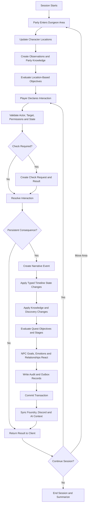
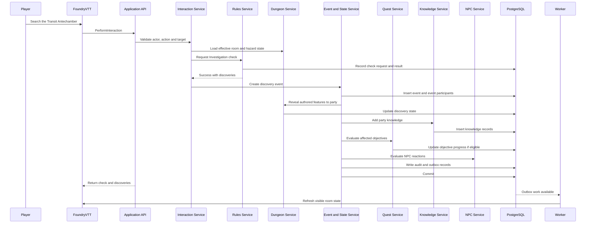
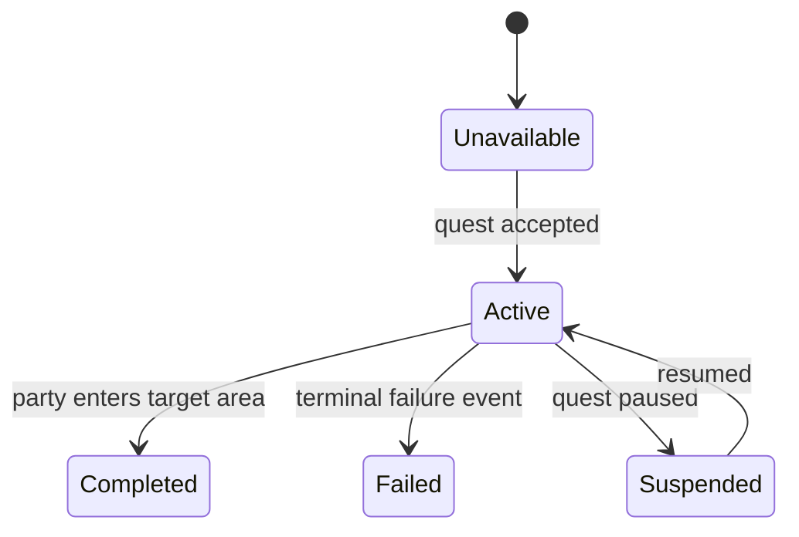
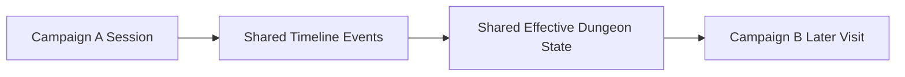
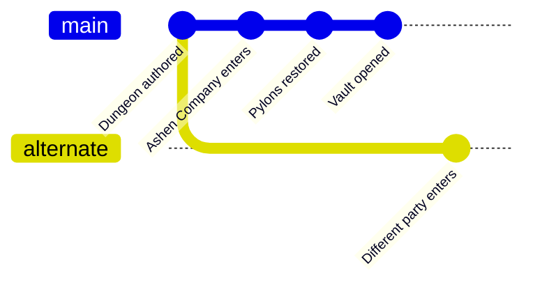

# Dungeon and Quest Progression Flow

## 1. Purpose

This document defines the first full vertical slice for the D&D AI World Platform: a party navigates a dungeon, discovers hidden information, changes persistent timeline state, advances a quest, influences NPC knowledge and goals, and leaves consequences visible to other campaigns sharing the same timeline.

This flow is both a gameplay model and an architectural acceptance test.

## 2. Scenario

World: **Mundivita**

Timeline: **Primary Timeline**

Campaign: **Ashen Company**

Dungeon: **Glass Ossuary**

Quest: **Restore the Glass Ossuary**

Key entities:

- Entrance Hall
- Transit Antechamber
- Lens Gallery
- Containment Vault
- three lens pylons
- arc-discharge hazard
- concealed service hatch
- Archivist Vael
- Prismatic Lens Key
- hostile glass wardens

## 3. Initial authored world definition

Before play begins, the world contains stable definitions for:

- dungeon areas and containment hierarchy
- area connections
- hidden features
- hazards and interactables
- NPCs and creatures
- item instances
- quest, stages and objectives
- objective completion rules
- authored knowledge claims
- NPC disclosure rules

The following facts exist before the party discovers them:

- the service hatch exists
- the arc trap is active
- the west pylon was deliberately damaged
- the key is inside the hatch
- Archivist Vael is alive in the Lens Gallery
- the sabotage was ordered by an Inquisition official

Discovery does not create these facts or objects. It changes party knowledge.

## 4. Initial timeline state

```text
Entrance Hall: accessible
Transit Antechamber: dormant
Center pylon: inactive
West pylon: damaged
East pylon: inactive
Arc hazard: active
Service hatch: closed, locked, hidden
Lens Gallery wardens: active
Archivist Vael: alive, trapped
Containment Vault: sealed
Facility mode: dormant
```

## 5. Quest definition

```text
Quest: Restore the Glass Ossuary

Stage 1: Enter the facility
  Objective A: Reach the Transit Antechamber

Stage 2: Restore the lens network
  Objective B: Activate three lens pylons
  Objective C: Prevent containment collapse

Stage 3: Access the vault
  Objective D: Open the Containment Vault
  Hidden Objective E: Discover who sabotaged the facility
```

Possible outcomes:

- full restoration
- partial restoration
- containment breach
- facility collapse
- evidence exposed
- evidence concealed or destroyed

## 6. End-to-end flow diagram



## 7. Runtime sequence



## 8. Step 1: start the session

Command:

```text
StartSession
```

Creates or updates:

- `campaign.sessions`
- active participant records
- session start world time
- audit and correlation context

No permanent dungeon state changes merely because a session starts.

## 9. Step 2: enter the Entrance Hall

Command:

```text
EnterLocation
```

Validation:

- actor belongs to the campaign or party
- target location belongs to the campaign's world
- an accessible connection exists
- travel is not blocked by current timeline state

Persistent results:

- character current location changes
- entry event is recorded when narratively meaningful
- ordinary visible features become known
- location-based quest objectives are evaluated

## 10. Step 3: reach the Transit Antechamber

Entering the antechamber completes Objective A.



Objective progress should link to the event that caused completion.

## 11. Step 4: search the room

Interaction:

```text
Actor: Rogue
Action: Search
Targets: room, pylons and walls
Skill: Investigation
DC: 15
Result: 18, success
```

The rules service records:

- ruleset and version
- ability or skill used
- DC
- roll expression
- raw roll
- modifiers
- final result
- advantage or disadvantage
- actor and target

The successful result reveals authored information:

- arc trap connected to center pylon
- concealed service hatch
- deliberate damage to west pylon

Knowledge changes:

```text
trap: unknown -> known
service hatch: unknown -> suspected/located
sabotage: unknown -> supported theory
```

The hidden objective may become visible, but it is not yet complete.

## 12. Step 5: throw a coin into the arc

Interaction:

```text
Throw copper coin at center pylon arc
```

Resolution rules determine:

- coin conducts the discharge
- coin is destroyed
- trap becomes temporarily discharged
- center pylon becomes grounded
- west pylon overloads
- facility mode changes to startup fault

Persistent event:

```text
Center arc discharged through a copper coin
```

Typed state changes:

```text
coin: possessed -> destroyed
arc hazard: active -> temporarily discharged
center pylon: inactive -> grounded
west pylon: damaged -> overloaded
facility mode: dormant -> startup fault
```

Quest consequences:

- Objective B remains 0/3
- Objective C enters elevated risk
- optional countdown may begin if defined by authored dungeon rules

## 13. Step 6: force open the service hatch

Interaction:

```text
ForceOpen(service_hatch)
```

Check result:

```text
Strength success with complication
```

State changes:

```text
service hatch: closed/locked -> open/damaged
noise: low -> high
Prismatic Lens Key: hidden/inaccessible -> accessible
```

Knowledge gained:

- maintenance notes mention Vael
- safety regulator was removed
- the key is present

Quest progress:

```text
sabotage clues: 0/3 -> 1/3
```

## 14. Step 7: repair the west pylon

Interaction requirements may include:

- suitable tools
- repair knowledge or successful check
- a replacement regulator or improvised component

The party uses part of a shield as an improvised regulator.

Event effects:

```text
shield: intact -> damaged
west pylon: overloaded -> operational
active pylons: 0/3 -> 1/3
facility mode: startup fault -> partial balance
```

Objective B progresses to 1/3.

## 15. Step 8: enter the Lens Gallery and resolve combat

Encounter definitions include:

- participants
- initial positions
- hostile/friendly sides
- environmental hazards
- victory and failure conditions

Low-level combat actions may remain interaction records. Narratively important outcomes become events.

Examples:

- glass wardens destroyed
- unstable conductor shut down
- Archivist Vael rescued

Timeline effects are shared with other campaigns on the same timeline.

## 16. Step 9: converse with Archivist Vael

The NPC context assembler loads only information Vael may use:

- portrayal profile
- current location and emotional state
- goals
- recent events
- knowledge and beliefs
- relationship with the party
- disclosure rules
- relevant quest state

Vael knows:

- the regulator was removed
- three staff members had access
- one suspect had an Inquisition connection
- all three pylons are needed for the vault

Vael may require trust, evidence or a successful social check before sharing details.

Knowledge transfer event:

```text
Vael tells the party that one authorized staff member served the Inquisition.
```

Possible state changes:

```text
Vael trust toward party: 3 -> 6
sabotage clues: 1/3 -> 2/3
```

## 17. Step 10: activate all pylons

Each pylon activation produces a persistent state transition.

```text
pylon 1: active
pylon 2: active
pylon 3: active
lens network: 1/3 -> 3/3
facility mode: partial balance -> balanced
collapse risk: elevated -> cleared
```

Quest changes:

- Objective B completes
- Objective C completes
- Stage 2 completes
- vault connection changes from sealed to unlockable

The vault is not automatically open. The key and activation sequence are still required.

## 18. Step 11: open the Containment Vault

Interaction:

```text
Use Prismatic Lens Key on Containment Vault
```

Persistent event:

```text
Containment Vault opened
```

Effects:

```text
vault door: sealed -> open
Stage 3: active
Objective D: completed
```

The party discovers records identifying the saboteur.

Knowledge layers:

```text
objective truth: Justicar Malrek authorized the sabotage
party knowledge: confirmed
Vael knowledge: confirmed
public knowledge: unknown
```

Hidden Objective E completes.

## 19. Step 12: choose a quest outcome

Possible choices:

- expose the evidence publicly
- deliver it privately to the Inquisition
- give it to Allistir's followers
- destroy it
- retain it as leverage

Each choice produces:

- event
- quest outcome state
- organization reactions
- NPC goal changes
- relationship changes
- knowledge transfers
- follow-up quest availability

Example: public exposure

```text
Inquisition attitude toward party: neutral -> hostile
Vael trust: increases
Malrek goal: recover or destroy evidence
sabotage knowledge: private -> publicly rumored
new quest: survive the Inquisition response
```

## 20. Shared timeline consequences

A second campaign entering later on the same timeline sees:

- opened or damaged hatch
- destroyed coin
- repaired pylon using shield fragment
- inactive or destroyed wardens
- opened vault
- Vael absent if he left
- altered organization and rumor state

The second campaign does not receive a duplicate dungeon copy.



## 21. Alternate timeline behavior

A branch created before Campaign A entered the dungeon inherits the original state.



The alternate timeline sees:

- active trap
- hidden hatch
- inactive pylons
- intact wardens
- trapped Vael
- sealed vault

## 22. Data ownership by step

| Concern | Owning domain |
|---|---|
| Actor, target and action | `interaction` |
| Check rules and roll result | `rules` and `interaction` |
| Room, door, trap and pylon definitions | `world` |
| Current room, door, trap and pylon state | `campaign` |
| Historical cause | `narrative.events` |
| Quest definition | `narrative` |
| Quest progress | `campaign` |
| Claims and discoveries | `knowledge` |
| NPC portrayal and goals | `character` |
| NPC current mood and goal progress | `campaign` |
| Generated proposal | `ai` |
| Approval and change history | `audit` |

## 23. Atomicity requirements

The following must commit together for a persistent interaction:

- interaction result
- causal event
- old state closure
- new state insertion
- quest objective changes
- knowledge changes
- relationship or NPC goal changes that are immediate consequences
- audit record
- outbox record

If any required invariant fails, the transaction rolls back.

## 24. AI boundaries

AI may:

- portray Vael using his knowledge and disclosure rules
- summarize the session
- suggest an improvised consequence
- identify likely affected objectives
- propose rumors or follow-up quests

AI may not directly:

- open the vault in canonical state
- declare Malrek guilty without an approved source
- complete an objective without a validated event or GM action
- alter NPC trust or goals without a proposal or deterministic policy

## 25. API command sequence

Representative commands:

```text
StartSession
EnterLocation
PerformInteraction(Search)
ResolveCheck
ApplyInteractionConsequences
PerformInteraction(ThrowObject)
PerformInteraction(ForceOpen)
PerformInteraction(Repair)
StartEncounter
ResolveEncounterOutcome
PerformInteraction(Conversation)
TransferKnowledge
ActivateInteractable
UseItem
CompleteQuestObjective
SelectQuestOutcome
EndSession
```

The client may issue fewer coarse-grained requests, but application services should preserve these conceptual boundaries.

## 26. Query examples

The platform must answer:

- What is the current state of every area in this dungeon for this timeline?
- Which rooms has this party discovered?
- Which hidden features exist but remain unknown to the party?
- Why is the west pylon operational?
- Which event opened the vault?
- Which objectives changed during Session 12?
- What does Vael believe about the sabotage?
- What is Vael willing to tell this party?
- What changed since another campaign last visited?
- What would the same dungeon look like on a branch created before the repair?

## 27. Acceptance criteria

The first dungeon vertical slice is complete when automated tests and a demonstrable API workflow prove:

1. A world, timeline, campaign, party and session can be created.
2. The Glass Ossuary can be authored as typed entities and definitions.
3. The party can enter connected dungeon areas.
4. A search check can reveal pre-existing hidden features.
5. Discovery changes knowledge without duplicating features.
6. An interaction can change hazard and interactable state.
7. Events explain every persistent change.
8. Quest objectives advance from validated events.
9. NPC context is filtered by knowledge and disclosure rules.
10. An AI suggestion requires approval when it changes persistent state.
11. Another campaign on the same timeline sees the changed dungeon.
12. A branch before the changes sees the original state.
13. Session history can reconstruct the sequence of meaningful events.
14. Failed transactions leave no partial event, state or quest updates.
