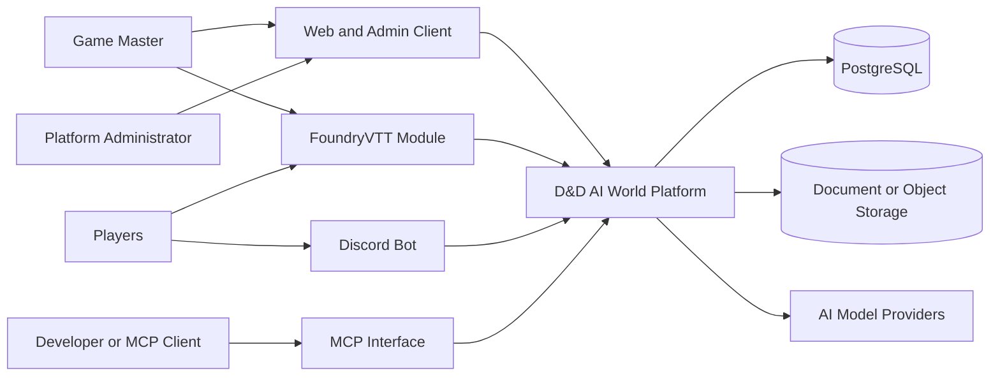
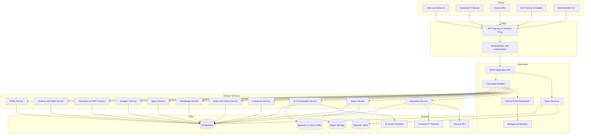
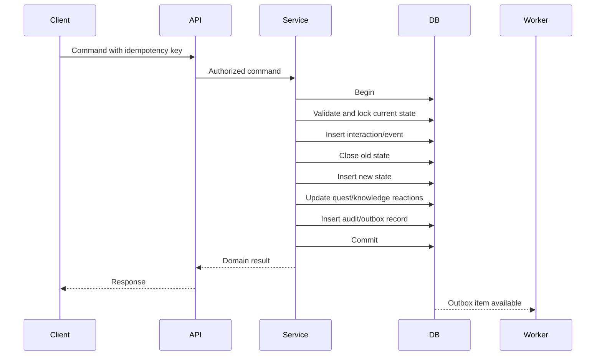
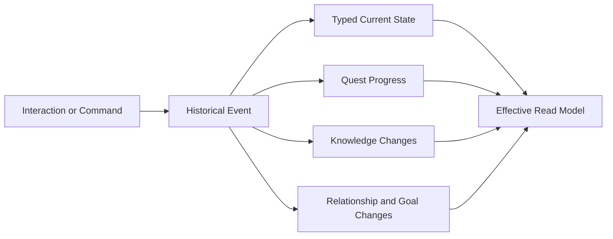
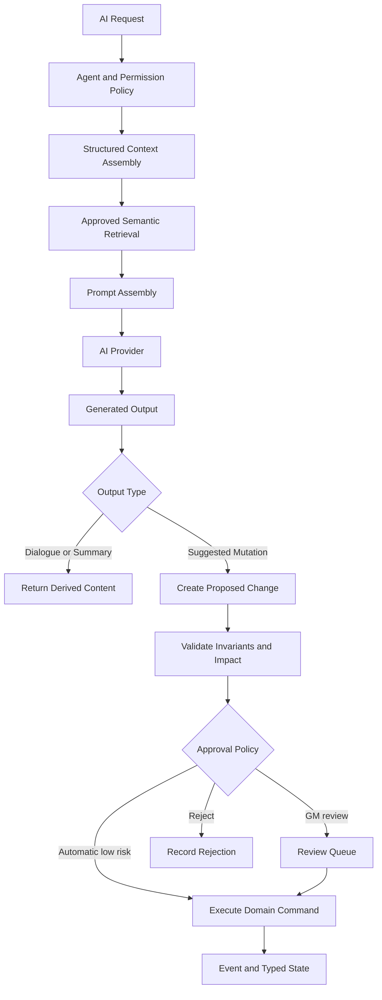
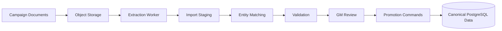
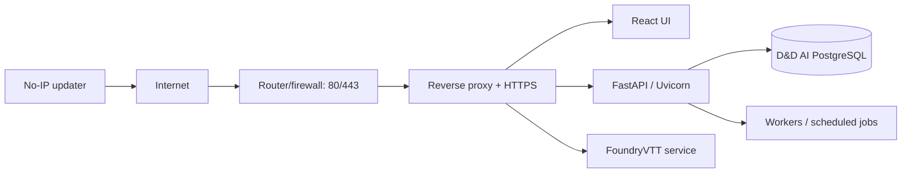

# System Architecture

## 1. Purpose

This document defines the application, service, data, AI, integration and operational architecture for the D&D AI World Platform.

The platform is a persistent-world system in which PostgreSQL is the source of truth, integrations communicate through application services, and AI produces controlled proposals rather than directly owning canonical state.

## 2. Architectural goals

The architecture must support:

- multiple worlds
- multiple timelines per world
- multiple campaigns sharing a timeline
- alternate timeline branches
- shared NPC and player-character mechanics
- event-assisted state management
- party-specific knowledge and discovery
- dungeon and quest progression
- FoundryVTT and Discord integrations
- AI-assisted NPC portrayal and world management
- future campaign-data imports
- auditability, validation and replayable history
- future rulesets beyond D&D 5e

## 3. Context diagram



## 4. Container diagram



## 5. Layering

### 5.1 Client and integration layer

Responsibilities:

- user interaction
- FoundryVTT scene and actor integration
- Discord commands and conversations
- administrative workflows
- MCP access for development and tooling

Clients may request commands and queries. They must not write directly to PostgreSQL.

### 5.2 API layer

Responsibilities:

- authentication
- authorization
- input validation
- command/query routing
- correlation and idempotency identifiers
- response shaping
- rate limiting and abuse protection

The API layer should avoid embedding domain rules.

### 5.3 Application layer

Responsibilities:

- coordinate use cases
- open transaction boundaries
- invoke domain services
- enforce command-level authorization
- publish post-commit work
- translate domain results into API responses

Recommended command examples:

- `CreateWorld`
- `CreateTimeline`
- `CreateNpc`
- `StartSession`
- `PerformInteraction`
- `ResolveCheck`
- `ApplyEvent`
- `AdvanceQuest`
- `RevealKnowledge`
- `CreateTimelineBranch`
- `ApproveAiProposal`

### 5.4 Domain layer

Responsibilities:

- enforce invariants
- calculate allowed transitions
- create events and state changes
- evaluate quest completion
- control knowledge visibility
- assemble NPC context
- validate timeline inheritance
- separate rules definitions from instances

### 5.5 Persistence layer

Responsibilities:

- PostgreSQL repositories and query objects
- migrations
- transactional stored procedures where beneficial
- typed state views
- effective timeline-state functions
- full-text and vector-search support

## 6. Command and query separation

The architecture uses pragmatic command/query separation.

Commands mutate state and should:

1. authenticate and authorize
2. validate the requested operation
3. acquire required locks
4. create interactions or administrative causes
5. create events when the mutation is narratively significant
6. close old typed state and insert new typed state
7. evaluate dependent quest, knowledge and relationship changes
8. record audit data
9. commit atomically
10. schedule non-transactional work after commit

Queries should use optimized views and read models without mutating domain state.

## 7. Transaction boundary

A persistent world change should generally use one PostgreSQL transaction.



External calls to AI providers, Discord or FoundryVTT should not normally occur inside the database transaction.

## 8. Event-assisted state architecture

The platform is not pure event sourcing.



Events answer why and when. Typed state answers what is true now.

## 9. Effective timeline state

An effective read combines:

```text
world definition
+ parent timeline history through branch point
+ local timeline events and state
+ campaign participation and permissions
+ party or character knowledge
```

The Timeline and State Service owns this resolution logic. Individual clients and domain services should not independently reinvent it.

## 10. Internal event dispatcher and outbox

The platform should use a transactional outbox for post-commit work.

Typical outbox consumers:

- update embeddings
- refresh caches
- notify FoundryVTT
- send Discord notifications
- generate session summaries
- evaluate low-priority NPC routines
- update search indexes

Outbox consumers must be idempotent.

## 11. AI orchestration architecture



AI context must be constrained by:

- world
- timeline
- campaign
- portrayed entity
- entity knowledge and beliefs
- disclosure rules
- current location and state
- approved source material
- user permissions

AI outputs are derived content unless promoted through the proposal workflow.

## 12. Rules engine

The rules engine should be ruleset-aware and deterministic where possible.

Responsibilities:

- ability and skill checks
- saving throws
- attack and damage resolution
- conditions and durations
- resource consumption
- spell and feature validation
- movement and senses
- ruleset version selection

Random results should record their inputs, roll expression, outcome and source so that session history can be audited.

## 13. Dungeon and quest services

The Dungeon Service owns:

- area containment and connections
- feature, hazard and interactable definitions
- current connection and hazard state
- area discovery
- travel and entry validation

The Quest Service owns:

- quest availability
- stage transitions
- objective dependencies
- event-evaluable completion
- GM-confirmed progress
- outcomes and rewards

The two communicate through events and explicit application orchestration rather than by directly editing each other's tables.

## 14. Knowledge service

Responsibilities:

- claim creation and versioning
- objective truth status
- per-entity awareness and belief
- party discovery
- information transfer
- sharing and disclosure policy
- public knowledge
- knowledge-filtered AI context

Discovery changes the knower's state, not the existence of the underlying entity or feature.

## 15. Integration architecture

### 15.1 FoundryVTT

Foundry is a client and visualization surface, not the authoritative database.

Integration responsibilities:

- map Foundry actors, scenes, journals and tokens to internal UUIDs
- submit interactions and checks
- receive state updates
- synchronize selected character and scene fields
- tolerate offline or delayed synchronization

### 15.2 Discord

Discord integration may support:

- out-of-session NPC conversation
- campaign notifications
- quest reminders
- downtime actions
- session summaries

Discord messages should be stored with provenance when they create interactions or knowledge transfers.

### 15.3 MCP

MCP exposes controlled development and GM tooling. It must follow the same authorization and domain-command pathways as other clients.

## 16. Import architecture



The import subsystem is intentionally isolated from canonical tables until promotion.

## 17. Deployment topology

Production is a modular monolith hosted on the existing Ubuntu mini-PC. Docker Compose runs the React UI, FastAPI under Uvicorn, PostgreSQL, and required worker or scheduled-job processes on private networks. A reverse proxy is the only inbound HTTP/HTTPS entry point, manages automatic TLS, and routes the preferred same-origin `world` UI and `/api/*`; FoundryVTT is a separately managed service on its own hostname. No-IP supplies dynamic DNS. Exact hostnames depend on whether deployment uses a custom domain delegated to No-IP or only No-IP-provided hostnames.



PostgreSQL and Uvicorn are never directly exposed. Foundry and D&D AI share hardware and potentially the proxy, but not application data, authentication, configuration, lifecycle, or backup handling. Secrets are mounted or supplied from outside the repository. The portable API boundary permits a later VPS or AWS deployment without making either a current requirement. Operational controls are defined in [LOCAL_DEPLOYMENT.md](../LOCAL_DEPLOYMENT.md).

### Historical AWS topology (superseded; retained for completed-work context)

Initial deployment is a modular monolith with separate workers, deployed to AWS. A modular monolith is preferred initially because the domains require strong transactional consistency and are still evolving. Service boundaries can become process boundaries later when operational evidence justifies it.

The table below is the superseded AWS proposal, retained to explain historical planning and transitional resources. It is not a current deployment requirement; [ADR 0012](../adr/0012-locally-host-production-on-existing-mini-pc.md) defines the supported production topology.

| Deployable | AWS target | Notes |
|---|---|---|
| Application API | ECS Fargate service behind an Application Load Balancer | The only deployable with ingress from outside the VPC |
| Background worker | ECS Fargate service, no load balancer | Drains the outbox (§10), delivers integrations, processes AI proposals |
| Discord adapter | ECS Fargate service, no load balancer | Outbound gateway connection; needs no inbound ingress |
| Migrations and batch jobs | ECS Fargate one-off tasks | Same image as the services, different entrypoint |
| PostgreSQL | RDS PostgreSQL, private subnets | Source of truth (§2); never publicly reachable in `staging`/`prod` |
| Object storage | S3 | Import source documents, exports, image layers |
| Secrets | Secrets Manager + IAM database authentication | No credential in an image, task definition, or source control |
| FoundryVTT module | Runs in the user's Foundry instance | A client, not something this project deploys |

The API, worker, and adapter share a single container image; the entrypoint selects the role, so there is one artifact to build, scan, and promote.

Concrete networking, identity, deployment flow, and per-phase deployment expectations are in [PLAN.md §30](../PLAN.md#30-aws-deployment-plan-for-application-services). The database's own provisioning and migration path is [PLAN.md §29](../PLAN.md#29-aws-terraform-deployment-plan-for-postgresql).

## 18. Security model

Required controls:

- user and service authentication
- role- and permission-based authorization
- world and campaign access checks
- GM-only approval policies
- secret management outside source control
- least-privilege database roles
- row-level security only where it provides clear value
- audit logging for privileged changes
- strict separation between model-provider credentials and client access
- `Secure`, `HttpOnly`, narrowly scoped authentication cookies and CSRF protection for cookie-authenticated mutations
- reverse-proxy and/or application rate limiting for login and expensive AI endpoints
- no direct public access to PostgreSQL or Uvicorn

## 19. Observability

Every request and background job should carry:

- correlation ID
- causation ID
- user or service identity
- world, timeline and campaign identifiers when applicable
- command or query name
- duration and outcome

Operational telemetry should include:

- API errors and latency
- database transaction failures
- outbox backlog
- integration delivery failures
- AI provider latency, cost and error rates
- proposal approval rates
- validation failures
- import extraction and matching quality

## 20. Failure handling

- Domain validation failures return structured errors without partial writes.
- A generic request-validation response never exposes a caller-controlled field *location* (a dynamic dictionary key, a rejected extra-field name, a discriminator value, an input-derived alias, an arbitrary index), and never a pydantic error-*type* string either — only a small, fixed, public vocabulary the API layer owns (`missing`/`invalid_type`/`invalid_format`/`out_of_range`/`invalid`), matched by exact lookup against a closed set of real pydantic type strings, never by regex or character shape; every unmapped or custom type — built-in or `PydanticCustomError`-supplied, however identifier-shaped — falls back to `invalid`. Validation failures are logged through the same sanitized, fixed-shape path as every other API error, never with raw errors, locations, per-error codes, or rejected input.
- Every `ApiError`'s status code, public error code, and public message are fixed, type-level properties of one of a small number of explicit, registered subclasses — never constructor-supplied. The complete `(status, code, message)` triple, not each field independently, is checked against that registry before reaching a response or a log line; an unrecognized subclass or any mismatched/altered field falls back to the fixed internal-error contract. A framework-raised `HTTPException`'s status code is bounded the same way: only a small, explicit set of supported statuses (at minimum routing 404/405) is ever forwarded to a response, and any other status — however HTTP-shaped — gets the identical fixed internal-error fallback rather than being forwarded verbatim. `HTTPException.headers` is never forwarded either — a directly raised instance can carry any header a caller or a careless call site chose — so a 405 response's `Allow` header is instead recomputed by the API layer itself from the matched route's own declared methods. Every unclassified/fallback path in the API layer (an unrecognized `ApiError`, an unsupported `HTTPException` status, an unclassified `IntegrityError`, an otherwise-unhandled exception) returns and logs the identical fixed 500/`internal_error` contract — one constant, not a separately worded copy per handler. Every handler computes exactly one validated classification and reuses it for both the response and the log line.
- A unique/exclusion-constraint conflict returns a fixed, non-disclosing 409 — a genuine conflict, but not a claim that retrying the same request will succeed; only a command that recognizes a specific, demonstrated optimistic-concurrency or idempotency case may say retrying/re-reading is appropriate, through its own exception type.
- An integrity failure the application layer cannot confidently classify (a missing or unrecognized SQLSTATE) is treated as an internal error (500), not guessed at as a 400 or 409 — that ambiguity itself is evidence of an application/schema/runtime defect.
- External integration failures are retried through durable queues.
- AI failures do not roll back already-committed world changes.
- Failed outbox deliveries remain visible and retryable.
- Import failures remain in staging.
- Administrative repair commands require provenance and audit entries.

## 21. Scalability approach

Scale in this order:

1. correct indexes and query plans
2. optimized effective-state views
3. connection pooling
4. background work and outbox processing
5. read caching for expensive derived views
6. partitioning of large append-only tables
7. read replicas if required
8. process-level service extraction only when justified

Do not prematurely split domains into distributed microservices while core invariants still require cross-domain transactions.

## 22. Testing strategy

### Unit tests

- domain transition rules
- quest objective evaluation
- knowledge visibility
- AI proposal impact classification
- timeline inheritance calculations

### Integration tests

Run against a local PostgreSQL 18 server during development and against the deployed AWS `dev` database in CI — never against SQLite or a mock ([PLAN.md §23.0](../PLAN.md#230-verification-policy)):

- PostgreSQL constraints and functions
- transactional state/event updates
- idempotent commands
- outbox processing
- effective-state views

### Contract tests

- FoundryVTT adapter
- Discord adapter
- AI provider adapters
- MCP tools

### End-to-end tests

The primary end-to-end scenario is the dungeon/quest flow defined in `docs/architecture/DUNGEON_FLOW.md`.

## 23. Architecture constraints

1. No client writes directly to domain tables.
2. PostgreSQL remains authoritative.
3. AI cannot directly mutate canon.
4. Events and typed state changes commit atomically.
5. External calls occur after commit through durable work where possible.
6. Knowledge-filtered context is mandatory for NPC portrayal.
7. Timeline resolution is centralized.
8. Rules data is versioned and ruleset-scoped.
9. Integrations retain internal UUID mappings.
10. Everything is deployed to AWS and verified there before it ships. Development runs against a local PostgreSQL server of the same major version; CI against `dev` RDS is the merge gate. There is no local deployment topology ([ADR 0008](../adr/0008-aws-first-deployment-and-verification.md), [ADR 0011](../adr/0011-local-first-development-aws-verified-delivery.md)).
11. The initial implementation should remain a modular monolith unless evidence supports decomposition.
